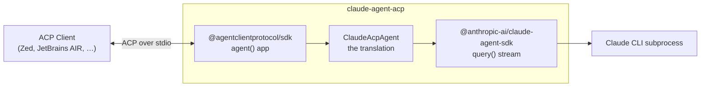
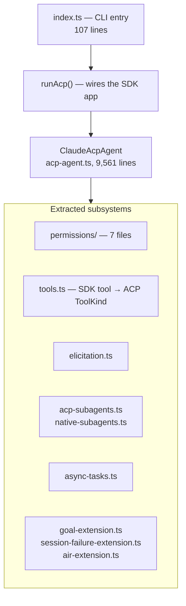
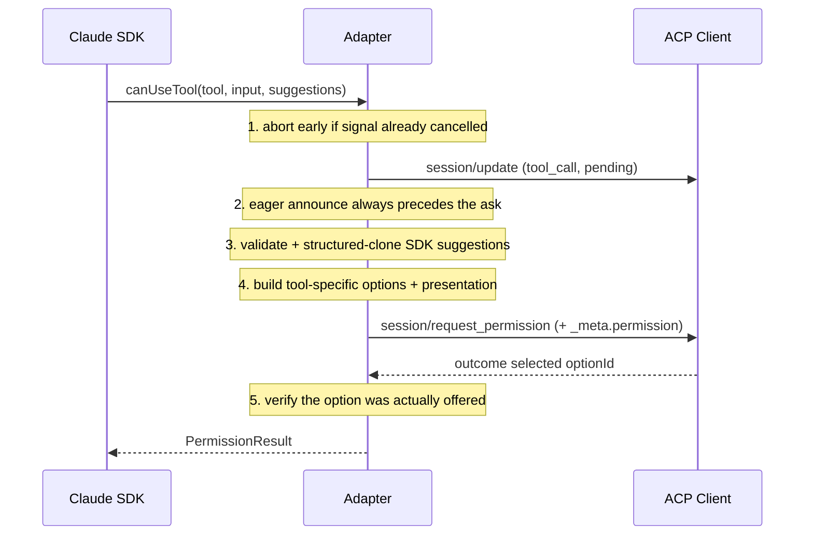

> Source: `claude-agent-acp` @ `c3ff343` (`v0.70.0`) · read against `agent-client-protocol` @ `9e6f550` and `typescript-sdk` @ `5dac09a` · Date: 2026-08-29 · Mode: **Explain**
> See also: [System & OOP Architecture](/acp/acp-system-architecture/) · [User-Facing API & UX/DX](/acp/acp-surface-architecture/) · [Extension Points & Vertical Surfaces](/acp/acp-extension-points/)

**The lens.** The three sibling docs cover how the protocol is built, how its surface looks from
outside, and where it can be extended in theory. None of them answers the question a person
actually has before starting: *what does it take to ship a production ACP agent?* This one does,
by reading the only production agent in the workspace.

It is also, unexpectedly, the best available evidence for the extension-points doc — this repo
ships **four `_`-prefixed extension methods and eleven distinct `_meta` conventions**, and none of
them has an RFD. §4 is the inventory that Part A of that document could only describe abstractly.

---

## 1. What this thing actually is

`claude-agent-acp` is **an adapter, not an agent.** It owns no model loop and no tools. It
translates between two SDKs:



This is the archetype. Most ACP agents will be adapters like this one — the ecosystem list in
`docs/get-started/agents.mdx` is full of "ACP wrapper for X" entries. If you are wrapping an
existing coding agent, this repo is the reference.

| Fact | Value |
|------|-------|
| Package | `@agentclientprotocol/claude-agent-acp` v0.70.0 — an npm **bin** (`claude-agent-acp`) *and* a library (`dist/lib.js`) |
| Runtime | Node ≥ 22, TypeScript, ESM |
| Dependencies | `@agentclientprotocol/sdk` **1.3.0**, `@anthropic-ai/claude-agent-sdk` 0.3.238, `zod` |
| Source | ~16,600 lines across 29 modules |
| Tests | ~32,000 lines — a **~2:1 test-to-source ratio**, 33 test files |
| Protocol | `protocolVersion: 1`, hardcoded. No v2 path |
| Velocity | 65 releases in the changelog; 181 commits since 2026-06-01; PR numbers past #1000 |

That release cadence is worth pausing on: **the adapter layer churns far faster than the protocol
it speaks.** The spec repo cut 7 minor crate versions in the same period this repo cut 65
releases. Whatever stability ACP has bought, it has bought it at the protocol boundary — not
inside the implementations.

---

## 2. The shape of the code



| Path | Responsibility |
|------|----------------|
| `index.ts` | CLI entry: `--cli` passthrough, `--version`, managed-policy env, stdout hygiene, shutdown |
| `acp-agent.ts` | **The bridge.** `ClaudeAcpAgent` — every ACP handler, the SDK message consumer, session state |
| `tools.ts` | `toolInfoFromToolUse` — one `switch` mapping Claude tool names to ACP `{title, kind, content, locations}` |
| `permissions/` | `options/` builders per tool family, plus `effects`, `modes`, `normalization`, `presentation`, `response` |
| `elicitation.ts` | Claude's `AskUserQuestion` → ACP `elicitation/create` |
| `acp-subagents.ts` | Local type declarations for draft subagent/async-task session updates (§4.1c) |
| `native-subagents.ts`, `async-tasks.ts` | Subagent session and background task lifecycles |
| `goal-extension.ts`, `session-failure-extension.ts`, `air-extension.ts` | The three named extensions |
| `settings.ts`, `session-mode.ts`, `session-config-ids.ts` | Config-option plumbing |
| `file-change-audit.ts`, `clear-context-coordinator.ts`, `exit-plan.ts`, `session-titles.ts`, `fork-session.ts` | Feature modules |

### The god file

**`acp-agent.ts` is 9,561 lines — 57% of the source.** That is worth naming plainly rather than
stepping around. `ClaudeAcpAgent` holds every ACP handler, the ~2,700-line SDK message consumer,
and all per-session state in one class.

Some of that is intrinsic: the core of an adapter is a long stateful fold over an async message
stream, and splitting a `switch` that must stay exhaustive across files makes exhaustiveness
harder to see, not easier. But the extraction pattern elsewhere in the repo shows the team knows
where the seams are — `permissions/` is properly decomposed, and each named extension got its own
module. The parts that *did* come out are the parts with a clean input/output contract. What is
left is the part that is genuinely entangled with session state.

The 2:1 test ratio is presumably how they live with it.

---

## 3. The bridge: three translations

An ACP adapter does exactly three jobs. Everything else is detail.

### 3.1 Lifecycle — ACP session ↔ SDK query

`runAcp()` registers handlers on the TypeScript SDK's app builder, exactly as documented in the
[UX/DX doc §2.5](/acp/acp-surface-architecture/):

```ts
const connection = acpAgent({ name: "claude-code-acp" })
  .onRequest(methods.agent.initialize,     (ctx) => agent.initialize(ctx.params))
  .onRequest(methods.agent.session.new,    (ctx) => agent.newSession(ctx.params))
  .onRequest(methods.agent.session.fork,   (ctx) => agent.unstable_forkSession(ctx.params))
  .onRequest(methods.agent.providers.set,  (ctx) => agent.unstable_setProvider(ctx.params))
  .onRequest(methods.agent.session.prompt, (ctx) => runPromptWithCancellation(agent, ctx.params, ctx.signal))
  .onNotification(methods.agent.session.cancel, (ctx) => agent.cancel(ctx.params))
  .onRequest<SteerRequest, SteerResponse>(STEER_METHOD, { parse: parseSteerRequest }, (ctx) => agent.steer(ctx.params))
  .connect(stream);
```

Two things to notice. The `unstable_` prefixes are the SDK's naming convention showing up in real
code — `unstable_forkSession`, `unstable_listProviders`, `unstable_setProvider`,
`unstable_disableProvider`. And the last line is seam 2 in production: the SDK's `string` overload
takes a custom method plus an explicit `{ parse }` validator, so an extension gets the same
validation discipline as a built-in.

There is also a small bootstrapping dance worth stealing, with a comment explaining it: `agent` is
`let`, not `const`, because it needs `connection.client` — which does not exist until `connect()`
returns. Handlers close over the binding, which is assigned synchronously before any message can
arrive.

### 3.2 Vocabulary — SDK tools → ACP display

`toolInfoFromToolUse` is one `switch` over Claude's tool names producing ACP's display vocabulary:

| Claude tool | ACP `ToolKind` |
|-------------|----------------|
| `Bash`, `PowerShell` | `execute` |
| `Read` | `read` |
| `Edit`, `Write`, `NotebookEdit` | `edit` |
| `Glob`, `Grep` | `search` |
| `WebFetch`, `WebSearch` | `fetch` |
| `Agent`, `Task`, `TodoWrite`, planning tools | `think` |
| `ExitPlanMode` | `switch_mode` |
| everything else | `other` |

This is the whole point of `ToolKind` being a display hint rather than a semantic contract: the
adapter picks an icon category, and the client renders it without knowing what a "Glob" is.

### 3.3 Consent — `canUseTool` ↔ `session/request_permission`

The hardest translation, and the one with the most documentation. `docs/permission-extension.md`
specifies a seven-step lifecycle:



Three design decisions in there generalise to any adapter:

- **Announce before you ask.** The `tool_call` update always precedes the permission request, so
  the client has a card to attach the prompt to. If the announcement fails, its de-duplication
  marker is removed so the streamed path can retry.
- **Snapshot the effect you are labelling.** Claude may attach `suggestions: PermissionUpdate[]`
  (durable rules). The adapter validates the whole array and takes a structured clone *before*
  showing it, so "don't ask again for `npm test` commands" cannot drift from what actually gets
  applied on a delayed answer. And: *"The adapter never labels one part of a mixed bundle while
  silently applying the rest."*
- **Validate the answer came from the question.** Step 5 checks the returned `optionId` was in the
  exact request. A `reject` is also kept distinct from `cancelled` — cancellation aborts the tool
  use, rejection returns a user denial to the model.

One more, which is a safety property rather than a UX one: `bypassPermissions` is refused when the
process is running as root unless `IS_SANDBOX` is set (`permissions/modes.ts`).

---

## 4. Extensions in the wild — the inventory

This is the section the [extension-points doc](/acp/acp-extension-points/) could not write from the
spec alone. Every extension below is shipping in a released package.

### 4.1 The full inventory

| Extension | Wire form | Seam |
|-----------|-----------|------|
| **Steering** — inject a message into a *running* turn | `_session/steering` request; advertised at top-level `InitializeResponse._meta.steering.supported` | 2 |
| **Goals** — a session-scoped long-running objective | `_session/goal` request; advertised via `_meta.goal.{version, controlMethod, actions}`; state published in `session_info_update._meta.goal` | 2 + 0 |
| **Async tasks** — stop one background task without cancelling the turn | `_session/async_task/stop` request | 2 |
| **Raw SDK passthrough** | `_claude/sdkMessage` notification | 2 |
| **Permission presentation** | `RequestPermissionRequest._meta.permission.{version, title, description}` | 0 |
| **Typed session failures** | `_meta.jetbrains.air.sessionFailure` on `PromptResponse` or `session_info_update` | 0 |
| **Fork at a message** | `_meta.jetbrains.air.fork.{version, messageId}` on a standard `session/fork` request | 0 |
| **Claude SDK settings passthrough** | `_meta.claudeCode.options.settings` on `session/new` | 0 |
| **Prompt queueing** | `agentCapabilities._meta.claudeCode.promptQueueing: true` | 0 |
| **Gateway auth** | `clientCapabilities.auth._meta.gateway` → agent offers `gateway` / `gateway-bedrock` auth methods carrying `_meta.gateway.protocol` | 0 |
| **Terminal auth (extended)** | `clientCapabilities._meta["terminal-auth"]` → auth methods carry `_meta["terminal-auth"].{command, args, label}` | 0 |
| **Subagent / async-task session updates** | `subagent_spawned`, `subagent_state_update`, `async_task_spawned`, `async_task_progress`, `async_task_state_update` | 1 — *by cast*, see §4.2c |
| **Tool-call provenance** | `_meta.claudeCode.parentToolUseId`, `_meta["_claude/origin"]`, `_meta["_claude/rateLimit"]` | 0 |
| **Elicitation option metadata** | `_claude/askUserQuestionOption`, `_askUserQuestionCustomAnswer` | 0 |

Fourteen extensions. **None of them has an RFD.** Checked against the spec repo's RFD tree at
`9e6f550`: there is no steering, goal, async-task, or subagent RFD, and `subagent` appears in no
published schema artifact (`schema/v1/*.json`, `schema/v2/*.json`) — not even the unstable ones.
The subagent work cites spec-repo **PR #1992** for its wire contract, which had not landed in any
schema at that commit.

That is the headline finding: **the extension surface is running well ahead of the governance
process**, and two vendors (Zed's adapter, JetBrains' AIR client) are already interoperating
across it.

### 4.2 Three distinct extension *techniques*

The inventory blurs three genuinely different moves. Separating them is the practical lesson:

**(a) A new verb.** `_session/goal`, `_session/steering`, `_session/async_task/stop`. Clean seam 2:
custom method name, explicit parser, capability advertised in `_meta` so clients can check first.
This is the technique to reach for when the operation has no ACP analogue.

**(b) A new field on an existing message.** `session/fork` gained fork-at-a-message by reading
`params._meta.jetbrains.air.fork.messageId` — no new method, no capability negotiation beyond a
version check, and an agent that ignores `_meta` still forks at HEAD. This is cheaper than (a) and
under-appreciated: **most extension needs are a missing field, not a missing verb.**

`fork-session.ts` also shows the maintenance cost honestly — it accepts *two* id spellings because
"older AIR builds sent their visible segment id", stripping a `:segment:N` suffix to recover the
protocol id. Extension versioning pain arrives fast.

**(c) New vocabulary — and here v1 makes you cheat.** The subagent and async-task session updates
have no home in v1's closed `SessionUpdate` union. So `acp-subagents.ts` declares the variants as
local TypeScript types and casts:

```ts
/** The only cast needed until the TypeScript SDK publishes PR #1992. */
export function asSdkSessionNotification(n: AcpSessionNotification): SessionNotification {
  return n as SessionNotification;
}
```

This is exactly the tax the extension-points doc predicted for v1 (§4 there): with no open unions,
extending the protocol's vocabulary means leaving the type system. On **v2**, where
`SessionUpdate::Other` exists and the TypeScript SDK generates an `isCustom()` guard for it, the
same feature would be type-safe on both ends. **This repo is the strongest empirical argument for
v2's open unions that I have seen** — a production team hit the wall and documented the workaround
in a one-line comment.

### 4.3 Four negotiation patterns, ranked by rigour

| Pattern | Example | When it fits |
|---------|---------|--------------|
| **None — purely additive** | `_meta.permission` presentation | The payload is decoration. *"A client that does not understand the extension can ignore `_meta` and render the ordinary ACP request."* |
| **Agent advertises, client opts in** | `_meta.steering.supported`; `_meta.goal.{version, controlMethod, actions}` | The agent gains a capability; clients discover it at `initialize` |
| **Client advertises, agent enables** | AIR's `sessionFailure`; `auth._meta.gateway`; `_meta["terminal-auth"]`; `subagents` | The *client* must render something new. Without the signal, "the adapter preserves the legacy ACP behavior" |
| **Bilateral with fallback** | Subagent sessions: canonical `clientCapabilities.subagents` **or** `_meta.jetbrains.air.capabilities` including `nativeSubagentSessions`, canonical taking precedence | A draft field exists but SDKs have not shipped it yet |

That last row is a pattern worth naming: **advertise the canonical field, accept a vendor
fallback, prefer the canonical one when both appear.** It lets a vendor ship before the spec does
without stranding itself when the spec lands.

`air-extension.ts` is the reusable machinery — 75 lines that any project doing vendor `_meta` could
copy:

- `withAirMeta(meta, capability, payload)` **merges** into existing `_meta`, so agent-native
  `claudeCode` metadata and an AIR payload coexist on one message
- every write stamps `version: 1`
- `clientSupportsAirCapability(caps, name)` validates the version is a finite integer ≥ 1 *and*
  the capability is listed, taking `unknown` because "every caller is reading wire data"

### 4.4 Namespace conventions — and their drift

Five different spellings appear inside `_meta` in one codebase:

| Spelling | Example | Reading |
|----------|---------|---------|
| Neutral, un-namespaced | `_meta.goal`, `_meta.steering`, `_meta.permission` | **Deliberate.** Claimed as future protocol surface |
| Vendor (agent) | `_meta.claudeCode.promptQueueing`, `.parentToolUseId`, `.options.settings` | Provider-specific, correctly scoped |
| Vendor (client), nested | `_meta.jetbrains.air.sessionFailure` | Reverse-DNS-ish, versioned |
| Underscore *inside* `_meta` | `_meta["_claude/origin"]`, `_claude/askUserQuestionOption` | Redundant — everything in `_meta` is already extension space |
| Bare kebab-case | `_meta["terminal-auth"]`, `_meta["subagent-transcript"]` | Legacy, unscoped, collision-prone |

This is the "`_` namespace has no registry" risk from the extension doc, visible inside a single
well-run repo. But the *good* convention is here too, and it is stated explicitly in
`docs/goal-extension.md`:

> It is intentionally shaped like a possible future first-class ACP API: implementations publish
> `_meta.goal`, not provider-specific metadata such as `_meta.claudeCode.goal`.

**That is how an extension graduates.** Namespace it to your vendor while it is yours; publish it
neutrally when you intend it to become everyone's. The goal and session-failure docs are both
written as specifications — capability negotiation, wire records, field tables, versioning — which
is to say they are RFDs that have not been filed.

### 4.5 One extension that anticipates the protocol

`docs/session-failure-extension.md` gives every failure record an `id` plus a monotonically
increasing `revision`, with these rules:

- first record for an `id` creates a transcript entry at the current position
- same `id` with a higher `revision` updates it **in place, without moving it**
- same or lower revision is idempotently ignored
- a new occurrence gets a new `id`, even with identical text

That is ACP v2's upsert semantics — *"omitted field = unchanged, `null` = cleared, value =
replaced"*, patched by ID — reinvented one layer up, in v1, by a vendor who needed it. When two
independent parties converge on the same mechanism, the mechanism is probably right.

---

## 5. Operational lessons the code encodes

These are the things that bite when you build an ACP agent, each fixed in a few lines here.

**Stdout is the wire. Guard it.** The single most common way to break a stdio ACP agent is a stray
`console.log`. `index.ts` closes the hole in four lines:

```ts
// stdout is used to send messages to the client
// we redirect everything else to stderr to make sure it doesn't interfere with ACP
console.log = console.error;
console.info = console.error;
console.warn = console.error;
console.debug = console.error;
```

**Exit when the connection does.** `connection.closed.then(shutdown)`, with the comment explaining
why: `process.stdin.resume()` keeps the event loop alive forever, "causing orphan process
accumulation in oneshot mode."

**Auth over ACP is genuinely hard, and remoteness decides the flow.** The adapter sniffs
`NO_BROWSER`, `SSH_CONNECTION`, `SSH_CLIENT`, `SSH_TTY`, `CLAUDE_CODE_REMOTE` — because an OAuth
browser redirect to localhost cannot work over SSH, and the device-code fallback "doesn't work well
over ACP". Remote sessions get a terminal login (`type: "terminal"`, `args: ["--cli"]`) instead.
This is the clearest justification I have seen for the protocol's Terminal Authentication RFD.

**Enterprise policy must be applied before the SDK starts.** `resolveSettings({ settingSources: [] })`
runs first so managed-policy env vars are in `process.env` before any SDK subprocess inherits them
— and going through `resolveSettings` rather than reading `managed-settings.json` "also picks up MDM
sources on macOS and HKLM/HKCU on Windows."

**Ship a wire tracer.** `examples/simple-client.ts` launches the agent and prints every JSON-RPC
message in both directions with a direction marker chosen to survive `NO_COLOR` and redirection:

```
[agent] ◂   inbound
[user]  ▸   outbound
```

Between that and Zed's `acp: open acp logs` command palette action, wire-level observability is a
solved problem for ACP development — which is not obvious until someone shows you.

**Also:** `--cli` passes through to the wrapped native CLI (and is checked *before* `--version`, so
`-v` reaches the child rather than being swallowed); `CLAUDE_AGENT_LOGS` enables file logging.

---

## 6. Self-hosted and enterprise routing

Relevant if you need an agent to reach a model you control rather than a public API. The adapter
implements all three layers:

**Protocol level.** `providers/list`, `providers/set`, `providers/disable` (the *Configurable LLM
Providers* RFD) are implemented as `unstable_listProviders` / `unstable_setProvider` /
`unstable_disableProvider`, and `providers: {}` is advertised **unconditionally** — no client
capability prerequisite. A client can redirect the agent's LLM traffic at runtime.

**Auth level.** When the client advertises `auth._meta.gateway`, the agent offers two extra auth
methods — `gateway` (`_meta.gateway.protocol: "anthropic"`) and `gateway-bedrock`
(`protocol: "bedrock"`) — described as *"Bypasses standard auth by routing requests through a
custom Anthropic-protocol gateway."*

**Deployment level.** `CLAUDE_MODEL_CONFIG` is a JSON env var with `modelOverrides` (map Anthropic
model IDs to Bedrock ARNs or equivalents) and `availableModels` (restrict what users can pick).
Precedence is explicit: a caller's `_meta.claudeCode.options.settings` wins outright, and the env
var is only a fallback.

The code also enumerates what "which backend" even means — `PROVIDER_ROUTING_ENV_VARS` lists twelve
variables spanning endpoint selection (`ANTHROPIC_BASE_URL`, the Bedrock/Vertex switches, project
and region), routing headers (`ANTHROPIC_CUSTOM_HEADERS` — an `anthropic-beta: context-1m-…` header
"flips the same model id at the same endpoint between context lanes"), and credentials. They are
hashed into a cache key because context-window size is a property of *(model, backend,
entitlement)*, not of the model name.

**The honest caveat:** every one of these is *configuration*, not *enforcement*. `providers/set`
tells the agent where to send traffic; nothing in ACP verifies it went there. If you need a
guarantee rather than a setting, the enforcement point is the Client or the network, not the
protocol — the same conclusion the [extension-points doc reaches for regulated
domains](/acp/acp-extension-points/).

---

## 7. What this case study says about ACP itself

Five conclusions, in descending confidence.

1. **The protocol held.** A demanding production agent — subagents, background tasks, steering,
   goals, plan mode, terminals, MCP, typed failures, gateway auth — needed **zero** protocol
   changes. Everything domain-specific went into `_meta` and `_`-prefixed methods. No fork. That is
   the extensibility design working exactly as intended.

2. **v1's closed vocabulary is the one place it does not hold.** New *verbs* and new *fields*
   extend cleanly; new *display variants* do not, and the adapter has to cast out of the type
   system to ship them. v2's open unions fix precisely this. If you are choosing a version for
   extension work, this repo is your evidence.

3. **The extension surface is where the innovation is, and it has outrun governance.** Steering,
   goals, async tasks, and subagent sessions are all real, all cross-vendor, and none has an RFD.
   Two of them ship with specification-quality documentation. The RFD process is a pull mechanism
   and the ecosystem is pushing.

4. **Conventions are emerging without a registry, and they are already drifting.** Five `_meta`
   spellings in one repo. The neutral-namespace rule from `docs/goal-extension.md` is the right
   convention and deserves to be written down somewhere in the spec, not just in a vendor's docs
   folder.

5. **The protocol is small because the adapter is big.** ~16,600 lines to expose roughly 25
   protocol methods. That is the intended trade — ACP stays a thin, learnable contract, and each
   agent absorbs the complexity of its own backend. Worth knowing before you estimate the work: a
   *conforming* ACP agent is a weekend; a *good* one is this.

---

## 8. Open Questions & Notes

**Limits of this reading:**

- **I did not run the build or the test suite.** No `npm run build`, no `vitest`. Every claim is
  read from source, comments, and the repo's own docs.
- **`acp-agent.ts` is 9,561 lines and I did not read all of it.** I read its structure, the
  handler signatures, `initialize`, `runAcp`, and the extension wiring. Claims about the SDK
  message consumer (`runConsumer`, ~2,700 lines) come from signatures and doc comments, not from
  reading the body.
- **The Claude Agent SDK is a dependency, not source here.** Everything about `canUseTool`,
  `PermissionUpdate`, `getContextUsage`, and `forkSession` is as the adapter describes it.

**Unverifiable from this workspace:**

- **JetBrains AIR is not here.** Half of the `sessionFailure`, `nativeSubagentSessions`, and
  `asyncTasks` contracts lives in a client I cannot inspect. Whether AIR implements them as
  documented is unverified.
- **Spec-repo PR #1992** (subagent session updates) is cited by the code but is not in any
  published schema at `9e6f550`. I could not check its state.

**Version skew inside the workspace:**

- The adapter pins `@agentclientprotocol/sdk` **1.3.0** while the cloned `typescript-sdk` is at
  **1.4.0**. Anything I said about SDK 1.4.0 in the UX/DX doc may not be what this adapter compiles
  against — notably, elicitation APIs stabilized in 1.4.0.
- `protocolVersion: 1` is hardcoded. There is no v2 path here even though the SDK it depends on
  gained an `experimental/v2` entry point in 1.3.0.

**Still the ecosystem's gap:** there is no conformance test anywhere in this workspace that
verifies an extension degrades correctly against a vanilla client. Fourteen extensions ship on the
promise that unknown `_meta` is ignored and unknown `_` methods return `-32601`. That promise is
stated in the spec and honoured by both SDKs, but nothing tests it end to end.

---

*Read from the repository at `c3ff343` on 2026-08-29. Every file, method, constant, and quoted
comment named here was read from source or from the repo's own `docs/`; anything that could not be
grounded is in §8.*
