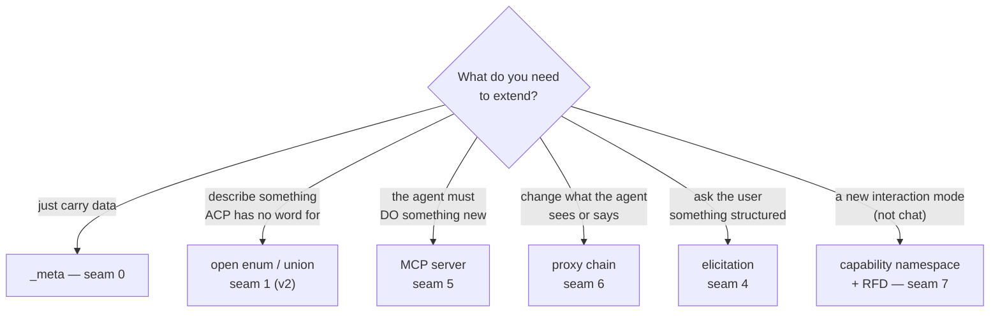
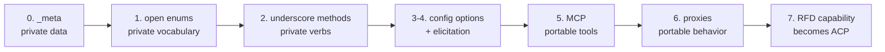
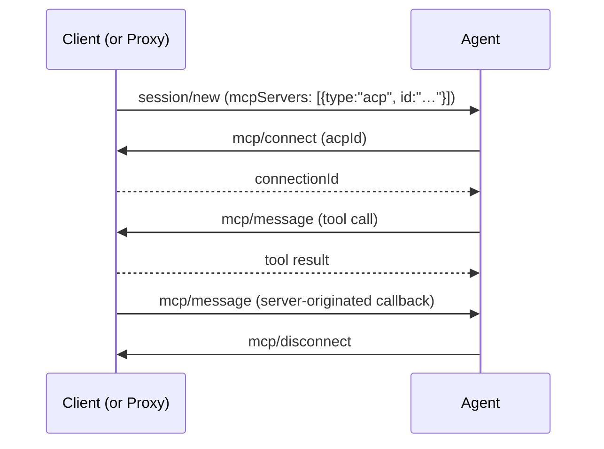
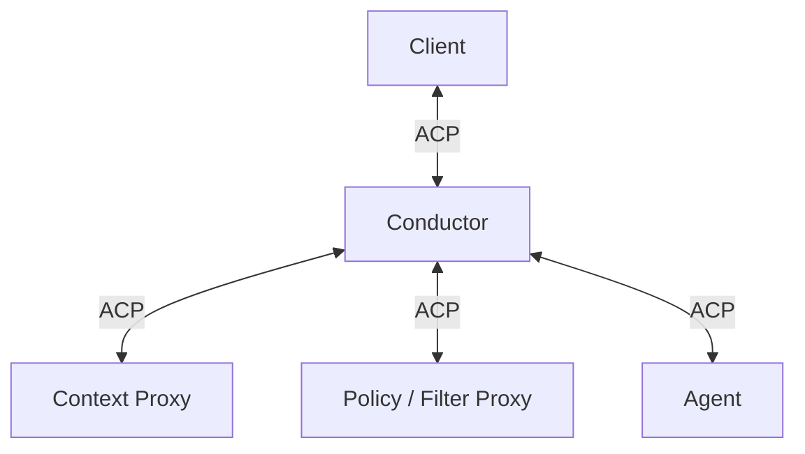

> Source: `agent-client-protocol` @ `9e6f550` · `python-sdk` @ `ce23c4a` · `typescript-sdk` @ `5dac09a` · `claude-agent-acp` @ `c3ff343` · Date: 2026-08-29
> See also: [System & OOP Architecture](/acp/acp-system-architecture/) · [User-Facing API & UX/DX](/acp/acp-surface-architecture/) · [Agent Implementation Case Study](/acp/acp-agent-implementation/)

**The question:** where can ACP be extended — vertically (into a domain that is not "editing
source code") or by capability (a new thing agents and clients can do) — and how far can you go
before you have effectively forked the protocol?

**How to read this:** the document has two halves, and they have different epistemic status.
**Part A (§2–§11) is evidence** — every mechanism is read from the repos, with its file, RFD, or
feature flag named. **Part B (§12–§16) is analysis** — my reasoning about what those mechanisms
enable. Part B is labelled throughout and is not backed by the repos beyond the ecosystem
inventory in §13.

---

## 1. TL;DR — the seven seams

| # | Seam | What it extends | Cost to use | Who must agree |
|---|------|-----------------|-------------|----------------|
| 0 | **`_meta` fields** | Data carried alongside any message | Nothing — always available | Nobody |
| 1 | **Open enums & tagged unions** | The protocol's *vocabulary* — content types, update kinds, permission subjects | Free, but **v2 only** | Nobody (peers degrade gracefully) |
| 2 | **`_`-prefixed methods** | New request/notification verbs | Small; advertise via `_meta` capability | Both peers |
| 3 | **Session config options** | User-tunable domain settings | Free; `_`-prefixed categories | Agent proposes, client renders |
| 4 | **Elicitation** | Structured user interaction, in or out of a turn | Free; capability-gated | Client must support form/url |
| 5 | **MCP servers** (incl. MCP-over-ACP) | What the agent can *do* | Standard path; ACP transport is draft | Agent must accept the server |
| 6 | **Proxies / conductor** | The agent's *behavior*, without touching the agent | New component; RFD is Draft | Nobody — transparent to both ends |
| 7 | **A new capability namespace** (RFD) | A whole new interaction mode on the same connection | Slow — governance | The whole ecosystem |

Beyond seam 7 is a fork, which forfeits the interoperability that is ACP's entire value.

---

## Part A — Mechanisms (grounded in the repos)

## 2. The extension ladder

The seams are ordered by how much agreement they require. Climb only as far as you must — each
rung up costs coordination and buys reach.

The dividing line is between rungs 0–2 (**private** — works today, nobody else benefits, no
governance) and rungs 5–7 (**portable** — other people's agents and clients can participate).
Rungs 3–4 sit in between: standard mechanisms carrying domain-specific payloads.

## 3. Seam 0 — `_meta`, the always-available seam

Every type in ACP carries `_meta: { [key: string]: unknown }` — requests, responses,
notifications, and nested types including content blocks, tool calls, plan entries, and
capability objects (`docs/protocol/v1/extensibility.mdx`).

Rules that matter:

- Root-level `traceparent`, `tracestate`, `baggage` are **reserved for W3C trace context**, for
  OpenTelemetry interop with MCP. This is what the *Meta Field Propagation* RFD standardized.
- Implementations **MUST NOT** add custom fields at the root of a spec type. All non-`_meta`
  names are reserved for future protocol versions. `_meta` is the only sanctioned place.

In the Python SDK this is ergonomic rather than an afterthought: every generated method takes
`**kwargs` that land in `field_meta`. `examples/echo_agent.py` does exactly this —
`session_update(..., source="echo_agent")`.

**What it is good for:** correlation and trace IDs, tenancy, provenance, audit breadcrumbs,
routing hints. **What it is not:** a schema. There is no validation, no discovery, and no
guarantee a peer preserves it — see §16.

## 4. Seam 1 — open enums and tagged unions (the v2 story)

This is the largest single change in extensibility between versions, and it decides how much
vertical work you can do without new methods.

**The rule** (`docs/protocol/v2/extensibility.mdx`, from the *v2 Enum Variant Extension* RFD):

> Values beginning with `_` are reserved for implementation-specific extensions. Unknown values
> that do not begin with `_` are reserved for future ACP variants. Extensions **MUST NOT** define
> custom non-underscore values.

Receivers **SHOULD** preserve unknown values when storing, replaying, proxying, or forwarding,
and degrade to generic display otherwise. The rule applies only where the schema defines a
fallback path — closed discriminators (elicitation actions, schema shapes, transport selectors)
still reject unknowns, because there is no safe way to continue.

**The inventory.** Counting Rust enums that carry a catch-all variant:

| | Open types | Notes |
|---|-----------|-------|
| **v1 stable** | **6** | `SessionConfigOptionCategory`, `ElicitationAction`, `ElicitationMode`, `ElicitationPropertySchema`, `MultiSelectItems`, `ErrorCode` |
| **v1 unstable** | +3 | `LlmProtocol`, `CompactionStatus`, `NoticeSeverity` — each behind its own feature gate |
| **v2** | **38** | Essentially every informational or display-oriented type |

The v2 ones that change what a vertical can express:

| Open type | What you can now define yourself |
|-----------|----------------------------------|
| **`ContentBlock::Other`** | **A custom content type.** Alongside text/image/audio/resource, a `_yourorg.thing` block that clients preserve and forward |
| **`SessionUpdate::Other`** | **A custom streaming update variant** — your own timeline entity in the session transcript |
| **`RequestPermissionSubject::Other`** | **Consent for something that is not a tool call.** v2 already generalized this to `tool_call \| command \| Other`; clients that don't understand yours show a generic prompt or decline per policy |
| `ToolCallContent::Other` | Custom tool-call payloads beyond content/diff/terminal |
| `PlanUpdateContent::Other` | Custom plan representations |
| `AvailableCommandInput::Other` | Custom slash-command input shapes |
| `ElicitationPropertySchema::Other` | Custom form field types |
| `ToolKind::Unknown`, `StopReason`, `ToolCallStatus`, `Role`, `IconTheme`, … | Custom display categories |

`agent-client-protocol-schema/src/v2/content.rs:122` is representative — the doc comment
instructs receivers to *"preserve the raw payload when storing, replaying, proxying, or
forwarding content, and otherwise ignore it or display it generically."*

**Corroborated downstream.** `typescript-sdk/scripts/generate.js` enumerates the tagged unions it
must keep open — `V1_EXTENSIBLE_UNIONS` has **4** entries, `V2_EXTENSIBLE_UNIONS` has **19**
(including `ContentBlock`, `SessionUpdate`, `RequestPermissionSubject`, `ToolCallContent`,
`PlanUpdateContent`). Those counts are smaller than the 6/38 above because the SDK counts only
*object* unions with a catch-all variant, while the Rust tally also includes open *string* enums;
the ~5× v1→v2 widening is the same in both. The script's comment explains that hey-api "drops
both halves of that contract", so it reconstructs them — and then emits `guards.gen.ts` with a
validated **`isCustom(value)`** narrowing per union, documenting how to read a vendor payload.
An SDK shipping first-class tooling for this seam is the strongest available signal that
`_`-prefixed vocabulary extension is a supported path rather than a loophole.

**The practical consequence:** on v1, a vertical that needs new nouns has to reach for
`_`-prefixed methods (seam 2) or smuggle structure through `_meta`. On v2, it can extend the
protocol's vocabulary directly and stay wire-legal. If you are planning a vertical extension,
**this is a reason to target v2 even though it is still draft.**

## 5. Seam 2 — `_`-prefixed methods and notifications

Any method name starting with `_` is reserved for implementations, permanently — e.g.
`_zed.dev/workspace/buffers`. Semantics:

- **Requests** follow normal JSON-RPC; an unrecognized one **must** get `-32601`.
- **Notifications** should be silently ignored when unrecognized.
- Extensions **SHOULD** advertise themselves through `_meta` in the capability objects at
  `initialize`, so callers can check before calling.

Python support is first-class: implement `ext_method(name, params)` / `ext_notification(...)` on
your Agent or Client, and call `conn.ext_method(...)`. The router strips the leading underscore
before dispatch (`src/acp/router.py`).

## 6. Seam 3 — session config options as a domain settings surface

The *Session Config Options* RFD replaced the fixed "modes" concept with an arbitrary list the
Agent declares per session. Each option has an `id`, `name`, optional `description`, a `type`
(`select`, or `boolean` when the client advertises it), a `currentValue`, and an optional
`category`.

The extension hook is the category:

> Category names beginning with `_` are free for custom use (e.g., `_my_custom_category`).
> Category names that do not begin with `_` are reserved for the ACP spec.

Crucially, categories are **UX-only** and *"MUST NOT be required for correctness"* — clients must
handle unknown ones gracefully. That makes this a safe place to put vertical settings: a client
that has never heard of your domain still renders the control.

Reserved categories today: `mode`, `model`, `model_config`, `thought_level`.

## 7. Seam 4 — elicitation as a generic domain-UI surface

Elicitation (stable since the *Elicitation* RFD completed; aligned with MCP's 2026-07-28 model)
lets the Agent ask the user for structured information through the Client. Two modes:

- **Form mode** — a restricted JSON Schema the client renders as a form. `ElicitationPropertySchema`
  has an `Other` fallback, so custom field types degrade rather than fail.
- **URL mode** — hand off to an out-of-band interaction (OAuth, or any domain web app), with
  `elicitation/complete` to report the result back.

Two properties make this more than a dialog box:

1. **It can be scoped to a request, not just a session.** Params are flattened as `sessionId`
   (+ optional `toolCallId`) *or* `requestId` "for a request-scoped interaction outside a
   session." Interaction is not confined to a chat turn.
2. **The client must supply the UI**, but the agent supplies the schema — so a vertical gets
   domain forms without any client shipping domain code.

Elicitation is capability-gated per mode, and ACP deliberately diverges from MCP here: `{}`
advertises *no* modes, each must be explicit.

## 8. Seam 5 — MCP, and MCP-over-ACP

The standard way to give an agent new abilities is MCP, and ACP already supports two directions:

- **Client → Agent.** At `session/new` the Client passes MCP server configs (stdio always; HTTP
  and SSE by capability). The Client can include *its own* MCP server — `docs/images/mcp-proxy.svg`
  shows the pattern of a small stdio proxy that tunnels back to the editor.
- **MCP-over-ACP** (RFD, Draft; Rust feature `unstable_mcp_over_acp`) removes the side channel.
  A new `"type": "acp"` transport plus `mcp/connect`, `mcp/message`, `mcp/disconnect` routes tool
  invocations back through the existing ACP connection.

The RFD's framing is the useful part: *"ACP stands in 'front' of the agent … MCP stands 'behind'
it. Many applications would benefit from being able to be both."* And the motivating constraint
is sandboxing:

> Imagine trying to host an ACP component that runs in a WASM sandbox or even on another
> machine: for that to work, the ACP protocol has to encompass all of the relevant interactions.

For a vertical this is the cleanest "new abilities" path: tools live in *your* address space,
with full conversation context, and no process management.

## 9. Seam 6 — proxies and the conductor (the universal extension mechanism)

The *Agent Extensions via ACP Proxies* RFD (Draft, ~25 KB, prototype shipped) is the most
ambitious extension point in the tree. Its diagnosis:

> MCP servers are fundamentally limited because they sit "behind" the agent. They can provide
> tools and respond to function calls, but they cannot: inject or modify prompts before they
> reach the agent; add global context that persists across conversations; transform responses
> before they reach the user; coordinate between multiple agents.

**The design.** A *proxy* sits between client and agent. Proxies do not talk to each other —
a central **conductor** routes everything, so a proxy needs exactly one communication channel
(which is what makes WASM-sandboxed proxies possible).

Two methods carry it: **`proxy/initialize`** (receiving it tells a component it has a successor;
receiving plain `initialize` means you are terminal) and **`proxy/successor`** (forward a message
on, or receive one back). From the client's perspective the conductor is an ordinary agent.

**What the RFD claims proxies subsume** — and this is the list that matters for verticals:
AGENTS.md-style context files, Claude Code plugins/skills, MCP servers (via MCP-over-ACP),
subagents (by opening new sessions and coordinating), hooks and steering files, and system-prompt
customization via modes or prepended messages.

> The key advantage is that proxy-based extensions work with any ACP-compatible agent without
> requiring agent-specific integration or modification.

**The stated limits, which are as important as the capabilities:**

> Proxies are limited to what is available through the ACP protocol itself. … they cannot
> directly modify an agent's system prompt or context window … cannot access internal agent
> state, model parameters, or other implementation details. This is actually a feature — it
> ensures that proxy-based extensions remain portable.

**Status:** Draft. A prototype exists as the `sacp`, `sacp-proxy`, `sacp-conductor` crates
(originally `symposium-dev/symposium-acp`, upstreamed to `agentclientprotocol/rust-sdk`). The RFD
also sketches an M:N future via an optional `peer` field on `proxy/successor`, which is the door
to multi-agent topologies.

## 10. Seam 7 — a new capability namespace: the NES pattern

If you want to add an interaction mode that is *not* a chat turn, ACP already has a worked
example: the **Next Edit Suggestions** RFD. It is worth studying as a template, because it
demonstrates five distinct moves:

1. **A nested capability with sub-negotiation.** `agentCapabilities.nes` declares both the
   *events* the agent wants and the *context* it wants attached. The client then sends only what
   was asked for — "minimizing overhead for simple agents while allowing rich context for
   advanced ones." The client separately advertises which *suggestion kinds* it can render.
2. **Its own session type on the same connection.** This is the structurally important one:

   > An NES session is **separate from and independent of** the ACP chat session — it has its
   > own session ID, its own lifecycle, and its own stream of events and requests. A single ACP
   > connection may have any number of active NES sessions alongside any number of chat sessions.

3. **A new notification namespace** — `document/didOpen`, `didChange`, `didClose`, `didSave`,
   `didFocus`, borrowing LSP's document-sync model wholesale, with full/incremental sync modes.
4. **Negotiated encodings.** `positionEncodings` (`utf-16` default, `utf-32`, `utf-8`) —
   precedent for negotiating a domain's coordinate system.
5. **Reuse rather than reinvention** — NES settings ride on the existing `configOptions`.

**The generalizable conclusion:** ACP is not structurally committed to "one connection = one kind
of conversation." A vertical mode can live beside the chat session, with its own session
lifecycle, its own event stream, and its own negotiated context — and NES proves the maintainers
accept that shape.

## 11. Infrastructure seams: transport, model routing, distribution

Three more extension points that are not about protocol semantics:

**Transport.** `docs/protocol/v1/transports.mdx` explicitly permits custom transports: *"The
protocol is transport-agnostic and can be implemented over any communication channel that
supports bidirectional message exchange."* The *Streamable HTTP & WebSocket Transport* RFD is
**Active** — a single `/acp` endpoint, POST for client→server, long-lived GET SSE streams for
server→client (one connection-scoped plus one per session), or a WebSocket upgrade. The Python
SDK already ships a working implementation (`acp.http`, `acp.ws`). This is what unlocks hosted
agents, mobile clients, and messaging bridges.

**Model routing.** The *Configurable LLM Providers* RFD (`providers/list`, `providers/set`,
`providers/disable`; feature `unstable_llm_providers`) lets a **client** redirect where the agent
sends LLM traffic. Its stated motivations are exactly the enterprise ones: *client proxies*,
*enterprise deployments* routing "through internal gateways for compliance, logging, and cost
controls", *self-hosted models* (vLLM, Ollama), and *API gateways*. `LlmProtocol` is an open
string type with the `_` convention, so custom protocols are expressible.

**Distribution.** The *ACP Agent Registry* RFD (Completed) defines a canonical manifest so clients
can discover agents and their capabilities. `sync-registry.yml` regenerates the site's agent list
hourly. A vertical distributing its own agent has a standard shelf to put it on — though the
registry is curated, and includes only agents that support authentication.

---

## 11.5 The seams in production — a worked inventory

Everything above is mechanism. `claude-agent-acp` — a shipping production agent — exercises most
of it, and reading its extension surface is the fastest way to see which seams people actually
reach for. The full breakdown is in the
[agent implementation case study](/acp/acp-agent-implementation/#4-extensions-in-the-wild--the-inventory);
the summary:

| Seam | Used in production for |
|------|------------------------|
| **0 `_meta`** | Permission presentation, typed session failures, fork-at-a-message, SDK settings passthrough, gateway/terminal auth negotiation, tool provenance — **eleven distinct conventions** |
| **1 open unions** | Subagent and async-task session updates — **and this is where v1 breaks down**, see below |
| **2 `_` methods** | `_session/steering`, `_session/goal`, `_session/async_task/stop`, `_claude/sdkMessage` |
| **3 config options** | Session modes, model/effort selectors |
| **4 elicitation** | Claude's `AskUserQuestion` → `elicitation/create` |
| **5 MCP** | Client-provided MCP servers |
| **6 proxies** | Not used |
| **7 RFD** | **Not used — none of the fourteen extensions has an RFD** |

Three findings that sharpen the sections above:

**Seam 1's absence in v1 has a measurable cost.** With no open `SessionUpdate` union in v1, the
adapter declares subagent and async-task update variants as local types and casts them onto the
wire, behind a single comment: *"The only cast needed until the TypeScript SDK publishes PR
#1992."* This is §4's prediction confirmed in production — on v2 the same feature is type-safe on
both ends. It is the strongest empirical argument available for targeting v2.

**Most extension needs turn out to be a missing *field*, not a missing *verb*.** Fork-at-a-message
was added by reading `params._meta.jetbrains.air.fork.messageId` on the standard `session/fork` —
no new method, no capability, and an agent that ignores `_meta` still forks at HEAD. Seam 0 applied
to *request params* is cheaper than seam 2 and under-described in §3.

**§17's namespace-registry risk is already visible.** One well-run repo contains five `_meta`
spellings: neutral (`_meta.goal`), agent-vendor (`_meta.claudeCode.*`), client-vendor nested
(`_meta.jetbrains.air.*`), redundant-underscore (`_meta["_claude/origin"]`), and bare kebab-case
(`_meta["terminal-auth"]`). But the *right* convention is also stated there, and is worth adopting
ecosystem-wide:

> It is intentionally shaped like a possible future first-class ACP API: implementations publish
> `_meta.goal`, not provider-specific metadata such as `_meta.claudeCode.goal`.
> — `claude-agent-acp/docs/goal-extension.md`

Namespace to your vendor while it is yours; publish neutrally when you intend it to become
everyone's. That is the graduation path §6 of the case study calls out, and the closest thing the
ecosystem has to a namespace policy.

---

## Part B — Verticals (analysis)

> Everything from here is my reasoning about what the mechanisms above enable, except §13,
> which is an inventory read from `docs/get-started/clients.mdx`. Treat §14–§16 as a starting
> point for discussion, not as claims about the repos.

## 12. What ACP actually assumes

The right way to judge whether a vertical fits is to separate ACP's hard assumptions from its
incidental ones.

**Hard assumptions — a vertical must satisfy these:**

| Assumption | Where it shows up |
|------------|-------------------|
| There is a **human in the loop**, represented by a Client that owns the UI | `session/request_permission` is a *baseline required* client method |
| Work is organized into **sessions** and long-running, cancellable **turns** | `session/new`, `session/prompt`, `session/cancel`, stop reasons |
| Progress is **streamed**, not batched | `session/update` is the whole UX surface |
| **Consent is a protocol-level concern**, not an application detail | The permission request/outcome round trip |
| The Client owns the environment; the Agent reaches it through the Client | The "Trusted" principle in `architecture.mdx` |

**Incidental assumptions — weaker than they look:**

| Looks like an assumption | Actually |
|--------------------------|----------|
| "The artifact is source code" | `ContentBlock` is MCP's generic text/image/audio/resource set. `ToolKind` is an explicit *display hint* — and open in v2 |
| "There is a filesystem workspace" | True in v1 (`cwd`, `fs/*`, `terminal/*`) — but **v2 removes the client filesystem and terminal APIs entirely.** v2's client surface is only `session/request_permission`, `session/update`, `elicitation/*` |
| "The agent is a local subprocess" | stdio is the default, not a requirement; transports are open and an HTTP/WS RFD is Active |
| "One connection means one chat" | NES already puts an independent session type on the same connection |

**The test, then:** does your domain have (a) a user who must approve consequential actions,
(b) long-running assisted work worth streaming, and (c) artifacts worth showing as they change?
If yes, ACP's shape fits regardless of whether the artifacts are code. The v2 slimming is
evidence the maintainers are actively removing the code-specific parts from the core.

## 13. Verticals already in the ecosystem *(inventory — from `clients.mdx`)*

Worth noting before speculating: the ecosystem has already gone well beyond code editors, and as
far as I can tell **without protocol extensions** — the seams above weren't needed.

| Vertical | Clients listed |
|----------|----------------|
| **Notebooks & data** | `agent-client-kernel` (Jupyter), marimo, `duckdb-acp` (DuckDB extension) |
| **Knowledge work** | Obsidian (4 separate plugins), Open Knowledge (local-first Markdown KB) |
| **Chat ops / messaging** | Slack, Telegram (4), Discord, WeChat, QQ, Matrix, Lark — mostly self-hosted bridges |
| **Mobile & voice** | Happy, Agmente, Ferngeist, Mobvibe, VACP (voice control), `qwen-audio-agent` (full-duplex voice, wake word, barge-in) |
| **3D / simulation** | Unity ACP Client, Unity Agent Client |
| **Data infrastructure** | Kangaroo (database IDE) |
| **Debugging** | `acpdbg` — bridges LLDB crashes to any ACP agent |
| **Orchestration** | CompozyOS ("agent OS": loops, schedules, shared memory, approvals), Jockey, Kronos (cron + dashboard), Codeg |

The pattern: a "Client" turns out to mean *any surface where a human supervises an agent* — a
Slack thread, a notebook cell, a voice call, a Unity editor panel. The chat-turn abstraction
survives the change of medium.

## 14. Candidate verticals and what each would need *(analysis)*

| Vertical | Maps natively | Would need |
|----------|---------------|-----------|
| **Data analysis / notebooks** | Cells as tool calls; `diff` content for cell edits; plan updates for multi-step analysis | A `document/*`-style sync for cells (seam 7, NES pattern); custom `ContentBlock` for a rendered figure or dataframe (seam 1, v2) |
| **Infra / DevOps** | Terminals + permission are already the right primitives; `usage_update` for cost | Multi-target roots (`additionalDirectories` exists); stronger provenance in `_meta`; policy proxies (seam 6) |
| **Document & knowledge work** | Diffs work on prose; `resource` content blocks; slash commands | Custom content blocks for structured documents (seam 1); already proven by the Obsidian clients |
| **Design / CAD / 3D** | Tool calls with domain `ToolKind` values; permission before destructive scene edits | Custom content blocks for scene/object references (seam 1, v2); the Unity clients show the medium works |
| **Multi-agent orchestration** | Sessions are already concurrent; `session/fork` (unstable) for branching | Proxy chains with the `peer` extension (seam 6); this is the RFD's own stated future |
| **Regulated / clinical work** | Consent-as-protocol is an unusually good fit; the transcript is already an event stream | See §15 — the fit is real but partial |

## 15. The regulated-domain case, examined honestly *(analysis)*

This one deserves more than a table row, because the fit is genuinely good in places and
genuinely absent in others, and conflating the two would be expensive.

**What ACP gives you for free:**

| Requirement | ACP mechanism |
|-------------|---------------|
| Explicit human authorization before a consequential action | `session/request_permission`. In **v2** the subject is a union with a custom fallback, so `_yourorg.export_report` is expressible and unknown-subject clients degrade to a generic prompt or decline per policy |
| An append-only record of what the agent did and showed | The `session/update` stream *is* an event log; `session/load` replay means transcripts are already a first-class concept |
| Correlation across systems | `_meta` with W3C `traceparent` / `tracestate` / `baggage` — standardized precisely for cross-tool instrumentation |
| Keeping inference on approved infrastructure | `providers/*` — a client can point the agent at an internal gateway or self-hosted model, with the RFD naming "compliance, logging, and cost controls" as motivation |
| Data staying inside a boundary | The trust model already says the Client owns the environment and the Agent reaches it only through the Client — so a Client can be the enforcement point |
| Domain-specific structured input | Elicitation form mode, including outside a chat turn (`requestId` scope) |
| Deployment policy without touching the agent | A proxy (seam 6) can enforce redaction, blocking, or logging across *any* ACP agent |

**What ACP does not give you, and will not:**

- **No identity or authorization model beyond agent authentication.** `authenticate` /
  `auth/login` is about the client authenticating *to the agent*. There is no notion of an
  end-user identity, a role, or an access decision on a record. Elicitation's own spec is careful
  here: agents *"MUST bind each elicitation and related state to the receiving Client connection
  and, when authentication exists, the verified user identity. A `sessionId` alone … is not
  sufficient."* That is a warning, not a feature.
- **No retention, immutability, or non-repudiation.** The transcript is a stream, not a ledger.
  Nothing signs it, nothing prevents replay-time divergence.
- **No data residency or egress guarantees.** `providers/*` (still unstable) tells you where the
  agent *says* it routes; it does not constrain the agent.
- **No concept of a record, a subject, or a retention class.** Domain semantics are entirely yours.
- **No conformance suite** to prove an extended implementation still interoperates (§17).

**The honest summary:** ACP is a good *interaction* substrate for supervised domain work — the
consent round trip, the streamed transcript, and the client-owns-the-environment trust model are
exactly the primitives you would otherwise build. It is not a compliance substrate, and treating
`_meta` breadcrumbs as an audit trail would be a mistake. The realistic architecture is ACP for
the human-agent loop, with the record-keeping, identity, and residency layers *underneath* it and
enforced by the Client — not delegated to the protocol.

## 16. Choosing a seam *(analysis)*

A rough decision order, cheapest first:

1. **Can `_meta` carry it?** Then use `_meta`. No negotiation, no governance, works on v1 today.
2. **Do you need a new noun the UI must render?** On **v2**, extend an open enum or union with a
   `_`-prefixed value — the peer preserves or generically renders it. On **v1**, you'll need a
   custom method or a `_meta` payload instead.
3. **Do you need the agent to be able to *do* something?** MCP. Prefer MCP-over-ACP if you need
   the tool to live in your process with conversation context — accepting that it is Draft.
4. **Do you need to change the agent's behavior across many agents?** A proxy. This is the only
   seam that gives you portability *without* asking agent authors for anything.
5. **Do you need a whole new interaction mode?** Follow the NES pattern — nested capability with
   sub-negotiation, its own session type, its own namespace — and write an RFD.
6. **Would the ecosystem benefit?** Then it belongs in an RFD regardless of which seam you used,
   because a private extension permanently forfeits interoperability, which is the only reason
   to be on ACP at all.

A useful sanity check at every rung: *what does a vanilla client do when it meets this?* Seams 0,
1, and 6 have good answers (ignore, degrade, transparent). Seams 2 and 5 have acceptable ones
(`-32601`, capability check). If your design has no answer, you have forked.

---

## 17. Risks and constraints when extending

- **The `_` namespace has no registry.** Convention appears to be reverse-DNS-ish (`zed.dev/...`,
  `_my_custom_category`), but nothing enforces it and nothing prevents collisions. I found no
  allocation authority in the repos.
- **`_meta` is unvalidated and undiscoverable.** No schema, no generated types, and the only
  discovery path is advertising it yourself in a capability object's `_meta`.
- **Version divergence is a real cost.** An extension built on v2's open enums simply cannot be
  expressed on v1, and the migration guide notes that converting v2 → v1 *"should fail when an
  unknown v2 value cannot be represented in v1 without data loss."*
- **Unstable ≠ stable.** `unstable_*` features and Draft RFDs carry no compatibility promise;
  only *Completed* RFDs represent a one-way door.
- **Proxies see everything.** The RFD is direct about it: *"Proxy components can intercept and
  modify all communication, so trust is essential."* WASM sandboxing is planned, not present, and
  *"such components could still modify prompts in unknown or malicious ways."*
- **Private extensions are a dead end by construction.** Every rung below 5 works today and helps
  nobody else; that is the trade you are making.

## 18. Open Questions

- **No conformance or interop test suite** appears in either repo. `tests/golden/` in the Python
  SDK pins helper output against the schema, which is not the same thing as verifying that an
  *extended* implementation still works against a vanilla peer. If one exists elsewhere in the
  ecosystem, I did not find it here.
- **`sacp`, `sacp-proxy`, `sacp-conductor` are not in this workspace** (they live in `rust-sdk` /
  `symposium-acp`). Everything in §9 comes from the RFD prose and its diagrams, not from reading
  the implementation.
- **Seam-1 tooling exists but only in TypeScript so far.** `typescript-sdk` generates `isCustom`
  guards for extensible unions; `python-sdk` has no equivalent, and is pinned to a v1-only
  schema where the seam barely exists. A vertical extension built on open unions would today be
  ergonomic in TypeScript and hand-rolled everywhere else.
- **Whether the non-code clients in §13 use any extension at all** — I inventoried the list but
  did not inspect those repos. The claim that they needed no protocol changes is an inference
  from the absence of vertical RFDs, not a verified fact.
- **The RFD process is being outrun.** Steering, goals, async tasks, and subagent sessions all ship
  cross-vendor with no RFD, and `subagent` appears in no published schema artifact at spec commit
  `9e6f550`. Two of them carry specification-quality documentation in a vendor's `docs/` folder.
  Whether that is healthy prototyping ahead of §6.3's lifecycle or a governance gap is a judgement
  I cannot make from the repos.
- **v2's timeline is unknown.** It is tagged `schema-v2.0.0-alpha.3` and every v2 page is marked
  Draft. §4's advice to target v2 for vocabulary extension carries that risk.
- **How proxies compose with capability negotiation** in edge cases (a proxy advertising a
  capability the terminal agent lacks) is sketched in the RFD but not, as far as I can tell,
  fully specified.
- **No mechanism found for a client to *revoke* a capability mid-connection** — negotiation
  happens once at `initialize`. For long-lived or policy-driven deployments that may matter.

---

*Part A was read from the repositories at the commits above: every mechanism names its file, RFD,
or feature flag. Part B is analysis and is labelled as such.*
