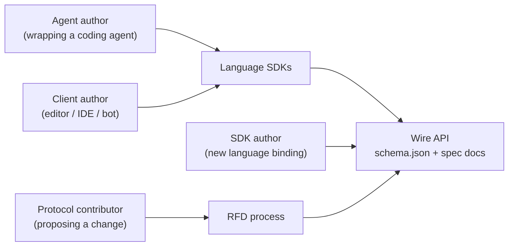
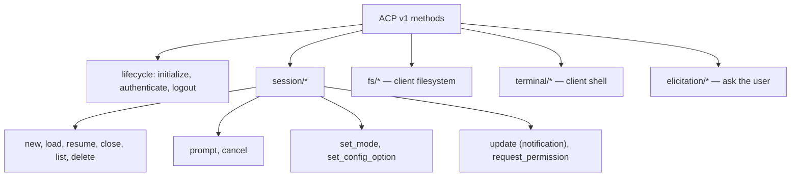
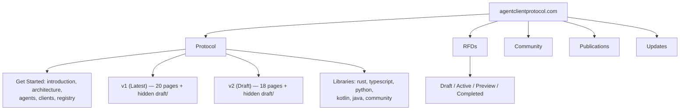
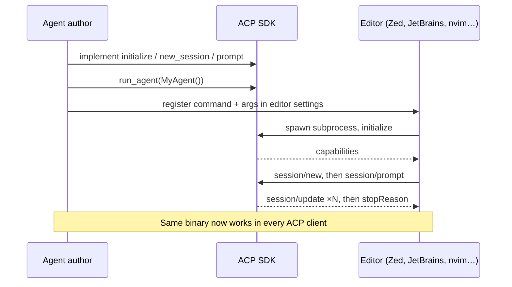
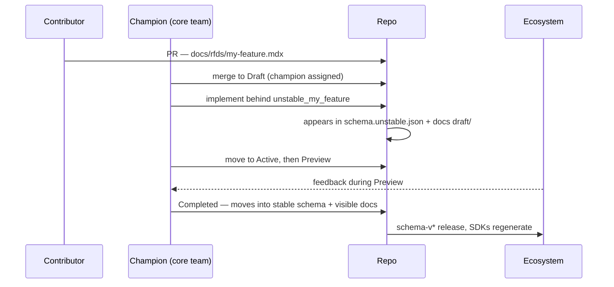
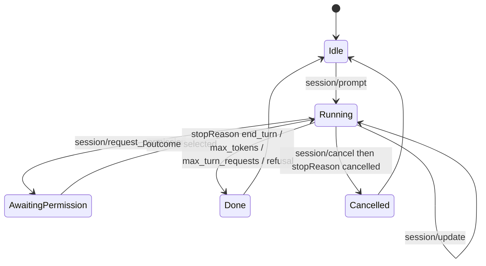
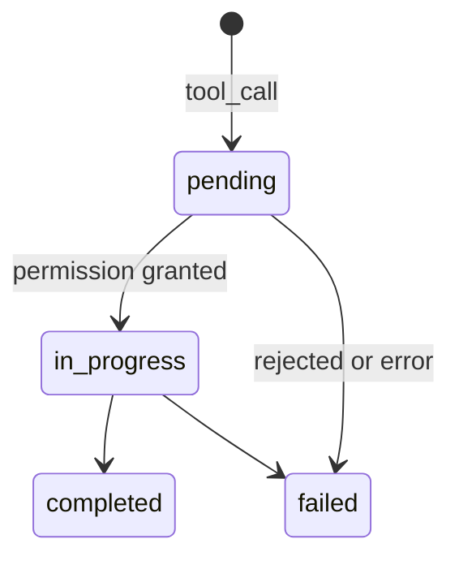

> Source: `agent-client-protocol` @ `9e6f550` (tag `schema-v2.0.0-alpha.3`) · `python-sdk` @ `ce23c4a` (`v0.12.1`) · `typescript-sdk` @ `5dac09a` (`v1.4.0`) · Date: 2026-08-29 · Mode: **Explain** · Surface: **Hybrid** (Wire API + Library/SDK + Docs site)
> See also: [System & OOP Architecture](/acp/acp-system-architecture/) · [Extension Points & Vertical Surfaces](/acp/acp-extension-points/) · [Agent Implementation Case Study](/acp/acp-agent-implementation/)

---

## Cheat Sheet

**The protocol in four messages** (JSON-RPC 2.0 over the agent's stdin/stdout, newline-delimited):

```jsonc
→ {"jsonrpc":"2.0","id":0,"method":"initialize","params":{"protocolVersion":1,"clientCapabilities":{"fs":{"readTextFile":true}},"clientInfo":{"name":"my-client","version":"1.0.0"}}}
← {"jsonrpc":"2.0","id":0,"result":{"protocolVersion":1,"agentCapabilities":{"loadSession":true},"authMethods":[]}}
→ {"jsonrpc":"2.0","id":1,"method":"session/new","params":{"cwd":"/abs/path","mcpServers":[]}}
← {"jsonrpc":"2.0","id":1,"result":{"sessionId":"sess_abc123"}}
→ {"jsonrpc":"2.0","id":2,"method":"session/prompt","params":{"sessionId":"sess_abc123","prompt":[{"type":"text","text":"Fix the failing test"}]}}
← {"jsonrpc":"2.0","method":"session/update","params":{"sessionId":"sess_abc123","update":{"sessionUpdate":"agent_message_chunk","content":{"type":"text","text":"Looking..."}}}}   // ×N
← {"jsonrpc":"2.0","id":2,"result":{"stopReason":"end_turn"}}
```

**Python SDK (`agent-client-protocol`) — the ten calls you actually use:**

| Call | Use |
|------|-----|
| `pip install agent-client-protocol` | Install |
| `await run_agent(MyAgent())` | Serve an agent over stdio — the whole main function |
| `connect_to_agent(my_client, writer, reader)` | Drive an agent from Python |
| `async with spawn_agent_process(client, cmd, *args) as (conn, proc)` | Spawn + wire + tear down a child agent |
| `class MyAgent(Agent): async def prompt(self, session_id, prompt, **kw)` | The one method you must implement |
| `await conn.session_update(session_id=..., update=...)` | Stream progress to the client |
| `text_block("hi")`, `tool_content(...)`, `tool_diff_content(...)` | Build content without touching discriminators |
| `update_agent_message(text_block(...))`, `start_tool_call(...)`, `update_tool_call(...)` | Build `session/update` payloads |
| `raise RequestError.method_not_found("fs/read_text_file")` | Decline a method you don't support |
| `PROTOCOL_VERSION`, `AGENT_METHODS`, `CLIENT_METHODS` | The negotiated version and method-name maps |

**TypeScript SDK (`@agentclientprotocol/sdk`) — the same job, a different idiom:**

```ts
import * as acp from "@agentclientprotocol/sdk";

// Serve an agent over stdio
acp.agent({ name: "my-agent" })
  .onRequest("initialize", (ctx) => ({ protocolVersion: acp.PROTOCOL_VERSION, agentCapabilities: {} }))
  .onRequest("session/new", (ctx) => ({ sessionId: crypto.randomUUID() }))
  .onRequest("session/prompt", async (ctx) => {
    await ctx.client.notify(acp.methods.client.session.update, {
      sessionId: ctx.params.sessionId,
      update: { sessionUpdate: "agent_message_chunk", content: { type: "text", text: "hi" } },
    });
    return { stopReason: "end_turn" };
  })
  .connect(acp.ndJsonStream(output, input));

// Drive an agent as a client
await acp.client({ name: "my-client" })
  .onRequest(acp.methods.client.session.requestPermission, (ctx) => ({ outcome: { outcome: "cancelled" } }))
  .connectWith(stream, async (ctx) => {
    await ctx.request(acp.methods.agent.initialize, { protocolVersion: acp.PROTOCOL_VERSION, clientCapabilities: {} });
    return ctx.buildSession(process.cwd()).withSession(async (session) => {
      session.prompt("Hello, agent!");          // bare string is wrapped for you
      return await session.readText();          // collect chunks until stopReason
    });
  });
```

**Repo task surfaces** — spec repo: `npm run generate`, `npm run check`, `npm run docs`.
Python SDK: `make install`, `make check`, `make test`, `ACP_SCHEMA_VERSION=<ref> make gen-all`.
TypeScript SDK: `npm run generate`, `npm run check` (generate-check → lint → format → spellcheck → build → test → typedoc), `npm test`.

---

## 1. Overview

ACP is **an interface first and a codebase second.** Its product is a contract: if your agent
speaks it, every ACP editor can drive it; if your editor speaks it, every ACP agent works
inside it. Everything in these two repos exists to make that contract legible, versioned, and
implementable.

### Surface type — Hybrid, with evidence

Three distinct surfaces, three distinct users:

| Surface | Evidence | User |
|---------|----------|------|
| **Wire API** (the primary one) | `schema/v1/schema.json` (JSON Schema), `schema/v1/meta.json` (method-name catalog), `docs/protocol/v1/*.mdx` (normative MUST/SHOULD prose) | A developer implementing either side, in any language |
| **Library / SDK** | `python-sdk/src/acp/__init__.py` `__all__` (~200 curated names) + `py.typed`; `typescript-sdk/package.json` `exports` map (stable root + five `experimental/*` subpaths); `agent-client-protocol-schema/src/lib.rs` `pub mod` + docs.rs metadata | A developer importing a language binding |
| **Docs site** | `docs/docs.json` — Mintlify config with 5 navigation tabs, redirects, versioned groups | Anyone learning or governing the protocol |

There is no GUI and no CLI for end users. The **end user** — a developer typing a prompt in
Zed — never sees ACP; they see their editor. That indirection is the design goal, and it is why
this document treats *implementers* as the users.

### The four users



---

## 2. Surface Map

### 2.1 Wire API — the v1 method catalog

The full inventory, from `schema/v1/meta.json` cross-checked against `docs/protocol/v1/overview.mdx`.
"Required" means every conforming implementation must provide it; everything else is gated on a
capability declared at `initialize`.

**Client → Agent** (the Agent implements these):

| Method | Kind | Required? |
|--------|------|-----------|
| `initialize` | request | **required** |
| `authenticate` | request | when `authMethods` is non-empty |
| `session/new` | request | **required** |
| `session/prompt` | request | **required** |
| `session/cancel` | notification | **required** |
| `session/load` | request | `loadSession` |
| `session/resume` | request | `sessionCapabilities.resume` |
| `session/close` | request | `sessionCapabilities.close` |
| `session/list` | request | `sessionCapabilities.list` |
| `session/delete` | request | `sessionCapabilities.delete` |
| `session/set_mode` | request | when the session reports `modes` |
| `session/set_config_option` | request | when the session reports `configOptions` |
| `logout` | request | `auth.logout` |

**Agent → Client** (the Client implements these):

| Method | Kind | Required? |
|--------|------|-----------|
| `session/request_permission` | request | **required** |
| `session/update` | notification | **required** |
| `fs/read_text_file` | request | `fs.readTextFile` |
| `fs/write_text_file` | request | `fs.writeTextFile` |
| `terminal/create`, `terminal/output`, `terminal/wait_for_exit`, `terminal/kill`, `terminal/release` | requests | `terminal` |
| `elicitation/create` | request | `elicitation.form` / `elicitation.url` |
| `elicitation/complete` | notification | `elicitation.url` |

**Protocol-level:** `$/cancel_request` — a *notification* that cancels one in-flight request (distinct from `session/cancel`, which aborts a whole turn). It follows LSP's `$/` convention: implementations that cannot act on it — a single-threaded synchronous runtime, say — are free to ignore it.



### 2.2 `session/update` — the streaming surface

One notification carries every kind of progress. This is where the *UX* of ACP actually lives:

| `sessionUpdate` value | What the Client renders |
|-----------------------|-------------------------|
| `user_message_chunk` / `agent_message_chunk` / `agent_thought_chunk` | Streamed message text; chunks sharing a `messageId` belong to one message |
| `tool_call` | A new tool call appears — title, `kind` (icon hint), status |
| `tool_call_update` | Status/content/locations patch; only changed fields are sent |
| `plan` | The agent's task list with per-entry `priority` and `status` |
| `available_commands_update` | Slash-command menu, updatable mid-session |
| `current_mode_update` | Mode switched by the agent itself |
| `config_option_update` | A session setting changed |
| `session_info_update` | Session title/metadata |
| `usage_update` | Context used / size, and optional cost `{amount, currency}` |

Tool-call content has three shapes, and the third is the interesting one:
`{type:"content"}` (ordinary blocks), `{type:"diff", path, oldText, newText}` (rendered as a
real diff), and `{type:"terminal", terminalId}` — **a live terminal embedded in the tool call**,
which the Client keeps displaying even after the terminal is released.

### 2.3 Capability negotiation — the discovery surface

`initialize` is a self-description call: each side declares what it can do, and the answer
shapes every later message. Omitted always means unsupported.

| Client declares | Agent declares |
|-----------------|----------------|
| `fs.readTextFile`, `fs.writeTextFile` | `loadSession` |
| `terminal` | `promptCapabilities.{image, audio, embeddedContext}` |
| `elicitation.{form, url}` | `mcpCapabilities.{http, sse}` |
| `auth.terminal` | `auth.logout` |
| `session.configOptions.boolean` | `sessionCapabilities.{list, resume, close, delete, additionalDirectories}` |
| `_meta` → custom capabilities | `_meta` → custom capabilities |

Both sides also send `clientInfo` / `agentInfo` as `{name, title, version}` — `name` for logic,
`title` for display, `version` for debugging.

### 2.4 Python SDK — public API

Everything below is in `acp.__all__` (or an explicitly documented submodule).

| Group | Symbols |
|-------|---------|
| **Entry points** | `run_agent`, `connect_to_agent` |
| **Interfaces** | `Agent`, `Client` (both `typing.Protocol`) |
| **Constants** | `PROTOCOL_VERSION`, `AGENT_METHODS`, `CLIENT_METHODS` |
| **Errors** | `RequestError` + constructors `parse_error`, `invalid_request`, `method_not_found`, `invalid_params`, `internal_error`, `auth_required`, `resource_not_found` |
| **Process / stdio** | `spawn_agent_process`, `spawn_client_process`, `spawn_stdio_connection`, `stdio_streams`, `spawn_stdio_transport`, `default_environment` |
| **Content helpers** | `text_block`, `image_block`, `audio_block`, `resource_link_block`, `resource_block`, `embedded_text_resource`, `embedded_blob_resource` |
| **Update helpers** | `update_user_message(_text)`, `update_agent_message(_text)`, `update_agent_thought(_text)`, `update_plan`, `plan_entry`, `session_notification` |
| **Tool-call helpers** | `start_tool_call`, `start_read_tool_call`, `start_edit_tool_call`, `update_tool_call`, `tool_content`, `tool_diff_content`, `tool_terminal_ref` |
| **Schema models** | ~90 re-exported Pydantic types (`InitializeRequest`, `PromptResponse`, `SessionNotification`, elicitation and terminal families …); the full set lives in `acp.schema` |
| **Submodules** | `acp.contrib` (`SessionAccumulator`, `ToolCallTracker`, `PermissionBroker`, `default_permission_options`), `acp.http` (`create_http_stream`, `AcpServer`), `acp.ws` (`create_websocket_stream`) — the last two behind the `[http]` extra |
| **Deprecated** | `AgentSideConnection`, `ClientSideConnection` at top level — still importable from `acp.core`, but `__getattr__` warns and points at `run_agent` / `connect_to_agent` |

### 2.5 TypeScript SDK — public API

Published as `@agentclientprotocol/sdk`. The `exports` map in `package.json` is the surface
contract, and it encodes the stability story directly in the import path:

| Import path | Contents |
|-------------|----------|
| `@agentclientprotocol/sdk` | **Stable v1.** Everything below unless noted |
| `@agentclientprotocol/sdk/experimental/v2` | The full v2 API, `PROTOCOL_VERSION = 2`, plus `batchRequest` / `batchNotification` |
| `.../experimental/http-client` | `createHttpStream`, `MemoryAcpCookieStore` |
| `.../experimental/ws-client` | `createWebSocketStream` |
| `.../experimental/server` | `AcpServer` — the Streamable HTTP + WebSocket server |
| `.../experimental/node` | `createNodeHttpHandler`, `createNodeWebSocketUpgradeHandler` |
| `.../schema/schema.json`, `.../schema/v2/schema.unstable.json` | **The raw JSON Schema, shipped in the package** |

The value exports from the stable entry point:

| Group | Symbols |
|-------|---------|
| **App builders** | `agent(options?) → AgentApp`, `client(options?) → ClientApp`. Fluent: `.onRequest(...)`, `.onNotification(...)`, `.onConnect(...)`, then `.connect(stream)` or `.connectWith(stream, op)` |
| **Contexts** | `AgentContext` (`request`, `notify`, `requestId`), `ClientContext` (adds `buildSession`) |
| **Session helpers** | `SessionBuilder`, `ActiveSession` (`prompt`, `nextUpdate`, `readText`, `dispose`, `[Symbol.dispose]`) |
| **Transport** | `ndJsonStream(output, input)`; `Stream` is a pair of Web-standard `ReadableStream`/`WritableStream` |
| **Constants** | `PROTOCOL_VERSION`, `AGENT_METHODS`, `CLIENT_METHODS`, `PROTOCOL_METHODS`, and `methods` — a *nested* tree (`methods.agent.session.prompt`, `methods.client.fs.readTextFile`) |
| **Errors** | `RequestError` + `parseError`, `invalidRequest`, `methodNotFound`, `invalidParams`, `internalError`, `authRequired`, `resourceNotFound` |
| **Type guards** | `CreateElicitationRequest`, `CreateElicitationResponse`, `ElicitationPropertySchema`, `MultiSelectItems` — value/type pairs merged by declaration merging, so `CreateElicitationResponse.isAccept(r)` narrows |
| **Types** | `export type * from "./schema/types.gen.js"` — the whole generated type surface, re-exported wholesale |
| **Deprecated** | `AgentSideConnection`, `ClientSideConnection`, and the `Agent` / `Client` interfaces; also `extMethod` / `extNotification` (use `onRequest` with any string) and `sendRequest` / `sendNotification` (use `request` / `notify`) |

Two absences are as informative as the presences: **there are no content-builder helpers**
(no `textBlock`, no `startToolCall` — you write typed object literals), and **there is no
subprocess-spawning helper** (`src/examples/client.ts` reaches for `node:child_process` directly).
Both exist in the Python SDK. See §6 for the side-by-side.

`zod` is a **peer** dependency, not a hard one — the generated `zod.gen.ts` validators need it,
but the version is the consumer's choice (`^3.25.0 || ^4.0.0`).

### 2.6 Rust schema crate — public API

`agent-client-protocol-schema` exposes `pub mod rpc`, `pub mod v1`, `pub mod v2`
(feature-gated), plus `ProtocolVersion`, `MaybeUndefined`, `IntoOption`, `IntoMaybeUndefined`.
Its own doc comment is careful to redirect: *"This crate is **only** the schema … For the
runtime pieces (transport, connection setup, the `Agent` / `Client` traits) use the
higher-level `agent-client-protocol` crate."*

The feature flags are part of the surface — they are how a consumer opts into unstable protocol
area:

| Feature | Effect |
|---------|--------|
| `schemars` (default) | `JsonSchema` impls; disable for size-sensitive builds |
| `unstable` | Umbrella over `unstable_llm_providers`, `unstable_mcp_over_acp`, `unstable_nes`, `unstable_plan_operations`, `unstable_session_fork`, `unstable_session_compaction`, `unstable_session_notices`, `unstable_end_turn_token_usage`, `unstable_tool_call_name` |
| `unstable_protocol_v2` | **Deliberately outside** `unstable` — enables `v2` and removes `ProtocolVersion::LATEST` so you must choose `V1` or `V2` explicitly |
| `tracing` | Warn when a malformed list entry is skipped during deserialization |

### 2.7 Docs site information architecture



Two IA decisions worth copying: **stable and draft live side by side** (each version group has a
`hidden: true` `draft/` mirror, so unstable features are documented without being discoverable
by accident), and **the RFD tab is grouped by lifecycle stage rather than by topic** — the
navigation *is* the status board.

---

## 3. Entry & Onboarding

### Agent author, Python

```bash
pip install agent-client-protocol   # or: uv add agent-client-protocol
python examples/echo_agent.py       # a working streaming agent, ~70 lines
```

Then point a real editor at it. Zed's `settings.json`:

```json
{
  "agent_servers": {
    "Echo Agent (Python)": {
      "type": "custom",
      "command": "/abs/path/to/python",
      "args": ["/abs/path/to/python-sdk/examples/echo_agent.py"]
    }
  }
}
```

The minimum viable agent is three methods — and `initialize` and `new_session` are near-trivial:

```python
class MyAgent(Agent):
    def on_connect(self, conn: Client) -> None: self._conn = conn

    async def initialize(self, protocol_version, **kw) -> InitializeResponse:
        return InitializeResponse(protocol_version=protocol_version)

    async def new_session(self, cwd, **kw) -> NewSessionResponse:
        return NewSessionResponse(session_id=uuid4().hex)

    async def prompt(self, session_id, prompt, **kw) -> PromptResponse:
        await self._conn.session_update(
            session_id=session_id,
            update=update_agent_message(text_block("hello")),
        )
        return PromptResponse(stop_reason="end_turn")

asyncio.run(run_agent(MyAgent()))
```

`on_connect(conn)` is the handshake that makes the SDK click: the connection hands you *the
peer*, typed as `Client`. From there you call the editor as if it were a local object.

### Agent author, TypeScript

```bash
npm install @agentclientprotocol/sdk
npx tsx src/examples/agent.ts    # the runnable example
```

Same three methods, registered rather than implemented:

```ts
acp.agent({ name: "my-agent" })
  .onRequest("initialize", () => ({ protocolVersion: acp.PROTOCOL_VERSION, agentCapabilities: {} }))
  .onRequest("session/new", () => ({ sessionId: crypto.randomUUID() }))
  .onRequest("session/prompt", async (ctx) => {
    await ctx.client.notify(acp.methods.client.session.update, { /* … */ });
    return { stopReason: "end_turn" };
  })
  .connect(acp.ndJsonStream(Writable.toWeb(process.stdout), Readable.toWeb(process.stdin)));
```

The equivalent of Python's `on_connect` is **`ctx.client`** — every handler context carries the
peer, so there is no instance state to wire up. `claude-agent-acp` uses exactly this shape at
production scale; see the [case study §3.1](/acp/acp-agent-implementation/#31-lifecycle--acp-session--sdk-query)
for the full handler table, including the `unstable_` methods and a custom `_`-prefixed request. Zed configuration is the same shape as for
Python (`command` + `args`), and `src/examples/README.md` adds a debugging tip worth knowing:
Zed's command palette has an **`acp: open acp logs`** action that shows the raw messages both
ways.

### Client author

No install ceremony — spawn the agent as a subprocess, write JSON-RPC to its stdin, read from
its stdout. In Python that is `connect_to_agent(my_client, writer, reader)`, or
`spawn_agent_process(...)` which does the spawning too. In TypeScript it is
`client({...}).connectWith(stream, async (ctx) => …)`, with `ctx.buildSession(cwd)` giving you an
`ActiveSession` to prompt against — you spawn the child process yourself. The obligations are
small and explicit:
implement `session/request_permission`, handle `session/update`, and declare honestly in
`clientCapabilities` — everything you don't declare, agents won't call.

### SDK author (new language binding)

Start from the release artifacts, not the git tree. `README.md`: the versioned `.json` files
attached to each `schema-v*` GitHub release are "the recommended download surface for SDK
generators and other release automation." You need two files: `schema.json` (the types) and
`meta.json` (the method-name catalog + protocol version).

Two worked examples of exactly that are now in this workspace, and they made different choices:
`python-sdk/scripts/gen_all.py` fetches from `raw.githubusercontent.com` and runs
`datamodel-code-generator`; `typescript-sdk/scripts/generate.js` fetches from the **release
assets** (`releases/download/<tag>/schema.unstable.json`) and runs `@hey-api/openapi-ts` with its
typescript and zod plugins. Both then post-process heavily — see §6.

### Protocol contributor

Copy `docs/rfds/TEMPLATE` to `docs/rfds/my-feature.md` and open a PR. The bar for starting is
deliberately low — `about.mdx` says "just an elevator pitch and status quo are enough to begin
dialog." The PR itself becomes the discussion forum.

---

## 4. Key User Journeys

### 4.1 "Make my coding agent work in every editor"



The payoff is the last line. One integration, not N.

### 4.2 "Drive an agent from my own program"

```python
async with spawn_agent_process(SimpleClient(), sys.executable, "examples/echo_agent.py") as (conn, _proc):
    await conn.initialize(protocol_version=PROTOCOL_VERSION)
    session = await conn.new_session(cwd=".", mcp_servers=[])
    await conn.prompt(session_id=session.session_id, prompt=[text_block("Hello!")])
```

The context manager owns the child process lifecycle — graceful stdin close, then `terminate`,
then `kill`, with timeouts at each step. This is the surface for building bots, CI harnesses,
and multi-agent orchestrators; `examples/duet.py` uses it to run a client and agent in one
process.

TypeScript expresses the same journey through the session helper rather than a process helper:

```ts
await acp.client({ name: "example-client" })
  .onRequest(acp.methods.client.session.requestPermission, (ctx) => client.requestPermission(ctx.params))
  .connectWith(stream, async (ctx) => {
    await ctx.request(acp.methods.agent.initialize, { protocolVersion: acp.PROTOCOL_VERSION, clientCapabilities: {} });
    return ctx.buildSession(process.cwd()).withSession(async (session) => {
      session.prompt("Hello, agent!");
      for (;;) {
        const message = await session.nextUpdate();
        if (message.kind === "stop") return message.response;
        await client.sessionUpdate(message.notification);
      }
    });
  });
```

Note the inversion: Python hands you a *connection* and you await named methods on it;
TypeScript hands you a *context* and you pull messages off an `ActiveSession` queue. The
`nextUpdate()` loop, with its `kind: "session_update" | "stop"` union, turns the whole prompt
turn into a single `for(;;)` — the stop reason arrives in the same channel as the updates
rather than as a separate return value.

For in-process testing TypeScript adds something Python has no equivalent of:
`agentApp.connect(clientApp)` wires two apps together **with no transport at all**.

### 4.3 "Get a change into the protocol"



Note the ordering: **implementation precedes stabilization**, and every step of the way the
feature is reachable only by opting in — a cargo feature, an unstable schema file, a hidden docs
page. Nothing lands in the stable surface until it is a one-way door.

---

## 5. Interaction & State

### 5.1 Error contract

Plain JSON-RPC 2.0 plus two ACP-reserved codes. `docs/protocol/v1/error.mdx` is still a stub
("_Documentation coming soon_"), so **the canonical list lives in code** —
`agent-client-protocol-schema/src/v1/error.rs`, mirrored independently by `python-sdk`'s
`RequestError` and `typescript-sdk`'s `RequestError` (`src/jsonrpc.ts`). All three agree:

| Code | Meaning | Typical trigger |
|------|---------|-----------------|
| `-32700` | Parse error | Malformed JSON frame |
| `-32600` | Invalid request | Not a valid JSON-RPC object |
| `-32601` | Method not found | Uncapable peer, or an unrecognized `_`-extension |
| `-32602` | Invalid params | Schema validation failure |
| `-32603` | Internal error | Unhandled exception in a handler |
| `-32000` | **Auth required** | Call before `authenticate` |
| `-32002` | **Resource not found** | `data: {uri}` |

The Python SDK maps a Pydantic `ValidationError` to `-32602` with `data.errors` carrying the
full validation report — an error that tells you exactly which field was wrong. TypeScript does
the same job with zod, and its `methodNotFound` goes one better by putting the method name in
both the message and `data`: `"Method not found": session/set_mode`.

Three independent implementations agreeing on `-32000` / `-32002` is stronger evidence than the
(absent) prose — but it is still convention rather than specification.

### 5.2 Turn lifecycle (v1)



**Cancellation is a designed UX, not an error path.** The spec is emphatic: an aborted turn
must come back as `stopReason: "cancelled"`, never as a JSON-RPC error, because Clients show
unrecognized errors to users and a cancellation is not a failure. The Client meanwhile
pre-marks unfinished tool calls `cancelled` and must answer every pending permission request
with the `cancelled` outcome. Updates arriving *after* the cancel are still accepted.

### 5.3 Tool call lifecycle



`pending` means "not started — either the input is still streaming or we're waiting for
approval." The `kind` field (`read`, `edit`, `delete`, `move`, `search`, `execute`, `think`,
`fetch`, `other`) exists purely so Clients can pick an icon and a rendering strategy without
parsing the tool name.

### 5.4 Permission prompts

Four `PermissionOptionKind` values — `allow_once`, `allow_always`, `reject_once`,
`reject_always` — are UI hints, not policy: the Agent supplies the option list and the Client
decides how to render it. Clients may auto-answer from user settings. The response is
`{outcome: "selected", optionId}` or `{outcome: "cancelled"}`.

The Python SDK's `default_permission_options()` provides the canonical triple
(Approve / Approve for session / Reject) so integrations converge on familiar wording.

### 5.5 SDK-level signals

| Signal | Meaning |
|--------|---------|
| `DeprecationWarning` from `_warn_legacy_handler` | You defined `sessionUpdate` (camelCase); rename to `session_update` |
| `DeprecationWarning` from `compatible_class` | You called a method with a single model object; switch to kwargs |
| `UserWarning` + `-32601` from an unstable route | The method exists in the generated types but needs `use_unstable_protocol=True` |
| `ConnectionError("Connection closed")` | Transport gone; all pending requests are rejected at once |

TypeScript signals the same conditions through the type system and the connection object instead
of warnings:

| Signal | Meaning |
|--------|---------|
| `@deprecated` on `AgentSideConnection` / `ClientSideConnection` / `Agent` / `Client` | The class-based API is superseded by `agent()` / `client()`; your editor flags it, no runtime warning |
| An `unstable_`-prefixed handler key (`unstable_forkSession`, `unstable_startNes`, `unstable_didOpenDocument`, …) | The method exists but is not stable. Instability is encoded **in the name**, so stabilization is a visible rename rather than a flag flip. `claude-agent-acp` implements four of these verbatim (`unstable_forkSession`, `unstable_listProviders`, `unstable_setProvider`, `unstable_disableProvider`) |
| `connection.signal` (`AbortSignal`) / `connection.closed` (`Promise<void>`) | Connection teardown, observable both ways |
| `connection.close(error?)` | Closes and rejects pending requests |
| A thrown error inside a handler | Converted to a JSON-RPC error by the connection layer |

That last row is the notable divergence: **Python gates unstable methods at runtime**
(`use_unstable_protocol=True`, else a `UserWarning` plus `-32601`), while **TypeScript gates them
at the API name**. Python's is safer against accidental use on the wire; TypeScript's is more
honest at the call site and makes stabilization a compile-time break.

### 5.6 HTTP transport statuses (experimental)

`initialize` → `200 OK` with a JSON body and an `Acp-Connection-Id` header; every other POST →
`202 Accepted` (the reply arrives on the SSE stream); JSON-RPC batches → `501 Not Implemented`.
`DELETE` terminates. Requires HTTP/2, which rules out Uvicorn — `docs/web-transport.md` says so
in a warning box rather than letting you discover it at runtime.

---

## 6. Information Architecture / API Ergonomics

### Naming conventions, and they are consistent

| Layer | Convention | Example |
|-------|-----------|---------|
| Wire method | `namespace/verb_or_noun` | `terminal/wait_for_exit` |
| Wire JSON keys | `camelCase` | `sessionId`, `stopReason` |
| Discriminator *values* | `snake_case` | `"agent_message_chunk"`, `"allow_once"` |
| Rust / Python method | `verb_noun` — reordered from the wire name | `terminal/new` → `new_terminal`; `terminal/output` → `terminal_output` |
| Rust / Python structs | `<MethodName>Request` / `Response` | `NewTerminalRequest` |
| Python parameters | `snake_case` kwargs, aliased on serialization | `session_id=` ↔ `"sessionId"` |
| TypeScript methods | `camelCase`, same `verb_noun` reordering | `newSession`, `terminalOutput`, `setSessionMode` |
| TypeScript payloads | **the wire shape verbatim** — no aliasing layer | `{ sessionId, stopReason }` |
| TypeScript method constants | flat `AGENT_METHODS.session_prompt` *and* nested `methods.agent.session.prompt` | both spellings exported |

The `noun/verb` → `verb_noun` reordering rule is written down in the spec repo's `AGENTS.md`
with worked examples, which is exactly where a convention like that belongs — it's the kind of
thing every contributor and every coding agent will otherwise guess differently.

### Cross-cutting invariants

Three rules apply everywhere, stated once in `overview.mdx` and never contradicted: **all file
paths are absolute**, **line numbers are 1-based**, and **implementations must not add custom
fields at the root of a spec type** — all root names are reserved for future protocol versions.
`_meta` is the only sanctioned place for custom data, and `_`-prefixed method names are reserved
for extensions forever.

### Python DX

- **Kwargs, not parameter objects.** `await conn.session_update(session_id=..., update=...)`,
  not `SessionNotification(...)`. The generated `interfaces.py` gives full type hints and the
  models are still there when you want them.
- **Builders hide discriminators.** `text_block("hi")` fills `type="text"`;
  `update_agent_message(...)` fills `sessionUpdate="agent_message_chunk"`. 36 golden fixtures in
  `tests/golden/` pin the resulting JSON, so the helpers cannot silently drift from the schema.
- **`Protocol`, not ABC.** Nothing to inherit; implement what you support and let the router's
  `optional=True` routes answer for the rest.
- **Optional methods degrade quietly.** A Client that doesn't implement `create_terminal` makes
  the route return its `default_result` rather than raising — the Agent's capability check was
  supposed to prevent the call anyway.

### TypeScript DX

- **Registration, not implementation.** `.onRequest("session/prompt", handler)` keyed by the
  literal method string; the handler's `ctx.params` and return type are inferred *from that
  string*. There is no interface to satisfy and no method you can misspell silently.
- **One `request` / `notify` pair, overloaded twice.** Built-in method literals infer params and
  response; a `string` overload with explicit generics handles custom `_`-prefixed extension
  methods through the same call. `extMethod` / `extNotification` are deprecated because
  `onRequest` already accepts any string.
- **Web standards over runtime APIs.** `Stream` is `{ readable: ReadableStream, writable:
  WritableStream }`; cancellation is `AbortController` / `AbortSignal`; cleanup is
  `Symbol.dispose` / `Symbol.asyncDispose` (so `using session` and `await using terminal` work).
  Node specifics are quarantined in `experimental/node`.
- **Type guards for extensible unions.** `guards.gen.ts` emits validated, declaration-merged
  narrowing helpers: `CreateElicitationResponse.isAccept(r)`, `.isDecline(r)`, `.isCancel(r)`,
  and **`.isCustom(r)`** — which narrows to a vendor or future variant and documents how to read
  its payload. This is direct tooling for the extension seam described in the sibling
  [extension-points doc](/acp/acp-extension-points/).
- **The stability boundary is the import path.** `experimental/v2`, `experimental/server`,
  `experimental/http-client` — you cannot use a draft surface without typing the word
  "experimental" at the import site.

### The two SDKs side by side

Same protocol, genuinely different idioms. Neither is a port of the other.

| Dimension | Python (`agent-client-protocol` 0.12.1) | TypeScript (`@agentclientprotocol/sdk` 1.4.0) |
|-----------|----------------------------------------|-----------------------------------------------|
| **Shape of your code** | Implement a class satisfying the `Agent` / `Client` `Protocol` | Register handlers on `agent()` / `client()` by method name |
| **Reaching the peer** | `on_connect(conn)` stores the connection; call named methods on it | `ctx.client` / `ctx.agent` on every handler context |
| **Calling the peer** | Named methods — `conn.session_update(session_id=…, update=…)` | Generic — `ctx.notify(methods.client.session.update, {…})` |
| **Payload style** | `snake_case` kwargs → Pydantic models → aliased to camelCase | Typed object literals in the wire shape, no aliasing |
| **Content builders** | Yes — `text_block`, `start_tool_call`, `tool_diff_content`, … | **None.** Write the literal |
| **High-level client** | None — you drive `conn` and handle updates yourself | `ActiveSession`: `prompt("…")`, `nextUpdate()`, `readText()` |
| **Spawning a child agent** | `spawn_agent_process(...)` context manager, with graceful → terminate → kill | **None.** Use `node:child_process` yourself |
| **In-process wiring** | `memory_transport_pair()` (internal) | `agentApp.connect(clientApp)` — public, no transport |
| **Validation** | `pydantic` (hard dependency) | `zod` (**peer** dependency) |
| **Protocol v2** | **Not supported** — `PROTOCOL_VERSION = 1` | **Supported** — `experimental/v2`, `PROTOCOL_VERSION = 2`, plus JSON-RPC batching |
| **Schema pin** | `schema-v1.19.0` | `schema-v1.21.0` **and** `schema-v2.0.0-alpha.3` — current with the spec repo |
| **Unstable gating** | Runtime flag `use_unstable_protocol` | `unstable_`-prefixed API names |
| **Codegen** | `datamodel-code-generator` → Pydantic; fetched from `raw.githubusercontent.com` | `@hey-api/openapi-ts` → types + zod + guards; fetched from **release assets** |
| **Docs** | MkDocs Material, hand-written guides | TypeDoc from source, two builds (v1 + v2) |
| **Extras / entry points** | `[http]`, `[logfire]` extras; one import root | Six subpath exports, five of them `experimental/*` |

**If you are choosing:** TypeScript is the more current implementation of the two — it tracks the
latest schema release and is the only one of the two with a v2 surface. Python is the more
*convenient* one for writing an agent quickly: the builders and `spawn_agent_process` remove real
boilerplate that TypeScript leaves to you.

### AX note — this surface is designed for agents too

ACP's consumers are unusually likely to be AI agents: agents are what gets wrapped, and agents
increasingly write the integrations. Several properties read as deliberate AX, whether or not
they were framed that way:

- **The contract is machine-readable first.** `schema.json` + `meta.json` are generated
  artifacts published per release. An agent writing an integration can read the method catalog
  as data instead of scraping prose — and `docs/protocol/v1/schema.mdx` is generated from the
  same source, so reference docs cannot contradict the schema.
- **Runtime self-description.** `initialize` *is* a discovery call. An agent can ask "what can
  you do?" and branch on the answer, rather than needing out-of-band documentation.
- **Errors that teach the next move.** `method_not_found` carries `{"method": "..."}`;
  `invalid_params` carries the full Pydantic error list; `resource_not_found` carries the URI.
  Stable numeric codes are branchable.
- **Token-economical streaming.** Chunked message updates and patch-style `tool_call_update`
  (only changed fields) keep the transcript small; `_meta` carries trace context out of band.
- **Wire-level observability is a solved problem, if you know where to look.** Zed exposes an
  `acp: open acp logs` command-palette action, and `claude-agent-acp/examples/simple-client.ts` is
  a tracing client that prints every JSON-RPC message in both directions with direction markers
  chosen to survive `NO_COLOR` and redirection. Neither is discoverable from the spec.
- **The TypeScript package ships the schema itself.** `package.json` exports
  `./schema/schema.json` and `./schema/v2/schema.unstable.json` as public subpaths. An agent
  that has installed the SDK can read the machine-readable contract without a network call —
  a small, unusually thoughtful AX decision.
- **Errors that name the thing.** TypeScript's `methodNotFound` produces
  `"Method not found": session/set_mode` *and* `data: { method }`, so both a human reading a log
  and a program branching on `data` get what they need.
- **All three repos ship agent-facing onboarding.** `AGENTS.md` in each (symlinked to `CLAUDE.md`
  in the spec repo) states the conventions an agent needs before editing: the `verb_noun` rule,
  the "run `npm run generate` then `npm run check`" loop, commit-message format, and *"never
  write readme files related to the conversation unless explicitly asked."* That file is a
  surface. **Caveat:** the TypeScript repo's copy is stale — it still instructs the reader to
  edit `rust/client.rs`, `rust/agent.rs`, and `rust/acp.rs`, paths that do not exist in this
  repo. It is a leftover from the monorepo era, and an agent following it literally would be
  lost.

For a full evaluative AX audit rather than this description, the `ax-interface` lens is the
right tool.

---

## 7. Configuration & Customization

### What an end user can tune, through the protocol

| Mechanism | Effect |
|-----------|--------|
| **Session config options** (`session/set_config_option`) | Named settings the Agent advertises; the successor to modes |
| **Session modes** (`session/set_mode`) | Ask / Architect / Code style modes — **deprecated**, "will be removed in a future version"; offer both for now |
| **Slash commands** | Agent advertises `availableCommands` via `session/update`; the user types `/web query` and it rides in as ordinary prompt text |
| **MCP servers** | Client passes stdio/HTTP/SSE server configs at `session/new`; can include a proxy back to the Client's own tools |
| **`additionalDirectories`** | Extra workspace roots beyond `cwd`; the effective root set is `[cwd, ...additionalDirectories]` |
| **Auth methods** | Agent advertises `authMethods`; the Client picks one and calls `authenticate` |

### Python SDK options

| Option | Default | Notes |
|--------|---------|-------|
| `stdio_buffer_limit_bytes` | **50 MB** | Deliberately raised from asyncio's 64 KB — the code comment says 64 KB "is not large enough for multimodal use-cases" |
| `use_unstable_protocol` | `False` | Unlocks unstable routes instead of warning + `-32601` |
| `observers=[...]` / `add_observer(...)` | none | Every raw frame, both directions — the hook for inspectors and recorders |
| `receive_timeout` | none | Maps a stalled read to `-32603` with `{"details": "Agent timeout"}` |
| Extras: `[http]`, `[logfire]` | off | Remote transports; OpenTelemetry/logfire spans picked up automatically |
| Env: `ACP_SCHEMA_VERSION`, `ACP_SCHEMA_REPO`, `ACP_SCHEMA_DOWNLOAD` | — | Control which upstream schema ref `make gen-all` pulls |
| Env: `ACP_ENABLE_GEMINI_TESTS`, `ACP_GEMINI_BIN`, `ACP_GEMINI_TEST_ARGS` | off | Opt-in Gemini CLI smoke tests |

### TypeScript SDK options

| Option | Default | Notes |
|--------|---------|-------|
| `agent({ name })` / `client({ name })` | none | Human-readable name used in handler descriptions and diagnostics |
| `connect(stream)` vs `connectWith(stream, op)` | — | The second scopes the connection to a callback and closes it when `op` settles |
| `connect(otherApp)` | — | In-process wiring for tests and examples; no transport involved |
| `onConnect(handler)` | none | Runs when the connection is established; a throw closes the connection |
| `SendRequestOptions` (per call) | — | Passed through `request(...)` and `ActiveSession.prompt(...)` |
| `zod` peer version | `^3.25 \|\| ^4` | The consumer picks; the SDK does not pin it |
| `DEFAULT_MAX_REQUEST_BODY_BYTES` | **16 MB** | `node-adapter.ts` cap for the HTTP server. Note this is a *different* number from Python's 50 MB stdio buffer — they cap different things, but a large multimodal payload could pass one and fail the other |
| `MemoryAcpCookieStore` / `AcpCookieStore` | in-memory | Cookie handling for the HTTP and WebSocket clients |
| `CURRENT_V1_SCHEMA_RELEASE` / `CURRENT_V2_SCHEMA_RELEASE` | `schema-v1.21.0` / `schema-v2.0.0-alpha.3` | Constants in `scripts/generate.js` — the schema pin is source code, not an env var |

### Spec repo knobs

Cargo features (§2.6) select the protocol surface at compile time; `docs/docs.json` owns the
site navigation, theme, and 44 redirects that keep old `/protocol/*` URLs alive after the v1/v2
split; `typos.toml`, `clippy.toml`, `deny.toml`, and `.release-plz.toml` configure the quality
and release gates.

---

## 8. Open Questions & Notes

**Gaps in the documented surface:**

- **`error.mdx` is a stub** in both v1 and v2 ("_Documentation coming soon_"). The error
  contract in §5.1 was reconstructed from `src/v1/error.rs` plus both SDKs' `RequestError` —
  three implementations that agree, but there is still no normative prose behind `-32000` /
  `-32002`, when to use them, or what `data` shapes callers may rely on.
- **`docs/get-started/registry.mdx` is generated** (hourly, from the external `registry` repo).
  How an agent gets listed, and what a client's install/discovery UX looks like, is not
  determinable from this workspace.

**Version-surface divergences worth knowing before you build:**

- **v2 is a substantially different surface, and only TypeScript exposes it.** Per
  `migration.mdx`: `session/prompt`'s response no longer ends the turn (completion moves to a
  `state_update` notification), updates become uniform upserts, and **the Client filesystem,
  terminal, and session-mode APIs are removed** — v2 agents reach Client-side tools through
  client-provided MCP servers instead. Any v1 integration written today will need real work.
  The TypeScript `experimental/v2` entry point is the only place in this workspace where that
  surface is usable, and its own README warns the API "may change incompatibly in any SDK
  release."
- **Both SDKs generate from the *unstable* schema**, so their method catalogs advertise `nes/*`,
  `providers/*`, `mcp/*`, and `document/did*` — names that are not in stable v1. Neither
  `meta.py` nor `AGENT_METHODS` is a list of *supported* methods. They differ in how they say
  so: Python refuses at runtime unless `use_unstable_protocol=True`; TypeScript prefixes the API
  names with `unstable_`.
- **The two SDKs are pinned to different schema releases** — Python to `schema-v1.19.0`,
  TypeScript to `schema-v1.21.0`. A field added between those releases exists in one binding and
  not the other. Whether Python's lag is a deliberate known-good pin or drift is still not
  determinable from the files.
- **HTTP/WebSocket transports ship ahead of the spec.** `transports.mdx` still lists Streamable
  HTTP as a draft proposal. The SDK's implementation documents its own gaps honestly
  (no SSE resumability, no reconnect, batch → `501`).

**Claims quoted rather than verified:**

- The Zed `settings.json` shape in §3 comes from `python-sdk/docs/quickstart.md`; I did not
  verify it against Zed's own documentation.
- **Resolved, and the claim does not hold.** `python-sdk/README.md` says `acp.helpers`
  "mirrors the Go/TS SDK APIs for content blocks, tool calls, and session updates", and
  `docs/quickstart.md` repeats it as "mirrors the Go/TS helper APIs". With the TypeScript SDK
  now in the workspace I checked:
  **it has no content-builder helpers at all** — no `textBlock`, `startToolCall`, or
  `toolContent`; consumers write typed object literals. Python's builders are a Python-specific
  addition, not a mirror. (There is also no Go SDK in the official library list, which names
  Kotlin, Java, Python, Rust, and TypeScript.) The claim may have been true of an earlier
  TypeScript version; at `v1.4.0` it is not.
- Rust *runtime* ergonomics (the `Agent` / `Client` traits developers actually implement) live
  in the separate `rust-sdk` repo. §2.6 covers only the schema crate that is present here.
- **The TypeScript repo's `AGENTS.md` is stale** — it instructs the reader to edit `rust/*.rs`
  paths that do not exist in the repo, a leftover from before the monorepo split. I read it as
  documentation of intent, not of the current layout.
- **I did not run either SDK's test suite or build**, so DX claims are read from source and the
  repos' own docs, not observed. The TypeScript `check` script chains generate-check → lint →
  format → spellcheck → build → test → typedoc, but I did not execute it.

**Deprecations with no stated removal date:** camelCase handler names and single-model
parameter styles in the Python SDK (both warn); the entire class-based API in the TypeScript SDK
(`AgentSideConnection`, `ClientSideConnection`, the `Agent` / `Client` interfaces, `extMethod` /
`extNotification`, `sendRequest` / `sendNotification` — 12 `@deprecated` markers, compile-time
only); and `session/set_mode` in the protocol (the docs say "a future version").

Worth noting that the two SDKs deprecated *the same class-based shape* at roughly the same time,
but replaced it differently: Python's `run_agent` / `connect_to_agent` are a facade over the same
`Agent` / `Client` Protocol classes, while TypeScript's `agent()` / `client()` abandon the
interface model entirely for method-name registration. The convergent deprecation is a stronger
signal than either alone that the class-based shape was the wrong abstraction.

---

*Written by reading the repositories at the commits above. Every method, symbol, flag, and
status code named here was read from source or from the repos' own docs; anything that could
not be grounded is in §8.*
