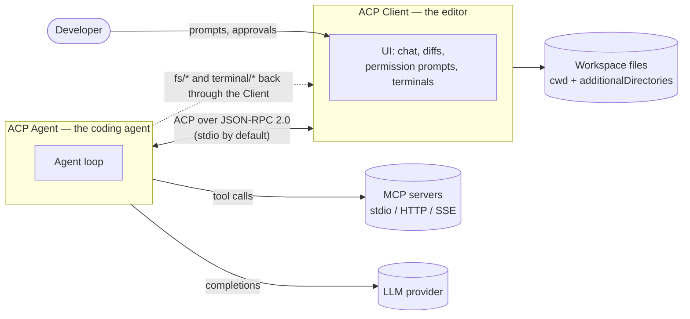
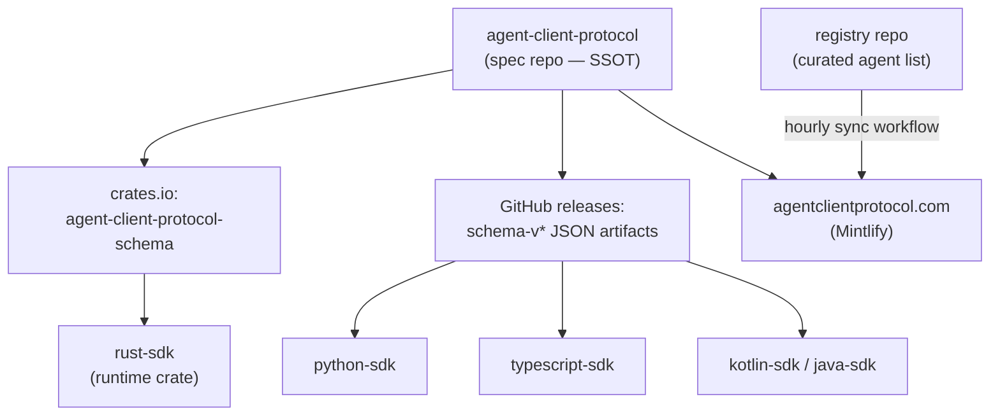
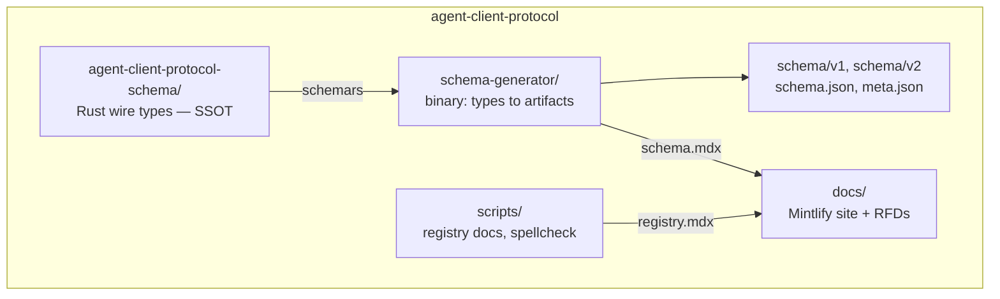
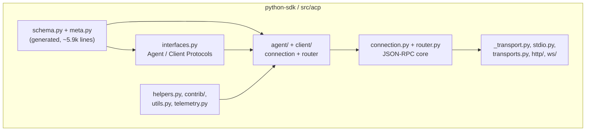
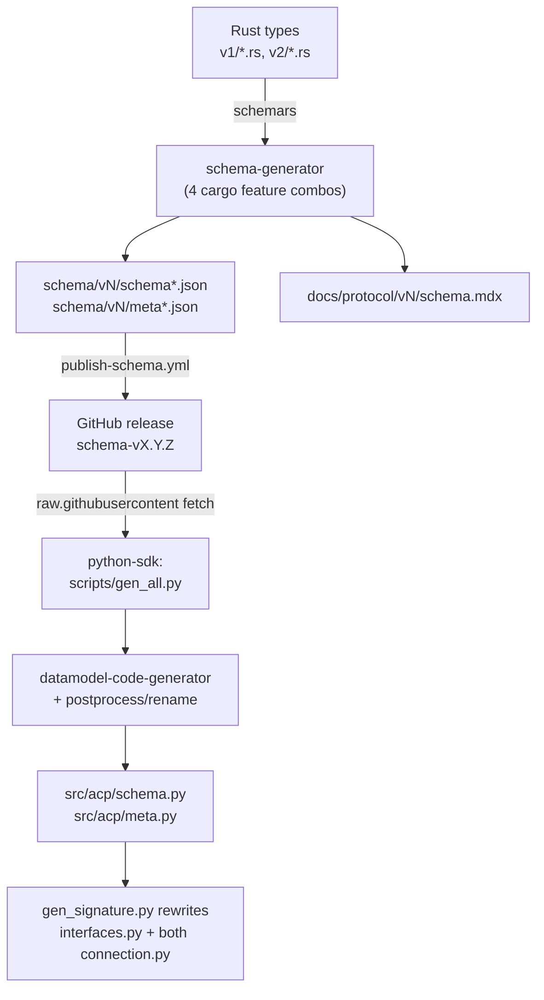
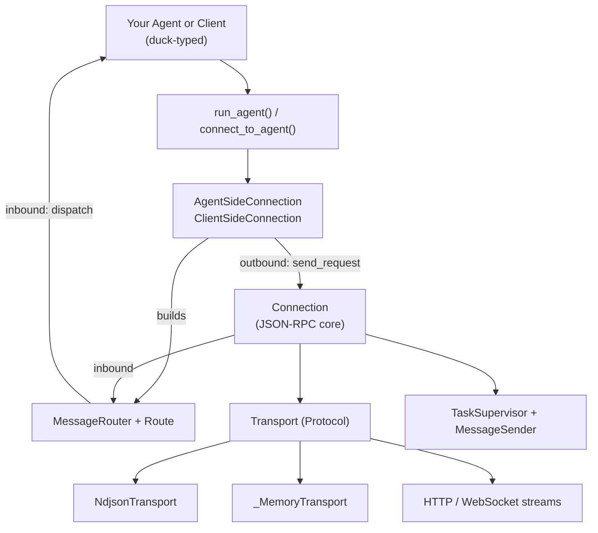
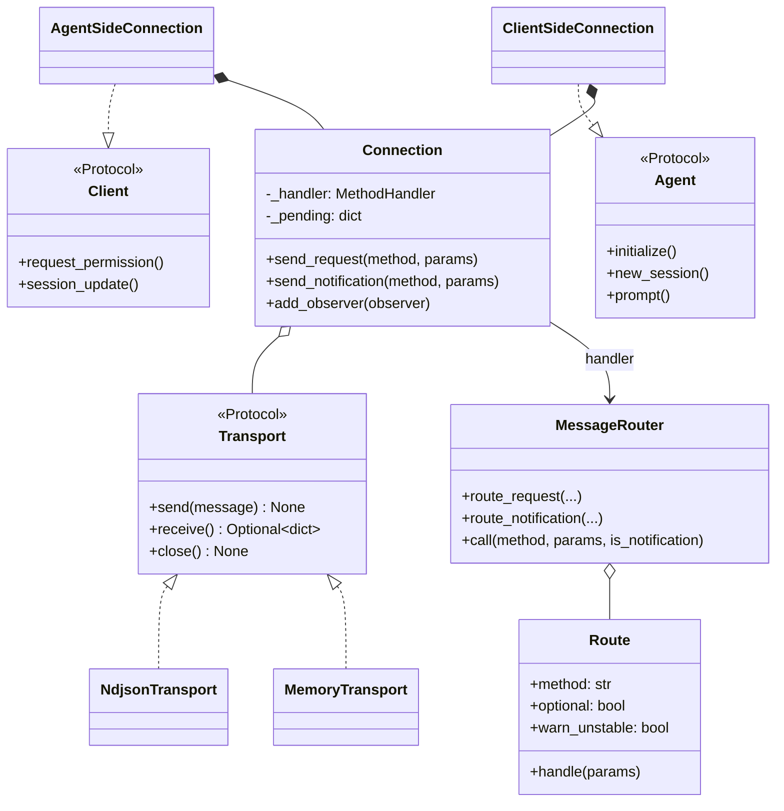
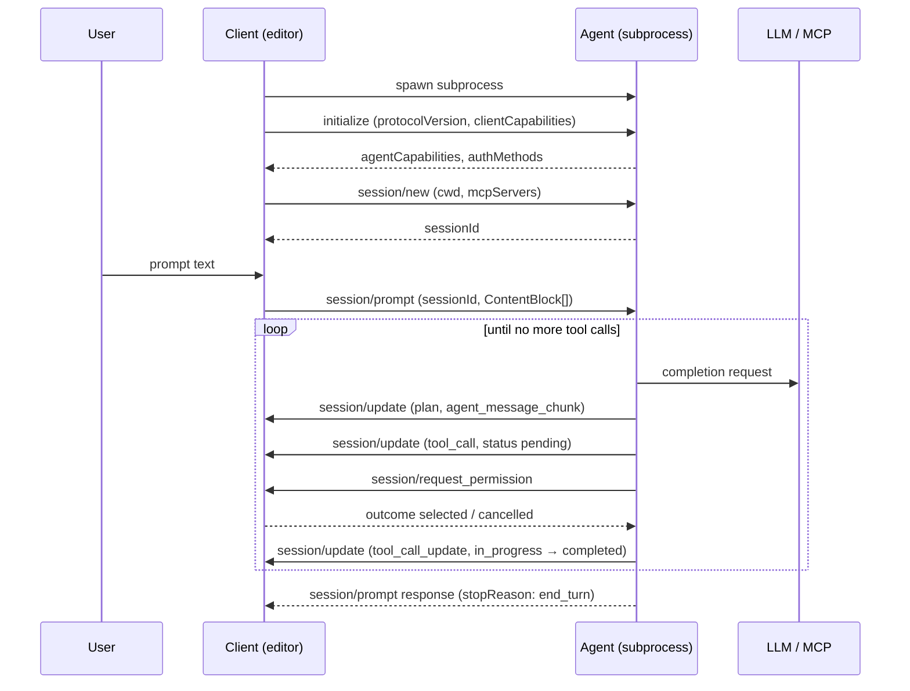
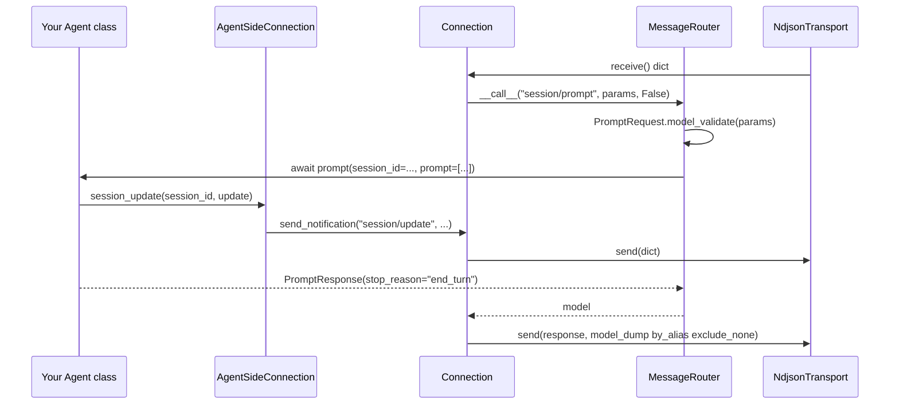
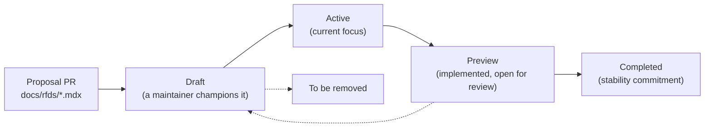

> Source: `agent-client-protocol` @ `9e6f550` (tag `schema-v2.0.0-alpha.3`, crate `v1.7.0`) · `python-sdk` @ `ce23c4a` (`v0.12.1`) · `typescript-sdk` @ `5dac09a` (`v1.4.0`, read for the UX/DX comparison only) · Date: 2026-08-29 · Mode: **Explain** · Type: **Hybrid**
> See also: [User-Facing API & UX/DX](/acp/acp-surface-architecture/) · [Extension Points & Vertical Surfaces](/acp/acp-extension-points/) · [Agent Implementation Case Study](/acp/acp-agent-implementation/)

---

## 1. Overview

**ACP standardizes the conversation between a code editor and a coding agent** — the same
decoupling LSP did for language servers, applied to agentic coding. An editor that speaks ACP
gets every ACP agent; an agent that speaks ACP reaches every ACP editor. The wire format is
**JSON-RPC 2.0**, bidirectional, newline-delimited, normally over the agent subprocess's
stdio.

This workspace holds four of the ecosystem's repos:

| Repo | Role | Covered here? |
|------|------|---------------|
| `agent-client-protocol` | **The spec.** Rust types are the single source of truth; JSON Schema, protocol reference docs, and the RFD governance process are all generated or hosted from it. | **Yes** |
| `python-sdk` | **One implementation.** Pydantic models generated *from* those JSON Schema artifacts, plus an asyncio JSON-RPC runtime for building agents and clients. | **Yes** |
| `typescript-sdk` | A second implementation, and the only one with a protocol v2 surface. | Surface only — see the [UX/DX doc §2.5](/acp/acp-surface-architecture/) |
| `claude-agent-acp` | A production **agent**: an adapter bridging the Claude Agent SDK to ACP. | See the [case study](/acp/acp-agent-implementation/) |

This document's architectural analysis (§3–§6) covers the first two. The other two get their own
lenses rather than being folded in, because a downstream SDK and a downstream agent answer
different questions than the generation pipeline does.

### Type classification — Hybrid, with evidence

Neither repo is purely one thing:

- **Library evidence.** `agent-client-protocol-schema/Cargo.toml` publishes to crates.io
  (`description`, `documentation = docs.rs/...`, `categories = ["api-bindings"]`); its
  `src/lib.rs` exposes `pub mod rpc`, `pub mod v1`, `pub mod v2`. `python-sdk/pyproject.toml`
  declares `name = "agent-client-protocol"` with a `pdm-backend` build and `src/acp/py.typed`;
  `src/acp/__init__.py` curates a ~200-name `__all__`.
- **Application evidence.** `schema-generator/src/main.rs` has a real `fn main()` that writes
  files into `schema/` and `docs/protocol/`. `python-sdk/scripts/gen_all.py` is a CLI
  (`argparse`) that fetches upstream schema and regenerates Python bindings.

So: **libraries whose contents are produced by build-time applications.** That generation
pipeline is the most architecturally significant thing in the workspace, and §4.1 gives it its
own diagram.

### Tech stack

| | |
|---|---|
| **Spec repo** | Rust 2024, MSRV 1.88 · `serde` + `serde_json` (`preserve_order`, `raw_value`) · `schemars` 1 (JSON Schema emission) · `serde_with` · `strum` · `derive_more` · npm scripts driving `prettier`, `mint` (Mintlify docs), `typos` · `release-plz` for releases |
| **Python SDK** | Python 3.10–3.14 · `pydantic` v2 (only runtime dep) · `uv` + `Makefile` · `datamodel-code-generator` (dev) · optional extras: `http` (`httpx[http2]`, `websockets`), `logfire` (OTel spans) · `ruff`, `ty`, `deptry`, `pytest`, `mkdocs-material` |

---

## 2. System Context (C4 Level 1)

Two contexts matter here, and conflating them is the usual source of confusion: the **runtime**
context (who exchanges ACP messages at 3am while you type) and the **artifact** context (who
consumes the spec repo's outputs at release time).

### 2.1 Runtime context — who speaks ACP

Two properties of this picture are load-bearing:

1. **The Client launches the Agent as a subprocess** and owns the environment. The Agent
   reaches the filesystem and shell *through* the Client (`fs/read_text_file`,
   `terminal/create`) rather than around it — that is what makes the permission model
   meaningful. `docs/get-started/architecture.mdx` names this the "Trusted" principle.
2. **Both sides call each other.** The Agent is not merely a server: it issues
   `session/request_permission` and `fs/*` requests *to the Client*. This bidirectionality is
   why every SDK ends up with two symmetric connection classes (§5).

### 2.2 Artifact context — who consumes the spec

Only `spec`, `py`, and `ts` are cloned in this workspace; the rest are named in
`agent-client-protocol/README.md` and `.github/workflows/sync-registry.yml`. The README is
explicit that **release artifacts, not the git tree, are the supported download surface** for
SDK generators.

---

## 3. High-Level Structure (C4 Level 2)

### 3.1 `agent-client-protocol` — the spec repo

| Path | Responsibility |
|------|----------------|
| `agent-client-protocol-schema/src/v1/`, `.../v2/` | Every request, response, and notification type, per protocol version. `agent.rs` (~6.3k lines) and `client.rs` (~3.6k) carry the bulk; `content.rs`, `tool_call.rs`, `plan.rs`, `elicitation.rs`, `error.rs`, `ext.rs`, `mcp.rs`, `nes.rs` split the rest by concern. |
| `.../src/rpc.rs`, `serde_util.rs`, `version.rs` | Version-agnostic plumbing: JSON-RPC envelope + batch types; `MaybeUndefined` and lenient list deserialization; the `ProtocolVersion` newtype. |
| `schema-generator/src/main.rs` | Build-time app. Walks the Rust types with `schemars`, emits JSON Schema + a metadata sidecar + generated reference docs. |
| `schema/v1/`, `schema/v2/` | Generated artifacts, four per version: `schema.json`, `schema.unstable.json`, `meta.json`, `meta.unstable.json`. Each directory is also a stub Cargo package that exists purely to give release-plz a version to tag. |
| `docs/protocol/v1/`, `docs/protocol/v2/` | Hand-written normative spec (MUST/SHOULD prose) + generated `schema.mdx`. Each has a hidden `draft/` mirror documenting unstable features. |
| `docs/rfds/` | The governance record — one file per proposal, 40+ of them, grouped Draft → Active → Preview → Completed by `docs.json` navigation. |
| `.github/workflows/` | `ci.yml` (MSRV, lint, feature powerset, **generated-files-are-current** check), `release-plz.yml`, `publish-schema.yml`, `sync-registry.yml`, `deny.yml`. |

### 3.2 `python-sdk` — a downstream implementation

| Path | Responsibility |
|------|----------------|
| `src/acp/schema.py`, `meta.py` | **Generated. Never hand-edited** (both are `ALL`-ignored in the ruff config and excluded from `ty`). Pydantic v2 models for every wire type; method-name constant maps. |
| `src/acp/interfaces.py` | `Agent` and `Client` as `typing.Protocol` — structural, not nominal. Also regenerated (signatures rewritten by `gen_signature.py`). |
| `src/acp/connection.py` | Transport-agnostic JSON-RPC 2.0 peer: request/response correlation, notification dispatch, error mapping, observers. |
| `src/acp/router.py` | `MessageRouter` / `Route` — method name → validated model → handler, with optional-method and unstable-method policy. |
| `src/acp/agent/`, `src/acp/client/` | The two symmetric halves: `*SideConnection` (outbound calls) + `build_*_router` (inbound dispatch). |
| `src/acp/_transport.py`, `stdio.py`, `transports.py` | The `Transport` seam, its NDJSON and in-memory implementations, cross-platform stdio streams, and subprocess spawning. |
| `src/acp/http/`, `src/acp/ws/` | **Experimental** Streamable HTTP and WebSocket transports, client + ASGI server, behind the `[http]` extra and import-guarded via module `__getattr__`. |
| `src/acp/contrib/` | Explicitly unstable conveniences distilled from real integrations: `SessionAccumulator`, `ToolCallTracker`, `PermissionBroker`. |
| `scripts/gen_all.py` + `gen_schema.py` / `gen_meta.py` / `gen_signature.py` | The regeneration pipeline (§4.1). |
| `tests/golden/` | 36 pinned JSON fixtures asserting that helper output still matches the wire format. |

---

## 4. Components (C4 Level 3)

### 4.1 The cross-repo generation pipeline

This is the spine of the whole ecosystem, and it is worth reading as one flow even though it
spans two repos and a GitHub release.

Four details make this robust rather than fragile:

- **Feature flags fan out into four artifacts.** `schema-generator` is compiled once per
  combination of `unstable` × `unstable_protocol_v2`, and `write_schema()` maps each
  `(bool, bool)` pair to a *disjoint* filename set — `v1/schema.json`,
  `v1/schema.unstable.json`, `v2/schema.json`, `v2/schema.unstable.json`. The comment in
  `main.rs` says why: the four runs must be safe to execute in any order without clobbering
  each other.
- **Two orthogonal version numbers.** `meta.json`'s `version` field is the *protocol* version
  (1 or 2). The crate version (`1.7.0`) and schema-release versions (`schema-v1.21.0`) describe
  the *artifacts*. `README.md` states the rule plainly: never infer wire compatibility from an
  artifact version — use the negotiated `protocolVersion`, then capabilities.
- **CI enforces freshness.** `ci.yml` runs `npm run generate` and then `git diff --exit-code`.
  Generated files cannot drift from their source types.
- **The Python side pins a ref, not a floating branch.** `schema/VERSION` currently reads
  `refs/tags/schema-v1.19.0`, and that ref is stamped into `meta.py`'s header comment — so any
  generated file announces its provenance.

Note what the Python SDK chooses to consume: `gen_all.py`'s `V1_SCHEMA_PATHS` points at
`schema/v1/schema.unstable.json`. **The SDK generates against the *unstable* v1 schema**, which
is why `meta.py` carries method names (`nes/*`, `providers/*`, `mcp/*`, `document/did*`) that
never appear in the stable `schema/v1/meta.json`. The runtime then gates them at dispatch time
via `use_unstable_protocol` — types are permissive, behavior is strict.

### 4.2 Python SDK runtime

The layering is clean and worth naming explicitly, because it is the thing to understand before
touching this codebase:

| Layer | Knows about | Does **not** know about |
|-------|-------------|-------------------------|
| `Transport` | dicts, framing, sockets | JSON-RPC semantics |
| `Connection` | JSON-RPC ids, futures, errors | ACP methods |
| `MessageRouter` | ACP method names, Pydantic models | who implements them |
| `*SideConnection` | the full ACP surface, both directions | transport details |

`Connection.__init__` discriminates the two construction forms on **`reader is None`**, not on
`isinstance(writer, Transport)` — and the inline comment explains why: `Transport` is a
`runtime_checkable` Protocol, so a `MagicMock` would spuriously satisfy it. A small decision,
but a good sign of a codebase that has met its own test doubles.

---

## 5. OOP & Class Architecture

### 5.1 Python SDK — the object model

**The central inversion, and the thing most likely to trip a newcomer:**
`AgentSideConnection` implements `Client`, and `ClientSideConnection` implements `Agent`. The
class you hold inside an agent *behaves like the client you're talking to*. Its own docstring
says it: *"The agent can use this connection to communicate with the Client so it behaves like a
Client."* Once that clicks, the whole SDK reads naturally — you never think about JSON-RPC, you
just call the peer.

Patterns actually in use (each named where it lives, not aspirationally):

| Pattern | Where | Why |
|---------|-------|-----|
| **Structural typing over inheritance** | `interfaces.py` — `Agent`/`Client` are `typing.Protocol` | Users implement a plain class; no base to import, no MRO to fight. `examples/echo_agent.py` subclasses `Agent` only for editor autocomplete. |
| **Strategy** | `Transport` protocol with NDJSON / memory / HTTP / WS implementations | `_transport.py`'s docstring frames it as a *seam* introduced so remote transports could exist with "zero behaviour change" for stdio. |
| **Adapter (symmetric)** | `AgentSideConnection` ↔ `Client`, `ClientSideConnection` ↔ `Agent` | Turns a byte stream into the peer's interface. |
| **Front controller / table dispatch** | `MessageRouter` + `Route` | One registration table; `optional=True` + `default_result` handle "this peer didn't implement it" without exceptions. |
| **Facade** | `run_agent()`, `connect_to_agent()` in `core.py` | Two functions cover the common case; `core.py`'s docstring says it exists to keep historical import paths stable. |
| **Decorator (as metadata, then as behavior)** | `@param_model` marks; `@compatible_class` reads those marks and installs camelCase legacy aliases | Deep-module move: one class decorator buys the entire pre-0.11 API surface as deprecation shims. |
| **Supervisor / structured concurrency** | `TaskSupervisor`, `MessageSender` | Every background task is registered, error-routed, and cancelled on close — no orphaned tasks. `MessageSender` serializes writes through a queue so concurrent sends can't interleave frames. |
| **Null Object** | `telemetry.span_context()` returns `nullcontext()` when neither logfire nor OTel is installed | Instrumentation is free when unused. |

`ClientSideConnection._SessionUpdateTracker` deserves a call-out: it wraps the user's `Client`
and tracks in-flight `session/update` handlers per session with a `ContextVar`, so a
`session/prompt` response can wait for its own streamed updates to finish being processed
before returning. That is a subtle ordering guarantee that would be very easy to get wrong.

### 5.2 Rust schema crate — the type-level design

No class hierarchy here; the design is expressed in the type system instead:

| Technique | Example | Purpose |
|-----------|---------|---------|
| **Newtype wrappers** | `SessionId(Arc<str>)`, `ProtocolVersion(u16)`, `AbsolutePath(PathBuf)` (v2) | Domain meaning at the type level; `ProtocolVersion`'s tests pin that `"1.0.0"` must fail to deserialize. |
| **Sum types for routing** | `AgentRequest`, `AgentResponse`, `AgentNotification` + the client trio | SDKs match on one enum to dispatch an incoming message. |
| **`#[non_exhaustive]` everywhere** | `SessionId`, `ExtRequest`, … | Adding a field is not a breaking change downstream. |
| **Tri-state optionality** | `MaybeUndefined` in `serde_util.rs` | Distinguishes *absent* / `null` / *value* — exactly the omit-unchanged / null-clear / value-replace upsert semantics v2 requires. |
| **Compile-time capability gating** | `unstable_*` features; `unstable_protocol_v2` deliberately excluded from the `unstable` umbrella | v2 is a parallel wire version, so it must be opted into explicitly. `ProtocolVersion::LATEST` is `#[cfg]`-removed when v2 is on, forcing an explicit choice. |
| **Lenient list deserialization** | `VecSkipError` + the optional `tracing` feature's `SkipListener` | A malformed entry in a list is dropped rather than failing the whole message — with an opt-in warning that compiles to a no-op by default. |

---

## 6. Key Flows

### 6.1 A prompt turn, end to end (v1, stdio)

Cancellation runs alongside this: the Client sends the `session/cancel` **notification**, and
the Agent must still answer the original `session/prompt` with `stopReason: "cancelled"` —
`docs/protocol/v1/prompt-turn.mdx` warns implementers explicitly not to let an aborted HTTP
client leak out as a JSON-RPC error, because Clients surface unrecognized errors to users.

### 6.2 The same turn through the Python SDK

Note the two conversions at the edges and nowhere else: `model_validate` on the way in,
`model_dump(mode="json", by_alias=True, exclude_none=True)` on the way out. Handler code deals
only in typed models and snake_case kwargs; camelCase never leaks inward.

### 6.3 Protocol evolution — the RFD lifecycle

Implementation runs *ahead* of stabilization and is gated the whole way: an RFD lands
feature-flagged (`unstable_<rfd_name>`), appears in `schema.unstable.json` and the hidden
`docs/protocol/*/draft/` pages, and only on reaching Completed does it move into the stable
schema and the visible docs. `docs/rfds/about.mdx` states the governance: Zed leads as BDFL,
and Completed is "the only state that can represent a 1-way door."

---

## 7. Extension Points

**Protocol level** (the whole point — extend without forking):

- `_meta: { [key: string]: unknown }` on *every* type, including nested content blocks, tool
  calls, and capability objects. Root-level `traceparent` / `tracestate` / `baggage` are
  reserved for W3C trace context, for OpenTelemetry interop with MCP.
- **`_`-prefixed method names** are reserved for implementations forever
  (e.g. `_zed.dev/workspace/buffers`). Unknown extension *requests* get `-32601`; unknown
  extension *notifications* should be ignored.
- **Custom capabilities** advertised through `_meta` inside `agentCapabilities` /
  `clientCapabilities`, so a peer can check before calling.
- **Capabilities as the non-breaking growth mechanism.** `protocolVersion` bumps only for
  breaking changes; everything else arrives as an optional capability that MUST be treated as
  unsupported when omitted.

**Rust crate:** cargo features. `unstable_nes`, `unstable_mcp_over_acp`, `unstable_session_fork`,
… each gate a module or field; `unstable` is an umbrella over them; `unstable_protocol_v2` sits
deliberately outside it. `schemars` itself is optional for size-sensitive consumers.

**Python SDK:**

| Hook | Use |
|------|-----|
| `ext_method()` / `ext_notification()` on your `Agent`/`Client` | Serve and call `_`-prefixed methods; the router strips the underscore and forwards. |
| `**kwargs` on every generated method → `field_meta` | How `_meta` is surfaced ergonomically — `session_update(..., source="echo_agent")` lands in `_meta`. |
| Implement `Transport` | Any bidirectional message channel becomes an ACP transport; `connect_to_agent(client, transport)` takes it directly. |
| `Connection.add_observer(...)` | Tap every raw frame in both directions — inspectors, recorders, protocol debugging. |
| `use_unstable_protocol=True` | Unlocks routes that otherwise warn and raise `method_not_found`. |
| `acp.contrib` | Opt-in incubating helpers; the package docstring is blunt that everything there may change without notice. |
| `logfire` / `opentelemetry` extras | `span_context()` picks them up automatically if installed. |

---

## 8. Key Abstractions / Glossary

| Term | Meaning |
|------|---------|
| **Agent** | Program that uses generative AI to autonomously modify code. Usually a subprocess of the Client. Must support `initialize`, `session/new`, `session/prompt`, `session/cancel`. |
| **Client** | The editor/IDE (or any UI). Owns the environment, the user, and the permission decisions. Must support `session/request_permission`. |
| **Session** | One conversation thread, identified by an opaque `SessionId`. A single connection carries many concurrently. |
| **Prompt turn** | `session/prompt` → streamed `session/update` notifications → response carrying a `StopReason`. In v2 this changes shape (see below). |
| **Stop reason** | `end_turn`, `max_tokens`, `max_turn_requests`, `refusal`, `cancelled`. |
| **Capability** | Optional feature declared at `initialize`. Omitted always means unsupported. |
| **Content block** | Reuses MCP's JSON shapes: `text`, `image`, `audio`, `resource_link`, `resource`. Markdown is the default rich-text format — no HTML rendering required of Clients. |
| **Tool call** | Agent-side action reported to the Client with a `ToolKind` (`read`, `edit`, `execute`, …), a status, and content that may be plain text, a **diff**, or a live **terminal** reference. |
| **Elicitation** | Structured request for information from the user (form or URL modes) — ACP's analogue of MCP elicitation. |
| **Plan** | The Agent's task list, streamed as an update so the Client can render progress. |
| **MCP server** | External tool provider the Client configures and the Agent connects to (stdio always; HTTP/SSE by capability). A Client can expose its *own* tools by handing the Agent an MCP proxy that tunnels back. |
| **RFD** | "Request for Dialog" — ACP's RFC process. See §6.3. |
| **`protocolVersion`** | Single integer, bumped only for breaking changes. Distinct from crate/schema artifact versions. |
| **`unstable` vs `draft`** | `unstable` = the cargo feature set and `*.unstable.json` artifacts. `draft` = the hidden docs pages describing them. Same features, two names. |
| **Upsert semantics (v2)** | Uniform patch rules for messages, tool calls, and plans: omitted field = unchanged, `null` = cleared, value = replaced, chunks append. |

---

## 9. Open Questions & Notes

**Not verifiable from this workspace** (named in the repos, not cloned here):

- **The Rust *runtime* crate.** `README.md` directs implementers to `agent-client-protocol` on
  crates.io — the `Agent`/`Client` traits, connection, and transport — which lives in the
  separate `rust-sdk` repo. Only the *schema* crate is here. Any statement about Rust runtime
  ergonomics would be confabulation.
- **The `registry` repo.** Referenced by `sync-registry.yml` (hourly cron → regenerate
  `docs/get-started/registry.mdx` → PR). Its data model and curation rules are external.
- **The Kotlin and Java SDKs.** The TypeScript SDK *is* now in the workspace, and comparing it
  with Python answers the question this bullet originally raised: the two are **not** structurally
  alike. TypeScript deprecated the class-based `AgentSideConnection` / `ClientSideConnection`
  shape in favour of method-name handler registration (`agent().onRequest("session/prompt", …)`),
  ships no content-builder helpers, has no subprocess-spawning helper, and carries a v2 surface
  Python lacks. `python-sdk/README.md`'s claim that `acp.helpers` "mirrors the Go/TS SDK APIs"
  does not hold at `typescript-sdk` v1.4.0. The side-by-side is in the
  [UX/DX doc §6](/acp/acp-surface-architecture/).

**Observations worth flagging to a maintainer, stated as observations rather than defects:**

- **The Python SDK is pinned two schema releases behind.** `schema/VERSION` is
  `refs/tags/schema-v1.19.0`; the spec repo's `schema/v1` package is at `1.21.0`. Whether that
  gap is deliberate (a known-good pin) or drift is not determinable from the files.
- **No v2 in the Python SDK.** `meta.py` reports `PROTOCOL_VERSION = 1`, and `gen_all.py` has no
  v2 path. The spec's `docs/protocol/v2/migration.mdx` advises supporting both versions side by
  side behind flags; that work has not started here.
- **The HTTP/WS transports run ahead of the spec.** `docs/protocol/v1/transports.mdx` lists
  Streamable HTTP as "_In discussion, draft proposal in progress_", while the SDK ships a
  working client + ASGI server. `docs/web-transport.md` is honest about the gaps
  (no `Last-Event-ID` resumability, no reconnect, batch returns `501`, HTTP/2 required — and
  Uvicorn cannot serve HTTP/2). Treat it as tracking a moving RFD.
- **Two deprecation layers are live simultaneously** in the Python SDK: camelCase method aliases
  (`_warn_legacy_handler`) and single-model-parameter call styles (`compatible_class`). Both
  emit `DeprecationWarning`. `docs/migration-guide-0.11.md` covers the transition; no removal
  version is stated.
- **`schema.mdx` is ~200 KB (v1) and ~224 KB (v2)** of generated reference. Excluded from the
  reading in this doc by design — it is generated output, not design intent.

---

*Written by reading the repositories at the commits above. Every path, type, and function name
in this document was read from source; claims that could not be grounded are in §9.*
