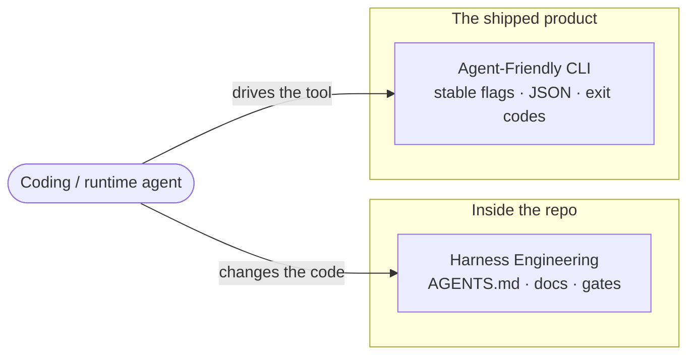
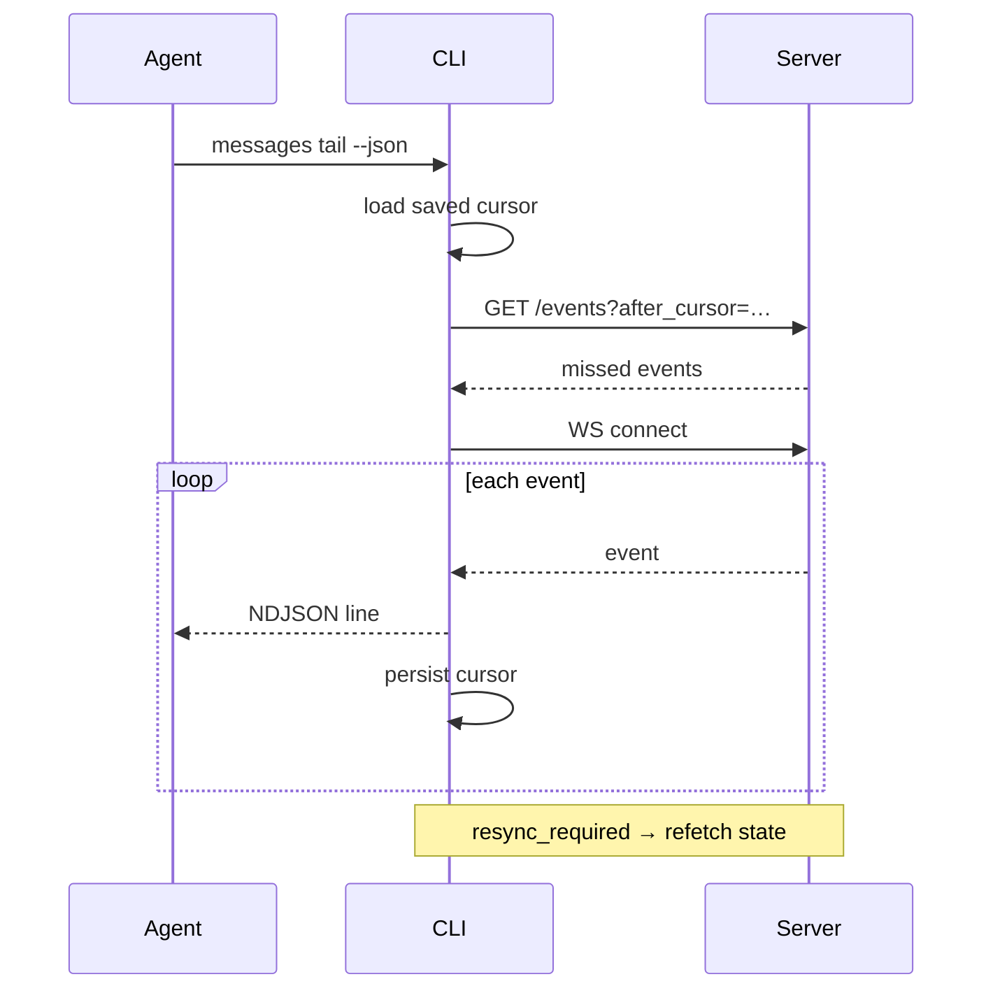

import Template from '../../../partials/agent-friendly-cli-template.md';

> A design contract for making a tool's **shipped command surface** usable by agents,
> scripts, and CI — not just humans — *without* embedding an LLM in the binary.
> Distilled from [`clickclack`](https://github.com/openclaw/clickclack)'s
> [`docs/agent-friendly-cli.md`](https://github.com/openclaw/clickclack/blob/main/docs/agent-friendly-cli.md).

This is the companion piece to [Harness Engineering in `clickclack`](/harness-eng/clickclack-harness-engineering/).
That chapter is about how agents work **inside** the repository. This one is about the
**opposite side of the boundary**: how an agent consumes the *product* the repository
ships. Same tool, two surfaces.



---

## 1. TL;DR — the pattern in five points

- **One contract, four audiences.** Humans, shell scripts, CI, and external agents all
  drive the *same* commands. There is no separate "agent mode" and no private backdoor —
  the CLI only uses the public HTTP/WebSocket API.
- **No embedded LLM.** The binary stays deterministic and testable; the intelligence
  lives in whatever *calls* it. An agent brings its own brain.
- **Predictable resolution.** Configuration follows a written precedence —
  flags → env → config file → defaults — so a caller can always reason about what wins.
- **Machine-readable by default.** stdout carries data, stderr carries diagnostics;
  `--json` gives objects (NDJSON for streams), `--plain` gives stable single fields, and
  `--no-input` makes non-interactive runs safe.
- **Branch on exit codes, not text.** A small, stable exit-code taxonomy lets scripts and
  agents react to *what happened* without parsing English error strings.

---

## 2. Why an LLM-free CLI is the point

The temptation when "making a tool agent-friendly" is to bolt an assistant *onto* the
tool. clickclack does the opposite: the CLI is a thin, dumb client over the same public
API a browser would use. That inversion is the whole idea.

The payoff is that the tool stays **deterministic**. Every behaviour can be unit-tested,
every output is reproducible, and the contract doesn't drift with a model version. The
agent supplies reasoning; the CLI supplies a stable, scriptable surface. This is why the
same `clickclack send …` invocation works identically for a human at a prompt, a CI step,
and an autonomous agent — none of them are special-cased.

---

## 3. The design principles

### Deterministic configuration resolution

Every input has one documented winner:

```
1. command-line flags        (highest priority)
2. environment variables
3. user config (~/.config/clickclack/config.json)
4. built-in defaults         (lowest priority)
```

Tokens are **scope-bound** — a credential is only sent when explicitly provided for that
server, so pointing the tool at a different host can't leak the wrong secret. For an
agent this matters because it can set everything through env vars
(`CLICKCLACK_SERVER`, `CLICKCLACK_TOKEN`, …) and never touch interactive state.

### Output discipline: stdout vs stderr, JSON vs plain

| Need | Mechanism |
|------|-----------|
| Data a program consumes | **stdout** |
| Diagnostics / progress | **stderr** |
| Structured single result | `--json` → one JSON object |
| Structured stream | `--json` → newline-delimited JSON (one event per line) |
| Stable single field | `--plain` |
| Non-interactive safety | `--no-input` (auto when stdin isn't a TTY) |

The guidance is explicit: *use `--json` for anything you parse, and `--plain` only for
stable single-field output.* The stdout/stderr split is what lets `… --json | jq` work
while progress text still reaches the terminal.

### Composable input precedence

A message body resolves in a fixed order — positional → `--body` → `--file` → `--stdin` —
so the tool pipes naturally:

```sh
agent-summarize incident.log | clickclack threads reply msg_01kr... --stdin
```

### A stable exit-code taxonomy

This is the highest-leverage idea in the doc. Because the codes are stable and
documented, an agent reacts to *categories of failure* without scraping text:

| Code | Meaning | Code | Meaning |
|------|---------|------|---------|
| 0 | Success | 4 | Not found |
| 1 | Generic failure | 5 | Permission denied |
| 2 | Invalid usage | 10 | Network unavailable |
| 3 | Auth required/failed | 11 | Unexpected server response |

> *"Scripts should branch on exit codes, not error text."*

### Durable streaming with cursor recovery

For long-lived `messages tail` / `events tail`, clickclack persists a cursor per
server/workspace/channel under `~/.local/state/clickclack/cursors/`. On start it replays
missed events `after_cursor`, opens the WebSocket, and re-persists the cursor after each
delivery — and refetches from scratch on a `resync_required` signal. An agent can crash,
restart, and resume the stream without gaps or duplicates.



---

## 4. A worked example

The contract makes a CI notifier a three-line affair — structured where it parses,
exit-code-driven where it branches:

```sh
if pnpm test; then
  clickclack send --channel builds "tests passed"
else
  clickclack send --channel builds "tests failed"
fi
```

---

## 5. A reusable template for your repo

The same contract transfers to almost any CLI that talks to a service. The template
below is authored as a shared partial (`src/partials/agent-friendly-cli-template.md`) so
future case studies in this book can embed the exact same checklist instead of
re-deriving it.

<Template />

---

## 6. Takeaways

- **Agent-friendliness is a property of the public surface, not an added assistant.**
  Make the existing CLI predictable and you've made it agent-ready.
- **Determinism beats cleverness.** No embedded LLM means the tool is testable and its
  contract is stable across model and release churn.
- **Exit codes and stdout/stderr hygiene are the cheapest, highest-impact wins** —
  they cost little to implement and immediately unlock reliable scripting and agent use.
