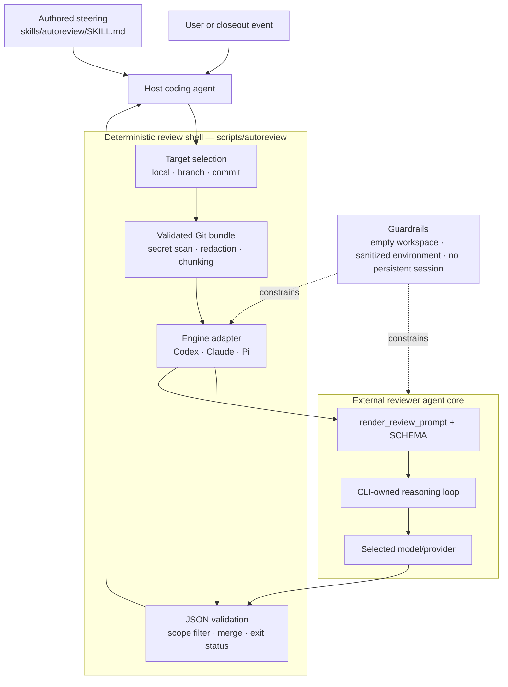

# Autoreview — Agentic Architecture

> Source: `openclaw/agent-skills` at `9b16adc2cfa080199c151bc3932cf0281b8c840e` · Date: 2026-07-19 · Mode: Explain · Type: Capability/steering pack with a deterministic execution shell
>
> See also: [Architecture of the shared agent-skills repository](/harness-eng/agent-skills-repo-for-sharing-in-org-architecture/)

## 1. Overview

`autoreview` is a pre-commit/ship code-review capability for a host coding agent. It turns a selected Git change into a validated, bounded prompt; runs an isolated external reviewer CLI; validates the returned JSON; and converts the result into a clean/non-clean process exit status.

The key architectural fact is that **three different control planes cooperate**:

| Control plane | Where it lives | Responsibility |
|---|---|---|
| Host-agent policy | [`SKILL.md`](https://github.com/openclaw/agent-skills/blob/9b16adc2cfa080199c151bc3932cf0281b8c840e/skills/autoreview/SKILL.md) | Decides when to review, verifies findings, controls fix-test-review cycles, and prevents scope expansion. |
| Deterministic review shell | [`scripts/autoreview`](https://github.com/openclaw/agent-skills/blob/9b16adc2cfa080199c151bc3932cf0281b8c840e/skills/autoreview/scripts/autoreview) | Selects and freezes the Git target, sanitizes the bundle, isolates the reviewer, validates output, and sets the exit code. |
| Reviewer agent runtime | External `codex`, `claude`, or `pi` CLI | Runs the actual LLM reasoning turn and produces a structured review report. |

This makes `autoreview` a **Pack**, not an agent runtime. The repository does not implement token sampling, provider APIs, an internal ReAct loop, or model context management. It supplies authored steering plus a deterministic adapter around existing agent runtimes.

In one sentence:

> `SKILL.md` governs the human/host workflow; `scripts/autoreview` governs the trust boundary; the external CLI supplies the model and reasoning loop.

### Main files

| File | Role |
|---|---|
| [`skills/autoreview/SKILL.md`](https://github.com/openclaw/agent-skills/blob/9b16adc2cfa080199c151bc3932cf0281b8c840e/skills/autoreview/SKILL.md) | Trigger description, operational contract, scope governor, engine guidance, and closeout protocol. |
| [`skills/autoreview/scripts/autoreview`](https://github.com/openclaw/agent-skills/blob/9b16adc2cfa080199c151bc3932cf0281b8c840e/skills/autoreview/scripts/autoreview) | Single-file Python implementation of target selection, bundle hardening, prompt construction, engine adapters, report validation, panels, and exit behavior. |
| [`skills/autoreview/scripts/test-review-harness.py`](https://github.com/openclaw/agent-skills/blob/9b16adc2cfa080199c151bc3932cf0281b8c840e/skills/autoreview/scripts/test-review-harness.py) | Live smoke harness using deliberately malicious or security-sensitive-but-benign temporary repositories. |
| [`skills/autoreview/scripts/autoreview_test.py`](https://github.com/openclaw/agent-skills/blob/9b16adc2cfa080199c151bc3932cf0281b8c840e/skills/autoreview/scripts/autoreview_test.py) | Compatibility, output parsing, fallback, and isolation tests. |
| [`skills/autoreview/tests/test_autoreview_hardening.py`](https://github.com/openclaw/agent-skills/blob/9b16adc2cfa080199c151bc3932cf0281b8c840e/skills/autoreview/tests/test_autoreview_hardening.py) | Large hardening suite for bundle integrity, secret handling, isolation, chunking, environment filtering, output safety, and source mutation. |

## 2. Agentic Anatomy



The host agent remains the decision-maker. Review findings are advisory: the skill explicitly requires the host to read the real code, accept or reject each finding, run proof, and repeat only while the work remains inside the original task scope.

## 3. How One Review Run Works

### 3.1 End-to-end sequence

```mermaid
sequenceDiagram
    actor H as Host agent
    participant S as SKILL.md policy
    participant A as autoreview helper
    participant G as Sanitized Git reader
    participant E as Isolated reviewer CLI
    participant V as Report validator

    H->>S: Skill is triggered or chosen for closeout
    S-->>H: Freeze scope; choose local, branch, or commit review
    H->>A: Run autoreview with target and engine options
    A->>G: Resolve target and snapshot source tree
    G-->>A: Full validated diff plus changed-path set
    A->>A: Scan/redact secrets; reject unsafe input; partition if oversized

    loop One bounded prompt at a time
        A->>E: Prompt via stdin in an empty/neutral workspace
        E->>E: External model reasoning turn
        E-->>V: JSON, JSONL, or wrapped structured result
        V-->>A: Validated in-scope report
    end

    A->>A: Merge reviewer and chunk reports
    A->>G: Compare source tree with frozen snapshot
    A-->>H: Human report, optional JSON, and exit status
    H->>H: Verify findings; fix and test if in scope; rerun if needed
```

### 3.2 The deterministic pipeline

1. **Parse configuration.** `parse_args()` accepts CLI flags and environment defaults. `reviewer_args()` resolves global, per-engine, and inline model/thinking settings. Source-defined defaults are Codex `gpt-5.6-sol` with high reasoning and an access-only `gpt-5.6-terra` fallback, or Claude `claude-fable-5`.

2. **Choose the review target.** `choose_target()` uses dirty local work first in `auto` mode, otherwise a non-`main` branch diff, or an explicitly requested commit. Branch mode uses an explicit base, the current PR base when `gh pr view` succeeds, or `origin/main`. It does not fetch automatically. A clean `main` checkout has no implicit target.

3. **Freeze source state.** `source_tree_snapshot()` records `HEAD`, index entries, and fingerprints for tracked and untracked files. The helper compares this snapshot after bundle creation and after review. Concurrent edits—including edits made by `--parallel-tests`—make the result stale and fail the run.

4. **Build a Git bundle.** `local_bundle()`, `branch_bundle()`, or `commit_bundle()` collects status, stats, unified patches, and safe untracked snapshots. Git runs with optional locks disabled, global/system configuration suppressed, external diff and text conversion disabled, and UTF-8 decoding enforced. Commit mode rejects merge commits because a single unambiguous parent-relative patch is required.

5. **Validate the trust boundary.** Before any model call, `validate_review_patch()` and related scanners:

   - reject sensitive tracked/untracked paths;
   - reject binary and gitlink/submodule changes whose content is not in the bundle;
   - detect secret-like values in reconstructed old/new file content and diff metadata;
   - redact recognized secret spans while retaining reviewable surrounding code;
   - fail closed when residual secret fragments remain or the input cannot be checked completely;
   - accept carefully recognized references and synthetic fixtures so normal credential-handling code remains reviewable.

6. **Add explicit evidence.** `--prompt-file` and `--dataset` must be repository-relative, regular, non-symlinked, non-sensitive files inside the reviewed repository. Inline `--prompt` text is secret-scanned too. Arbitrary host files cannot be pulled into the bundle.

7. **Render one or more prompts.** `render_review_prompt()` combines the JSON schema, review rules, scope policy, target metadata, optional evidence, and the change bundle. `build_review_prompts()` keeps an integrated change in one pass when possible; oversized input is split deterministically without dropping or reordering bytes.

8. **Run an isolated external reviewer.** `run_engine()` dispatches to an engine-specific adapter. The prompt is sent on stdin, not exposed as a command-line argument. Reviewer subprocesses receive a filtered environment and a `PATH` that excludes executables inside the reviewed repository.

9. **Parse and validate the result.** `extract_json()` accepts the structured shapes emitted by supported CLIs. `validate_report()` enforces the schema again in Python, normalizes paths, drops findings outside the changed-path set, and applies optional acceptance-test requirements.

10. **Merge and close.** Panels deduplicate findings by file, line, category, and normalized title. Chunk reports use the same merge mechanism. The helper rechecks the source snapshot, prints the report, optionally writes atomic outputs outside the reviewed repository, and exits according to the result.

### 3.3 Large changes and panels

These are two independent dimensions:

```text
for each bounded change chunk, sequentially:
    run one reviewer
    OR run all panel reviewers concurrently
    merge the panel reports

merge every chunk report
validate required findings and compute the final exit status
```

- A prompt is capped at 512,000 UTF-8 bytes.
- A run is capped at eight review passes.
- Chunking prefers bundle sections and file boundaries, then lines.
- Continuation context repeats file/hunk identity and line offsets without counting as new change content.
- The implementation asserts that concatenating chunk content exactly recreates the original bundle.
- Panels use a `ThreadPoolExecutor`; they are peer reviewer processes, not child subagents sharing a parent conversation.

## 4. The Agent Core

### Model/provider layer

There is no direct model SDK in this repository. Engine adapters translate the common review contract into external CLI flags:

| Engine | State | Model behavior | Repository access during review |
|---|---|---|---|
| Codex | Runnable; default | Defaults to `gpt-5.6-sol`, high reasoning; retries `gpt-5.6-terra` only for a recognized account-access failure. | Validated bundle only; Codex runs in an empty temporary workspace. Web search may be enabled. |
| Claude | Runnable | Defaults to `claude-fable-5`; optional Claude fallback chain and effort level. | Bundle via stdin; empty temporary workspace; no filesystem/shell tools; WebSearch and explicitly domain-constrained WebFetch only. |
| Pi | Runnable | No built-in model default; model/provider comes from the Pi installation. | Bundle via stdin from a neutral directory; all tools disabled. |
| Droid, Copilot, Cursor, OpenCode | Recognized but refused | Options remain visible for compatibility and isolation probes. | Fail closed because the current CLI contracts cannot prove the required project/filesystem/network confinement. |

### System prompt and constitution

The effective constitution has two layers:

- [`SKILL.md`](https://github.com/openclaw/agent-skills/blob/9b16adc2cfa080199c151bc3932cf0281b8c840e/skills/autoreview/SKILL.md) tells the host agent how to use review responsibly: advisory findings, real-code verification, iterative proof, scope classification, two-cycle pause, release freeze discipline, and the stopping rule.
- `review_scope_policy()` plus `render_review_prompt()` tell the reviewer model what counts as an actionable finding and require exact `SCHEMA` output.

The output schema contains:

- `findings[]`: title, body, priority (`P0`–`P3`), confidence, category, and one file/line location;
- `overall_correctness`: `patch is correct` or `patch is incorrect`;
- `overall_explanation` and `overall_confidence`.

### Reasoning loop

The helper does **not** contain a model reasoning loop. Each reviewer invocation delegates one turn to `codex exec`, `claude --print`, or `pi --print`. Those CLIs own any internal model/tool loop.

The helper does contain deterministic outer orchestration:

- sequential passes for oversized bundle chunks;
- concurrent peer calls for an opt-in panel;
- an access-only Codex model retry;
- parse/validation handling for engine output;
- no autonomous “review → edit → review” loop.

The last loop belongs to the host agent and is constrained by `SKILL.md`.

## 5. Context and Memory

### Context assembly

The reviewer sees a deliberately narrow world:

```text
JSON schema
+ reviewer rules and scope policy
+ target/branch metadata
+ explicit prompt files or datasets
+ complete validated change bundle (or one bounded chunk)
```

It does **not** receive the unchanged repository tree. The prompt explicitly forbids reporting missing symbols or context merely because unchanged files are absent. This is a deliberate privacy/isolation tradeoff: stronger containment, but less whole-repository semantic context.

### Compaction and memory

- **Compaction/summarization:** absent. Oversized input uses byte-preserving deterministic partitioning, not semantic summarization.
- **Working memory:** whatever the external CLI/model holds during one invocation.
- **Persistent memory:** absent by design. Codex is ephemeral, Claude disables session persistence and auto-memory, and Pi disables sessions.
- **Cross-pass memory:** absent. Continuation context contains only structural file/hunk/line information; reports are merged after independent passes.

## 6. Capabilities

| Organ | Where it lives | Provisioning | Notes |
|---|---|---|---|
| Git target and bundle tools | `choose_target()`, `local_bundle()`, `branch_bundle()`, `commit_bundle()` | Core code | Deterministic; no model chooses shell commands for bundle creation. |
| Secret and path hardening | `validate_review_patch()` and scanner helpers | Core code | Large language-aware guard layer with positive and negative tests. |
| Prompt construction | `SCHEMA`, `review_scope_policy()`, `render_review_prompt()` | Core code plus authored policy | Stable structured contract around a nondeterministic reviewer. |
| Reviewer adapters | `run_codex()`, `run_claude()`, `run_pi()` | Core code | Thin provider-CLI translation plus isolation. |
| Web lookup | Codex search; Claude WebSearch/domain-bound WebFetch | Extension-provided | External runtime capability; optional and restricted. |
| Skills | `skills/autoreview/SKILL.md` | Authored content | Loaded by the host harness. Reviewer-side skill loading is disabled. |
| MCP | Isolation flags and refusal paths | Absent/disabled | Claude disallows `mcp__*`; Codex plugins/hooks/skills are disabled; Pi extensions are disabled. |
| Parallel test runner | `start_parallel_tests()` / `finish_parallel_tests()` | Core code | Optional sibling process with an isolated temporary home and filtered environment. |

This is intentionally **not** a general tool registry. `run_engine()` is a closed dispatcher over reviewed engine adapters, and adding an engine requires proving its isolation contract.

## 7. Guardrails and Trust Boundaries

The hardening code is architecturally central, not incidental. The change under review may itself be untrusted, so the reviewed repository must not control the reviewer process.

### 7.1 Input and command integrity

- Bare commands are resolved only from absolute external `PATH` entries; repo-local executables and symlink targets are rejected.
- Explicit engine paths must remain outside the reviewed repository lexically and after resolution.
- Git runs with safe configuration, no optional locks, no external diff, no text conversion, and no interactive prompting.
- Refs are validated before use; path lists use NUL delimiters; non-UTF-8 Git output fails closed.
- Prompt files and datasets cannot escape through absolute paths, `..`, symlinks, or sensitive content.

### 7.2 Reviewer isolation

| Reviewer | Main boundary |
|---|---|
| Codex | Empty workspace; auth-only config reconstruction; user config/rules ignored; project docs, hooks, plugins, skills, shell snapshots, and login shells disabled; named read-only permission profile; isolated runtime directories. |
| Claude | Minimum CLI-version check; safe mode; user settings only; strict/disabled MCP; auto-memory off; no filesystem or shell tools; empty workspace; non-persistent session. |
| Pi | Minimum CLI-version and flag probe; neutral temporary directory; approvals, sessions, context files, extensions, skills, templates, themes, and tools disabled. |

Authentication remains usable through narrowly forwarded engine-specific environment variables or Codex auth handling, while process-injection variables and credentialed proxy URLs are excluded.

### 7.3 Data and result integrity

- Sensitive paths and unreviewable binary/gitlink changes are rejected before model invocation.
- Secret-like content is redacted or rejected; residual known fragments cause failure.
- Source fingerprints detect mutation while the model or parallel tests are running.
- Findings outside the reviewed changed-path set are ignored and reported on stderr.
- Terminal control characters in engine output, errors, and reports are escaped.
- `--output` and `--json-output` must point outside the reviewed repository and are replaced atomically.

### 7.4 Human-in-the-loop boundary

The reviewer subprocess runs non-interactively, but the workflow is not “auto-fix.” `SKILL.md` requires the host agent to verify each finding. It classifies proposed work as an in-scope blocker, follow-up, or stop-and-escalate item. The two-cycle convergence pause and release-freeze rules are policy controls; the Python helper does not infer project scope for the human.

## 8. Orchestration and Autonomy

- **Subagents:** absent. Panel reviewers are isolated peer processes and share only the frozen prompt.
- **Hooks/triggers:** no scheduler or repository hook is implemented. A host harness routes to the skill using frontmatter or chooses it as a closeout step.
- **Autonomous edits:** absent. Reviewer workspaces are empty/neutral and read-only or tool-free; the prompt forbids modifications.
- **Parallelism:** panel reviewers run concurrently per chunk. Optional focused tests may run beside review in an isolated environment.
- **Sessions/state:** process-local only. Streaming adapters retain buffered output for final validation while showing compact activity and usage summaries.
- **Event bus:** absent. Engine JSONL/stdout/stderr are local subprocess streams, not a persistent application event system.

## 9. Output Contract and Exit Semantics

| Condition | Normal exit |
|---|---:|
| Valid report, no findings, patch marked correct, tests pass, source unchanged | `0` |
| One or more accepted/in-scope findings | `1` |
| Patch marked incorrect even without discrete findings | `1` |
| Parallel tests fail | `1` |
| Source changes after the bundle is frozen | `1` or immediate failure, depending on when detected |
| Unsafe input, invalid engine isolation, malformed report, missing executable, or other contract failure | Nonzero via `SystemExit` |
| Acceptance harness with `--expect-findings` | Inverted finding expectation: `0` only when findings exist |

The human-readable clean marker is:

```text
autoreview clean: no accepted/actionable findings reported
```

The host should stop after that successful run unless code changes again.

## 10. Testing Architecture

The test strategy separates deterministic hardening from live model calibration:

| Layer | Evidence | Purpose |
|---|---|---|
| Built-in self-tests | `autoreview --self-test-*` | Exercise configuration precedence, output parsers, fake-engine isolation, heartbeat metrics, and fail-closed behavior without live models. |
| Focused Python tests | `scripts/autoreview_test.py` | 31 tests for compatibility, parsing, Codex fallback, empty-workspace behavior, and disabled engines. |
| Hardening suite | `tests/test_autoreview_hardening.py` | 295 tests covering bundle completeness, secret/reference classification, chunk preservation, environment/path isolation, source mutation, output safety, and performance bounds. |
| Live smoke harness | `test-review-harness.py` plus Bash/PowerShell wrappers | Creates a temporary Git repo and checks whether real selected engines find a malicious patch and tolerate a benign security-sensitive patch. |
| CI | [`.github/workflows/validate.yml`](https://github.com/openclaw/agent-skills/blob/9b16adc2cfa080199c151bc3932cf0281b8c840e/.github/workflows/validate.yml) | Runs syntax checks, self-tests, and Python tests on Ubuntu and Windows. The credential/model-dependent live smoke harness is not run by CI. |

The large hardening suite reflects the main design risk: safely distinguishing real credential material from source code that merely handles credentials, across several languages and diff shapes.

## 11. Extension Points

### Add or enable a reviewer engine

An engine is more than a command template. A safe addition must supply:

1. engine/model/thinking configuration;
2. executable resolution outside the reviewed repo;
3. a minimal, sanitized environment;
4. proof that project instructions, hooks, plugins, MCP, tools, filesystem reads, and private-network fetches are confined;
5. a neutral working directory;
6. output parsing into the common schema;
7. fake-engine isolation tests and cross-platform coverage.

The refused Droid, Copilot, Cursor, and OpenCode adapters demonstrate the governing rule: **recognize an integration without enabling it until confinement is proven**.

### Change the review contract

- Reviewer behavior: edit `review_scope_policy()` or `render_review_prompt()`.
- Structured output: change `SCHEMA`, `_validate_report()`, merge behavior, and tests together.
- Host closeout behavior: edit `SKILL.md`; do not hide workflow policy only inside Python.

### Change bundle handling

- Target semantics live in `choose_target()` and the three bundle builders.
- Evidence-file policy lives in `validate_evidence_file()`.
- Chunk boundaries and continuation metadata live in `review_bundle_units()`, `split_oversized_review_unit()`, and `split_review_bundle()`.
- Secret detection/redaction changes require both malicious and benign regression cases. False negatives risk exfiltration; false positives make ordinary credential-handling code unreviewable.

## 12. Organ Presence Matrix

| Cluster | Organ | Status | Where/how | Architectural finding |
|---|---|---|---|---|
| Brain | Reasoning loop | Partial/external | `run_engine()` delegates to external CLIs | No in-repo model loop; deterministic chunk/panel orchestration only. |
| Brain | Model/provider layer | Partial/external | `run_codex()`, `run_claude()`, `run_pi()` | CLI adapters, not direct provider SDKs. |
| Brain | System prompt/constitution | Present | `SKILL.md`, `review_scope_policy()`, `render_review_prompt()`, `SCHEMA` | Host policy and reviewer policy are deliberately separate. |
| Context | Context assembly | Present | Git bundle builders and prompt renderer | Bundle is the sole reviewed-repo input. |
| Context | Compaction/summarization | Absent | Deterministic chunking instead | No semantic summary or token-aware memory compression. |
| Context | Memory | Absent | Ephemeral/non-persistent reviewer flags | No working-memory store or persistent checkpoints owned by the skill. |
| Capability | Tools | Present but narrow | Safe Git reader, engine adapters, optional web lookup | No general-purpose model tool registry. |
| Capability | Skills | Present at host boundary | `SKILL.md` | Reviewer-side skills are disabled. |
| Capability | MCP | Absent/disabled | Isolation flags | External MCP servers are not part of a review run. |
| Orchestration | Subagents | Absent | Panels use independent subprocesses | Peer reviewers are not spawned conversational subagents. |
| Orchestration | Hooks/triggers/scheduling | Partial | Skill frontmatter/host closeout convention | No built-in hook, cron, or scheduler. |
| Orchestration | Permissions/guardrails/HITL | Present | Bundle scanner, isolated workspaces, environment filtering, report scope filter, `SKILL.md` verification contract | This is the dominant architectural concern. |
| Orchestration | Session/state/event bus | Partial/ephemeral | Source snapshot, subprocess streams, report objects | No persistent session or event bus. |

## 13. Reading Path for a New Maintainer

1. Read [`SKILL.md`](https://github.com/openclaw/agent-skills/blob/9b16adc2cfa080199c151bc3932cf0281b8c840e/skills/autoreview/SKILL.md) first to understand the behavioral contract and scope governor.
2. Jump to `main()` in [`scripts/autoreview`](https://github.com/openclaw/agent-skills/blob/9b16adc2cfa080199c151bc3932cf0281b8c840e/skills/autoreview/scripts/autoreview) to see the orchestration spine.
3. Follow `choose_target()` into `local_bundle()`, `branch_bundle()`, or `commit_bundle()`.
4. Read `validate_review_patch()` before the secret-scanner helpers; it shows how the many scanning functions compose.
5. Read `build_review_prompts()` and `render_review_prompt()` to understand the model boundary.
6. Read `run_codex()`, `run_claude()`, and `run_pi()` together with `safe_engine_env()` to understand isolation.
7. Finish with `extract_json()`, `validate_report()`, panel/chunk merge functions, and the final exit logic.
8. Use test names in the two Python test files as the executable threat-model index.

## 14. Glossary and Open Questions

### Glossary

- **Review target:** local dirty state, a branch relative to a base, or one non-merge commit.
- **Bundle:** the validated textual evidence sent to a reviewer; not a copy of the repository.
- **Review pass:** one bounded prompt sent to one reviewer or one reviewer panel.
- **Panel:** multiple independent reviewer engines evaluating the same frozen prompt concurrently.
- **Accepted/actionable finding:** a schema-valid finding whose location belongs to the changed-path set; the host still decides whether the claim is correct.
- **Source snapshot:** deterministic fingerprint used to prove the reviewed tree did not change during the run.
- **Fail closed:** refuse the review when containment, completeness, or output validity cannot be proven.
- **Guardian `auto_review`:** a different approval-routing concept; `autoreview` is code-review closeout.

### Open questions and evidence limits

- The internal reasoning loops, provider normalization, context limits, and tool scheduling of Codex, Claude, and Pi are external to this repository and cannot be inferred from this source.
- The exact host-harness routing behavior for `description:` depends on where the skill is installed and which agent harness loads it.
- Engine CLI contracts can change independently. The version/flag probes and fail-closed adapters are the local mechanism for detecting some drift, but external behavior still requires periodic re-verification.
- Chunked review preserves bytes and locations, but independent passes cannot recover every cross-file semantic relationship available to one integrated model call. The skill therefore still recommends coherent, reviewable branch shapes.
