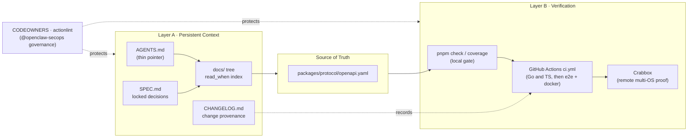
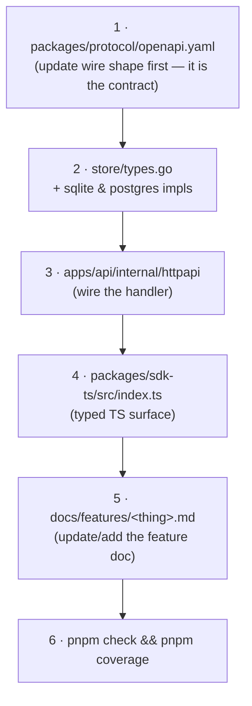
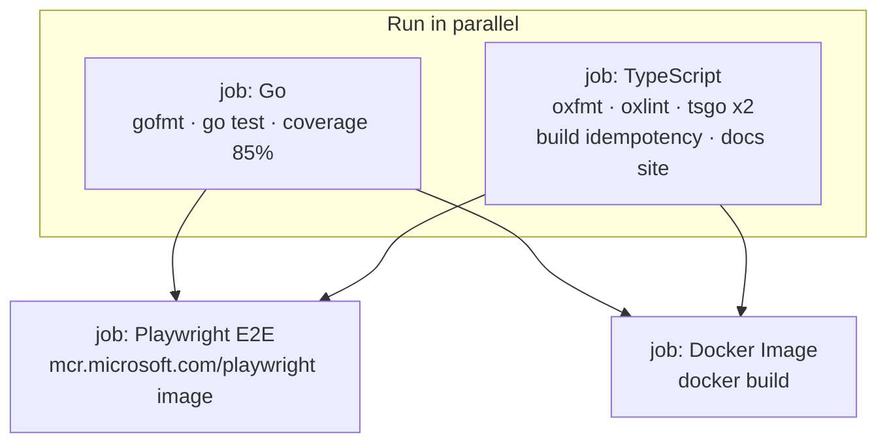
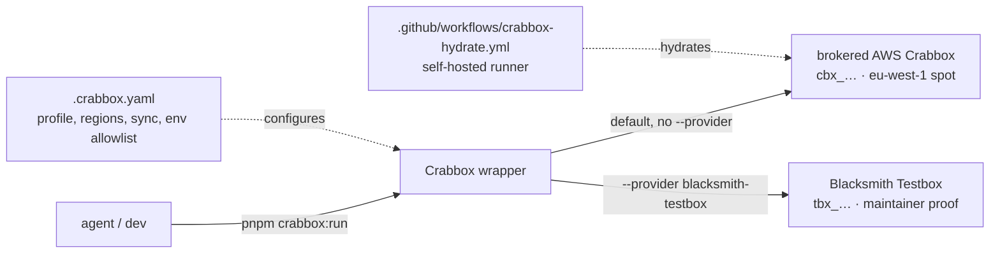

> How this repository is built so that AI coding agents (Claude Code, Codex, Cursor)
> *and* humans can work in it effectively — with persistent guidance, a single source
> of truth, and deterministic feedback loops.

[`clickclack`](https://github.com/openclaw/clickclack) is "Realtime team chat for OpenClaw agents and humans": a self-hostable,
API-first chat app that ships as a single Go binary embedding a Svelte SPA. It lives
inside the larger **OpenClaw** ecosystem. This document is *not* about the chat product
— it is about the **harness**: the structured files, conventions, and automation that
turn the repo into a place an autonomous agent can reason about and prove work in.

---

## 1. TL;DR — the harness in five points

- **Two-layer harness.** Layer A is *context you read before changing code* (`AGENTS.md`
  + a `read_when`-indexed `docs/` tree). Layer B is *verification you run to prove the
  change* (`pnpm check`, the CI gate graph, and Crabbox remote proof).
- **Selective context, not a wall of text.** `AGENTS.md` is deliberately tiny. Almost
  all guidance lives in `docs/`, where **every doc opens with a `read_when:` frontmatter
  block** so an agent loads only the page matching its task.
- **One source of truth.** `packages/protocol/openapi.yaml` is the API contract. A fixed
  change-propagation order (OpenAPI → store → handler → SDK → feature doc) keeps wire
  shape, server, client, and docs in lockstep.
- **Deterministic gates.** `pnpm check` mirrors CI exactly: gofmt, `go test`, an 85 %
  coverage gate, oxlint, oxfmt, tsgo typecheck, and a build-idempotency check. Agents get
  a tight local loop that matches the remote one.
- **Governed provenance.** `CODEOWNERS` puts the `@openclaw/openclaw-secops` team over
  every harness-critical path (workflows, skills, configs, scripts, docs), so the rules an
  agent follows can't be silently rewritten.

---

## 2. The big picture

The harness has two halves an agent moves between: **read context → make the change →
prove it**, escalating from a local loop to remote proof only when needed.



An agent's life cycle: **(1)** open the `read_when` doc that matches the task, **(2)** edit
the OpenAPI contract and the layers downstream of it, **(3)** run `pnpm check`/`pnpm
coverage` locally, **(4)** let CI re-run the same gates, **(5)** optionally request Crabbox
remote proof, **(6)** open a PR that lands under `@openclaw/openclaw-secops` review.

---

## 3. Repository map (harness-relevant files)

```
clickclack/
├── AGENTS.md                 # ← Layer A entrypoint (thin: one sqlc note)
├── README.md                 # product pitch + docs index + read_when explainer
├── SPEC.md                   # locked V1 decisions, non-goals (the "why")
├── CHANGELOG.md              # change provenance
├── package.json              # ← Layer B: pnpm check / coverage / crabbox scripts
├── .crabbox.yaml             # remote-proof provider config (brokered AWS default)
├── docs/                     # ← Layer A knowledge base (read_when on every doc)
│   ├── README.md             #   landing page + index
│   ├── development.md        #   monorepo layout, gates, "Adding a feature" recipe
│   ├── agent-friendly-cli.md #   the explicit agent CLI contract
│   ├── data-model.md         #   tables, ID prefixes, thread invariants
│   ├── architecture/overview.md
│   ├── api/overview.md       #   endpoint map; OpenAPI = source of truth
│   └── features/*.md         #   14 per-domain docs (messages, threads, realtime, …)
├── .agents/
│   └── skills/crabbox/SKILL.md   # ~700-line remote-validation skill
├── .github/
│   ├── CODEOWNERS            # ← governance over harness files
│   ├── actionlint.yaml       # self-hosted runner labels
│   └── workflows/
│       ├── ci.yml            # the gate graph
│       ├── crabbox-hydrate.yml
│       ├── pages.yml         # docs site deploy
│       └── release.yml
├── scripts/
│   ├── check-go-coverage.sh  # 85 % coverage gate
│   └── go-test-with-web-dist.mjs  # embeds web dist, runs Go tests isolated
├── packages/protocol/openapi.yaml # ← the single source of truth
├── apps/{api,web}/  packages/sdk-ts/  examples/bot-ts/   # application code
└── tests/e2e/                # Playwright specs
```

Everything above the application-code line is *harness*. The application directories
(`apps/`, `packages/`, `examples/`, `infra/`) are where work happens — but the harness is
what tells an agent how to enter, change, and verify them safely.

---

## 4. Layer A — Persistent context & guidance

### 4.1 `AGENTS.md`: deliberate minimalism

`AGENTS.md` is a **real file**, not a symlink, and there is *no* `CLAUDE.md` in the repo.
Its entire content is three lines:

```markdown
## Project Notes

- SQL: use sqlc for typed SQL. Edit schema/query files, then run `pnpm generate:sqlc`;
  do not hand-maintain generated storedb code.
```

This is a design choice, not an omission. Rather than stuffing one mega-file with rules
that go stale, `AGENTS.md` carries only the single cross-cutting gotcha that has no natural
home in a feature doc (the sqlc-generation discipline). Everything else is delegated to the
`docs/` tree, which is **versioned alongside the code it describes** and indexed for
selective loading.

### 4.2 The `read_when` convention — selective context loading

The signature of this repo's harness is a YAML frontmatter block at the top of every major
doc that names *the situations in which an agent should open it*. From
`docs/features/messages.md`:

```yaml
---
read_when:
  - changing message create/edit/delete or pagination
  - touching the `messages` table or `channel_seq`
  - changing the Markdown body format
---
```

`README.md` states the rule explicitly:

> The [docs/](docs/) tree is organised so each file has a short `read_when` hint at the
> top — open the one that matches your change.

Why this matters for harness engineering: an agent has a finite context window. A flat
"read all the docs" instruction wastes it and buries the relevant 5 %. `read_when` turns
the doc tree into a **task-indexed retrieval map** — the agent (or human) scans hints, opens
the one or two pages that match, and skips the rest. It is, in effect, a hand-authored
retrieval index that doubles as human onboarding.

### 4.3 Doc taxonomy

| Path | Category | `read_when` trigger (abridged) | Audience |
|------|----------|-------------------------------|----------|
| `docs/README.md` | Index / landing | starting anywhere | both |
| `docs/architecture/overview.md` | Architecture | changing storage, realtime, auth, embedded serving | both |
| `docs/data-model.md` | Data model | touching tables, IDs, thread invariants | both |
| `docs/api/overview.md` | API contract map | changing REST/WS/SDK/OpenAPI | both |
| `docs/development.md` | Process | fresh checkout, changing the gate, adding a tool | both |
| `docs/agent-friendly-cli.md` | Agent contract | designing CLI for agents/scripts, exit-code contracts | agents |
| `docs/cli.md` | Reference | implemented command surface | both |
| `docs/features/*.md` (14) | Domain | per-feature (messages, threads, reactions, realtime, search, uploads, dms, bots, auth, moderation, profiles, workspaces, replies, integrations) | both |
| `docs/{configuration,deployment,releasing,install,quickstart,sdk,bot-installs}.md` | Operations | deploy/config/release/integrate | both |

### 4.4 Provenance docs: `SPEC.md` and `CHANGELOG.md`

Two root files carry **provenance** — the record of *why* the system is the way it is, which
agents cannot infer from code alone:

- **`SPEC.md`** freezes the decisions that bound the design space. Its `Locked V1 Decisions`
  and `Non-Goals For V1` sections keep an agent from "helpfully" re-litigating settled
  scope. For example:

  > - API contract is OpenAPI-first, with `packages/protocol/openapi.yaml` as the source of truth.
  > - IDs use ULID-style sortable text IDs with semantic prefixes such as `usr_`, `wsp_`, `chn_`, `msg_`, `evt_`.

  and the explicit *Non-Goals* (no voice/video, no federation, no E2E encryption, no
  multi-node websocket fanout) that tell an agent what *not* to build.

- **`CHANGELOG.md`** records what actually shipped and what is in flight, giving an agent the
  temporal context — which features are new, which were revived, which were security fixes.

---

## 5. Layer B (part 1) — Source-of-truth & the provenance chain

### 5.1 OpenAPI-first contract propagation

The harness pins one artifact as canonical: `packages/protocol/openapi.yaml`. `docs/api/
overview.md` opens with it:

> `packages/protocol/openapi.yaml` is the API contract source of truth. Server handlers
> live in `apps/api/internal/httpapi`; the TypeScript SDK in `packages/sdk-ts` is the typed
> client.

`docs/development.md` codifies the exact order in which a change must flow outward from that
contract — its "Adding a feature" recipe:



This ordering is itself a harness mechanism: it makes "the contract" causally upstream of
every implementation, so an agent who follows the recipe cannot drift the server, client,
and docs out of sync. Supporting invariants from `docs/architecture/overview.md` and
`docs/development.md` reinforce it:

- **Single-writer discipline:** `db.SetMaxOpenConns(1)` on SQLite.
- **Outbox pattern:** "Outbox `events` rows are inserted in the same commit as the durable
  write that produced them, so subscribers can't see a message that isn't in the DB."
- **Store abstraction:** "Keep SQL behind the store interface… dialect-specific SQL belongs
  in the SQLite/Postgres store packages, not in HTTP handlers."
- **Semantic ULID IDs:** sortable, prefixed (`usr_`, `wsp_`, `chn_`, `msg_`, `evt_`,
  `upl_`, `idn_`) — readable by humans, stable cursors for recovery.

Mutating endpoints return both the resource and its durable event (`{message, event}`), so
clients reconcile optimistically — and `apps/api/internal/store/types.go` is the seam every
new persistence method passes through.

### 5.2 The agent-friendly CLI contract

`docs/agent-friendly-cli.md` is the clearest statement that this repo was designed *for*
agents. Its goals:

> - Predictable for agents and shell scripts.
> - Works against `localhost` and hosted servers with the same commands.
> - Uses the public HTTP/WebSocket API; no private server backdoors.
> - Supports durable cursor recovery for long-running watchers.

The binary exposes machine-parseable contracts an agent can rely on:

| Mechanism | Contract |
|-----------|----------|
| `--json` | one JSON object per finite command; newline-delimited JSON for streams |
| `--plain` | stable single-field output (IDs, tokens) |
| `--no-input` | never prompt — required for non-interactive automation |
| Exit codes | `0` ok · `1` generic · `2` usage/validation · `3` auth · `4` not found · `5` forbidden · `10` network · `11` bad response — *"branch on exit codes, not error text."* |
| Cursor recovery | load saved cursor → backfill via `/api/realtime/events?after_cursor=…` → open WS → persist last cursor |

Crucially, the doc notes "all LLM/provider behavior [stays] outside the ClickClack binary"
— the harness gives agents a stable *surface*, not an embedded model.

---

## 6. Layer B (part 2) — Verification & the feedback loop

### 6.1 The local gate = the CI gate

The whole point of the verification layer is that **the command an agent runs locally is the
same one CI runs**. From `package.json`:

```json
"check": "pnpm test && pnpm typecheck && pnpm -r typecheck && pnpm lint && pnpm fmt:check",
"coverage": "bash scripts/check-go-coverage.sh",
"test":  "pnpm build:web && pnpm build:sdk && node scripts/go-test-with-web-dist.mjs"
```

| Gate | Command | What it enforces |
|------|---------|------------------|
| Go format | `gofmt -l apps/api` | no unformatted Go |
| Go tests | `go test ./...` | backend correctness |
| Coverage | `scripts/check-go-coverage.sh` | ≥ 85 % on `apps/api/internal/...` (store/storedb/uploadstore filtered out) |
| TS format | `oxfmt --check …` | no unformatted TS/Svelte |
| Lint | `oxlint …` | TS/JS lint rules |
| Typecheck | `tsgo --noEmit` (root + `-r` workspaces) | strict types |
| Build idempotency | `pnpm build` ×2 + `git diff --exit-code` | embedded SPA assets are deterministic |

`scripts/go-test-with-web-dist.mjs` builds the web/SDK dist, embeds it into the API, and runs
Go tests in an isolated temp copy so tests exercise *fresh* assets without rewriting tracked
embedded files. The coverage script deliberately **excludes** storage/upload adapters so the
gate measures request/business logic, not noisy generated-SQL and external-I/O branches.

### 6.2 The CI gate graph

`.github/workflows/ci.yml` runs the same gates on every PR and push to `main`, fanning out
two independent jobs and then gating heavier jobs on both:



The `Go` and `TypeScript` jobs are independent (fast feedback on both fronts at once); `e2e`
and `docker` `needs:` both, so they only spend the expensive minutes once the cheap gates are
green. E2E runs inside the pinned Playwright container image for a reproducible browser
environment — a recent fix (commit `a9e4ab9`, "run e2e on playwright image") that removed
host-browser drift.

### 6.3 Crabbox — escalation to remote, multi-OS proof

When local and CI gates aren't enough — broad CI-parity runs, secrets, hosted services,
Docker/E2E/package lanes, or non-Linux proof — the harness escalates to **Crabbox**, an
OpenClaw remote-validation wrapper described in `.agents/skills/crabbox/SKILL.md` (~700
lines) and configured by `.crabbox.yaml`:



Key facts the skill encodes for agents:

- **Omitting `--provider` means brokered AWS today** (`provider: aws`, lease ids `cbx_…`);
  `--provider blacksmith-testbox` delegates to Testbox (`tbx_…`) for maintainer-grade proof.
- `.crabbox.yaml` pins the profile (`clickclack-check`), multi-region spot capacity with
  on-demand fallback, a sync `exclude` list (`node_modules`, `dist`, `coverage`, …), and an
  **env allowlist** (`CI`, `NODE_OPTIONS`, `PNPM_*`, `NPM_CONFIG_*`) — secrets are never
  blanket-forwarded.
- The skill insists agents **report the actual provider and lease id**, so remote-proof claims
  are auditable rather than vague.

`package.json` exposes the entry points: `crabbox:hydrate`, `crabbox:run`, `crabbox:warmup`,
`crabbox:stop`.

---

## 7. Governance & provenance enforcement

A harness is only trustworthy if its rules can't be quietly edited. `.github/CODEOWNERS`
places the security team over every harness-critical path:

```
/.github/workflows/   @openclaw/openclaw-secops
/.agents/skills/      @openclaw/openclaw-secops
/.crabbox.yaml        @openclaw/openclaw-secops
/package.json         @openclaw/openclaw-secops
/scripts/             @openclaw/openclaw-secops
/apps/  /packages/  /docs/   @openclaw/openclaw-secops
```

Combined with `.github/actionlint.yaml` (which declares the `crabbox`/`openclaw`/`clickclack`
self-hosted runner labels and lints the workflows), this means: an agent can *propose* changes
to the gates, skills, or remote-proof config, but a human secops review gates them. The
context an agent trusts in Layer A and the gates it must pass in Layer B are themselves under
review — provenance all the way down.

---

## 8. A day in the life of an agent here

Concretely, suppose an agent is told *"add an `edited_at` field to messages."*

1. **Read context selectively.** Scan `read_when` hints; open `docs/features/messages.md`
   ("changing message create/edit/delete…") and `docs/api/overview.md` ("changing REST
   endpoints… or OpenAPI"). Skip the other 28 docs.
2. **Check the rails.** `SPEC.md` confirms Markdown messages and ULID IDs are locked;
   `AGENTS.md` reminds: edit sqlc query files, then `pnpm generate:sqlc` — don't hand-edit
   `storedb`.
3. **Change from the contract outward** (the `development.md` recipe): edit
   `packages/protocol/openapi.yaml` → add the store method in `store/types.go` + both
   sqlite/postgres impls → wire the handler in `httpapi` → update `packages/sdk-ts/src/
   index.ts` → update `docs/features/messages.md`.
4. **Prove locally.** `pnpm check && pnpm coverage` — same gates as CI, fast loop, fix until
   green (≥ 85 % coverage, formatted, typed, build idempotent).
5. **Let CI re-prove.** Push; `ci.yml` runs Go and TypeScript in parallel, then Playwright
   E2E + Docker.
6. **Escalate if needed.** For broad CI-parity or non-Linux proof, `pnpm crabbox:run` and
   report the provider + lease id.
7. **Land under governance.** Open a PR; `@openclaw/openclaw-secops` reviews any touch to
   workflows, scripts, or configs.

At no step does the agent need tribal knowledge — each move is anchored in a file the harness
makes discoverable.

---

## 9. Why this design works

| Principle | How the harness implements it |
|-----------|-------------------------------|
| **Selective context loading** | `read_when` frontmatter turns `docs/` into a task-indexed map; `AGENTS.md` stays thin |
| **Single source of truth** | `openapi.yaml` is canonical; a fixed propagation order keeps server/client/docs in sync |
| **Docs co-located with code** | guidance is versioned, reviewed, and decays with the code rather than rotting in a wiki |
| **Deterministic, mirrored gates** | `pnpm check` == CI; build-idempotency check catches non-reproducible output early |
| **Machine-readable surfaces** | CLI `--json`/`--plain`/`--no-input` + stable exit codes make the app scriptable by agents |
| **Escalating proof** | local → CI → Crabbox, paying expensive remote minutes only when warranted |
| **Governed provenance** | `CODEOWNERS` + `actionlint` keep harness files under secops review |

The result is a repo where an agent's effectiveness comes from *structure*, not from a large
opening prompt: read the right page, change from the contract outward, run one command to
prove it, and escalate only when the task demands it.

---

## 10. Appendix — harness file reference

| File | Role |
|------|------|
| `AGENTS.md` | Thin agent entrypoint; sqlc-generation note |
| `README.md` | Product pitch, docs index, `read_when` explainer |
| `SPEC.md` | Locked V1 decisions + non-goals (provenance of *why*) |
| `CHANGELOG.md` | Change provenance |
| `docs/README.md` | Docs landing page + index |
| `docs/development.md` | Layout, scripts table, "Adding a feature" recipe, coding rules |
| `docs/agent-friendly-cli.md` | Agent CLI contract (flags, exit codes, cursor recovery) |
| `docs/architecture/overview.md` | Layers + storage rules (single-writer, outbox) |
| `docs/data-model.md` | Tables, ID prefixes, thread invariants |
| `docs/api/overview.md` | Endpoint map; OpenAPI as source of truth |
| `docs/features/*.md` | 14 per-domain guides, each `read_when`-indexed |
| `packages/protocol/openapi.yaml` | The API contract — single source of truth |
| `package.json` | `check` / `coverage` / `crabbox:*` scripts |
| `scripts/check-go-coverage.sh` | 85 % coverage gate (filters store/upload adapters) |
| `scripts/go-test-with-web-dist.mjs` | Builds + embeds web dist, runs Go tests isolated |
| `.github/workflows/ci.yml` | Go and TypeScript, then E2E + Docker gate graph |
| `.github/workflows/crabbox-hydrate.yml` | Hydrates self-hosted Crabbox runner |
| `.github/CODEOWNERS` | `@openclaw/openclaw-secops` governance over harness paths |
| `.github/actionlint.yaml` | Self-hosted runner labels; workflow linting |
| `.crabbox.yaml` | Remote-proof provider config (brokered AWS default) |
| `.agents/skills/crabbox/SKILL.md` | ~700-line remote-validation skill |

---

*Sources: all quotes and structure verified against the files cited, at the repository state
of this writing (branch `main`).*
