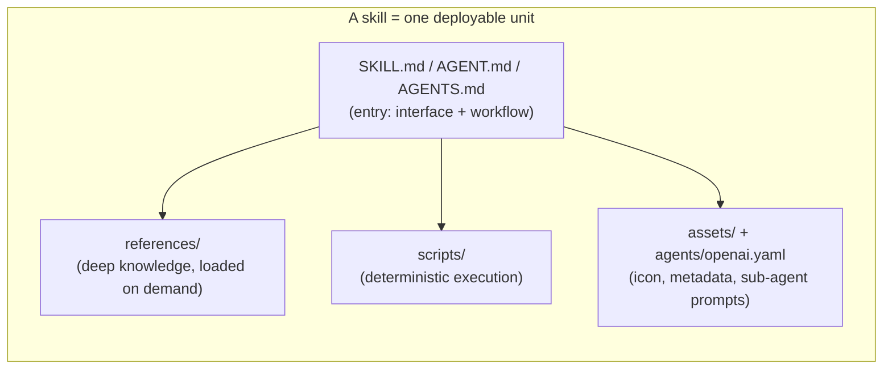
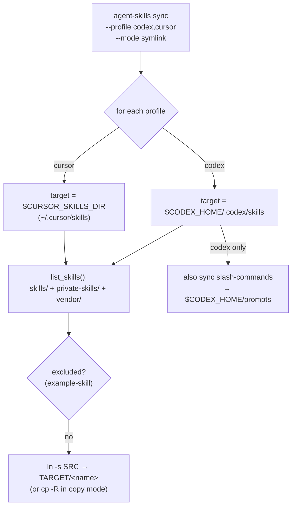
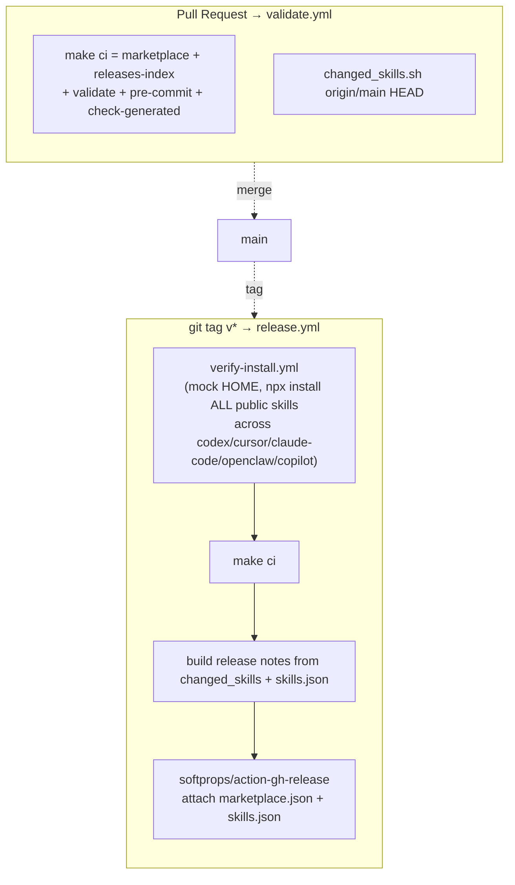
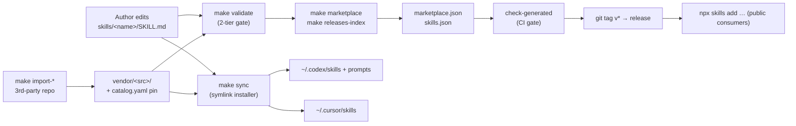
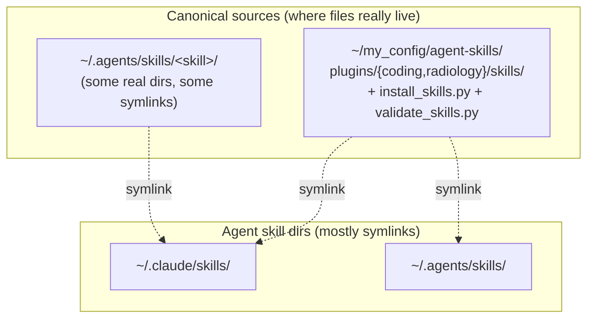

*A field guide to vincentkoc's `.skills` repo: how it's built, the harness engineering inside it, and how you'd fork the pattern to wire into your own `~/.claude/skills` / `~/.agents/skills` setup.*

---

## 1. TL;DR — the verdict

**Yes, you can borrow this architecture, and you're already 80% of the way there.** dotskills is a *personal skill registry* — "dotfiles, but for AI execution." It bundles reusable prompt-modules (`SKILL.md` + references + scripts), validates them against a spec, generates publish indexes, and **syncs them into agent skill directories via a symlink/copy installer**.

You already operate the exact substrate it targets:

- `~/.claude/skills/` and `~/.agents/skills/` are **symlink farms** pointing at canonical sources.
- `~/my_config/agent-skills/` is **already a skills repo** with `plugins/{coding,radiology}/skills`, an `install_skills.py`, and a `validate_skills.py`.

So the question isn't "can I adopt this" — it's "**which of dotskills' harness pieces are worth grafting onto the repo I already have?**" Section 9 answers that directly. The short version: borrow the **two-tier validator**, the **internal/public split**, and the **generated-index + CI gate** pattern; skip the `npx skills` / OpenAI-marketplace publishing unless you actually want to publish publicly.

---

## 2. Mental model: "skill as runtime module"

The repo's thesis (from `README.md`): move from *"prompt as text"* to *"skill as runtime module."* Each skill is a lightweight, installable, versioned, testable unit — like a container image for AI work — with a stable interface and bundled resources.



The design philosophy maps cleanly onto your own (Ousterhout / "deterministic shell around intelligence"):

- **The entry file is the deep module's interface** — terse, stable, opinionated.
- **`references/` is lazy-loaded depth** — verbose knowledge stays out of the prompt until needed (the spec enforces "one level deep").
- **`scripts/` is the deterministic core** — the agent supplies reasoning; the script supplies repeatable, testable execution.

---

## 3. Repo anatomy

```text
dotskills/
├── skills/                  # First-party PUBLIC skills (publishable)
│   └── <skill>/ { SKILL.md, references/, scripts/, assets/, agents/openai.yaml }
├── private-skills/          # Local-only skills (never published)
│   └── <skill>/ { SKILL.md, scripts/ }
├── vendor/                  # Third-party skills, imported/mirrored from other repos
│   └── <source>/<skill>/
│
├── bin/agent-skills         # ★ The harness CLI: list | validate | sync | import
├── scripts/                 # Validation + publish automation (bash + python)
│   ├── validate.sh          #   tier-1: repo policy (required sections, entry files)
│   ├── validate_spec.py     #   tier-2: AgentSkills spec (frontmatter, refs, public policy)
│   ├── generate_marketplace.sh   # → .claude-plugin/marketplace.json
│   ├── generate_releases_index.sh# → releases/skills.json
│   ├── check_generated.sh   #   CI gate: indexes must be in sync with source
│   └── changed_skills.sh    #   diff-aware: which skills changed between refs
│
├── catalog.yaml             # Hand+tool-maintained metadata catalog of every skill
├── .claude-plugin/marketplace.json  # GENERATED: Claude plugin marketplace manifest
├── releases/skills.json     # GENERATED: install index (npx commands per skill)
│
├── AGENTS.md                # Contributor + agent contract (the "source of truth")
├── Makefile                 # Task runner: make validate | sync | marketplace | ci | release
├── .pre-commit-config.yaml  # shellcheck, yamllint, gitleaks, + local validate hook
└── .github/workflows/       # validate.yml, release.yml, verify-install.yml, codeql.yml
```

Three skill tiers, one rule each:

| Tier | Location | Published? | Marker |
|---|---|---|---|
| **Public** | `skills/<name>/` | Yes (marketplace + releases index) | requires `license: MIT` + `metadata.source` |
| **Private** | `private-skills/<name>/` | No | excluded everywhere |
| **Public-but-internal** | `skills/<name>/` | No | `metadata.internal: true` in frontmatter |
| **Vendored** | `vendor/<source>/<name>/` | Synced, not published | tracked in `catalog.yaml` with upstream commit |

---

## 4. Anatomy of one skill

The **entry file** is the contract. The harness accepts three names (`SKILL.md`, `AGENT.md`, `AGENTS.md`) so it can host skills authored for different agent ecosystems, but `SKILL.md` is the "strict" format that gets full spec validation.

A `SKILL.md` (from `semantic-slicing`):

```yaml
---
name: semantic-slicing          # must be lowercase-hyphen, ≤64 chars, == dir name
description: Build local semantic review slices…   # ≤1024 chars
license: MIT                     # required for PUBLIC skills
metadata:
  source: "https://github.com/vincentkoc/dotskills"   # required for PUBLIC skills
---

# Semantic Slicing
## Purpose          ← required section
## When to use      ← required section
## Workflow         ← required section
## Inputs           ← required section
## Outputs          ← required section
```

Private skills relax the rules (`metadata.internal: true`, no `source`/`license` needed). The richest skills add a **sub-agent layer** — e.g. `technical-documentation/agents/` ships four prompt files, each pinned to a model tier:

```text
agents/inventory-agent.md       (fast,     Claude haiku)
agents/governance-agent.md      (thinking,  Claude sonnet)
agents/docs-framework-agent.md  (thinking,  Claude sonnet)
agents/synthesis-agent.md       (long,      Claude opus)
```

This is the "deterministic shell around intelligence" idea made physical: the skill orchestrates a small fleet, and each role's model is pinned where it must reproduce.

---

## 5. The harness: `bin/agent-skills`

A single ~440-line bash script is the engine. Four verbs:

```text
agent-skills list        # enumerate every skill across skills/ private-skills/ vendor/
agent-skills validate    # delegate to scripts/validate.sh (→ validate_spec.py)
agent-skills sync        # install skills into agent dirs (symlink|copy)
agent-skills import      # pull skills from a 3rd-party git repo into vendor/
```

### 5.1 `sync` — the installer (this is the piece that matters for your integration)



Key behaviors:

- **Profiles** are just target directories, env-overridable: `codex` → `${CODEX_HOME:-~/.codex}/skills`, `cursor` → `${CURSOR_SKILLS_DIR:-~/.cursor/skills}`.
- **Mode** `symlink` (default) keeps the repo canonical and the install dir a thin pointer — *exactly the pattern your `~/.claude/skills` already uses.* `copy` is for hermetic/CI installs.
- **Vendored skills get namespaced** on install: `vendor/<source>/<skill>` → `<source>--<skill>` so two upstreams can't collide.
- **Slash-command mirroring**: for the `codex` profile it additionally syncs `vendor/**/slash-commands/*.md` into `~/.codex/prompts` (e.g. `/sectriage` from steipete).

### 5.2 `import` — vendoring third-party skills

`make import-anthropic` shows the flow: shallow-clone a repo at a ref, find skill dirs under a subdir, copy selected ones into `vendor/<source>/`, and **append a `catalog.yaml` entry pinning the exact upstream commit**. This gives reproducible third-party provenance without git submodules.

---

## 6. Validation: a two-tier gate

`make validate` runs two layers, cheap-to-strict:

```mermaid
flowchart LR
    V["make validate"] --> T1
    subgraph T1["Tier 1 — validate.sh (bash, policy)"]
        direction TB
        P1["Every skill dir has an entry file"]
        P2["SKILL.md skills have the 5 required sections"]
        P3["AGENT.md / AGENTS.md / vendor entries are non-empty"]
    end
    T1 --> T2
    subgraph T2["Tier 2 — validate_spec.py (AgentSkills spec)"]
        direction TB
        S1["name: lowercase-hyphen, ≤64, == dir name"]
        S2["description ≤1024; frontmatter well-formed"]
        S3["PUBLIC skills: license=MIT + metadata.source"]
        S4["PUBLIC skills: agents/openai.yaml w/ required interface<br/>fields, icons exist, defaults match AGENTS.md"]
        S5["refs one level deep, no '../', targets exist"]
    end
    T2 --> X{"skills-ref<br/>installed?"}
    X -->|yes| Y["run external validator too"]
    X -->|no| Z["warn + skip (non-fatal)"]
```



Notable engineering choices:

- **`validate_spec.py` hand-rolls a minimal YAML parser** rather than depending on PyYAML — zero-dependency, runs anywhere Python 3 exists. (Tradeoff: it only understands the subset of YAML the skills use.)
- **Defaults are DRY-sourced from `AGENTS.md`**: the validator parses the `## OpenAI Metadata Defaults` fenced block out of the markdown and asserts each public skill's `openai.yaml` matches it. The doc *is* the config.
- **`internal: true` is the publish kill-switch** — checked identically by the validator, the marketplace generator, and the releases generator.

---

## 7. Generated artifacts & the publish pipeline

Two files are **generated, never hand-edited**, and CI enforces they stay in sync:

| File | Generator | Consumer |
|---|---|---|
| `.claude-plugin/marketplace.json` | `generate_marketplace.sh` | Claude Code plugin marketplace |
| `releases/skills.json` | `generate_releases_index.sh` | `npx skills add` install index |

Both walk `skills/*`, skip `internal: true`, pull the description from the entry file's first non-frontmatter line, and emit JSON. `check_generated.sh` is the guard:

```bash
git diff --quiet -- .claude-plugin/marketplace.json releases/skills.json \
  || { echo "Generated artifacts are out of date"; exit 1; }
```

So the source of truth is `skills/`; the indexes are a pure function of it; CI fails if you forget to regenerate. This is the same "manifest-as-SSOT, everything derives" discipline from your release-engineering conventions.

### CI/CD wiring



`verify-install.yml` is the standout: it builds a **mock `$HOME`**, sets every agent's home env var, and actually runs `npx skills add … --skill '*' --global` to prove the published skills install cleanly across five agent ecosystems before the release is cut. That's a real end-to-end install smoke test, not just a lint.

Pre-commit adds the safety net: `shellcheck`, `yamllint`, `gitleaks`/`detect-private-key` (secret scanning), `check-yaml/json/toml`, plus a **local hook that runs `agent-skills validate`** on every commit.

---

## 8. The full data flow, end to end



Two distinct distribution paths: **`make sync`** for *your own machine* (local symlinks, includes private skills), and **`npx skills` / releases** for *public consumers* (public skills only).

---

## 9. Wiring it into YOUR existing setup

Here's where it gets concrete, because your machine already has the relevant pieces. Today:



Your `~/.claude/skills/` is **already a symlink farm** — e.g. `c4-architect -> ~/.agents/skills/c4-architect`, `ax-interface-analysis -> ~/my_config/agent-skills/plugins/coding/skills/ax-interface-analysis`. This is *precisely* what `agent-skills sync --mode symlink` produces. **dotskills and your setup are the same shape.** The difference is dotskills has a more developed harness around it (spec validator, generated indexes, CI gates, vendoring).

### Two ways to adopt

**Option A — Graft dotskills' harness onto `~/my_config/agent-skills` (recommended).**
You already have the repo and an installer. Borrow the *engineering*, not the directory layout:

1. **Add a Claude profile to the sync target list.** dotskills only ships `codex` and `cursor`. Your `agent-skills sync` (or `install_skills.py`) should target `~/.claude/skills` and `~/.agents/skills`. The script already parameterizes targets via env vars — add:
   ```bash
   claude_target() { echo "${CLAUDE_SKILLS_DIR:-$HOME/.claude/skills}"; }
   agents_target() { echo "${AGENTS_SKILLS_DIR:-$HOME/.agents/skills}"; }
   ```
2. **Adopt the two-tier validator.** Your `validate_skills.py` likely overlaps; steal `validate_spec.py`'s zero-dependency frontmatter checks (name↔dir match, ref-depth, public policy). It's self-contained and copy-pasteable.
3. **Adopt the `internal: true` kill-switch + generated index pattern** if you ever want a public subset. Your `plugins/radiology` skills (PHI-adjacent, RAMAAI-branded) almost certainly stay private — the internal flag is the clean way to keep them in-repo but unpublished.
4. **Keep your plugin grouping.** dotskills is flat (`skills/`); you've gone further with `plugins/{coding,radiology}/`. That's a *better* fit for your two-domain split — don't flatten it. Just teach the sync/validate walkers to recurse one extra level.

**Option B — Run dotskills' repo as-is, forked.** Clone the structure verbatim, drop your skills into `skills/` + `private-skills/`, point sync at your Claude dirs. Faster to stand up, but you'd abandon your existing `plugins/` grouping and `install_skills.py`. Only worth it if you want public `npx skills` publishing out of the box.

### The one wiring gotcha

Your `~/.claude/skills` mixes **real directories** (`commit-push-pr`, `dotnet-clean-architect`, `notebook-literate-python`) with **symlinks**. A `sync` that does `rm -rf "$dest"` before linking (as dotskills does) will happily delete a real dir if names collide. Before adopting the installer, decide: are the real dirs in `~/.claude/skills` canonical, or stale copies that should become symlinks? Migrate them into your repo first, then let sync own that directory.

---

## 10. How to build your own from scratch (minimal viable harness)

If you'd rather start clean, here's the irreducible core — four files reproduce 90% of the value:

```text
my-skills/
├── skills/<name>/SKILL.md          # author here
├── bin/skills                      # list | validate | sync   (≈150 lines bash)
├── scripts/validate_spec.py        # frontmatter + section + ref checks
└── Makefile                        # validate | sync | (optional) index
```

Build order:
1. **Define the entry contract** — pick `SKILL.md` + the 5 sections (`Purpose / When to use / Workflow / Inputs / Outputs`). Copy `skills/example-skill/SKILL.md` as your template.
2. **Write `sync`** — walk `skills/*`, `ln -s` into `~/.claude/skills` and `~/.agents/skills`. Support `--dry-run` from day one.
3. **Write the validator** — start with tier-1 (entry exists, sections present); add spec checks as you feel pain.
4. **Add a Makefile + pre-commit hook** — `make validate` on every commit is the whole quality story locally.
5. **Defer the rest** — generated indexes, `npx` publishing, and CI matrix only earn their keep once you're sharing publicly. For a personal registry, `make sync` is the product.

---

## 11. What to borrow vs. skip (opinionated, for your context)

| Piece | Borrow? | Why |
|---|---|---|
| `SKILL.md` 5-section contract | ✅ Yes | Stable interface; cheap discipline; matches your "deterministic shell" philosophy |
| `internal: true` public/private split | ✅ Yes | Clean way to keep radiology/RAMAAI skills in-repo but unpublished |
| Two-tier validator (`validate.sh` + `validate_spec.py`) | ✅ Yes | Zero-dep, copy-pasteable; better than your current `validate_skills.py` likely is |
| Symlink installer w/ env-overridable targets | ✅ Yes | You already live this pattern; formalize it. Add Claude/agents profiles |
| `import` + `catalog.yaml` commit-pinning | ✅ Yes (if you vendor) | Reproducible 3rd-party provenance without submodules |
| pre-commit (shellcheck/gitleaks/local validate) | ✅ Yes | gitleaks especially, given PHI/credential adjacency |
| Generated `marketplace.json` + `releases/skills.json` | ⚠️ Only if publishing | Pure overhead for a private registry |
| `npx skills` + `verify-install.yml` matrix | ⚠️ Only if publishing | 5-agent install smoke test is great, but it's for *public* consumers |
| Flat `skills/` layout | ❌ Skip | Your `plugins/{coding,radiology}/` grouping is strictly better for your two domains |

---

## Appendix — quick command reference

```bash
# Inspect
make list                    # every skill across skills/ private-skills/ vendor/
./bin/agent-skills sync --dry-run --profile codex,cursor   # preview installs

# Validate (the daily gate)
make validate                # 2-tier: policy + spec
pre-commit run --all-files

# Install onto this machine
make sync                    # symlink into agent dirs (default)
make sync-copy               # hermetic copy install

# Vendor a 3rd-party skill
./bin/agent-skills import --source <name> --repo <url> --ref main --subdir skills --skills a,b

# Publishing path (public)
make marketplace && make releases-index   # regenerate indexes
make check-generated                       # CI gate: indexes in sync?
make ci                                    # marketplace+index+validate+precommit+check
make release VERSION=v0.4.0                # tag → triggers release.yml
```

---

*Bottom line: dotskills is a clean, well-gated reference implementation of "skill-as-module." Its harness is mostly bash + one zero-dependency Python validator — easy to read, easy to fork. You already run the symlink-farm substrate it targets and you already have a skills repo with grouping it lacks. The highest-leverage move is to graft its **validator + internal/public split + sync-with-Claude-profiles** onto your existing `~/my_config/agent-skills`, and leave the public-publishing machinery on the shelf until you actually want to publish.*
