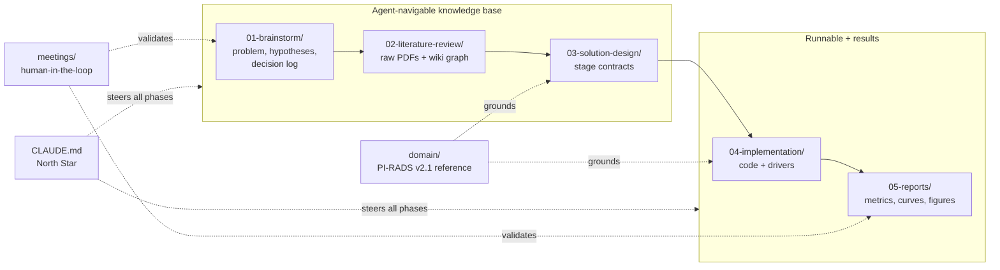
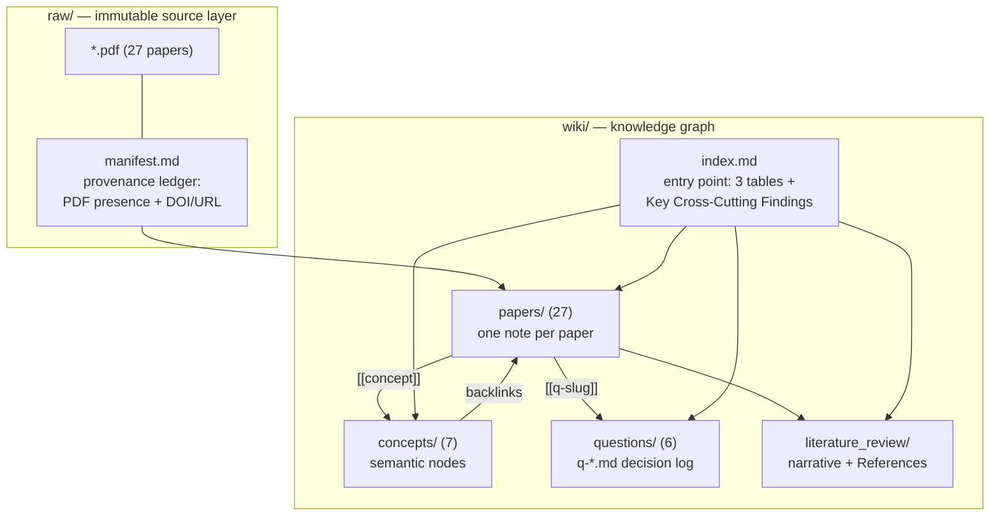
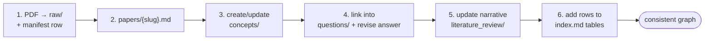
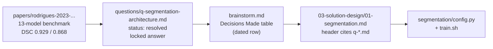
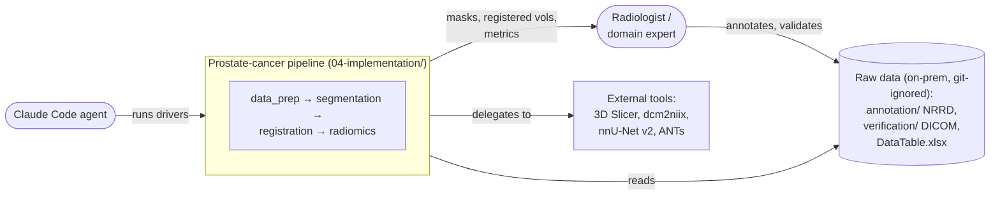
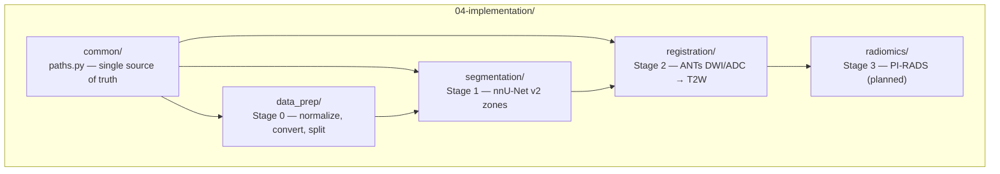
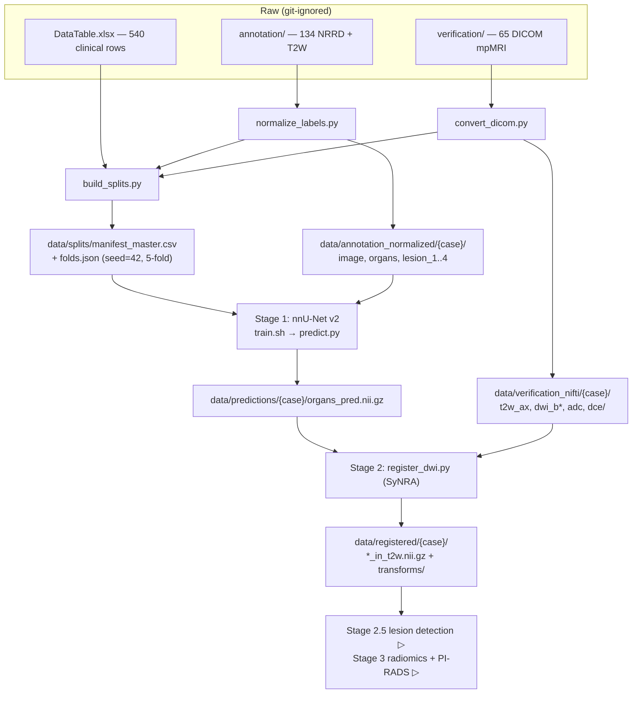
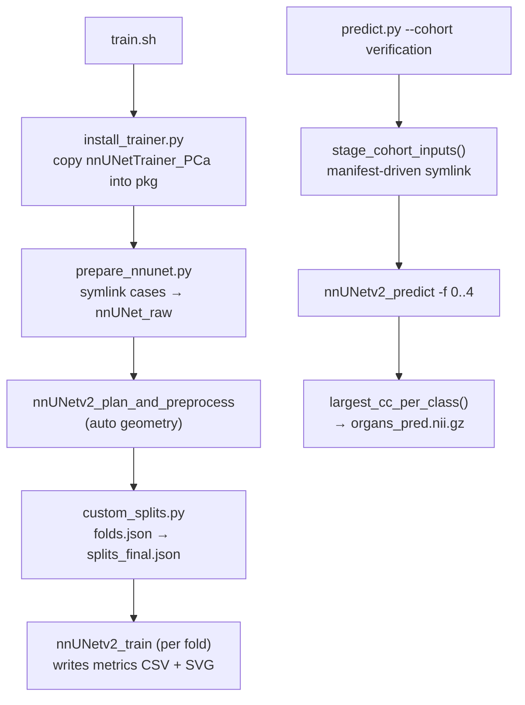
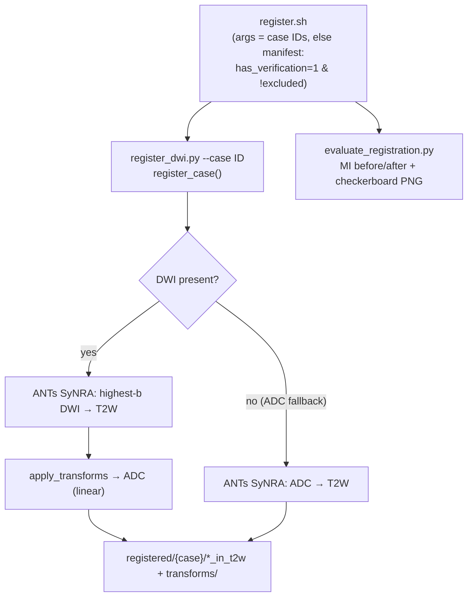
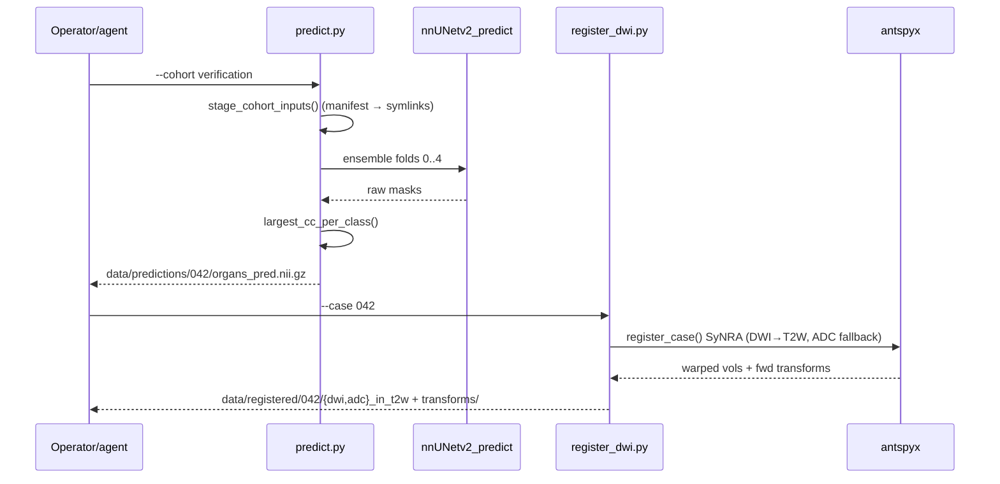

# Agent-Driven Prostate-Cancer ML — System & Workflow Architecture

> Analyzed: 2026-06-03 · Type: **Hybrid** —
> a runnable ML pipeline *and* an importable, agent-navigable knowledge base.

## 1. Overview

This repository is an end-to-end pipeline for prostate-cancer assessment from
multiparametric MRI (mpMRI) — automated zone segmentation, multi-modal image
registration, and radiomics-based PI-RADS estimation. But the more interesting thing
about it is *how it was built*: an LLM coding agent (Claude Code) drove the whole research
lifecycle — brainstorm → literature review → solution design → implementation → reports —
and the repo's file structure **is** the agent's working memory.

That structure is a concrete instance of Andrej Karpathy's
["LLM wiki"](https://gist.github.com/karpathy/442a6bf555914893e9891c11519de94f) idea: a
knowledge base deliberately shaped so that both humans and an LLM can read it, query it,
trace decisions through it, and extend it without drifting out of sync. This document
explains **both** architectures, weighted equally:

- **Part A — the agent-driven knowledge architecture**: the numbered research phases, the
  literature wiki, the decision-traceability chain, domain encoding, and human-in-the-loop
  checkpoints. *(What makes the process reproducible.)*
- **Part B — the ML system architecture**: the code under `04-implementation/`, the
  data-flow contracts, and the reproducibility machinery. *(What makes the pipeline
  reproducible.)*
- **Part C — a replication playbook**: a project-agnostic recipe to apply this workflow to
  a new ML research project.

**Repo classification — Hybrid, with evidence:**

| Signal | Evidence |
|---|---|
| *Runs* (application) | bash drivers `04-implementation/segmentation/train.sh`, `registration/register.sh`; argparse CLIs `predict.py`, `register_dwi.py`; nnU-Net `nnUNetv2_train`/`nnUNetv2_predict` invocations |
| *Imported* (library/knowledge base) | `from common import paths` single-source-of-truth module; `02-literature-review/wiki/` graph navigated via `[[backlinks]]`; design docs cite `q-*.md` notes |
| *Knowledge base* | numbered phase dirs `01-brainstorm` → `05-reports`; `.claude/instruction.md` methodology; living decision log |

**Tech stack:** Python 3.11 + Bash; nnU-Net v2 + PyTorch (segmentation); ANTs / `antspyx`
(registration); `dcm2niix`, `nibabel`, `pynrrd` (I/O); `pandas` + `scikit-learn` (manifests
+ stratified splits); PyRadiomics (planned). Knowledge layer is Obsidian-compatible
Markdown. The driving "runtime" of the *process* is Claude Code, steered by `CLAUDE.md` and
the per-phase `.claude/` instructions.

---

# Part A — Agent-Driven Knowledge Architecture

## A.1 The phase pipeline

The repo root is a research-to-code assembly line. Each numbered directory is a phase, and
each phase is a **prerequisite contract** for the next: brainstorm locks the open questions,
the literature review answers them with citations, solution design turns answers into
input/output contracts, implementation runs the code, and reports capture results.

| Path | Role | Status |
|---|---|---|
| `01-brainstorm/brainstorm.md` | Living decision log: problem, hypotheses (`✓`/`✗`), open-questions table, iteration log, "Decisions Made" table, Go decision | ✅ |
| `02-literature-review/` | Curated knowledge graph (the clearest Karpathy-wiki instance, §A.2) | ✅ |
| `03-solution-design/` | Per-stage design docs as input/output contracts | ✅ |
| `04-implementation/` | Source code + bash drivers (Part B) | 🔄 M2 |
| `05-reports/` | Aggregate results (no PHI): Dice tables, training curves, registration QA | 🔄 |
| `domain/` | `pirads_v2_1.md` — clinical scoring rules encoded for the agent | template |
| `meetings/` | Dated radiology-team reports + follow-ups (human checkpoints) | ongoing |
| `CLAUDE.md` | Project scope, milestone status, team roles — read on every agent invocation | ✅ |

## A.2 The literature wiki — the clearest Karpathy-wiki instance

`02-literature-review/` separates **sources** from **knowledge**, and the whole thing is
governed by a written methodology that an agent follows deterministically:
`02-literature-review/.claude/instruction.md` ("Literature Review Methodology — VRU-AI
Standard"). The methodology is explicit: *"A literature review is maintained as an
LLM-authored knowledge wiki ... a knowledge graph, not a flat list."*

**`raw/` vs `wiki/`.** `raw/` holds the 27 original PDFs plus `manifest.md`, a one-row-per-
note provenance ledger (matching PDF filename or "missing — to source", plus DOI/URL). It is
the immutable source layer. `wiki/` is the processed, queryable graph — five mandatory
components:

- **`papers/`** (27 notes) — one per paper, named `{firstauthor}-{year}-{slug}.md`, with
  YAML frontmatter (`type, authors, year, doi, relevance, questions: [...]`) and fixed body
  sections ending in **"Notes for the Project"** (how the finding applies *here*). Rule:
  *"numbers over adjectives"* — record n, AUC, DSC, parameters verbatim, because these are
  cited directly in Solution Design.
- **`concepts/`** (7 nodes) — e.g. `pi-rads-scoring.md`, `adc-quantification.md`,
  `radiomic-features.md`; each defines a term and backlinks the papers that discuss it.
- **`questions/`** (6 notes, `q-*.md`) — the *decision log of the review*: each carries an
  `Initial Hypothesis`, the papers bearing on it, and a **Current Working Answer** that is
  locked when `status: resolved`. All six are resolved → the phase can feed design.
- **`literature_review/`** — continuous academic prose with inline `(Author Year)` links
  back to `papers/`, ending in a `## References` list. This becomes the paper's Background.
- **`index.md`** — the query entry point (Papers/Questions/Concepts tables + distilled
  cross-cutting findings).

**The curatorial invariant.** §9 of the methodology defines a 6-step "Adding a Paper"
workflow, and states the rule that keeps the graph consistent:

> *"Adding a paper is not done until all six steps are complete — that is what keeps the
> graph consistent."* — `.claude/instruction.md` §9

This is the machine-readable standard: an agent can execute it without judgment calls, which
is exactly why the wiki does not rot as it grows.

## A.3 Decision traceability — every claim points back to evidence

The defining property of this knowledge base is that **every design decision can be traced
backward to its evidence**, and forward to its code. Worked example — *"use nnU-Net 3D
full-resolution for zone segmentation"*:

The mechanisms that make this work:
- **Brainstorm decision log** — a "Decisions Made" table (every major decision + rationale +
  date) plus an **iteration log** recording each pass through the review loop and what
  changed (e.g. Hypothesis 2 revised when DWI EPI distortion proved to need *deformable*,
  not affine, registration).
- **Question notes as locks** — `q-*.md` `Current Working Answer` is the authoritative,
  citable decision once `resolved`.
- **Design-doc headers cite their evidence** — e.g. `03-radiomics-pirads.md` locks the
  PyRadiomics config "from the literature (`02-literature-review/wiki/index.md`, finding 4)"
  and attributes each setting to a paper (FBN=64 → Dewi 2023, LoG → Schwier 2019).
- **Risk register** — `03-solution-design/README.md` tracks anticipated obstacles (R1
  imaging-archive availability, R5 multi-scanner ADC variability) with mitigations.
- **Status-marker convention**, used everywhere so any reader (human or agent) sees state at
  a glance: `✅` done · `▶` in progress / next · `▷` planned · `✗` revised/rejected.

Scope changes propagate through every layer. When lesion *detection* moved in-scope
(2026-06-02) after the review surfaced PI-CAI, the change appears in the brainstorm decision
table, a new `03-solution-design/04-lesion-detection.md`, a re-centered radiomics doc, and a
new `M2.5` milestone in `CLAUDE.md` — no ghost decisions.

## A.4 Domain encoding + human-in-the-loop

- **`domain/pirads_v2_1.md`** encodes PI-RADS v2.1 scoring rules so radiomic features are
  grounded in clinical decision logic, not only data. It is a **`[FILL]` template**:
  institution-specific ADC reference values are left as `[FILL] × 10⁻³ mm²/s` placeholders,
  explicitly awaiting radiologist validation. The placeholder *is* the design — it keeps the
  document alive and assignable to the domain expert.
- **`meetings/`** records human checkpoints as dated pairs:
  `reports/report-2026-06-03.md` (clinical plain-language status for the radiology team) and
  `follow-up/follow-2026-06-03.md` (action items + a deployment/visualization guide,
  including a `figures/` folder of de-identified comparison screenshots). The two are
  cross-linked by date.

This surfaces the repo's **three formality tiers**, matched to audience: academic
(`literature_review/`), technical (`03-solution-design/`, code), and clinical plain-language
(`meetings/reports/`, `domain/`).

## A.5 `CLAUDE.md` — the North Star

The root `CLAUDE.md` is the single instruction file every agent invocation sees. It carries
project scope, the **milestone status board** (M0 ✅ → M1 ✅ → M2 ▶ → M2.5/M3 ▷) with the M1
Dice results inline, a team-roles table, and the open key-questions list. It is the document
that tells the agent *where the project is* and *what to do next*. (There is no `AGENTS.md`
symlink here — a single agent manages the lifecycle.)

---

# Part B — ML System Architecture

## B.1 System context (C4 L1)

## B.2 High-level structure (C4 L2)

| Path | Responsibility |
|---|---|
| `04-implementation/common/paths.py` | Canonical filesystem layout; `ensure_data_dirs()`, `ensure_nnunet_dirs()` |
| `04-implementation/data_prep/` | NRRD→NIfTI label normalization, DICOM→NIfTI conversion, manifest + CV-fold build |
| `04-implementation/segmentation/` | nnU-Net v2 wrapper: prepare, train (custom trainer), predict, evaluate |
| `04-implementation/registration/` | ANTs SyNRA DWI/ADC→T2W alignment + QA |
| `04-implementation/radiomics/` | PyRadiomics + PI-RADS modelling — **planned, not yet present** |

Each stage ships its own `README.md` and `requirements.txt` (self-contained `uv` venvs); no
global installs. Style is **predominantly functional** (procedural CLI scripts with pure
helpers); the only OOP extension is the nnU-Net trainer subclass (§B.4).

## B.3 Data flow / pipeline

The pipeline is a sequence of stages joined by **file contracts**, not shared objects. Raw
heterogeneous inputs become a canonical `data/` tree; the `manifest_master.csv` +
`folds.json` are the spine that every later stage filters on.

**Milestone ↔ phase ↔ script mapping:**

| Milestone | Phase dir / design doc | Scripts | Output |
|---|---|---|---|
| M0 ✅ | `data-pipeline.md` | `normalize_labels.py`, `convert_dicom.py`, `build_splits.py` | `annotation_normalized/`, `verification_nifti/`, `manifest_master.csv`, `folds.json` |
| M1 ✅ | `01-segmentation.md` | `train.sh`, `predict.py`, `evaluate.py` | `predictions/{case}/organs_pred.nii.gz`, Dice tables |
| M2 ▶ | `02-registration.md` | `register.sh`, `register_dwi.py`, `evaluate_registration.py` | `registered/{case}/*_in_t2w.nii.gz` + QA |
| M2.5 ▷ | `04-lesion-detection.md` | (PI-CAI transfer, TBD) | `lesions/{case}/lesion_*.nii.gz` |
| M3 ▷ | `03-radiomics-pirads.md` | (TBD) | `features/`, `models/`, metrics |

## B.4 Components inside the key modules (C4 L3)

**Segmentation** — `train.sh` is a 5-step orchestrator; prediction is manifest-driven and
ensembled over 5 folds:

- `config.py` holds **task identity only** — `DATASET_NAME='Dataset201_ProstateZones'`,
  `LABELS={background:0, CG:1, PZ:2, SV:3, Bladder:4}`, `CHANNEL_NAMES={'0':'T2W'}`. Image
  geometry defaults to `None` (nnU-Net auto-derives it); nothing is hardcoded.
- `nnunet_ext/nnUNetTrainer_PCa.py` is the **one OOP extension** — subclasses `nnUNetTrainer`
  to add env-driven max-epochs + early stopping (monitors `ema_fg_dice`) and to auto-write
  manuscript artifacts (`training_metrics.csv`, `*_curve.svg`) on train end.
- `evaluate.py` computes DSC / HD95 / ASD reading **voxel spacing from each NIfTI header**,
  so surface metrics are in millimetres regardless of acquisition grid.
- `prostate_zones.ctbl` — a 3D Slicer color table whose label IDs match `config.LABELS`, for
  visual verification.

**Registration** — a manifest-driven driver wrapping an ANTs core with an ADC fallback:

## B.5 Key patterns

- **Single source of truth — `common/paths.py`.** `PROJECT_ROOT = Path(__file__).resolve().
  parents[2]` derives every path from one anchor, so the repo runs anywhere after cloning.
  Change the layout once; it propagates everywhere.
- **Manifest-as-contract.** `data/splits/manifest_master.csv` (one row per cohort case) is
  the API between stages. No stage re-derives case status — `predict.py --cohort`,
  `register.sh`, and `evaluate.py --which` all filter the same CSV. Case lists are never
  hardcoded, so any run is reproducible and auditable.
- **Three-layer configuration.** `config.py` defaults → `PCA_*` environment overrides →
  argparse flags. Operators tune epochs, early-stopping patience, SyN parameters, or geometry
  for a new scanner **without editing Python** (e.g. `PCA_MAX_EPOCHS=3 ./train.sh --smoke`).
- **Reproducibility by construction.** `build_splits.py` uses `seed=42` with
  `StratifiedShuffleSplit` (10% test) + `StratifiedKFold` (5 folds), both PI-RADS-stratified;
  metrics are spacing-aware; training CSV/SVG artifacts are auto-captured per fold.
- **Quality gates.** `build_splits.py` hard-fails if any valid case is missing an organ, if
  an excluded case leaks into a split, or if PI-RADS is null for a split case.
- **Git data-sovereignty boundary.** `.gitignore` excludes `data/`, model weights
  (`*.pth/*.ckpt`, `runs/`), and imaging (`*.nii.gz/*.nrrd/*.dcm`). Only code, design docs,
  and **aggregate** metrics/figures (no PHI) are committed.

## B.6 One representative flow — predict + register case 042

## B.7 Known-issue handling — defects tracked, not hidden

The pipeline records data defects in the manifest and fails loudly rather than silently
corrupting downstream stages:

- **Duplicate annotations** — cases 004/005 and 087/088 share a byte-identical NRRD though
  they are different patients; flagged `is_known_duplicate=1, excluded=1`, and a quality gate
  forbids excluded cases from entering any split (132 valid cases used for M1).
- **4D-NRRD affine bug (fixed)** — Slicer 4D exports encode the non-spatial axis as a `nan`
  vector; `build_lps_affine()` now skips any `None`/scalar-`nan`/`nan`-containing direction,
  recovering 134/134 cases (was 19/134).
- **DICOM geometry mismatch (resolved)** — when an annotation T2W exists, `convert_dicom.py`
  selects the AX-T2 series matching its matrix/spacing; 3 cases (022/062/064) with no match
  and 2 with no AX-T2 (023/065) are flagged for review, not forced.
- **Modality absence** — only ~44/65 DICOM cases have ADC and ~38 have DWI; the design treats
  bpMRI as primary and degrades gracefully (cases without a modality skip its extraction).
- **In-progress lesion labels** — 112 cases carry `inprogress` lesion segments; precise
  lesion *boundary* segmentation is out of scope, so these seed/validate lesion *detection*
  (M2.5) rather than being trained on.

---

# Part C — Replication Playbook

A project-agnostic recipe to run this agent-driven workflow on a **new** ML research project.
Each step names the concrete artifact in this repo you can copy.

1. **Lay down numbered phase dirs + a North Star.** Create `01-brainstorm/` → `05-reports/`
   and a root `CLAUDE.md` carrying scope, a milestone status board with markers
   (`✅ ▶ ▷ ✗`), and team roles. The agent reads this on every invocation.
   → copy: `CLAUDE.md`, the `0N-*/` layout.
2. **Build the literature wiki as a graph, with a written curatorial standard.** Split
   `raw/` (PDFs + `manifest.md` provenance) from `wiki/` (`papers/`, `concepts/`,
   `questions/`, narrative `literature_review/`, `index.md`). Put the methodology and the
   N-step "adding a paper" workflow in `02-literature-review/.claude/instruction.md` so the
   graph stays consistent by rule, not vigilance.
   → copy: `02-literature-review/.claude/instruction.md` verbatim; adapt §11 only.
3. **Keep a living decision log with locked answers.** Use `questions/q-*.md`
   `Current Working Answer` (locked at `status: resolved`) + a brainstorm "Decisions Made"
   table + an iteration log. Prefer numbers over adjectives.
4. **Encode domain knowledge as a `[FILL]` template.** Put expert-owned facts in `domain/`
   with explicit placeholders, so the domain expert can complete them asynchronously.
   → copy: `domain/pirads_v2_1.md` pattern.
5. **Write design docs as input/output contracts that cite evidence.** Each
   `03-solution-design/*.md` opens by citing the `q-*.md` it traces to and states
   Inputs → Outputs → Steps → Quality gates → Known residuals.
6. **Implement with a paths single-source-of-truth + a manifest contract + layered config.**
   One `common/paths.py`; one `manifest_master.csv` spine every stage filters; defaults in
   `config.py`, overridable by env vars and argparse; bash drivers with a `--smoke` mode.
7. **Enforce a git data-sovereignty boundary.** `.gitignore` patient data, derived trees, and
   weights; commit only code, design, and aggregate metrics.
8. **Record human checkpoints.** Dated `meetings/reports/` (plain-language) +
   `meetings/follow-up/` (action items) pairs make the human-in-the-loop auditable.

The throughline: **decisions are written down, linked to evidence, and given a status**, so
both a human and an LLM can pick up the project at any point and know what is settled, what
is next, and why.

---

## Glossary

| Term | Meaning |
|---|---|
| **CG / PZ / SV / Bladder** | Segmentation labels: Central Gland (transition zone), Peripheral Zone, Seminal Vesicles, Bladder (label IDs 1–4) |
| **mpMRI / bpMRI** | Multiparametric MRI (T2W + DWI/ADC + DCE) / biparametric (T2W + ADC); bpMRI is the primary deliverable |
| **PI-RADS v2.1** | Prostate Imaging-Reporting and Data System; 1–5 suspicion score the project estimates |
| **csPCa** | Clinically significant prostate cancer (the binary modelling target) |
| **nnU-Net v2** | Self-configuring U-Net framework used for zone segmentation (3D full-res, 5-fold ensemble) |
| **SyNRA** | ANTs registration preset: rigid → affine → SyN (deformable), used to align DWI/ADC onto T2W |
| **Manifest** | `manifest_master.csv` — the single-source-of-truth case table that contracts stages together |
| **Fold** | One of 5 PI-RADS-stratified cross-validation partitions in `folds.json` (seed=42) |
| **`q-*.md`** | A research-question synthesis note; its locked Working Answer is a citable decision |

## Open Questions & Notes

Honest boundaries of this document (observed vs. not-yet-present in the repo):

- **Planned, not present:** there is **no `04-implementation/radiomics/` directory yet** —
  Stage 2.5 (lesion detection) and Stage 3 (radiomics + PI-RADS modelling) exist only as
  design docs and milestone entries. Script names in those rows are anticipated, not on disk.
- **WIP:** registration QA (`05-reports/registration/registration_metrics.csv`) is in
  progress; `register_dce.py` for DCE frames is referenced in design but not yet implemented.
- **Pending domain input:** `domain/pirads_v2_1.md` retains `[FILL]` ADC reference values
  awaiting radiologist validation.
- **Inferred vs. observed:** exact per-case file presence (which of the 65 verification cases
  have DWI vs ADC-only) was reported by exploration of design/manifest docs rather than by
  enumerating the (git-ignored) `data/` tree directly; treat the 44/38-case modality counts
  as design-stated figures.
- **Data not in repo:** `annotation/`, `verification/`, `DataTable.xlsx`, and the entire
  `data/` tree are git-ignored and were not inspected as files — their structure is taken
  from `common/paths.py`, `03-solution-design/data-pipeline.md`, and `CLAUDE.md`.
