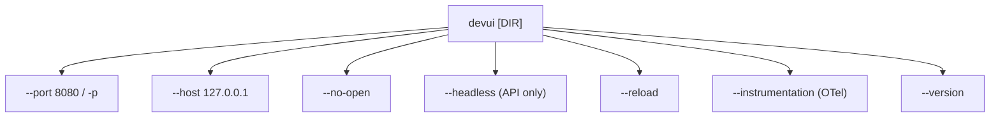
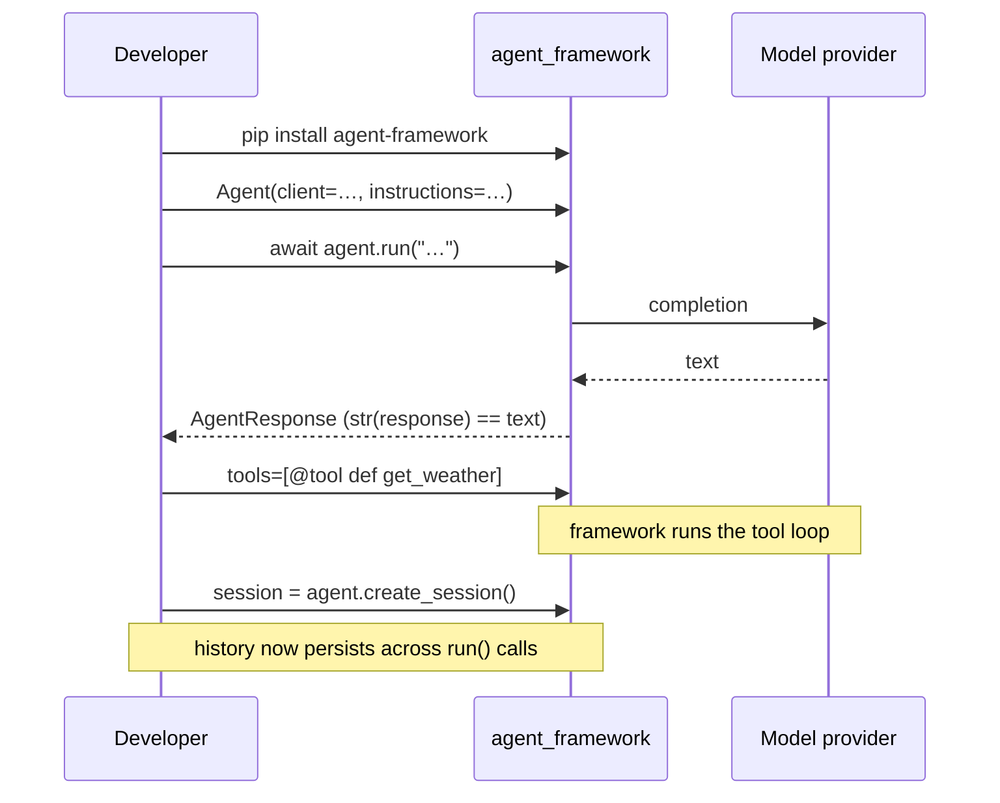
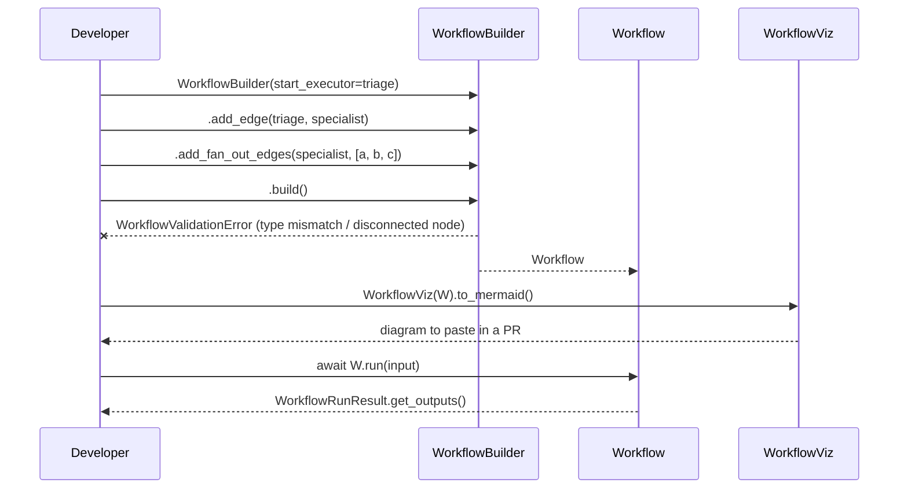
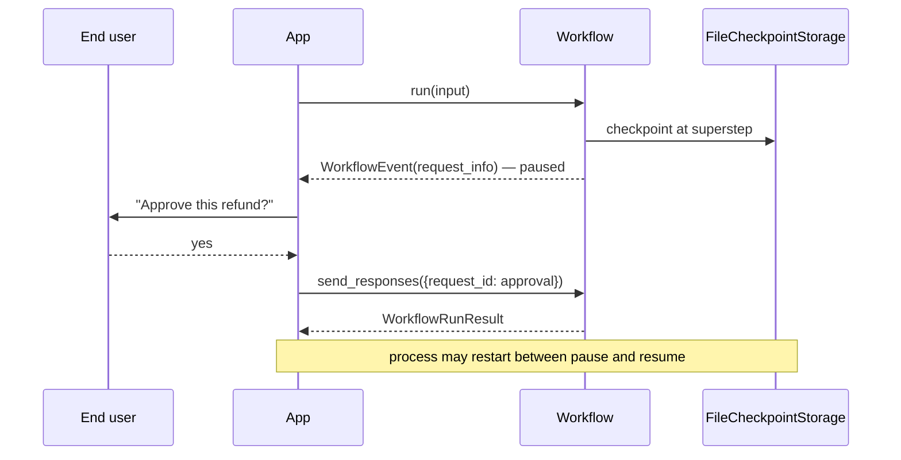
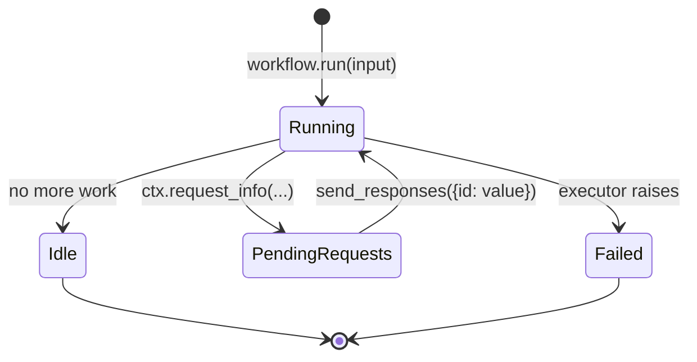

> Source: [microsoft/agent-framework](https://github.com/microsoft/agent-framework) (branch `main` @ `7181af5d7`) · Date: 2026-08-25 · Mode: Explain · Type: **Hybrid** (Library/SDK · CLI · Web API · declarative YAML)
> See also: [System & OOP Architecture](/lib-pkg/microsoft-agent-framework-system-architecture/)

## Cheat Sheet

The ten things you will actually type. Every symbol here is verified in §2.

### Python — agents

```python
from agent_framework import Agent, tool
from agent_framework.openai import OpenAIChatClient

# 1. An agent
agent = Agent(client=OpenAIChatClient(), name="Helper", instructions="Be brief.")
print(await agent.run("Capital of France?"))

# 2. Streaming — same method, one kwarg
async for chunk in agent.run("Tell me a fact.", stream=True):
    print(chunk.text, end="")

# 3. A tool — Annotated fields become the JSON schema
@tool(approval_mode="never_require")            # "always_require" in production
def get_weather(location: Annotated[str, Field(description="City")]) -> str:
    return f"{location}: sunny"

agent = Agent(client=..., tools=[get_weather])

# 4. Multi-turn — an explicit session object, not hidden global state
session = agent.create_session()
await agent.run("My name is Alice.", session=session)
await agent.run("What's my name?", session=session)

# 5. Agent-as-tool / agent-as-MCP-server
researcher_tool = researcher.as_tool()
mcp_server      = agent.as_mcp_server()
```

### Python — workflows

```python
from agent_framework import WorkflowBuilder, WorkflowContext, executor, workflow

# 6. Graph workflow — start_executor is a required kwarg
@executor(id="upper")
async def upper(text: str, ctx: WorkflowContext[str]) -> None:
    await ctx.send_message(text.upper())

wf = WorkflowBuilder(start_executor=upper).add_edge(upper, reverse).build()
result = await wf.run("hello")
result.get_outputs()          # -> ['OLLEH']

# 7. Functional workflow — plain async functions, no graph wiring
@workflow
async def pipeline(text: str) -> str:
    return await reverse_text(await to_upper_case(text))

await pipeline.build().run("hello world")

# 8. Prebuilt orchestrations
from agent_framework.orchestrations import (
    SequentialBuilder, ConcurrentBuilder, GroupChatBuilder, HandoffBuilder, MagenticBuilder,
)
wf = ConcurrentBuilder(participants=[researcher, marketer, legal]).build()
wf = SequentialBuilder(participants=[writer, reviewer], output_from="all").build()
```

### Python — run it, watch it

```bash
# 9. DevUI: discover agents in a directory, serve web UI + OpenAI-Responses API
devui ./agents --port 8080
```
```python
from agent_framework_devui import serve
serve(entities=[agent], auto_open=True)                       # or in-process

from agent_framework.observability import configure_otel_providers, get_tracer
configure_otel_providers()                                     # 10. OTel, one line
```

### .NET — the same ten moves

```csharp
using Microsoft.Agents.AI;

// agent + tools
AIAgent agent = new AIProjectClient(new Uri(endpoint), new DefaultAzureCredential())
    .AsAIAgent(model: model, instructions: "You are helpful",
               tools: [AIFunctionFactory.Create(GetWeather)]);

Console.WriteLine(await agent.RunAsync("Weather in Amsterdam?"));
await foreach (var u in agent.RunStreamingAsync("...")) Console.Write(u);

// decorate: telemetry, logging, function-calling
agent = agent.AsBuilder().UseOpenTelemetry().Build();

// workflow
WorkflowBuilder builder = new(uppercase);
builder.AddEdge(uppercase, reverse).WithOutputFrom(reverse);
await using Run run = await InProcessExecution.RunAsync(builder.Build(), "Hello");

// host it (DI + ASP.NET Core)
builder.AddAIAgent("writer", "You write short stories.", chatClient)
       .WithInMemorySessionStore();
app.MapOpenAIResponses(agentBuilder);   // or MapA2AJsonRpc / AG-UI
```

---

## 1. Overview

MAF's user is a **developer building an agent product**, in Python or C#. The framework's DX
promise is a *narrow front door with deep rooms*: two constructors (`Agent`, `WorkflowBuilder`) get
you running in five lines, and everything past that — memory, approval, checkpointing, protocols,
telemetry — attaches to those same two objects rather than requiring a different mental model.

### Surface classification and evidence

**Hybrid**, four surfaces, in descending order of how much of the repo they occupy:

| Surface | User | Evidence |
|---|---|---|
| **Library / SDK** (primary) | App developer | 35 Python packages with `pyproject.toml`; 39 NuGet projects; curated `__all__` in `agent_framework/__init__.py`; 5 tiers of samples in `python/samples/01-…05-` and `dotnet/samples/` |
| **CLI** | Developer at a terminal | `devui` console script (`python/packages/devui/agent_framework_devui/_cli.py`) |
| **Web API** | Client dev / another agent | DevUI's OpenAI-Responses-shaped `/v1/*` routes (`devui/_server.py`); .NET `MapOpenAIResponses`, `MapA2AJsonRpc`, `MapA2AHttpJson`, AG-UI |
| **Declarative YAML** | Author without code | `declarative-agents/**/*.yaml`, `AgentFactory` |

### How the user reaches it

```bash
pip install agent-framework            # meta-package, pulls all sub-packages
pip install agent-framework-core       # just the core
dotnet add package Microsoft.Agents.AI
```

The Python packaging story is worth understanding up front: `agent-framework` is a meta-package;
real code lives in `agent-framework-core` plus one package per provider/integration. You can install
only what you use — `pip install agent-framework-openai agent-framework-devui` is a legitimate
minimal install. Import paths are unified regardless: `agent_framework.openai`,
`agent_framework.foundry`, `agent_framework.orchestrations` all resolve through namespace packaging,
so the install granularity does not leak into your imports.

---

## 2. Surface Map

### 2.1 Python SDK — the public API by concept

```mermaid
flowchart TD
    root["agent_framework"]
    root --> ag["Agents<br/>Agent · BaseAgent · RawAgent<br/>SupportsAgentRun"]
    root --> cl["Clients<br/>BaseChatClient · Supports*Tool protocols"]
    root --> to["Tools<br/>@tool · FunctionTool<br/>MCPStdioTool · MCPStreamableHTTPTool"]
    root --> se["Sessions<br/>AgentSession · ContextProvider<br/>HistoryProvider · SessionStore"]
    root --> mw["Middleware<br/>@agent_middleware · @chat_middleware<br/>@function_middleware"]
    root --> sk["Skills<br/>Skill · SkillsSource · SkillsProvider"]
    root --> ha["Harness<br/>create_harness_agent · Todo/Memory/<br/>FileAccess/ToolApproval providers"]
    root --> wf["Workflows<br/>WorkflowBuilder · Executor · @handler<br/>@executor · @workflow · WorkflowContext"]
    root --> co["Compaction<br/>SlidingWindow · Summarization · TokenBudget"]
    root --> ev["Evaluation<br/>evaluate_agent · @evaluator · checks"]
```



| Symbol / module | What you do with it |
|---|---|
| `Agent(client, name, instructions, tools, middleware, context_providers)` | The agent you will use 95% of the time |
| `agent.run(msg, session=…, stream=False)` | One call, streaming or not, via the `stream` kwarg |
| `agent.create_session()` / `agent.get_session(id)` | Explicit conversation handle |
| `agent.as_tool()` / `agent.as_mcp_server()` | Expose an agent to another agent |
| `client.as_agent(...)` | Shortcut from a chat client straight to an agent |
| `@tool(approval_mode=…)` → `FunctionTool` | Function → schema'd, approvable tool |
| `MCPStdioTool` / `MCPStreamableHTTPTool` / `MCPWebsocketTool` | Attach an MCP server as tools |
| `ContextProvider` (`before_run` / `after_run`) | The main extension seam — inject messages, instructions, tools, middleware |
| `@agent_middleware` / `@chat_middleware` / `@function_middleware` | Interception at three altitudes |
| `create_harness_agent(client, …)` | Batteries-included coding-agent: todo, memory, file access, shell, approvals |
| `WorkflowBuilder(start_executor=…)` + `.add_edge/.add_chain/.add_fan_out_edges/.add_fan_in_edges/.add_switch_case_edge_group/.build()` | Graph workflows |
| `@executor` / `Executor` + `@handler` | A workflow node |
| `@workflow` + `.build()` | Functional workflows — write async Python, get a graph |
| `WorkflowContext.send_message / yield_output / request_info / get_state` | A node's four capabilities |
| `agent_framework.orchestrations.*Builder` | Sequential · Concurrent · GroupChat · Handoff · Magentic |
| `InMemoryCheckpointStorage` / `FileCheckpointStorage` | Resume and time-travel |
| `WorkflowViz(...).to_mermaid() / .save_svg()` | Draw the graph |
| `agent_framework.observability.configure_otel_providers()` / `get_tracer()` | OTel in one line |
| `agent_framework.declarative.AgentFactory` | Build agents from YAML |
| `evaluate_agent` / `@evaluator` / `keyword_check` / `tool_called_check` | Built-in eval harness |

**Provider modules** (each also a separate pip package):
`agent_framework.{openai, foundry, azure, anthropic, gemini, google, amazon, mistral, ollama, github, microsoft, monty, hyperlight}` plus `agent_framework.{a2a, ag_ui, chatkit, mem0, redis, devui, lab}`.

### 2.2 .NET SDK

| Symbol | Purpose |
|---|---|
| `AIAgent` (abstract) — `RunAsync`, `RunStreamingAsync`, `CreateSessionAsync`, `SerializeSessionAsync` | The agent contract |
| `ChatClientAgent` | The concrete chat-model agent |
| `chatClient.AsAIAgent(...)` / `AIProjectClient.AsAIAgent(...)` | One-liner construction |
| `agent.AsBuilder().Use(...).Build()` — `UseOpenTelemetry`, logging, function-invocation | Decorator stack |
| `agent.AsAIFunction()` | Agent as a tool |
| `AIContextProvider` / `MessageAIContextProvider` / `ChatHistoryProvider` | Context injection |
| `WorkflowBuilder(start)`, `.AddEdge`, `.WithOutputFrom`, `.Build()`; `InProcessExecution.RunAsync` | Workflows |
| `AgentWorkflowBuilder`, `ConcurrentWorkflowBuilder`, `GroupChatWorkflowBuilder`, `HandoffWorkflowBuilder` | Orchestrations |
| `builder.AddAIAgent(name, instructions, chatClient)` + `.WithAITools(...)` + `.WithInMemorySessionStore()` / `.WithSessionStore(store)` | DI registration |
| `app.MapOpenAIResponses(...)`, `app.MapA2AJsonRpc(...)`, `app.MapA2AHttpJson(...)` | ASP.NET endpoints |
| `UseClaimsBasedAgentIsolation(...)` | Per-principal session isolation |

### 2.3 CLI — `devui`



One command, positional directory, a handful of flags. `devui` with no directory shows a curated
sample gallery instead of an empty screen.

### 2.4 Web API — DevUI's `/v1/*` surface

DevUI does not invent a protocol; it speaks **OpenAI Responses**, so any Responses-compatible client
works against it unmodified.

| Method | Route | Purpose |
|---|---|---|
| `GET` | `/health`, `/meta` | Liveness, server metadata |
| `GET` | `/v1/entities` | Discovered agents & workflows |
| `GET` | `/v1/entities/{entity_id}/info` | One entity's schema |
| `POST` | `/v1/entities/{entity_id}/reload` | Hot-reload an entity |
| `POST` | `/v1/responses` | **Run an agent or workflow** (streaming via SSE) |
| `POST` | `/v1/responses/{response_id}/cancel` | Cancel an in-flight run |
| `POST`/`GET`/`DELETE` | `/v1/conversations[/{id}]` | Conversation lifecycle |
| `POST`/`GET`/`DELETE` | `/v1/conversations/{id}/items[/{item_id}]` | Message-level access |
| `POST`/`GET`/`DELETE` | `/v1/deployments[/{id}]`, `/v1/entities/{id}/deploy` | Deploy an entity |

Auth is **on by default**: localhost prints a generated bearer token at startup; pass it as
`Authorization: Bearer <token>`.

### 2.5 Declarative YAML

```yaml
kind: Prompt                      # an agent
name: Assistant
instructions: You are a helpful assistant.
model:
  id: gpt-4.1-mini
  options: { temperature: 0.9, topP: 0.95 }
  connection:
    kind: Remote
    endpoint: =Env.AZURE_FOUNDRY_PROJECT_ENDPOINT
outputSchema:
  properties:
    answer: { type: string, required: true }
```

```yaml
kind: Workflow                    # a workflow
trigger:
  kind: OnConversationStart
  actions:
    - { kind: InvokeAzureAgent, id: ask_student, agent: { name: StudentAgent } }
    - { kind: SetVariable, variable: Local.TurnCount, value: =Local.TurnCount + 1 }
    - kind: ConditionGroup
      conditions:
        - { condition: "=Local.TurnCount < 4", actions: [{ kind: GotoAction, actionId: ask_student }] }
```

Action kinds observed in samples: `InvokeAzureAgent`, `SetVariable`, `ConditionGroup`,
`GotoAction`, `SendActivity`. Expressions are Power-Fx (`=Env.X`, `=System.ConversationId`,
`=Local.TurnCount + 1`, `=!IsBlank(Find(...))`).

---

## 3. Entry & Onboarding

The repo's onboarding is a **numbered ladder**, identical in both languages — the strongest single
DX decision in the project:

```
01-get-started/   01_hello_agent → 02_add_tools → 03_multi_turn → 04_memory
                  → 05_functional_workflow_with_agents → 06_functional_workflow_basics
                  → 07_first_graph_workflow
02-agents/        providers · tools · mcp · middleware · skills · harness · observability
                  · security · evaluation · declarative · a2a · devui · compaction
03-workflows/     _start-here → control-flow · parallelism · checkpoint · human-in-the-loop
                  · orchestrations · composition · state-management · visualization
04-hosting/       foundry-hosted-agents · durable agents/workflows · af-hosting
05-end-to-end/    AgentWebChat · A2AClientServer · AGUIClientServer · DevUIAspireIntegration
```

The smallest real program is `python/samples/01-get-started/01_hello_agent.py` — three imports, a
client, an `Agent`, one `await agent.run(...)`.

Two onboarding details worth copying:

- **XML region markers** (`# <create_agent>` … `# </create_agent>`) inside sample files. The docs
  site pulls the same code by region, so published snippets cannot drift from runnable samples.
- **PEP 723 inline dependencies** in harness samples (`# /// script … dependencies = [...]`), so
  `uv run sample.py` works with zero setup.

Migration on-ramps exist for both predecessors: `python/samples/semantic-kernel-migration/` and
`python/samples/autogen-migration/`.

---

## 4. Key User Journeys

### 4.1 Hello agent → tools → memory (the 01-ladder)



The affordance that makes this feel short: `AgentResponse.__str__` returns the text, so
`print(f"Agent: {result}")` works on line 4 without teaching a response object first.

### 4.2 Building a multi-agent workflow



Type errors surface at `build()`, not mid-run — `TypeCompatibilityError`,
`GraphConnectivityError`, `EdgeDuplicationError`. This is the workflow API's core DX claim.

### 4.3 Human-in-the-loop with resume



Sample: `python/samples/03-workflows/orchestrations/handoff_with_tool_approval_checkpoint_resume.py`.

---

## 5. Interaction & State

### 5.1 What a run returns

| Type | You get | Notes |
|---|---|---|
| `AgentResponse` | `.text`, `.messages`, `.usage`, `str(r)` | Generic over a structured-output model |
| `AgentResponseUpdate` | `.text` chunk | Yielded when `stream=True` |
| `ResponseStream` | async-iterable **and** awaitable | Iterate for chunks, await for the final response |
| `WorkflowRunResult` | `.get_outputs()`, `.get_intermediate_outputs()`, `.get_request_info_events()`, `.get_final_state()`, `.status_timeline` | Subclasses `list[WorkflowEvent]` — iterate it directly |

### 5.2 Workflow run states



`WorkflowRunState` (`_workflows/_events.py:58`) is what `get_final_state()` returns —
`IDLE` is the normal terminal state, not `COMPLETED`, because a workflow finishes by running out of
work rather than by an explicit end node.

### 5.3 Errors and control

| Signal | Meaning |
|---|---|
| `AgentFrameworkException` | Root of the framework's exception tree |
| `MiddlewareTermination` | Middleware deliberately stopped the run (carries a `result`) |
| `MiddlewareFailure` | Middleware failed |
| `UserInputRequiredException` | The run needs input from a human |
| `WorkflowValidationError` + subclasses | Graph invalid at `build()` |
| `WorkflowCheckpointException` / `WorkflowConvergenceException` / `WorkflowRunnerException` | Runtime workflow faults |
| `ExperimentalWarning` / release-candidate warnings | The API you just called is not stable |

**Tool approval** is a first-class interaction state, not an afterthought: `@tool(approval_mode=…)`
takes `"always_require"` / `"never_require"`, and every sample that uses `never_require` carries a
comment telling you to flip it in production. `ToolApprovalMiddleware` and `ToolApprovalRule` drive
the prompt; `FileAccessProvider.read_only_tools_auto_approval_rule` is the idiomatic middle ground
(reads auto-approve, writes prompt).

### 5.4 CLI & HTTP contracts

DevUI: standard process exit codes; HTTP surface returns OpenAI-Responses-shaped bodies and SSE
streams. Auth failures are `401` with a bearer challenge. `mode="developer"` gives verbose errors
and full API access; `mode="user"` restricts APIs and returns generic errors.

---

## 6. Information Architecture / API Ergonomics

### What is consistent, and worth relying on

- **One verb per concept, mirrored across languages.** `run`/`RunAsync`, `create_session`/
  `CreateSessionAsync`, `as_tool`/`AsAIFunction`, `add_edge`/`AddEdge`. Reading a Python sample
  teaches you the C# API and vice versa.
- **`as_*` / `As*` means "reinterpret this as that"** — `as_agent`, `as_tool`, `as_mcp_server`
  (Python); `AsAIAgent`, `AsBuilder`, `AsAIFunction` (.NET). Once you notice the convention, the
  composition surface is guessable.
- **`stream` is a kwarg, not a second method** (Python). One call site, one mental model. .NET
  splits them (`RunAsync` / `RunStreamingAsync`) because `IAsyncEnumerable` cannot overload on
  return type — a language constraint, not an inconsistency.
- **Builders validate at `build()`.** `WorkflowBuilder`, `AIAgentBuilder`, `MagenticBuilder`,
  `AgentSkillsProviderBuilder` all defer errors to one checkable moment.
- **Everything private is `_`-prefixed** (`_agents.py`, `_workflows/`) with a curated `__all__`.
  The public surface is exactly what `__init__.py` exports — no ambiguity about what is API.
- **Experimental is labelled at runtime**, not just in docs: `ExperimentalFeature` /
  `ReleaseCandidateFeature` emit warnings on first use.

### Friction worth knowing before you commit

- **Two orthogonal package namespaces in Python.** `agent_framework.orchestrations` (import path)
  vs `agent_framework_orchestrations` (distribution/internal path) — `magentic.py` imports from
  *both* in one file. Same for `agent_framework_devui` vs `agent_framework.devui`. Expect to look
  this up.
- **`start_executor` moved into the constructor.** `WorkflowBuilder(start_executor=x)` is required;
  `set_start_executor` is now private. Sample *prose* in `03-workflows/_start-here/step1` still
  describes the old fluent form while the *code* uses the new one — trust the code.
- **Python hosting packages are converters, not servers.** If you expect `pip install
  agent-framework-hosting-a2a` to give you a running A2A server, it will not; you wire the routes.
  .NET does ship servers. This asymmetry is deliberate and documented in each README, but it is the
  single biggest cross-language expectation gap.
- **Provider surface is wide and uneven.** 13+ provider modules; hosted-tool support is advertised
  through `Supports*Tool` protocols rather than documented per provider, so feature-detect rather
  than assume.

### AX note — MAF as a surface an agent drives

The framework is unusually well-shaped for an AI agent as the consumer, and in three places treats
that as the point rather than a side effect:

- **`agent.as_mcp_server()`** turns any agent into an MCP server — an agent-callable surface by
  construction. `as_tool()` does the same at the in-process level.
- **Skills are progressive disclosure as a type.** `Skill` = frontmatter + content + resources +
  runnable scripts, with `FileSkillsSource` / `MCPSkillsSource` / `CachingSkillsSource` /
  `FilteringSkillsSource` composing discovery. An agent loads the frontmatter cheaply and pulls
  content only when relevant — token economy designed into the data model.
- **`create_harness_agent`** is an explicit "organs of a coding agent" bundle: todo list, memory,
  file access, mode switching, background sub-agents, tool approval, and an iteration loop with
  `loop_should_continue` / `loop_next_message` callbacks.

The DevUI HTTP surface is agent-friendly for the same reason it is client-friendly: it reuses the
OpenAI Responses schema instead of a bespoke one, and `GET /v1/entities/{id}/info` is a
self-describing endpoint an agent can read before calling. Errors that teach the next move and
token-economical output are not systematically verified here — for an evaluative pass, use the
`ax-interface` skill.

---

## 7. Configuration & Customization

### Python

| Where | What |
|---|---|
| Constructor kwargs | `Agent(client, name, instructions, tools, middleware, context_providers, chat_options, …)` |
| `ChatOptions` TypedDict | `model`, `temperature`, `top_p`, `max_tokens`, `seed`, `stop`, `tools`, `tool_choice`, `allow_multiple_tool_calls`, `response_format`, `instructions` — merged via `merge_chat_options` |
| `.env` + `load_settings` / `SecretString` | Provider credentials and endpoints; every sample uses `python-dotenv` |
| Env vars | `FOUNDRY_PROJECT_ENDPOINT`, `FOUNDRY_MODEL`, OTLP exporter vars, `USER_AGENT_TELEMETRY_DISABLED_ENV_VAR` |
| `configure_otel_providers(enable_sensitive_data=…)` | Telemetry; also available zero-code via env vars |
| Compaction strategies | `SlidingWindowStrategy`, `SummarizationStrategy`, `TruncationStrategy`, `ToolResultCompactionStrategy`, `TokenBudgetComposedStrategy`, `ContextWindowCompactionStrategy` |
| `register_state_type(cls, type_id=…)` | Make custom session state serializable — required at module import time for cold-start restore |
| `create_harness_agent(...)` | ~25 kwargs: `disable_todo`, `disable_compaction`, `skills_paths`, `file_access_store`, `background_agents`, `max_context_window_tokens`, … |

### .NET

| Where | What |
|---|---|
| `ChatClientAgentOptions` / `ChatClientAgentRunOptions` | Per-agent and per-run configuration |
| `AIAgentBuilder.Use(...)` | Decorator stack — the customization mechanism |
| DI: `AddAIAgent(...).WithAITools(...).WithSessionStore(...)` | Composition at registration time |
| `UseClaimsBasedAgentIsolation(new() { ClaimType = ClaimTypes.NameIdentifier })` | Multi-tenant session scoping |
| `InMemoryChatHistoryProviderOptions`, `AgentSkillsProviderOptions`, `IsolationKeyScopedAgentSessionStoreOptions` | Options objects per subsystem |

### DevUI

Flags: `--port`, `--host`, `--no-open`, `--headless`, `--reload`, `--instrumentation`, `--version`.
Programmatic `serve()` adds `cors_origins`, `ui_enabled`, `mode` (`"developer"` | `"user"`),
`auth_enabled`, `auth_token`.

---

## 8. Open Questions & Notes

**Determined, and flagged:**

- **Pre-release.** Several READMEs instruct `pip install … --pre`. Treat the API as moving,
  especially harness, skills, evaluation, and declarative (all warn at runtime).
- **Telemetry defaults on.** `FeatureIndex`/`FeatureUsage` encode a feature bitmask into the
  user-agent string (`docs/decisions/0033-feature-usage-bitmask-user-agent.md`). Off switch:
  `USER_AGENT_TELEMETRY_DISABLED_ENV_VAR`. Check this before deploying somewhere sensitive.
- **DevUI is explicitly not for production** — its own README says so. It is a sample app; build
  your own server with the SDK for anything real.
- **Sample-vs-production defaults diverge deliberately.** `approval_mode="never_require"` and
  `DefaultAzureCredential` appear throughout the samples with inline warnings. Copy-pasting a sample
  into production copies both.

**Not determined from the evidence:**

- **Per-provider hosted-tool coverage.** Which of the 13+ providers actually implement
  `SupportsWebSearchTool`, `SupportsCodeInterpreterTool`, `SupportsShellTool`, etc. was not
  enumerated; the protocols advertise capability but no matrix exists in-repo.
- **Which orchestration to reach for.** Sequential / Concurrent / GroupChat / Handoff / Magentic are
  presented as peers with no selection rubric.
- **Error-message quality and exit-code discipline.** Not systematically sampled — the AX note above
  is descriptive, not an audit. Run the `ax-interface` skill for a real evaluation.
- **Stability contract per package.** No per-package semver/support statement was located.
- **The *why* behind these ergonomics lives in the ADRs.** `docs/decisions/` (40+ records) is where
  the API-shape arguments were actually had — read `0013-python-get-response-simplification.md`,
  `0012-python-typeddict-options.md`, and `0005-python-naming-conventions.md` before arguing with
  any of the ergonomics above.
