> Source: [microsoft/agent-framework](https://github.com/microsoft/agent-framework) (branch `main` @ `7181af5d7`) · Date: 2026-08-25 · Mode: Explain · Type: **Hybrid** (library + hosted apps/CLI)
> See also: [SDK & DX Surface](/lib-pkg/microsoft-agent-framework-surface-architecture/)

## 1. Overview

**Microsoft Agent Framework (MAF)** is a multi-language SDK for building production AI agents and
multi-agent workflows. It is the convergence point of Semantic Kernel and AutoGen (both have
migration sample trees: `python/samples/semantic-kernel-migration/`, `python/samples/autogen-migration/`).

The framework answers two questions with two orthogonal primitives:

| Question | Primitive | Model |
|---|---|---|
| "How do I run *one* LLM-driven actor?" | **Agent** | model-driven control flow (the LLM picks tools) |
| "How do I compose *many* actors reliably?" | **Workflow** | developer-driven control flow (a typed, checkpointable graph) |

Everything else — sessions, context providers, middleware, skills, tools, observability, hosting —
attaches to one or both of these.

### Type classification and evidence

**Hybrid.** Evidence for *library*: 35 distributable Python packages under `python/packages/` each
with `pyproject.toml`, 39 .NET projects under `dotnet/src/` published to NuGet
(`Microsoft.Agents.AI*`), and a curated lazy public API in
`python/packages/core/agent_framework/__init__.py` (a `_LAZY_MODULE_EXPORTS` map plus an explicit
`__all__`). Evidence for *application*: `devui` ships a CLI + web server
(`python/packages/devui/`, `dotnet/src/Microsoft.Agents.AI.DevUI`), and the hosting tree
(`Microsoft.Agents.AI.Hosting.*`, `python/packages/hosting*`) produces runnable servers speaking
A2A, AG-UI, MCP, OpenAI Responses, and ChatKit.

### Tech stack

- **Python** — 3.10+, `pydantic` (tool schemas), `msgspec` (session serialization), `opentelemetry-*`,
  `uv` workspace. Core package `agent-framework-core`, meta package `agent-framework`.
- **.NET** — built on `Microsoft.Extensions.AI` (`IChatClient`, `AITool`, `ChatMessage` are *its*
  types, not MAF's), `Microsoft.Extensions.DependencyInjection`, `System.Text.Json` source generators.
- **Go** — SDK lives out of tree at `microsoft/agent-framework-go`.
- **Declarative** — YAML agent/workflow definitions (`declarative-agents/`), Power-Fx-style
  expressions (`=Env.X`, `=Local.TurnCount + 1`).

---

## 2. System Context — C4 Level 1

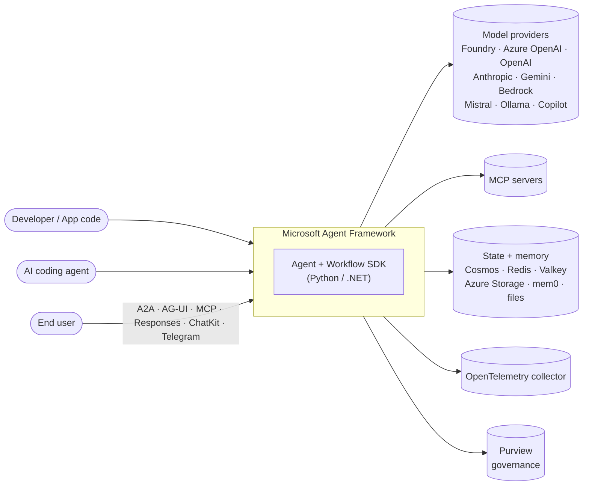

MAF sits between application code and model providers. Its distinguishing move is that the
**inbound** edge is also a protocol surface: an agent built with MAF can itself be *served* as an
A2A agent, an MCP tool, an OpenAI-Responses endpoint, or an AG-UI stream — so an agent is both a
consumer and a provider of the agent ecosystem.

---

## 3. High-Level Structure — C4 Level 2

The repo is a two-language mirror: nearly every concept exists in both trees under parallel names.

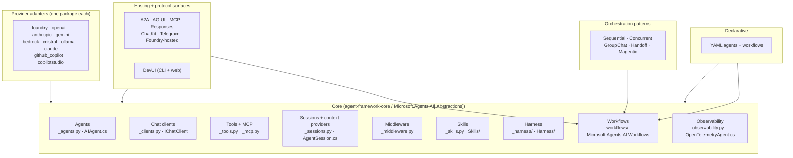

### Path map

| Path | Responsibility |
|---|---|
| `python/packages/core/agent_framework/` | The whole core: agents, clients, tools, sessions, middleware, skills, harness, workflows, telemetry |
| `python/packages/core/agent_framework/_workflows/` | Graph engine — `Executor`, `Edge`, `Runner`, checkpointing, events, validation, viz |
| `python/packages/core/agent_framework/_harness/` | "Batteries-included" coding-agent organs: todo, memory, file access, mode, background agents, tool approval, loop |
| `python/packages/orchestrations/agent_framework_orchestrations/` | `SequentialBuilder`, `ConcurrentBuilder`, `GroupChatBuilder`, `HandoffBuilder`, `MagenticBuilder` |
| `python/packages/{foundry,openai,anthropic,gemini,bedrock,mistral,ollama,…}/` | One provider adapter per package |
| `python/packages/{a2a,ag-ui,chatkit,hosting-*}/` | Protocol conversion helpers (deliberately *not* servers — see §7) |
| `python/packages/devui/` | Discovery-based dev server + React frontend |
| `python/packages/lab/` | Experimental: benchmarking, RL, research |
| `dotnet/src/Microsoft.Agents.AI.Abstractions/` | `AIAgent`, `AgentSession`, `AgentResponse`, `AIContextProvider`, `ChatHistoryProvider` |
| `dotnet/src/Microsoft.Agents.AI/` | `ChatClientAgent`, `AIAgentBuilder`, decorators, Harness, Skills, Memory, Compaction, Evaluation |
| `dotnet/src/Microsoft.Agents.AI.Workflows/` | Graph engine + `AgentWorkflowBuilder`, `ConcurrentWorkflowBuilder`, `GroupChatWorkflowBuilder`, `HandoffWorkflowBuilder` |
| `dotnet/src/Microsoft.Agents.AI.Hosting*/` | DI registration (`AddAIAgent`), session stores, ASP.NET endpoints |
| `docs/decisions/` | 40+ ADRs — the design rationale of record |

---

## 4. Components — inside the core package

The core is one Python package that layers a single agent object.

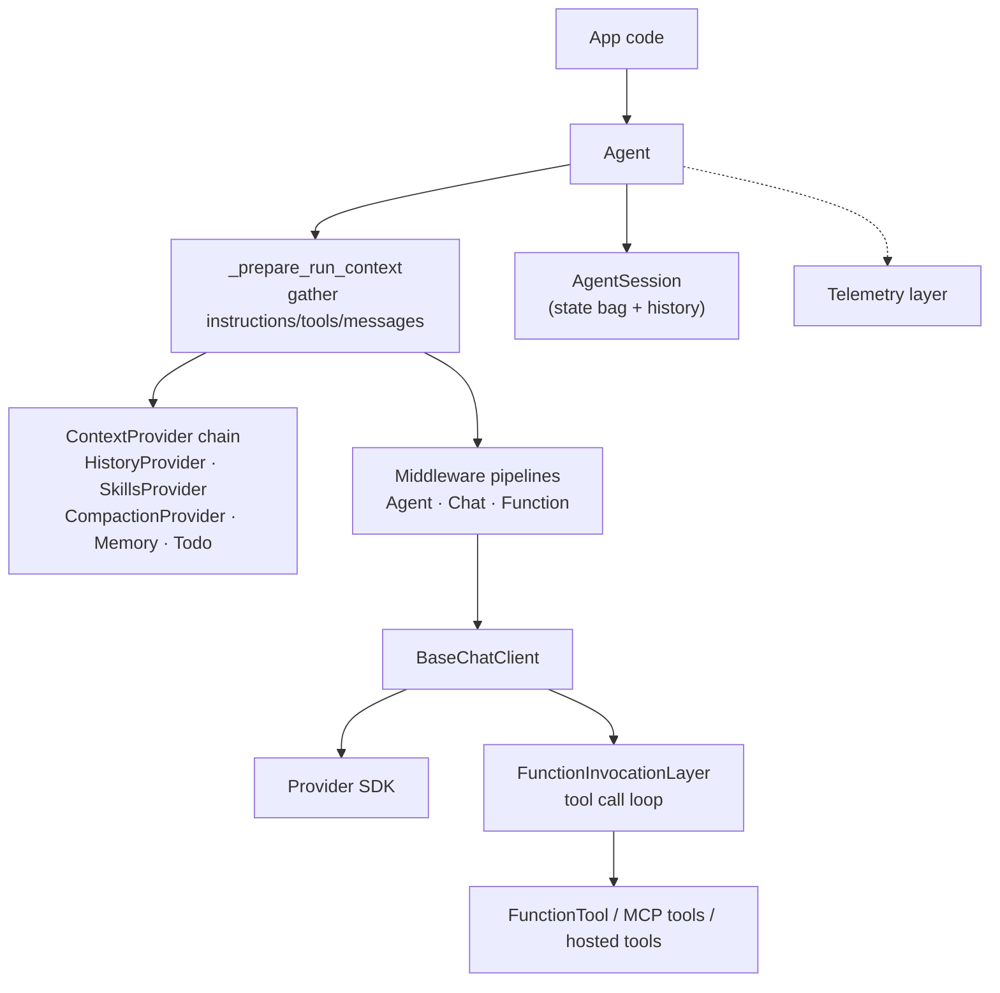

### The layer stack

`Agent` is not one class — it is a **mixin stack** assembled in `_agents.py:1786`:

```python
class Agent(AgentMiddlewareLayer, AgentTelemetryLayer, RawAgent[OptionsCoT]):
```

`BaseAgent` (`_agents.py:374`) holds the minimum: identity, `create_session`, `as_tool`.
`RawAgent` (`_agents.py:730`) adds the chat-client run loop. `Agent` wraps that in middleware and
OpenTelemetry. The same stacking appears on the client side — `ChatTelemetryLayer` and
`FunctionInvocationLayer` decorate `BaseChatClient`.

.NET reaches the same result with **decorators instead of mixins**: `DelegatingAIAgent`
(`Abstractions/DelegatingAIAgent.cs:28`) is the base decorator, and `AIAgentBuilder.Use(...)`
composes `LoggingAgent`, `OpenTelemetryAgent`, `FunctionInvocationDelegatingAgent`, and
`AnonymousDelegatingAIAgent` around a `ChatClientAgent`. This is the `IChatClient`/`ILogger`
middleware idiom carried up one level.

### Workflow engine components

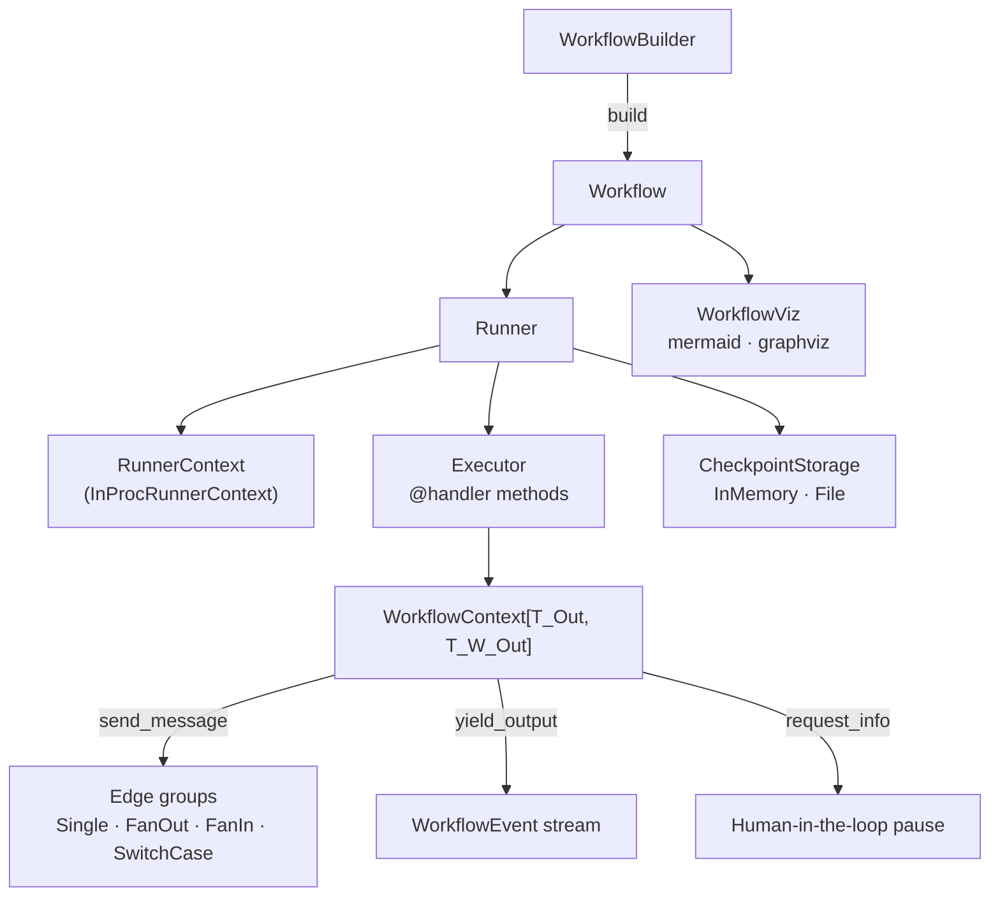

The engine is a **typed, superstep-based message-passing graph**. Type compatibility across edges is
validated at build time (`_validation.py`: `TypeCompatibilityError`, `GraphConnectivityError`,
`EdgeDuplicationError`) — a workflow that would deadlock on types fails at `build()`, not at run.

---

## 5. OOP & Class Architecture

### 5.1 Agent hierarchy (Python, left) vs (.NET, right)

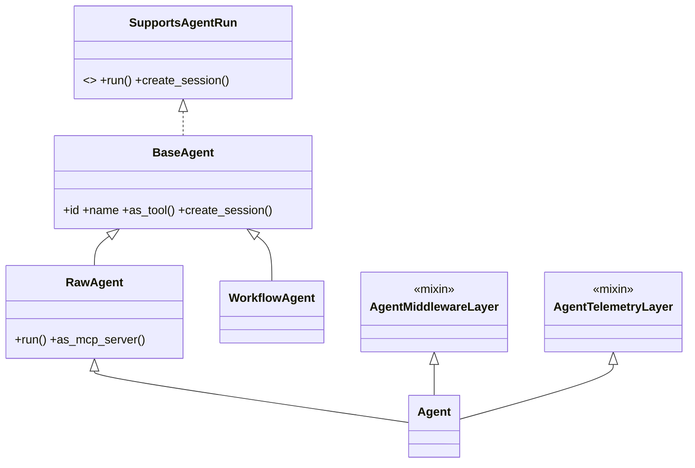

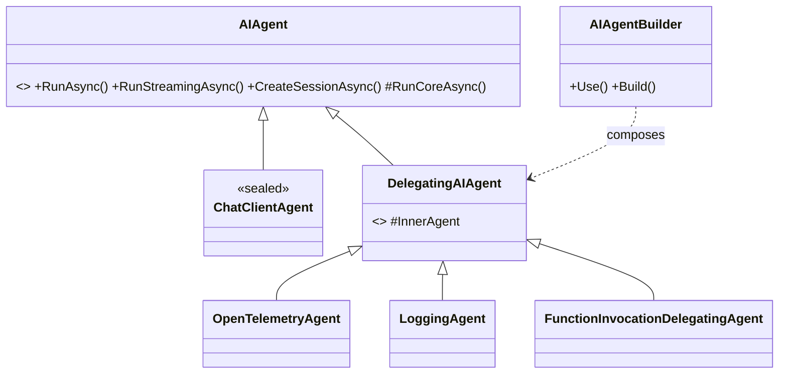

**Template Method throughout .NET**: every public `AIAgent` method is non-virtual and delegates to a
`protected abstract *Core` method (`RunCoreAsync`, `CreateSessionCoreAsync`,
`SerializeSessionCoreAsync`). Public overload fan-out is fixed in the base class; subclasses
implement exactly one thing. This is the deepest-module choice in the .NET tree — four public
`RunAsync` overloads, one abstract hook.

### 5.2 Context assembly — the Strategy/Chain that shapes every prompt

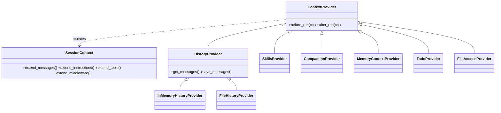

This is the single most important extension seam in the framework. A `ContextProvider` gets
`before_run`/`after_run` hooks and a `SessionContext` it can *extend* — with messages, instructions,
tools, **or middleware**. That last one matters: a provider can inject behavior, not just data. It is
how `SkillsProvider` adds skill-loading tools and `CompactionProvider` rewrites history mid-run.

.NET mirrors this with `AIContextProvider` / `MessageAIContextProvider` / `ChatHistoryProvider`
(`Abstractions/AIContextProvider.cs:42`, `ChatHistoryProvider.cs:51`).

### 5.3 Skills — a Composite over sources

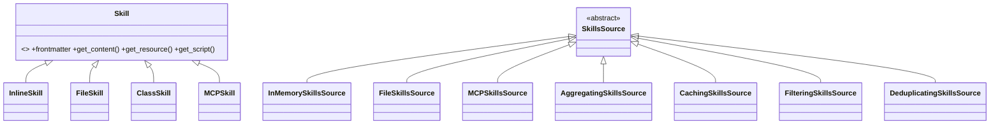

`AggregatingSkillsSource`, `CachingSkillsSource`, `FilteringSkillsSource`,
`DeduplicatingSkillsSource`, `DelegatingSkillsSource` are all *decorators over `SkillsSource`* — the
same shape as the agent decorators, applied to skill discovery. A skill carries frontmatter, content,
resources, and runnable scripts (`SkillScript` → `InlineSkillScript` / `FileSkillScript`), i.e.
progressive disclosure is a first-class type, not a convention.

### 5.4 Workflow types

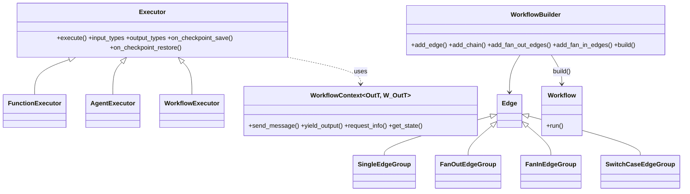

Two composition adapters make the Agent/Workflow duality closed under composition:

- `AgentExecutor` — puts an **agent inside a workflow node**.
- `WorkflowAgent` (`_workflows/_agent.py:52`) and `WorkflowExecutor` — expose a **workflow as an
  agent**, and nest **a workflow inside a workflow**.

So `Agent → Workflow → Agent` composes arbitrarily deep. That is the framework's structural thesis.

### 5.5 Patterns in use — named, located, and why

| Pattern | Where | Why |
|---|---|---|
| Template Method | `AIAgent.RunAsync` → `RunCoreAsync` (`Abstractions/AIAgent.cs:251,367`) | Overload fan-out lives once; subclass implements one hook |
| Decorator | `DelegatingAIAgent` + `AIAgentBuilder.Use` | Cross-cutting concerns (OTel, logging, function-calling) stack without inheritance |
| Mixin layering | `Agent(AgentMiddlewareLayer, AgentTelemetryLayer, RawAgent)` | Python analogue of the same stack |
| Builder | `WorkflowBuilder`, `AIAgentBuilder`, `MagenticBuilder`, `AgentSkillsProviderBuilder` | Graph/pipeline validity checked at `build()` |
| Strategy | `CompactionStrategy` (Sliding/Summarization/Truncation/TokenBudget…) | Context-window policy swapped without touching the agent |
| Chain of Responsibility | `AgentMiddlewarePipeline`, `ChatMiddlewarePipeline`, `FunctionMiddlewarePipeline` | `call_next` interception at three altitudes |
| Composite + Decorator | `SkillsSource` family | Skill discovery from many origins, cached/filtered/deduped |
| Adapter | `AgentExecutor`, `WorkflowAgent`, `WorkflowExecutor`, `hosting-*` converters | Bridges Agent↔Workflow and MAF↔wire protocols |
| Protocol/structural typing | `SupportsAgentRun`, `SupportsChatGetResponse`, `SupportsWebSearchTool`, `SupportsMCPTool`… | Capability discovery without a class hierarchy — see §7 |
| Memento | `WorkflowCheckpoint` + `on_checkpoint_save`/`on_checkpoint_restore` | Time-travel and resume |

---

## 6. Key Flows

### 6.1 A single agent run with a tool call

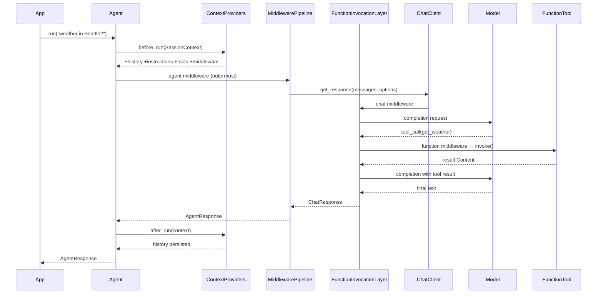

Note where the tool loop lives: **inside the chat-client layer**, not in the agent. That is why
`RawAgent` (no middleware/telemetry) still calls tools, and why the .NET side can express the same
thing as a `FunctionInvocationDelegatingAgent` decorator or as an `IChatClient` decorator
(`InvocableFunctionBypassingChatClient`, `ApprovalNotRequiredFunctionBypassingChatClient`).

### 6.2 Workflow run with human-in-the-loop and checkpoint

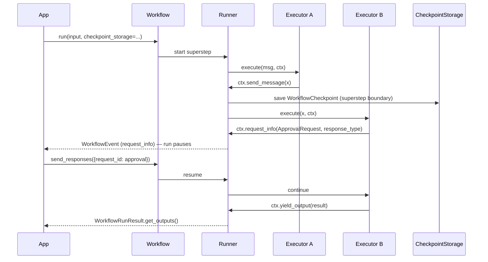

`ctx.request_info(...)` is the human-in-the-loop primitive: an executor suspends the graph, the run
surfaces a typed request event, and the app resumes by id. Combined with `CheckpointStorage`, the
pause can outlive the process — that is the "durable / restartable" claim in the README made concrete.

### 6.3 Serving an agent over a protocol

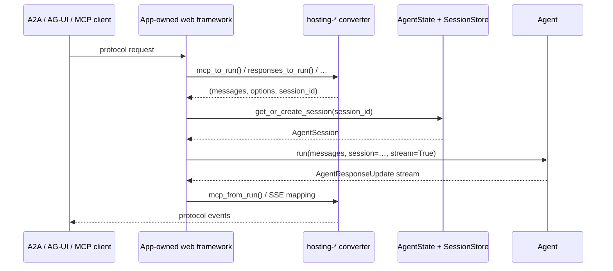

The Python hosting packages are **conversion helpers, not servers** — an explicit design stance
stated in `python/packages/hosting-a2a/README.md` ("It does not provide an `AgentExecutor`, task
lifecycle, event queue, task store, routes, session policy, authentication, or deployment"). The app
keeps routing, auth, and lifecycle. .NET takes the opposite stance and ships real endpoints
(`Microsoft.Agents.AI.Hosting.A2A.AspNetCore`, `…Hosting.AGUI.AspNetCore`) because ASP.NET Core gives
it a single obvious host.

---

## 7. Extension Points

Ranked roughly by how often you would reach for them.

1. **Tools** — `@tool` decorator (Python) / `AIFunctionFactory.Create` (.NET). Pydantic `Annotated`
   fields become the JSON schema. `approval_mode` is per-tool.
2. **Context providers** — subclass `ContextProvider` / `AIContextProvider`; the richest seam,
   since it can inject messages, instructions, tools, *and* middleware.
3. **Middleware at three altitudes** — `@agent_middleware` (whole run), `@chat_middleware` (each
   model call), `@function_middleware` (each tool call). All are `(context, call_next)` — terminate
   by not calling `call_next`, or raise `MiddlewareTermination`.
4. **Chat clients** — subclass `BaseChatClient` and implement `_inner_get_response`; you inherit
   telemetry, the function-calling loop, and compaction for free. Adding a provider is a package,
   not a core change.
5. **Capability protocols** — implement `SupportsWebSearchTool`, `SupportsCodeInterpreterTool`,
   `SupportsMCPTool`, `SupportsShellTool`, `SupportsFileSearchTool`, `SupportsImageGenerationTool`
   to advertise hosted-tool support. Structural, not nominal: no base class to inherit, and callers
   feature-detect rather than version-check.
6. **Workflow executors** — subclass `Executor` with `@handler`, or decorate a function with
   `@executor`. Handler signatures are the type contract; the builder validates the graph.
7. **Skills sources** — implement `SkillsSource`, or wrap an existing one with the caching /
   filtering / aggregating decorators.
8. **Session & checkpoint storage** — implement `SessionStore`, `HistoryProvider`, or
   `CheckpointStorage`; ship-in-the-box backends live in `azure-cosmos`, `redis`, `mem0`,
   `Microsoft.Agents.AI.CosmosNoSql`, `…Valkey`, `…Hosting.AzureStorage`.
9. **Compaction strategies** — implement `CompactionStrategy` for context-window policy.
10. **Declarative YAML** — `kind: Prompt` agents and `kind: Workflow` graphs, no code change.

Two more, less obvious:

- **`agent.as_tool()` / `AsAIFunction()`** — turn an agent into a tool of another agent. Sub-agents
  without an orchestration framework.
- **`agent.as_mcp_server()`** — expose an agent as an MCP server, so any MCP client (including other
  agents) can call it.

---

## 8. Key Abstractions / Glossary

| Term | Meaning |
|---|---|
| **Agent** | An LLM-driven actor. `Agent` (Python) / `AIAgent` (.NET). Model decides control flow. |
| **Chat client** | Provider adapter. `BaseChatClient` (Python) / `IChatClient` (from `Microsoft.Extensions.AI`). |
| **AgentSession** | Per-conversation handle: history + a typed state bag. Serializable → resumable. |
| **ContextProvider** | `before_run`/`after_run` hook that extends the run's messages, instructions, tools, or middleware. |
| **HistoryProvider** | A `ContextProvider` specialized to load/save conversation history. |
| **SessionContext** | The mutable object a provider extends during context assembly. |
| **Middleware** | `(context, call_next)` interceptor at agent, chat, or function altitude. |
| **FunctionTool** | A Python callable + generated JSON schema + approval policy. |
| **Skill** | Named unit of domain knowledge: frontmatter + content + resources + runnable scripts. |
| **Harness** | Pre-wired coding-agent organs: todo, memory, file access, mode, background agents, tool approval, iteration loop. |
| **Workflow** | Typed graph of executors. Developer decides control flow. |
| **Executor** | A workflow node; `@handler` methods define its typed inputs/outputs. |
| **WorkflowContext[T_Out, T_W_Out]** | A node's capability token — `send_message` (T_Out), `yield_output` (T_W_Out), `request_info`, state. |
| **Edge group** | Single / FanOut / FanIn / SwitchCase / MultiSelection routing. |
| **Checkpoint** | `WorkflowCheckpoint` at a superstep boundary; enables resume and time-travel. |
| **request_info** | Typed suspend-and-ask primitive — the human-in-the-loop seam. |
| **Orchestration** | A prebuilt workflow shape: Sequential, Concurrent, GroupChat, Handoff, Magentic. |
| **Magentic** | Manager-led open-ended orchestration with a task ledger + progress ledger (from Magentic-One). |
| **Compaction** | Strategy-driven context-window management (sliding window, summarization, tool-result pruning). |
| **DevUI** | Sample dev server + web UI that discovers agents/workflows from a directory. Explicitly not for production. |
| **Declarative agent** | YAML `kind: Prompt` / `kind: Workflow` definition. |

---

## 9. Open Questions & Notes

**Determined from evidence, worth flagging:**

- **Two hosting philosophies.** Python ships conversion helpers and refuses to own routing/auth
  (`hosting-a2a`, `hosting-mcp`, `hosting-responses`, `hosting-telegram` READMEs all say so
  explicitly). .NET ships ASP.NET Core endpoints. Cross-language parity is at the *primitive* level,
  not the *hosting* level — a portability caveat for anyone planning a two-language deployment.
- **The ADRs are the real design record.** `docs/decisions/` holds 40+ architecture decision records
  — far more rationale than this walkthrough captures. Read
  `docs/decisions/0021-agent-skills-design.md`, `0016-structured-output.md`, and
  `0007-agent-filtering-middleware.md` before changing those subsystems.
- **Feature-usage telemetry.** `FeatureIndex` / `FeatureUsage` exist in both trees and encode a
  bitmask into the user-agent string (`docs/decisions/0033-feature-usage-bitmask-user-agent.md`,
  `docs/specs/feature-usage-bit-registry.md`). Worth knowing before shipping to a
  telemetry-sensitive environment; `USER_AGENT_TELEMETRY_DISABLED_ENV_VAR` is the off switch.
- **Experimental surface is marked, not hidden.** `ExperimentalFeature` / `ReleaseCandidateFeature`
  (`_feature_stage.py`) emit warnings at use. The harness, skills, and evaluation subsystems are all
  behind these markers — treat their APIs as unstable.

**Not determined:**

- **Runtime performance characteristics** — no benchmark results were read. `python/packages/lab/`
  contains benchmarking machinery but was not executed.
- **Which orchestration is production-recommended** — the repo presents Sequential, Concurrent,
  GroupChat, Handoff, and Magentic as peers without a selection rubric. Magentic is documented as
  the most open-ended and therefore the least predictable.
- **Go parity** — `go/` contains only a `README.md` pointer; the Go SDK is a separate
  repo (`microsoft/agent-framework-go`) and its feature coverage was not assessed.
- **Version/stability of the public API** — packages are published pre-release
  (`pip install … --pre` in several READMEs). The exact stability contract per package was not
  established.
