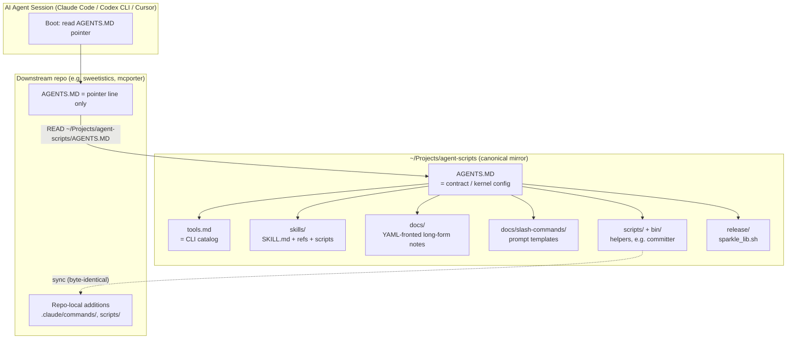
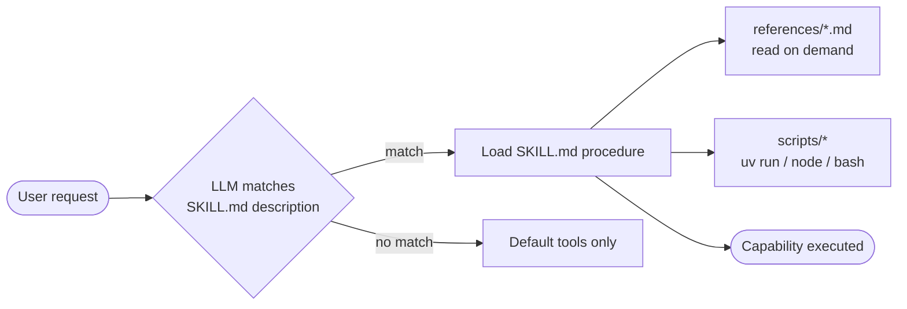
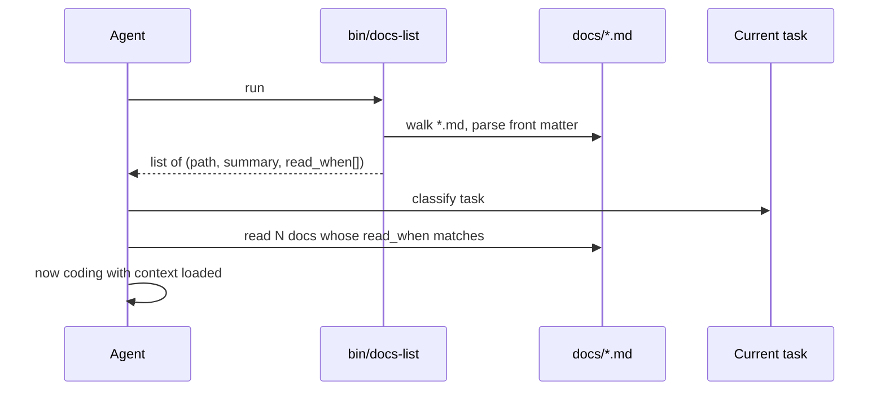
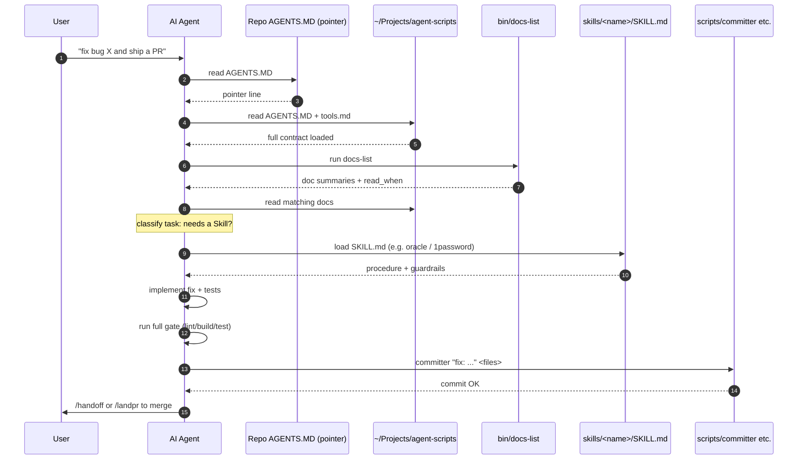

> Claude/Codex skills, shell scripts, slash commands, and small CLI helpers
> into a single, reproducible "agent operating system" that lives in
> `~/Projects/agent-scripts` and is mirrored into every other repo via a pointer.

---

## 1. The Big Picture

The repo is **not** a library or an app. It is a **canonical mirror** for the
guardrails, skills, prompts, and helper binaries that Peter's coding agents
(Claude Code, Codex CLI, Cursor) load on every session.

You can think of it as a tiny userland for AI agents:

- **`AGENTS.MD`** = the kernel / boot config — the contract every agent reads
  first.
- **`tools.md`** = the device driver list — every CLI the agent is allowed to
  call.
- **`skills/`** = the system extensions — opt-in capability bundles
  (procedure + reference docs + sometimes scripts).
- **`scripts/` + `bin/`** = the userland binaries — small, dependency-free
  helpers (`committer`, `docs-list`, `browser-tools`, `nanobanana`, ...).
- **`docs/`** + **`docs/slash-commands/`** = the man pages and "macros" — long-form
  references (with YAML front matter so they are machine-discoverable) and
  reusable prompt templates (`/handoff`, `/pickup`, `/landpr`, ...).
- **`release/`** = shared shell libraries reused by multiple Mac apps for
  release plumbing.



---

## 2. The Pointer-Style `AGENTS.MD`

The single most important architectural choice. Instead of duplicating the
guardrail prose across N repos and then watching them drift, every downstream
repo's `AGENTS.MD` is reduced to **one line**:

```text
READ ~/Projects/agent-scripts/AGENTS.MD BEFORE ANYTHING (skip if missing).
```

Repo-specific rules go *after* that line. The full text lives in **exactly
two places** (kept in sync manually):

1. `~/Projects/agent-scripts/AGENTS.MD` — this repo.
2. `~/AGENTS.MD` — the user-global Codex copy.

### Why this matters
- **Single source of truth.** Edits propagate by re-read, not by copy.
- **Token-thrifty.** The "telegraph-style" tone (`AGENTS.MD` line 4:
  *"Work style: telegraph; noun-phrases ok; drop grammar; min tokens"*) is
  deliberate — these instructions are paid for, per-turn, in every session.
- **Submodules get the same treatment.** `Peekaboo/*` and others repeat the
  pointer inside the subrepo so nested agents still inherit the rules.

### What's inside `AGENTS.MD`
A compact, opinionated runbook covering:

- Agent identity / contact / workspace (`~/Projects`).
- Git policy (safe by default; no destructive ops without consent; commit
  helper required).
- Build/test policy ("run full gate before handoff").
- Tool catalog references (`tools.md`, plus inline notes on `bird`, `sonos`,
  `peekaboo`, `oracle`, `gh`, `committer`, `trash`, `xcp`, `xcodegen`, `lldb`,
  `axe`, `mcporter`, `tmux`, ...).
- Slash command locations (`~/.codex/prompts/` + repo-local mirrors).
- Frontend aesthetic rules.
- Screenshot workflow.
- Where private notes/runbooks live (`~/Projects/manager/docs/`).

---

## 3. Skills — Opt-in Capability Bundles

Each subdirectory of `skills/` is a self-contained capability the agent can
load on demand. Every skill has the same shape:

```text
skills/<name>/
├── SKILL.md           # YAML front matter + procedure
├── references/        # Long-form notes the agent can read on demand
├── scripts/           # Optional executable helpers (Python/JS/Shell)
├── agents/            # Optional per-host agent manifests (yaml)
└── config/            # Optional defaults (JSON)
```

The `SKILL.md` front matter is the **trigger contract**:

```yaml
---
name: 1password
description: >
  Set up and use 1Password CLI (op). Use when installing the CLI, enabling
  desktop app integration, signing in (single or multi-account), or
  reading/injecting/running secrets via op.
metadata:
  clawdbot:
    emoji: "🔐"
    requires: { bins: ["op"] }
    install:
      - { id: brew, kind: brew, formula: 1password-cli, bins: [op] }
---
```

The `description` is what the LLM matches against the user request to decide
"do I need this skill?". `metadata.clawdbot` is consumed by Peter's
clawdbot/openclaw runtime for install hints.

### Skill taxonomy in this repo

| Category | Skills |
|---|---|
| Secrets / accounts | `1password` |
| Web search & extraction | `brave-search` |
| Image generation | `nano-banana-pro`, `openai-image-gen` |
| Domain ops | `domain-dns-ops`, `xurl` |
| Discord / chat archive | `discord-clawd`, `openclaw-relay` |
| Apple / Swift development | `swift-concurrency-expert`, `swiftui-liquid-glass`, `swiftui-performance-audit`, `swiftui-view-refactor`, `native-app-performance`, `instruments-profiling` |
| Meta / cross-cutting | `oracle` (2nd-model review), `create-cli`, `frontend-design`, `markdown-converter`, `video-transcript-downloader` |



### Design conventions seen across skills
- **Procedure first, prose second.** Most skills begin with a numbered
  "Workflow" or "Golden path".
- **Guardrails block.** Recurring suffix listing what *not* to do
  (e.g. `1password`: never paste secrets, run `op` only inside tmux).
- **Failure handling block.** `openclaw-relay`'s "if relay work fails: run
  `doctor`, `status`, `show`..." pattern shows up repeatedly.
- **Defaults via env vars.** Skills avoid baked-in personal paths; they list
  the env vars to override (`OPENCLAW_RELAY_TRANSPORT`, `ORACLE_HOME_DIR`...).

---

## 4. Scripts — Tiny, Dependency-Free Helpers

These are *not* skills. They are the small Unix-style binaries that the agent
reaches for many times per session, and they are explicitly forbidden from
acquiring shared dependencies (per `README.md`: "Keep every file
dependency-free and portable... do not add `tsconfig` path aliases, shared
source folders, or any other Sweetistics-specific imports").

| Script | Purpose |
|---|---|
| `scripts/committer` | Bash. Stages **only the files you list** (rejects `.`), enforces a non-empty message, then commits. Auto-recovers stale `.git/index.lock` with `--force`. The single allowed commit pathway. |
| `scripts/docs-list.ts` | TSX. Walks `docs/`, requires every Markdown file to have YAML front matter with `summary:` and `read_when:`, prints a one-line summary per doc. Compiled to `bin/docs-list` via `bun build`. |
| `scripts/browser-tools.ts` | TSX → `bin/browser-tools`. Standalone Chrome helper inspired by Mario Zechner's "What if you don't need MCP?". Cmds: `start`, `nav`, `eval`, `screenshot`, `pick`, `cookies`, `inspect`, `kill`, `console`, `search`, `content`. |
| `scripts/nanobanana` | Single-file `uv run --script` Python; calls Gemini 2.5 Flash Image. |
| `scripts/shazam-song` | Small shell helper. |
| `scripts/trash.ts` | Historical (removed 2025-12-22 per CHANGELOG); now the agent uses the system `trash` command directly. |

### Why "no shared library"?
Portability. These scripts get copy-pasted into other repos and must work
without dragging in `tsconfig`, `package.json` paths, or workspace setup.
Inline tiny helpers, duplicate the minimum code needed.

---

## 5. Docs With Front Matter (the man-page system)

Every Markdown file under `docs/` opens with YAML front matter the
`docs-list` script enforces:

```yaml
---
summary: 'Codex handoff checklist for agents.'
read_when:
  - Creating a /handoff prompt or refining handoff format.
---
```

The pattern at session start (codified in `AGENTS.MD`):

1. Run `bin/docs-list` (or `pnpm run docs:list`).
2. Read the printed `summary`s.
3. If a `read_when:` hint matches the task, open that file before coding.



This is the closest thing this repo has to a "retrieval" layer — but it's
just front-matter + filesystem walk + grep-by-LLM. No vector store, no index.

---

## 6. Slash Commands — Reusable Prompt Templates

Two locations:

- **Global**: `~/.codex/prompts/*.md` (used by Codex CLI when the user types
  `/handoff`, etc.).
- **Repo-local mirror**: `docs/slash-commands/*.md` (so edits are reviewable
  and version-controlled).

The repo ships seven canonical commands:

| Command | What it does |
|---|---|
| `/handoff` | Package current state for the next agent: git status, branch/PR, running tmux sessions with attach commands, what's pending, blockers, next steps. |
| `/pickup` | Inverse of handoff — rehydrate context when starting work. |
| `/landpr` | Land a PR end-to-end: temp-branch rebase → full gate (lint/build/test) → commit via `committer` → `gh pr merge --rebase` → verify GitHub state == `MERGED` (never `CLOSED`). |
| `/acceptpr` | Lighter merge flow with changelog + thanks. |
| `/fixissue` | Fix an issue end-to-end: tests → changelog → commit → push → comment → close. |
| `/raise` | Open the next `Unreleased` section in CHANGELOG. |
| `/sectriage` | GHSA security advisory triage end-to-end. |

Slash commands are pure Markdown — when the agent receives `/handoff`, it
reads the file and follows the recipe. No DSL, no executor: just prompt
inheritance.

---

## 7. Release Helpers (`release/`)

`release/sparkle_lib.sh` is a shared Bash library that multiple Mac apps
(CodexBar, Trimmy, RepoBar) source for Sparkle (auto-updater) releases:

- `require_clean_worktree` — abort if `git status` is dirty.
- `clean_key` — validate the ed25519 Sparkle key is a single base64 line.
- changelog finalization, appcast monotonicity guards, etc.

This is the only place in the repo with shared library code — and it's only
shared via `source path/to/sparkle_lib.sh`, not via packaging.

---

## 8. How It All Wires Together at Runtime



---

## 9. Why this is "OS-like"

A useful frame for understanding Peter's setup:

| OS concept | `agent-scripts` analog |
|---|---|
| Kernel | `AGENTS.MD` (the contract every process inherits) |
| `/etc` | `tools.md`, slash-command files, doc front matter |
| `/usr/bin` | `scripts/` and `bin/` |
| Loadable kernel modules | `skills/<name>/` (loaded on demand by description match) |
| Shell aliases / functions | Slash commands (`/handoff`, `/landpr`) |
| System libraries | `release/sparkle_lib.sh` (the rare shared lib) |
| Process boot sequence | `READ AGENTS.MD` → run `docs-list` → load matching docs → load matching skills → work |
| `dotfiles` distribution | Pointer-style `AGENTS.MD` in every repo |

The cleverness is mostly in the **discipline**, not the code:

- Front matter is mandatory and machine-checked.
- Helpers refuse the unsafe defaults (`committer` rejects `.` as a path;
  `op` is only allowed inside `tmux`).
- Every shared file is byte-identical across repos by *manual* sync — there
  is no automated package, on purpose, because portability beats elegance.

---

## 10. Adoption Plan for Your Machine

Below is a pragmatic, low-risk path to adapt this for your radiology /
medical AI workflow on macOS + zsh. You don't need to copy everything; pick
the layers that actually pay rent.

### Phase 1 — Foundations (1–2 hrs)

1. **Create your canonical repo**:
   ```bash
   mkdir -p ~/Projects/agent-scripts && cd ~/Projects/agent-scripts
   git init
   ```
2. **Write your own `AGENTS.MD`** (or symlink to `CLAUDE.md` per your CLAUDE.md
   convention). Keep it telegraph-style. Cover: your role, workspace, git
   policy, full-gate definition, scratchpad rules (you already have
   `_playground/` conventions — encode them here).
3. **Adopt the pointer**: in each downstream repo's `AGENTS.MD` /
   `CLAUDE.md`, put one line at the top:
   ```text
   READ ~/Projects/agent-scripts/AGENTS.MD BEFORE ANYTHING (skip if missing).
   ```
4. **Copy `scripts/committer`** to `~/Projects/agent-scripts/scripts/` and
   add `~/Projects/agent-scripts/scripts` to your `PATH`. It is the single
   highest-leverage helper.

### Phase 2 — Doc front matter + listing (1 hr)

5. Copy `scripts/docs-list.ts` (or rewrite as a 30-line Python script — your
   stack preference). Adapt the `DOCS_DIR` to your project's docs root.
6. Start adding `summary:` + `read_when:` front matter to your existing docs
   under each project's `_docs/`. Run the lister; it will fail on
   missing front matter — that's the point.

### Phase 3 — Slash commands (30 min, then ongoing)

7. Make `~/.claude/commands/` (or `~/.codex/prompts/`) and mirror them into
   `~/Projects/agent-scripts/docs/slash-commands/`.
8. Port `/handoff` and `/pickup` first; they have the highest payoff. Adapt
   `/landpr` later if you do PR work routinely.

### Phase 4 — Skills (incremental)

9. Pick **one** domain capability you currently re-explain to the agent
   often. Examples for you, given your CLAUDE.md:
   - `orthanc-ops` — your Orthanc DICOM REST workflows (you already have
     `orthanc-api` skill from the system).
   - `radiology-anon` — anonymization rules for fixtures in `_playground/`.
   - `quarto-render` — your Quarto rendering conventions.
   - `dicom-dimse-review` — wrap your existing `dicom-dimse-tx-reviewer`
     agent as a repo-portable skill.
10. Structure each as `skills/<name>/SKILL.md` + `references/` + optional
    `scripts/`. Use YAML front matter with `name:` and a clear `description:`
    that the LLM can match against user prompts.

### Phase 5 — Helpers (as needed)

11. Port `bin/docs-list` (or your rewrite) as a compiled or `uv run --script`
    binary so it's instant.
12. Skip `browser-tools.ts` unless you actually use DevTools-driven Chrome
    automation. If you do, the `uv run`-style single-file Python approach
    you already prefer is simpler than the Bun build.

### Phase 6 — Sync discipline

13. Decide once: **manual sync** (steipete's choice) or **submodule**.
    Manual sync is simpler and survives offline; submodules guarantee
    byte-identity but add ceremony. Given your `_playground/` discipline,
    manual sync should suit you fine.

### Things to **not** copy verbatim
- `release/sparkle_lib.sh` — only useful if you ship signed Mac apps.
- Steipete's specific path constants (`~/Projects/manager`, Sonos/Discord
  setups, `mac-studio` SSH host) — these are personal infra.
- `openclaw-relay`, `discord-clawd`, `sweetistics`, `bird` — proprietary
  to his workflow.
- The "no shared library" rule is *strong*. Don't introduce a `lib/` even if
  you're tempted; the duplicate-and-sync model is what makes the scripts
  portable across your `_playground/`-style sessions.

---

## 11. Risks / Things to Watch

- **Drift.** Manual sync means files *will* drift unless `/sync agent-scripts`
  becomes a regular ritual. Add a `make sync` or shell function early.
- **Front-matter bit-rot.** If `read_when:` hints lie, the agent will skip
  the right doc. Treat the docs-list output as a test, not a comment.
- **Skill overload.** Every skill adds tokens to the LLM's matching set.
  Keep `description:` lines tight and specific; delete unused skills.
- **Secrets.** Several skills (`1password`, `discord-clawd`) demand
  `tmux`-only execution to avoid leaks. Replicate that discipline if you
  port them; do not weaken it.

---

## 12. TL;DR

`agent-scripts` is a portable, file-based "agent userland":

- **One contract** (`AGENTS.MD`) every agent must read.
- **One catalog** (`tools.md`) of allowed CLIs.
- **Many small skills** (`skills/<name>/SKILL.md`) loaded by LLM description
  match.
- **Many tiny scripts** (`scripts/`, `bin/`) — dependency-free on purpose.
- **Front-matter docs** that the agent discovers via `docs-list`.
- **Slash-command prompt templates** for repeated workflows.
- **Pointer-style propagation** across every repo so the contract stays
  byte-identical without packaging.

The cleverness is in the discipline (telegraph prose, machine-checked front
matter, opinionated helpers that refuse unsafe defaults), not in any
framework. That's why it's a good fit for adapting to a personal workflow
like yours — you can adopt one layer at a time, and each layer pays for
itself before you commit to the next.
