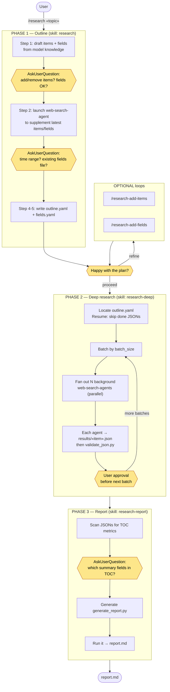
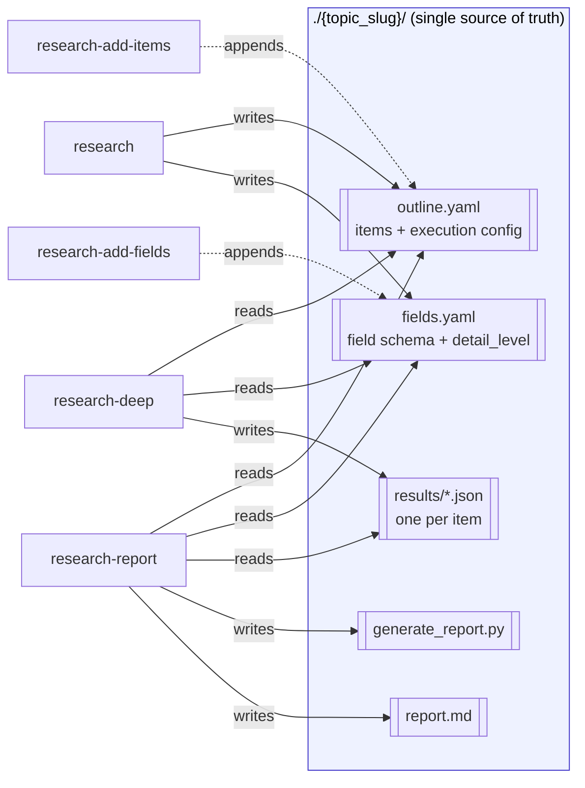
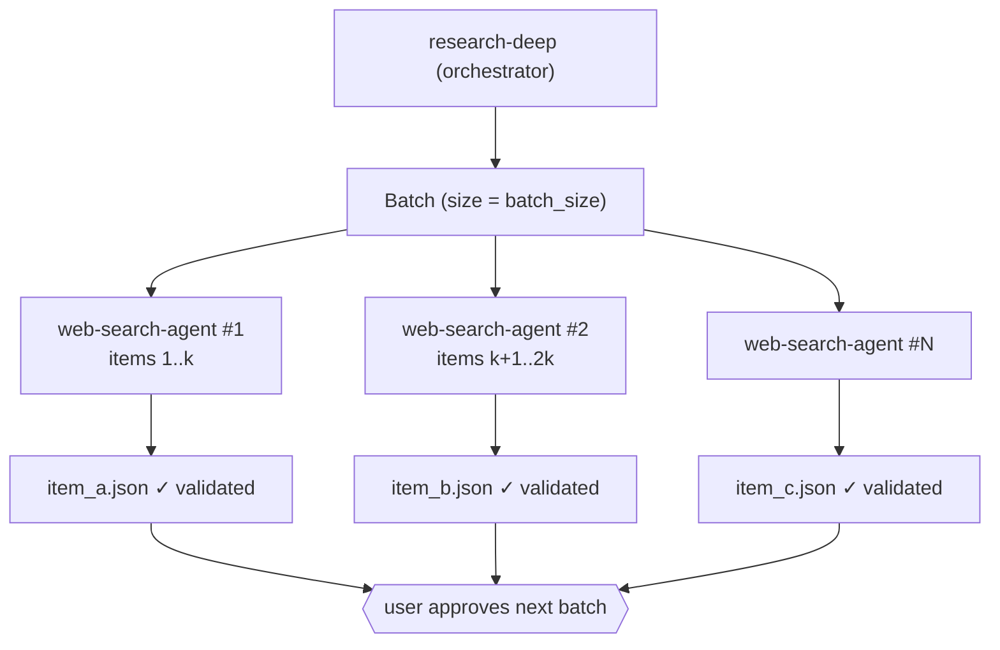
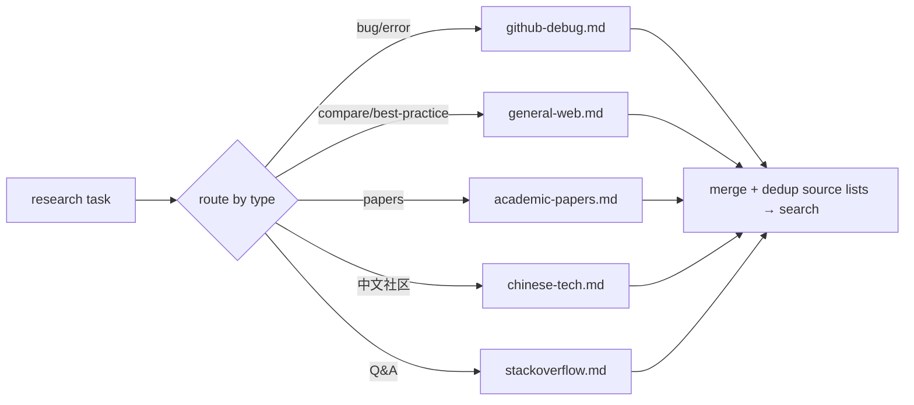

> Reverse-engineered from the repo. Reads the system from two angles:
> **UX** (the human driving the workflow) and **AX** (the agent experience —
> how the orchestrating model and its sub-agents are engineered to behave).
>
> *Inspired by [RhinoInsight](https://arxiv.org/abs/2511.18743): improving deep
> research through **control mechanisms** for model behavior and context.*

---

## 1. What this repo actually is

It is **not** an application. There is no server, no runtime, no package. It is a
**bundle of prompt-engineering artifacts** — Markdown skills, Markdown/TOML agent
definitions, and one small Python validator — that you copy into an AI coding
harness (Claude Code, OpenCode, or Codex). The harness *is* the runtime; this repo
reprograms its behavior into a structured, human-gated research pipeline.

```
Deep-Research-skills/
├── skills/                         # WHAT to do — orchestrator workflows
│   ├── research-en/  research-zh/          → Claude Code + OpenCode
│   └── research-codex-en/ research-codex-zh/ → Codex
│       └── (each set = 5 skills)
│           ├── research/            + validate_json.py
│           ├── research-add-items/
│           ├── research-add-fields/
│           ├── research-deep/
│           └── research-report/
├── agents/                         # HOW to search — the reasoning worker
│   ├── web-search-agent.md              (Claude, model: opus)
│   ├── web-search-opencode.md           (OpenCode, gpt-5.4)
│   └── web-search-modules/*.md          (5 pluggable search strategies)
├── agents-codex/
│   ├── web-researcher.toml              (Codex, gpt-5.4, sandbox read-only)
│   └── web-search-modules/*.md
└── scripts/install-codex.sh
```

**Four skill sets** = 2 languages (en/zh) × 2 harness families (Claude+OpenCode
share one format / Codex needs its own). The *logic is identical* across them; only
file paths (`~/.claude` vs `~/.codex`) and agent-invocation syntax differ.

---

## 2. The core architectural idea

The whole system is one pattern, applied repeatedly:

> **Deterministic orchestrator (skill) + reasoning worker (sub-agent), with the
> human as a gate between every phase, and the filesystem as the only shared state.**

This maps directly onto your "decide where the intelligence lives" principle:

| Layer | Role | Intelligence? | Artifact |
|-------|------|---------------|----------|
| **Skill** | Orchestration: locate files, template prompts, fan out, gate on the user, validate | Low — mostly deterministic control flow | `SKILL.md` |
| **Sub-agent** | The actual web research & synthesis | High — this is the LLM "feature" | `web-search-agent.md` + modules |
| **Validator** | Completion contract | Zero — pure Python | `validate_json.py` |
| **Human** | Approves the plan and each batch | The taste that can't be delegated | `AskUserQuestion` |

The skill is the **deterministic shell**; the sub-agent is the **LLM core behind a
stable I/O contract** (structured prompt in → JSON file out → validation gate). This
is exactly the human+AI collaboration design your CLAUDE.md advocates.

---

## 3. The three-phase pipeline (UX flow)



Yellow = **human-in-the-loop gate**. Notice there is a gate at *every* phase
boundary — the design never runs more than one autonomous step without checking
back. That is the "control mechanism" thesis made concrete.

### User's mental model
The user only ever types five slash commands and answers multiple-choice questions.
They never touch YAML/JSON by hand (though they *can* — it's all on disk). The
promised UX from the README:

> *"Tell it your topic → it creates a research list → AI searches each item → all
> data → one organized report."*

---

## 4. State lives on disk — the loose-coupling backbone

Skills don't call each other. They **rendezvous through files** in a
`./{topic_slug}/` directory. Each skill re-discovers state by globbing
`*/outline.yaml`. This makes every phase independently resumable and re-runnable.



**Why this is good AX:** the contract between phases is *inspectable files*, not
hidden conversation state. A forgetful, text-only agent can pick up mid-pipeline by
reading `outline.yaml` — no memory of the earlier turn required. It also makes the
system crash-safe and human-auditable (you can hand-edit any YAML between phases).

- `outline.yaml` → `items` list + `execution: {batch_size, items_per_agent, output_dir}`
- `fields.yaml` → `field_categories` with per-field `name`, `description`,
  `detail_level` (brief → moderate → detailed), plus a reserved `uncertain` list.

---

## 5. AX: how the agent is engineered

This is where the interesting design lives. Five deliberate techniques:

### 5.1 Orchestrator ⇄ worker fan-out with context isolation
`research-deep` doesn't research anything itself. It spawns **N background
`web-search-agent` sub-agents in parallel**, one handling `items_per_agent` items,
`batch_size` agents per batch.



Each item is researched in a **fresh sub-agent context**. That is the key AX move:
the deep-research phase is inherently context-hungry (dozens of web pages per item),
and isolating each item prevents one item's context from polluting another's. The
orchestrator's own context stays tiny — it only ever sees *"item_x.json written,
validation passed."* This is why the skill explicitly says **"Task Output: Disabled"** —
the sub-agents communicate results via files, not by dumping tokens back up.

#### Conceptualizing `batch_size` vs `items_per_agent`

These two `execution:` knobs in `outline.yaml` slice and pace the fan-out. They are
easy to conflate, so pin the definitions down:

- **`items_per_agent`** — how many items **one** agent researches before it's done
  (its *workload*).
- **`batch_size`** — how many agents run **at the same time** before the pipeline
  pauses for your approval (the *fan-out width* and the unit of the human gate).

> **Items processed per wave = `batch_size × items_per_agent`.**
> **Number of waves = `ceil(total_items / (batch_size × items_per_agent))`** — i.e.
> how many times you'll be asked *"approve next batch?"*

**Kitchen analogy.** Picture a research kitchen:
`agent = one cook` · `items_per_agent = dishes each cook makes` ·
`batch_size = cooks on the line at once` · after each seating (batch) the *head chef
(you)* inspects and says "send the next wave."

**Worked example — researching "AI Coding Assistants 2025":** `/research` produced an
outline of **20 items** (Copilot, Cursor, Windsurf, Cline, Aider, …), each needing the
same **15 fields**. Three ways to tune the same 20 items:

| Tuning | `batch_size` | `items_per_agent` | Result | Trade-off |
|--------|:---:|:---:|--------|-----------|
| **A — wide & shallow** | 10 | 2 | 10×2 = 20 → **1 wave** | Fastest wall-clock, one approval at the end (little control), risks web-search rate limits with 10 agents at once |
| **B — balanced** *(sane default)* | 4 | 3 | 4×3 = 12 → **2 waves** (12, 8) | Inspect after wave 1, adjust before wave 2; good speed vs. oversight |
| **C — narrow & deep** | 2 | 1 | 1 item/agent → **10 waves** | Each agent pours its *whole context budget* into one item (deepest research), approve every pair — slowest, most controlled |

**The key intuition** — the two knobs pull on *different* constraints:

| Knob | Turn it **up** for… | Turn it **down** because… |
|------|---------------------|----------------------------|
| **`items_per_agent`** | efficiency — fewer agents, each reused across items | each item is complex/deep → one agent's context fills up and later items get sloppy |
| **`batch_size`** | speed — more parallelism, finish sooner | web-search rate limits, *and* you want a human checkpoint more often |

The trap is thinking "more items per agent = deeper research." It's the opposite:
**fewer items per agent = deeper *per item***, because that agent's limited context
isn't diluted across many items. `items_per_agent` trades depth for efficiency;
`batch_size` trades control/rate-safety for speed. Rule of thumb: **simple items** →
raise both (get done fast); **complex items** → drop `items_per_agent` to 1–2 and keep
`batch_size` small so you can eyeball quality between waves. (Note the name is
misleading — `batch_size` counts *agents*, not items.)

### 5.2 "Hard Constraint" prompt templates (reproducibility)
Both `research` and `research-deep` wrap their sub-agent prompt in:

> **Hard Constraint**: The following prompt must be strictly reproduced, only
> replacing variables in `{xxx}`, do not modify structure or wording.

Plus a one-shot worked example. This **pins the I/O contract** so the delegated call
reproduces — the same design instinct as pinning model/temperature behind a
deterministic seam. The orchestrator is free-form; the boundary prompt is frozen.

### 5.3 Progressive disclosure via search-strategy modules
The `web-search-agent` is a *router*, not a monolith. It loads a strategy module
**only when the task needs it** — MANDATORY-load before any search:



Each module is a few lines: which sources to hit, which query tactics to use. A task
can load **one or several** (e.g. "transformers OOM" → `github-debug` +
`stackoverflow` + `chinese-tech`). This keeps the base agent prompt small and lets
search expertise scale by adding files — classic progressive disclosure, good for a
finite-context reasoner.

### 5.4 Deterministic completion gate (`validate_json.py`)
Every sub-agent must end by running:

```
python .../validate_json.py -f fields.yaml -j results/item.json
```

The validator computes field **coverage** (defined vs. present), flags missing
*required* fields, and exits non-zero on failure. The task is **"complete only after
validation passes."** So "done" is not the model's self-assessment — it's a
deterministic contract the agent must satisfy. It even normalizes flat-vs-nested JSON
and cross-language category names (`CATEGORY_MAPPING`) so the schema check is robust
to how the model happened to shape the output.

### 5.5 Explicit uncertainty handling
The pipeline never lets the model bluff. Sub-agents must mark unknown values
`[uncertain]` and list them in a trailing `uncertain[]` array; the report step then
**skips** those fields. Uncertainty is a first-class, structured signal end-to-end —
another RhinoInsight-style control on model behavior.

---

## 6. AX contract summary (the sub-agent's world)

| Concern | Contract |
|---------|----------|
| **Input** | Frozen prompt template with `{item_related_info}`, `{fields_path}`, `{output_path}` |
| **Where intelligence lives** | Inside the sub-agent (query generation, source routing, synthesis) |
| **Output** | A JSON file at a deterministic path — *not* chat text (`Task Output: Disabled`) |
| **Success signal** | `validate_json.py` exits 0 (coverage of required fields) |
| **Uncertainty** | `[uncertain]` markers + `uncertain[]` array — structured, not prose |
| **Search behavior** | MANDATORY module load before any `WebSearch`/`WebFetch` |
| **Isolation** | Fresh context per item; results shared via disk, not up-channel tokens |
| **Resumability** | Skip items whose JSON already exists |

This is a textbook "design the surface for a forgetful, text-only reasoner": stable
I/O contract, structured output, token-economical (files not dumps), a status code to
branch on.

---

## 7. Cross-harness AX (same brain, three bodies)

The logic is portable; the harness bindings differ:

| | Claude Code | OpenCode | Codex |
|---|---|---|---|
| Skills dir | `~/.claude/skills/` | `~/.claude/skills/` | `~/.codex/skills/` |
| Skill set | `research-en/zh` | `research-en/zh` | `research-codex-en/zh` |
| Agent def | `web-search-agent.md` (`model: opus`) | `web-search-opencode.md` (`gpt-5.4`, `temperature 0.4`, tool allowlist) | `web-researcher.toml` (`gpt-5.4`, `reasoning: high`, `sandbox: read-only`, `web_search: live`) |
| Web search enable | built-in | `OPENCODE_ENABLE_EXA=1` required | `web_search = "live"` in TOML |
| Sub-agent invocation | `Task` tool | `Task` (subagent mode) | `multi_agent = true` in `config.toml` |
| Notable quirk | — | plain `export` is per-shell; persist in `~/.bashrc` | agent told **"DONT USE ANY SKILLS"** to prevent recursion |

The OpenCode agent tightens AX by **tool allowlisting** (`write:false`, `edit:false`,
`grep:false`) — the researcher can read + search + bash but cannot mutate the repo.
Codex enforces the same via `sandbox_mode = "read-only"`. Both narrow the sub-agent's
authority to exactly its job — least privilege as an AX safety property.

---

## 8. Where the design is strong / where it strains

**Strong**
- **Human gates everywhere** — matches the "when unsure, surface the choice" ethos.
- **File-as-contract** — inspectable, resumable, crash-safe, hand-editable.
- **Intelligence pushed to the edge** — orchestrator stays deterministic & testable.
- **Deterministic done-signal** — `validate_json.py` removes "the model says it's done."
- **Progressive disclosure** — search strategy scales by adding module files.

**Strains / sharp edges**
- **Hardcoded install paths** in prompts (`~/.claude/skills/research/validate_json.py`).
  The validate command in `research-deep` assumes the skill was copied to a specific
  path; a non-standard install breaks the completion gate. (This repo's own git log
  shows a recent "fix hardcoded paths" commit — a known friction area.)
- **No schema enforcement on YAML itself** — `outline.yaml`/`fields.yaml` are
  free-form; a malformed hand-edit surfaces only downstream.
- **Coverage ≠ correctness** — the validator checks that fields are *present*, not that
  values are *right*. Fact-checking rests on the sub-agent + `[uncertain]` discipline.
- **Batch approval is manual** — great control, but a 50-item survey is many gates.
- **Four near-duplicate skill sets** — en/zh × claude/codex means a logic change must
  be made in four places (a DRY cost paid for harness portability).

---

## 9. One-paragraph takeaway

Deep Research Skills is a **control-oriented reformulation of "deep research"**: rather
than one autonomous agent looping until it decides it's finished, it decomposes the
job into a *deterministic orchestrator* that fans work out to *isolated reasoning
sub-agents*, gates the human at every phase, persists all state as inspectable files,
and defines "done" as a *passing validation script* rather than the model's own
judgment. The AX is engineered for a forgetful text-only reasoner — frozen boundary
prompts, structured JSON output over chat dumps, mandatory strategy-module loading,
and first-class uncertainty markers — while the UX collapses the whole thing into five
slash commands and a handful of multiple-choice confirmations.

---

*Sources read: `README.md`, all five `skills/research-en/*/SKILL.md`,
`skills/research-en/research/validate_json.py`, `agents/web-search-agent.md`,
`agents/web-search-opencode.md`, `agents/web-search-modules/*.md`,
`agents-codex/web-researcher.toml`.*
