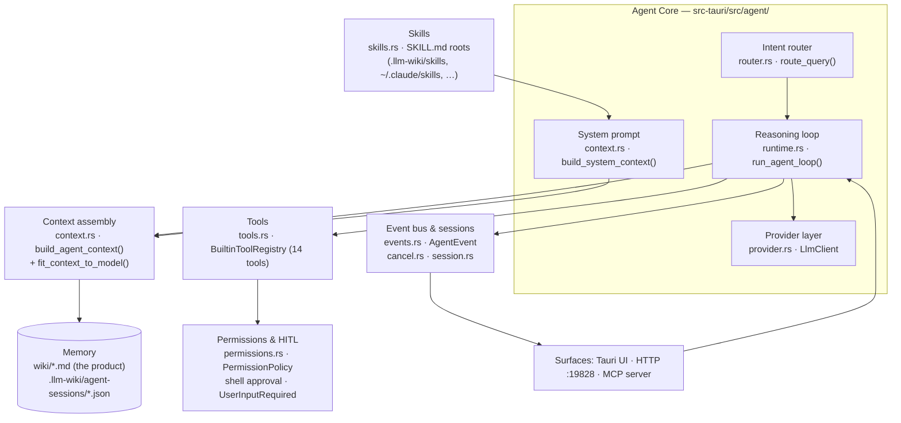

> Source: [nashsu/llm_wiki](https://github.com/nashsu/llm_wiki) (HEAD `4d70fe3`) — **the `nashsu` variant** of the several LLM Wiki implementations · Date: 2026-08-09 · Mode: **Explain** · Type: **Hybrid (embedded runtime)**
> See also: [System & OOP Architecture](/oss/llm-wiki-system-architecture/)

## 1. Overview

LLM Wiki is a desktop knowledge-base app with an **agent embedded inside it**: a tool-using chat runtime, written in Rust, that answers questions over the user's wiki by iteratively searching, reading, and (when allowed) writing — instead of a single retrieve-then-answer RAG call. The same runtime serves three callers — the desktop UI, a local HTTP API, and an MCP server — so the agent's behavior, budgets, and safety gates are defined once, in the backend.

**Type classification: Hybrid (C).** The loop/dispatch machinery lives in source (`src-tauri/src/agent/` — 13 modules, ~13.5k lines: a real reasoning loop, tool registry, provider layer, permission policy), which makes it a **Runtime**; but it is embedded in an application rather than being a general harness, and it additionally *loads* external capability packs (SKILL.md folders, including Claude Code's `~/.claude/skills/`) and *serves itself as a capability* to other agents via MCP. The frontend deliberately contains no agent logic — `src/lib/chat-agent-types.ts` opens with: *"The Agent execution engine lives in Rust (`src-tauri/src/agent`)… so API, MCP, and UI callers share one backend behavior."*

**Substrate:** Rust (tokio, reqwest) for the runtime; any OpenAI-compatible / Anthropic / Google / Ollama endpoint as the model substrate via the backend `LlmClient` (`agent/provider.rs`); Node (`@modelcontextprotocol/sdk`, stdio) for the MCP server.

## 2. Agentic Anatomy



Every caller converges on one entry point: `AgentRuntime::run_once_with_cancel_and_events()` (`runtime.rs:163`).

## 3. The Core

### Provider layer

`agent/provider.rs` — `LlmClient` with `generate_text()` / `generate_text_stream()`, built from an `LlmConfig` (provider, model, base URL, reasoning config). `LlmConfig::is_usable_for_backend_http()` is the pivotal predicate: the full agentic loop only runs when the configured provider can be called over HTTP from Rust. `structured_task_config(max_tokens)` derives a variant tuned for structured (JSON-action) turns.

### System prompt / constitution

`build_system_context()` (`context.rs:64`) assembles the durable instructions per turn:

- Identity: *"You are the LLM Wiki backend Agent"* + grounding rules ("say what is missing instead of inventing facts", cite page paths).
- **Tool policy** — when to prefer `wiki.search` vs `graph.search`, plus router-conditional hints for `web.search` / `anytxt.search`.
- **Generated-file policy** — all agent-generated files must land in the visible project workspace (`workspace.rs: agent_workspace_path()`); skill folders are read-only; prefer Mermaid blocks over generated HTML for diagrams.
- Project grounding: trimmed excerpts of the project overview and `schema.md`.
- **Skills index** — rendered differently for `AgentSkillMode::Auto` ("use a skill only when the request matches its description") vs `Explicit` (user-selected skills).

### The reasoning loop — distinctive shape

The loop is **not** native provider tool-calling. Each iteration asks the model for a structured JSON **`AgentLoopAction`** (parsed by `parse_agent_loop_action()`, `runtime.rs:3076`), dispatches it through the tool registry, records an `AgentObservation`, and re-plans. Its distinguishing features:

1. **Two execution paths.** `run_once_with_cancel_and_events()` branches early: with a backend-HTTP-usable LLM → the full loop (`run_agent_loop()`, `runtime.rs:1294`); without one → a **deterministic fallback pipeline** (heuristic router + optional one-shot model planner → fixed retrieval fan-out → synthesis). The comment calls this the *"API/MCP offline contract"* — API callers still get grounded answers with no loop-capable model.
2. **Context is rebuilt every iteration, not appended.** Each pass calls `build_agent_context()` fresh (query, chat history, skills, accumulated references, explicit context files) and appends observations only in the loop-specific user block — avoiding duplicated tool output. `fit_context_to_model()` then trims to char budgets (system trimmed first; user floor of 4,000 chars).
3. **Dual budgets with forced finalization.** An iteration budget (`agent_loop_iteration_budget()`: fast = 4, standard = 8, expanded only for skill turns) and a separate **retrieval budget** (`agent_loop_retrieval_budget()`, sensitive to mode and retrieval mode). When either is exhausted, `must_finalize` swaps in final-answer prompts (`build_agent_final_system/user`) and `forced_final_answer()` guarantees a response; the prompt even tells the model *"Iteration budget: step N of M."*
4. **Retrieval dedup.** Repeated identical tool calls are collapsed via `retrieval_signature()` (canonical-JSON of tool + input), and `retrieval_added_evidence()` checks whether a step actually produced new references.
5. **Cost-aware multimodality.** Attached images (≤ 5, ≤ 7 MB base64 each) are sent **only on iteration 0** — tool observations after that are text.
6. **Modes as steering.** `AgentMode` (`fast | standard | deep | local_first`) scales budgets and eagerness (deep mode force-enables web/anytxt + `deep_research.run`); `AgentRetrievalMode` (`standard | smart | faithful`) constrains evidence — *faithful* answers exclusively from imported sources and disables web search.

### One agent turn (loop path)

```mermaid
sequenceDiagram
    participant S as "Surface (UI / API / MCP)"
    participant R as "run_once_with_cancel_and_events"
    participant L as "run_agent_loop"
    participant M as "LlmClient"
    participant T as "BuiltinToolRegistry"

    S->>R: AgentChatRequest (message, mode, skills, approved_shell_commands)
    R->>R: route_query() · load_project_skills() · PermissionPolicy checks
    R->>L: llm_config.is_usable_for_backend_http() == true
    loop "≤ iteration budget (4–8+)"
        L->>L: build_agent_context() → fit_context_to_model()
        L->>M: generate (structured; images only on step 0)
        M-->>L: raw JSON → parse_agent_loop_action()
        L->>T: execute(tool, input, ToolContext)
        T-->>L: AgentObservation (+ AgentEvent ToolStart/ToolEnd/ReferenceAdded)
        L-->>S: events streamed via AgentEventSink
    end
    L->>M: must_finalize → final system/user prompts
    M-->>L: answer → forced_final_answer()
    L-->>S: MessageDelta + Done → AgentChatResponse (message, references, tool_events, usage)
```

## 4. Context & Memory

| Layer | Where | Notes |
|---|---|---|
| Working context | `context.rs: build_agent_context()` | Rebuilt per iteration from query, history, skill index, references, observations, explicit context files (`load_explicit_context_files()`). |
| Window fitting | `runtime.rs: fit_context_to_model()` | Char-budget truncation (`trim_chars`); system trimmed before user; no LLM summarization/compaction. |
| Session memory | `session.rs: AgentSessionStore` | Turns persisted as JSON in `.llm-wiki/agent-sessions/`; `recent_messages()` feeds history back into context. |
| Persistent memory | the wiki itself (`wiki/*.md`, `index.md`, `log.md`) | The product thesis: knowledge is compiled once into the wiki, and the agent reads it back via `wiki.search` / `wiki.read_page`. Writes go through `wiki.write_page`. |
| Caches | `.llm-wiki/` (ingest cache, caption cache, LanceDB) | Maintained by the ingest pipelines, consumed by agent retrieval. |

**Finding:** there is no summarization-based compaction — long contexts are handled by hard truncation plus the rebuild-per-iteration design, which keeps the transcript from growing monotonically in the first place.

## 5. Capabilities

| Organ | Where it lives | Code or content |
|-------|----------------|-----------------|
| Tools | `agent/tools.rs` — `ToolRegistry` trait, `BuiltinToolRegistry`, `ToolSpec { name, description, effects, parameters }` | Core code |
| Skills | `agent/skills.rs` loader + external `SKILL.md` folders | Core code loader · **authored content** skills |
| MCP | `mcp-server/` (Node, stdio → HTTP :19828) | Core code — **server only** (no MCP client) |

### Tools (14 builtin)

Declared in `builtin_tool_specs()` (`tools.rs:421`), each tagged with `ToolEffect` (`Read | Write | Network | Process`) — the effect taxonomy the permission layer gates on:

| Tool | Effect | Purpose |
|---|---|---|
| `wiki.search` | Read | Hybrid keyword+vector search over wiki pages |
| `wiki.read_page` | Read | Read one wiki page (≤ 2 MB) |
| `wiki.write_page` | Write | Create/update a wiki page (frontmatter-aware) |
| `source.search` | Read | Search raw imported sources |
| `graph.search` | Read | Relationships/backlinks/neighbors in the knowledge graph |
| `web.search` | Network | Tavily / SerpApi / SearXNG (30 s timeout) |
| `anytxt.search` | Network | Local AnyTXT full-text index (`127.0.0.1:9920`) |
| `deep_research.run` | Network | Multi-query research pipeline |
| `llm.generate` | — | Model call itself, surfaced as a tool event |
| `skills.load` / `skill.read_file` | Read | Load skill index; read skill files (path-traversal-guarded) |
| `workspace.write_file` / `workspace.append_file` | Write | Generated outputs, sandboxed to the agent workspace (≤ 2 MB) |
| `shell.exec` | Process | Shell command (30 s timeout, 4k-char cmd, 20k-char output cap) — **approval-gated** (§6) |

Hard limits are `const`s at the top of `tools.rs`; a comment in `runtime.rs` explains why they live in the backend: *"API and MCP callers bypass the UI, so safety and cost boundaries must live here."*

### Skills

`skill_roots()` (`skills.rs:80`) discovers `SKILL.md` folders from, in override order: project `.llm-wiki/skills/` → `~/.claude/skills/` → `~/.codex/skills/` → `~/.agents/skills/`. So the app **reuses the user's existing Claude Code / Codex skill library**. Skills are surfaced two ways: `AgentSkillMode::Auto` injects a name+description index into the system prompt and lets the model pull instructions via `skill.read_file` on demand (progressive disclosure), or `Explicit` when the user picks skills with `/skill` in the chat input. A dedicated Skills view (`activeView: "skills"`, `settings/sections/skills-section.tsx`) manages enablement; `agent_list_skills` is the backing command.

### MCP — served, not consumed

`mcp-server/src/index.ts` exposes 10 tools to external agents: `llm_wiki_{status, projects, set_project, files, read_file, reviews, search, chat, graph, rescan_sources}`. `llm_wiki_chat` proxies to `POST /projects/{id}/chat` — meaning **an outside agent (e.g. Claude Code) can converse with this app's embedded agent**, agent-to-agent. `McpProjectBinding` (`project-binding.ts`) pins a session to one project and rejects overrides until `llm_wiki_set_project`. The inverse direction is absent: the embedded agent has no MCP *client* and cannot consume external MCP servers. A separately-shipped skill pack ([llm_wiki_skill](https://github.com/nashsu/llm_wiki_skill), per README) installs into Claude Code/Codex so external agents drive the HTTP API directly.

## 6. Orchestration & Autonomy

**Subagents — absent.** One agent, one loop. `deep_research.run` is a deterministic pipeline, not a child agent.

**Hooks / triggers / scheduling — partial, outside the agent.** Autonomy lives in the ingest side: the `notify`-based source-folder watcher and the persistent ingest queue react to filesystem changes, and `scheduled-import.ts` handles scheduled URL imports. Nothing triggers the *chat agent* autonomously.

**Permissions / guardrails / HITL — the richest cluster:**

- `PermissionPolicy` (`permissions.rs`) gates `AgentCapability` (`ReadProject, ReadSource, SearchWiki, SearchWeb, SearchAnyTxt, WriteWiki, RunDeepResearch, Network, Process`); `api_default()` allows read/search/network and sandboxed wiki writes.
- **Shell approval is exact-match HITL:** `shell.exec` runs only if the exact command string appears in `AgentChatRequest.approved_shell_commands` — a list the code explicitly forbids populating *"from model output or persisted conversation data."* Otherwise the tool returns the `shell.exec.approval_required` observation; the UI shows an approval dialog and re-submits with the approved command.
- **Ask-the-user:** the `UserInputRequired` event carries an `AgentUserInputRequest` (typed fields: single/multi/text/textarea/confirm, capped at 12 fields/8 options) — a structured mid-turn question channel rendered by the chat UI.
- **Workspace sandbox:** generated files are confined to the agent workspace dir; the system prompt enforces it and `workspace.rs` defines it (`LLM_WIKI_AGENT_WORKSPACE` env var for shell scripts).
- **Undo & file history:** `FileChanged` events carry `previousContent` for immediate UI undo; `commands/file_history.rs` keeps versioned snapshots (`record_file_version`, `restore_file_history`).
- **Trust-boundary redaction:** `AgentEvent::redact_for_external_api()` strips desktop-only data (rollback snapshots) before events cross the HTTP API.

**Session / state / event bus:** `AgentEvent` (`events.rs`) — `AgentStart, TurnStart, ToolStart/ToolEnd, ReferenceAdded, FileChanged, MessageDelta, Error, UserInputRequired, Done` — flows through an `AgentEventSink` closure: Tauri events for the UI (`agent_start_turn_stream`), buffered/streamed responses for the HTTP API and MCP. `AgentCancellationRegistry` (`cancel.rs`) maps `(project, session, run)` → token; the UI's stop button invokes `agent_cancel_turn`, and API callers use `POST …/chat/{session}/cancel`.

## 7. Extension Points

| Want to… | Extend here |
|---|---|
| Add an agent tool | New `ToolSpec` in `builtin_tool_specs()` + a dispatch arm in `BuiltinToolRegistry::execute()` (`tools.rs`); tag honest `ToolEffect`s so permission gating holds |
| Add a skill | Drop a `SKILL.md` folder into `.llm-wiki/skills/` (project) or `~/.claude/skills/` etc. (user) — no code change |
| Add a capability gate | Extend `AgentCapability` + `PermissionPolicy` (`permissions.rs`) |
| Add a provider | Extend `LlmConfig`/`LlmClient` in `agent/provider.rs` (backend HTTP) |
| Expose a new MCP tool | `mcp-server/src/index.ts` tool list + handler, backed by an `api_server.rs` endpoint |
| Tune loop behavior | Budget functions in `runtime.rs` (`agent_loop_iteration_budget`, `agent_loop_retrieval_budget`) |

## 8. Organ Presence Matrix

| Organ | Present? | Where | Notes |
|-------|----------|-------|-------|
| Reasoning loop | ✅ | `runtime.rs: run_agent_loop()` | Structured-JSON action loop + deterministic offline fallback path |
| Model / provider layer | ✅ | `agent/provider.rs: LlmClient` | Backend HTTP only; loop requires `is_usable_for_backend_http()` |
| System prompt | ✅ | `context.rs: build_system_context()` | Assembled per turn; tool + file policies + schema excerpt |
| Context window mgmt | ✅ | `fit_context_to_model()` | Char budgets; rebuilt (not appended) each iteration |
| Compaction / summarization | ❌ | — | Truncation only; no LLM summarization of history |
| Memory (persistent) | ✅ | wiki files + `.llm-wiki/agent-sessions/` | The wiki *is* the memory — the product's core idea |
| Tools | ✅ | `tools.rs` (14 tools, effect-tagged) | Registry → dispatch → execution with hard resource caps |
| Skills | ✅ | `skills.rs` + external SKILL.md roots | Interops with Claude Code / Codex skill dirs |
| MCP | ⚠️ server-only | `mcp-server/` | Serves 10 tools incl. agent chat; **no MCP client** in the agent |
| Subagents | ❌ | — | Single agent; deep research is a pipeline |
| Hooks / scheduling | ⚠️ partial | file watcher, ingest queue, `scheduled-import.ts` | Autonomy on ingest side only, not the chat agent |
| Permissions / HITL | ✅ | `permissions.rs` + shell approval + `UserInputRequired` | Exact-command shell approval; workspace sandbox; API redaction |
| Session / state / event bus | ✅ | `events.rs`, `cancel.rs`, `session.rs` | One event contract for UI, API, and MCP |

## 9. Glossary & Open Questions

**Glossary**
- **AgentLoopAction** — the structured JSON the model must emit each loop step (tool call or final answer); the app's tool-calling protocol.
- **Observation** — a tool result (`AgentObservation`) fed back into the next iteration's prompt.
- **Agent workspace** — the sandboxed per-project directory where all generated files must land.
- **Mode / retrieval mode** — `fast|standard|deep|local_first` (budget/eagerness) × `standard|smart|faithful` (evidence policy; *faithful* = imported sources only).
- **Skill mode** — `Auto` (model self-selects from an injected index) vs `Explicit` (user picks via `/skill`).
- **Offline contract** — the deterministic router/planner fallback that keeps API/MCP answers working without a loop-capable LLM.

**Open questions**
- How a chat turn behaves when the configured provider is `claude-code`/`codex-cli` (not backend-HTTP-usable): the UI's legacy CLI transports (`claude-cli-transport.ts`, `commands/claude_cli.rs`) still exist, but whether chat routes through them or through the runtime's fallback path was not traced end to end.
- `run_agent_loop()` internals between dispatch and reference accumulation (~1,500 lines) were read selectively (loop head, budgets, finalization); per-tool observation formatting details were not exhaustively verified.
- The HTTP API's streaming semantics for chat events (buffered vs SSE) were not verified; only endpoint existence (`handle_chat`, `handle_cancel_chat` in `api_server.rs`).
- `AgentMode::local_first` semantics were seen in the type union but its routing behavior was not traced.

---

*Reverse-engineered from source; every file, function, tool, event, and constant named above was read directly from the repository. Lower-confidence items are listed in Open Questions rather than drawn into the diagrams.*
