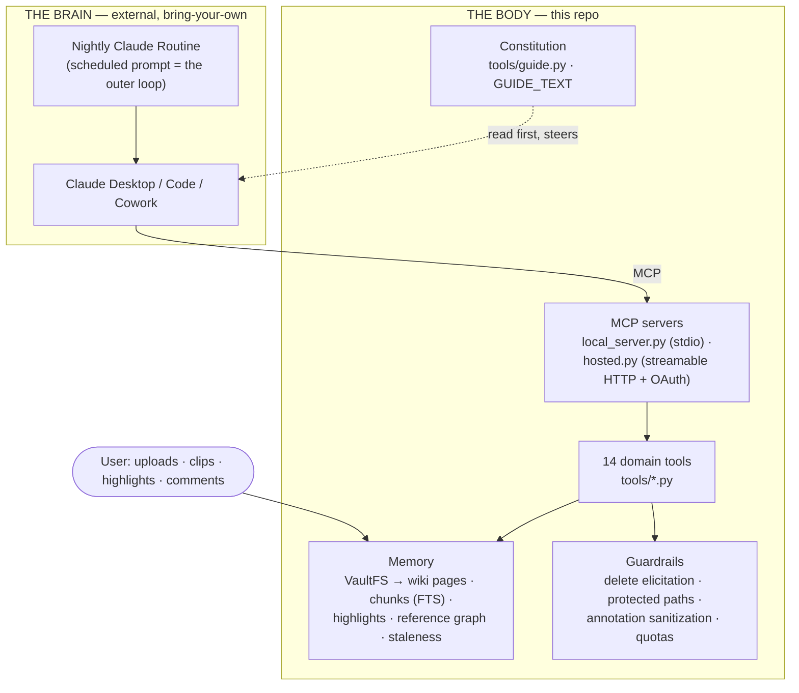
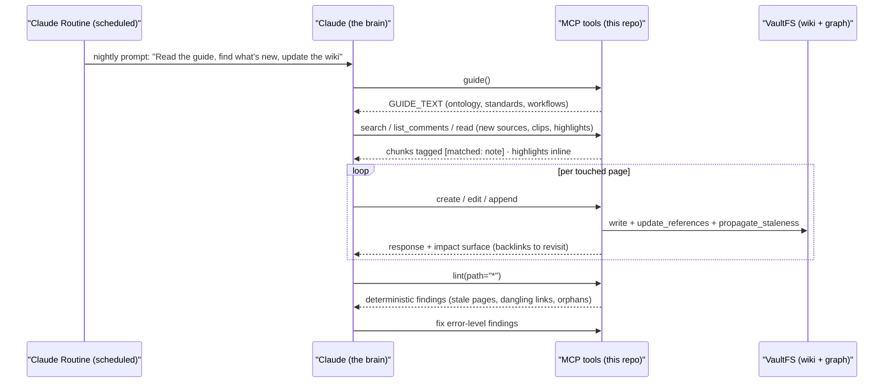

> Source: [lucasastorian/llmwiki](https://github.com/lucasastorian/llmwiki) (HEAD `ab1a32e`) — **the `lucasastorian` variant** of the several LLM Wiki implementations · Date: 2026-08-09 · Mode: **Explain** · Type: **Hybrid (capability infrastructure + authored constitution, for a BYO brain)**
> See also: [System & OOP Architecture](/oss/llm-wiki-lucasastorian-system-architecture/)

## 1. Overview

This repo contains **no reasoning loop and no agent-brain LLM call**. It is the opposite architectural answer to the same product idea as the [nashsu LLM Wiki variant](/oss/llm-wiki-agentic-architecture/): where nashsu *embeds* a Rust agent runtime inside the app, lucasastorian **exports the agency** — Claude (Desktop, Code, Cowork, or a scheduled Claude Routine) is the brain, and this repo is the body it operates through MCP. What the repo supplies is agent-native scaffolding: **action** (write/edit/append/delete tools), **perception** (read with inline highlights, search with annotation attribution, lint, the post-write impact surface), **memory** (the wiki + reference graph + the user's highlights), and **procedural knowledge** (a ~500-line authored guide served as a tool). Autonomy is achieved *by convention*: the README's recommended nightly Routine prompt — "Read the guide… find everything added since your last run… update the pages those sources touch" — is the outer loop, scheduled on Anthropic's infrastructure, not in this codebase.

**Type classification — Hybrid.** Real source infrastructure (FastMCP servers, tool dispatch, a two-backend storage abstraction — Runtime-style machinery, but for *capability*, not reasoning) plus authored content (`GUIDE_TEXT` in `mcp/tools/guide.py`, the constitution the external brain is told to read first). The only model calls in the repo are two narrow *features*, not agency: quiz grading via Cloudflare Workers AI (`api/services/quiz_grader.py`, JSON-schema-constrained, "the rubric is the sole authority") and optional Mistral OCR for PDFs (`api/services/ocr.py`).

## 2. Agentic Anatomy

## 3. The Core (what replaces it)

There is no in-repo loop, so the three brain organs appear in displaced form:

- **Reasoning loop → a scheduled prompt.** The iterate-observe-act cycle belongs to the host harness. The repo's contribution is making each cycle *converge*: every `create`/`edit`/`append` response ends with the **impact surface** (`_get_wiki_impact` in `tools/write.py`) — "these pages reference what you just changed" — which is the feedback signal that turns isolated writes into graph maintenance.
- **Model / provider layer → absent** (by design). The two embedded ML calls are deterministic-shelled features: `quiz_grader.py` pins `@cf/google/gemma-4-26b-a4b-it` with a strict JSON `GRADE_SCHEMA` and a rubric-only system prompt; `ocr.py` calls Mistral OCR when `PDF_BACKEND == "mistral"`. Neither reasons about the wiki.
- **System prompt → the `guide` tool.** `GUIDE_TEXT` (`mcp/tools/guide.py`, ~500 lines) is the constitution, delivered in-band as a tool result. It prescribes the wiki's ontology (`overview.md` as THE HUB PAGE, `concepts/` for abstract ideas, `entities/` for concrete things), writing standards (frontmatter REQUIRED, citations REQUIRED, "Visual Elements — MANDATORY"), the three core workflows (*Ingest a New Source* — "a single source typically touches 5-15 wiki pages — that's expected"; *Answer a Question* — "explorations should compound"; *Maintain the Wiki*), and a full pedagogy for course-type KBs ("teach a model, not a list", "analogies need a mapping and a boundary", "treat highlights and comments as teaching defect reports").

### One maintenance turn (the nightly routine)

## 4. Context & Memory

The wiki **is** the memory — same thesis as every LLM Wiki variant, but with a distinctive extra layer:

| Layer | Where | Notes |
|---|---|---|
| Semantic memory | wiki pages via `VaultFS` (Markdown on disk in local mode) | The compiled knowledge; hub-and-spoke ontology enforced by the guide |
| Episodic traces | sources + chunks (`chunks_fts` / pgroonga) | What was actually read, searchable |
| **User-judgment layer** | highlights + comments (`highlight_chunks`, `highlight_merge`) | The user's marginalia are *materialized into chunk text* and attributed in search (`[matched: note]`, `annotated_only=true`, `scope="annotations"`) — the guide instructs: treat these as "user opinion or curation, not source claims" |
| Relational memory | reference edges + `propagate_staleness` | Citations/wiki-links as a graph; staleness marks form the agent's to-do queue |
| Working context | n/a in repo | Window assembly/compaction is the host harness's job; the repo economizes instead — paged `read` (`pages="1-10"`), snippet extraction, capped outputs |

## 5. Capabilities

| Organ | Where it lives | Code or content |
|-------|----------------|-----------------|
| Tools | `mcp/tools/*.py`, registered via `register(mcp, get_user_id, fs_factory)` | Core code |
| Skills | — (no SKILL.md machinery) | The `guide` tool plays this role |
| MCP | `local_server.py` (stdio) · `hosted.py` (streamable HTTP, `stateless_http=True`, Supabase OAuth per RFC 9728) | Core code — server only |

The 14 domain tools (+ `ping`): `guide` · `create_knowledge_base` / `update_knowledge_base` / `list_knowledge_bases` · `create` / `edit` / `append` (write path, with quiz-block and size validation) · `read` (inline highlight/reply materialization, page ranges) · `search` (modes: list / search / references; annotation scoping) · `lint` (deterministic hygiene: frontmatter, citations, dangling links, orphans, stale pages) · `delete` (elicitation-gated) · `list_comments` / `reply_to_comment` (the agent participates in the user's comment threads) · `add_source_from_url` (hosted-only — `local_server.py` never registers it).

The division of intelligence is disciplined: `lint` and `references` are **deterministic critics** — the repo computes facts (broken links, stale pages, uncited sources) and the external brain supplies judgment, exactly the "tools stay deterministic, the agent supplies the reasoning" split.

## 6. Orchestration & Autonomy

**Subagents — n/a** (the host harness may spawn its own; the repo is agnostic).

**Hooks / triggers / scheduling — external by design.** The nightly Claude Routine is documented, not implemented — Anthropic's scheduler is the cron. *Inside* the repo, autonomy is limited to ingestion: `watch_workspace()` (watchfiles, debounced, self-write suppression) and `reconcile_workspace()` keep the index current so the next agent run sees fresh state.

**Permissions / guardrails / HITL — substantial, and aimed at an *agent* caller:**

- **Destructive-action approval:** `delete` uses MCP **form elicitation** — the exact document set is shown to the user for confirmation before deletion, and `_is_protected()` shields structural pages regardless.
- **Prompt-injection defense:** `helpers.clean_annotation_text()` strips control characters and caps length "so user annotations can't break layout **or read as instructions to the LLM**" — user content is treated as untrusted input to the agent's context.
- **Tenancy & auth:** hosted MCP authenticates via Supabase OAuth; every hosted query flows through `ScopedDB` (constructor-bound `user_id`). Local mode substitutes network-level containment: loopback-only binding plus `local_http.py` Host-header rejection.
- **Resource ceilings:** content-size checks in the write tools, quiz quotas (migration 009), `rate_limit.py`, SSRF-safe URL fetching (`safe_fetch.py`) behind `add_source_from_url`.

**Session / state / event bus:** the hosted MCP server is deliberately **stateless** (`stateless_http=True`) — all state lives in the vault, so any Claude surface (or a fresh Routine run) resumes from the wiki itself. The KB event feed (`routes/events.py`, `routes/ws.py`, migration 010) streams changes to the *web UI*; the agent's "event feed" is instead the queryable staleness/reference state.

## 7. Extension Points

| Want to… | Extend here |
|---|---|
| Add an agent capability | New `mcp/tools/<tool>.py` with `register(...)`; wire into `tools/__init__.py` — it lands in both local and hosted servers |
| Change the agent's behavior | Edit `GUIDE_TEXT` (`mcp/tools/guide.py`) — steering is content, no code path changes |
| Add a lint check | `mcp/tools/lint.py` (deterministic checks) — instantly part of the maintenance loop |
| Support another storage | Implement `VaultFS` (`mcp/vaultfs/base.py`) |
| Change the outer loop | It's a prompt — rewrite the Routine text (README suggests the canonical one) |

## 8. Organ Presence Matrix

| Organ | Present? | Where | Notes |
|-------|----------|-------|-------|
| Reasoning loop | ❌ (external) | host harness / Claude Routine | By design — the repo makes each external cycle converge via impact surfaces + lint |
| Model / provider layer | ⚠️ narrow | `quiz_grader.py` (CF Workers AI) · `ocr.py` (Mistral) | Deterministic-shelled features, not agency |
| System prompt / constitution | ✅ authored | `mcp/tools/guide.py: GUIDE_TEXT` | Served in-band as a tool result; ontology + standards + workflows + pedagogy |
| Context window mgmt | ❌ (external) | — | Repo economizes tool output instead (paged reads, snippets, caps) |
| Compaction / summarization | n·a | — | Host harness concern |
| Memory (persistent) | ✅ | `VaultFS`: wiki, chunks, highlights, reference graph | Includes the distinctive user-judgment layer (highlights materialized into search) |
| Tools | ✅ | `mcp/tools/` — 14 domain tools + ping | Registry = `register()` convention; DI of auth + vault backend |
| Skills | ❌ | — | Guide tool fills the role; no loadable-skill machinery |
| MCP | ✅ server-only | `local_server.py` · `hosted.py` | stdio and stateless streamable HTTP + OAuth; no MCP client |
| Subagents | n·a | — | Harness-side |
| Hooks / scheduling | ⚠️ split | Claude Routines (external, by convention) · `watcher.py` (internal, indexing only) | The outer loop is a scheduled prompt, not code |
| Permissions / HITL | ✅ | delete elicitation, `_is_protected`, `clean_annotation_text`, ScopedDB, loopback guard, quotas | Notably includes prompt-injection defense on user annotations |
| Session / state / event bus | ⚠️ | `stateless_http=True`; state = the vault; KB events feed the web UI | No agent sessions — resumability comes from the wiki itself |

## 9. Glossary & Open Questions

**Glossary**
- **The guide** — `GUIDE_TEXT`, the authored constitution an agent is told to read before working.
- **Impact surface** — backlink list appended to every write response; the convergence signal.
- **Staleness** — a page flagged because something it links to changed; the maintenance queue.
- **Annotation attribution** — search-result tags (`[matched: note]`, `[annotated]`) separating user opinion from source claims.
- **Course KB** — a knowledge base with `kind="course"`: ordered lessons, quiz blocks (validated by `quiz_lint`), CF-Workers-AI-graded free-form answers.
- **Elicitation** — MCP's structured user-confirmation mechanism, used by `delete`.

**Open questions**
- Whether hosted MCP enforces per-tool scopes/permissions beyond OAuth identity (e.g. read-only API keys) was not traced (`api/routes/api_keys.py` not read in full).
- How a Routine discovers "what's new since last run" — the guide documents search/list and staleness queries, but there is no explicit "changes since timestamp" tool; presumably the agent uses list ordering and the events are UI-only. Unverified.
- `mcp/services/chunker.py` vs `api/services/chunker.py` — apparent duplication; whether they share code or diverge was not checked.
- The web app's `planTasks.ts` suggests a task-planning UI element whose relationship to agent work was not explored.

---

*Reverse-engineered from source. The contrast with the [nashsu variant](/oss/llm-wiki-agentic-architecture/) (embedded Rust runtime vs exported agency) is drawn in the overview of each doc; both answer "where does the agent live?" — in the app, or outside it.*
