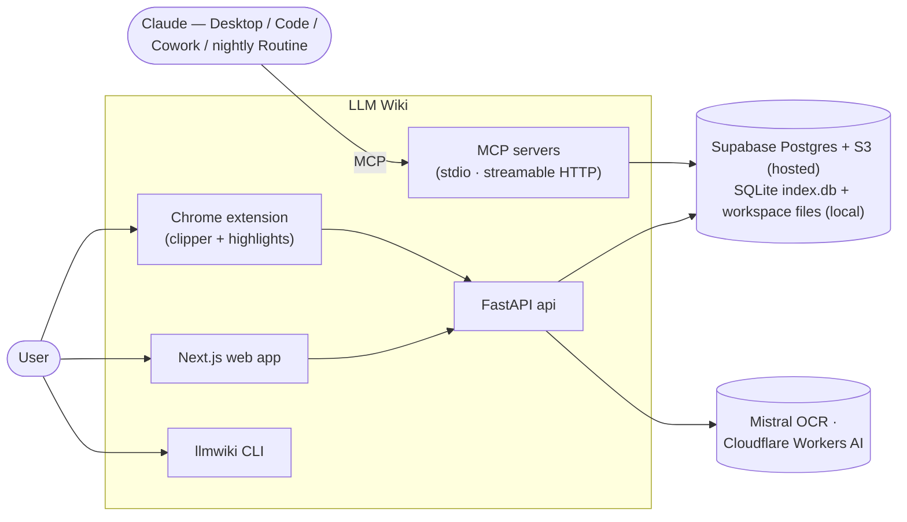
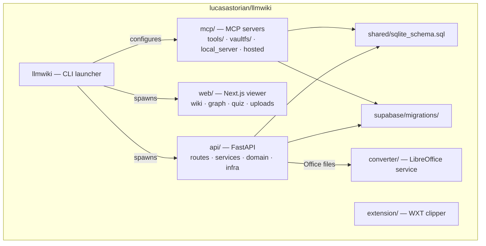
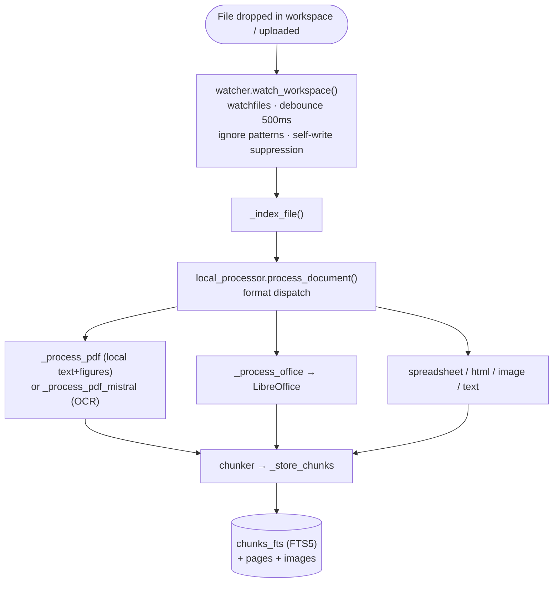
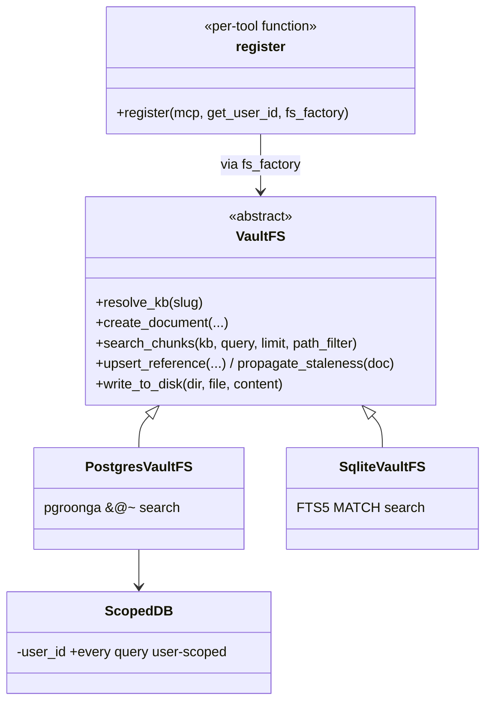
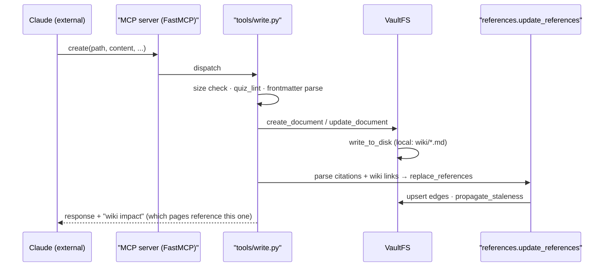

> Source: [lucasastorian/llmwiki](https://github.com/lucasastorian/llmwiki) (HEAD `ab1a32e`) — **the `lucasastorian` variant** of the several LLM Wiki implementations · Date: 2026-08-09 · Mode: **Explain** · Type: **Application** (multi-service web/CLI product)
> See also: [Agentic Architecture](/oss/llm-wiki-lucasastorian-agentic-architecture/) — how this repo serves as capability infrastructure for an external Claude agent.

## 1. Overview

**What it is.** LLM Wiki turns a folder of documents, web clips, and highlights into a persistent, AI-maintained personal Wikipedia. Unlike a chat-RAG product, the *maintenance intelligence lives outside the repo*: Claude (Desktop, Code, Cowork, or a nightly Claude Routine) connects over MCP and does the reading, synthesis, and page writing; the repo supplies ingestion, storage, search, a viewer, and the MCP tool surface. The design follows Karpathy's LLM Wiki pattern "with an increased emphasis on autonomous maintenance" (README).

**Type & evidence — Application.** Runnable entry points everywhere: `api/main.py` (FastAPI), `mcp/local_server.py` / `mcp/hosted.py` (MCP servers), `web/` (Next.js), `extension/` (Chrome MV3 via WXT), and the `llmwiki` CLI launcher at repo root. Deployment configs: `docker-compose.yml`, per-service `railway.toml` (api, mcp, converter), `netlify.toml` (web). Nothing is published as an importable library.

**The defining axis is dual deployment mode** — one codebase, two products:

| | **Hosted** (llmwiki.app, multi-tenant) | **Local** (`./llmwiki open ~/folder`) |
|---|---|---|
| Storage | Supabase Postgres + S3 | SQLite `index.db` + the user's own files on disk |
| Search | pgroonga index (`&@~` operator) | SQLite FTS5 (schema comment: *"replaces pgroonga"*) |
| Auth | Supabase OAuth + API keys, `ScopedDB` per-user scoping | none — loopback-only (`api/infra/local_http.py` rejects non-loopback Host headers) |
| MCP transport | Streamable HTTP, `stateless_http=True`, OAuth (RFC 9728) | stdio (`FastMCP`) |
| Extras | tus resumable uploads, WebSocket events, quiz grading, public sharing | file watcher, workspace reconcile, local graph |

**Tech stack.** Python 3.11 (FastAPI, asyncpg/aiosqlite, watchfiles, httpx) · Next.js + React 19 (web) · WXT + React (extension) · MCP Python SDK (`FastMCP`) · Supabase (Postgres, pgroonga, auth, migrations in `supabase/migrations/`) · LibreOffice (Office conversion; hosted via the `converter/` service) · Mistral OCR (optional PDF backend) · Cloudflare Workers AI (quiz grading) · Railway + Netlify + Chrome Web Store.

## 2. System Context *(C4 L1)*

The user curates sources (uploads, folder drops, web clips, highlights); Claude — connected over MCP — is the *other first-class user*, reading and writing the same store. The wiki pages themselves are Markdown (written to disk in local mode), so the product stays inspectable.

## 3. High-Level Structure *(C4 L2)*

| Path | Responsibility |
|------|----------------|
| `api/main.py` | FastAPI app; **mode-conditional routers** — local: `local_upload`, `files`, `local_graph`; hosted: `api_keys`, `tus`, `graph`, `ws`, `public`, `quiz`. |
| `api/routes/` | 15 route modules (documents, knowledge_bases, events, quiz, graph, …). |
| `api/services/` | Ingestion & domain services: `parsers`, `ocr`, `chunker`, `url_ingest`, `references`, `highlight_chunks`, `highlight_merge`, `quiz_grader`, `webclip_assets`, `s3`, `hosted`/`local`. |
| `api/domain/` | Local-mode engine: `watcher.py` (watchfiles), `local_processor.py` (per-format extraction pipeline), `file_types.py`, `quiz_lint.py`. |
| `api/infra/` | Cross-cutting: `local_http.py` (loopback guard), `rate_limit.py`, `safe_fetch.py` (SSRF-safe URL fetch), `tus.py`, auth, db, storage. |
| `api/scoped_db.py` | `ScopedDB` — every hosted query runs scoped to a `user_id` (multi-tenant isolation at the query layer). |
| `mcp/tools/` | The 14 MCP domain tools + shared helpers (detailed in the [agentic doc](/oss/llm-wiki-lucasastorian-agentic-architecture/)). |
| `mcp/vaultfs/` | **`VaultFS` abstraction** — `postgres.py` (hosted) and `sqlite.py` (local) behind one ABC. |
| `converter/` | Standalone LibreOffice conversion service (hosted; local mode shells out to a local LibreOffice install). |
| `llmwiki` | CLI: `open`, `init`, `serve`, `mcp`, `mcp-config`, `reindex` — spawns uvicorn on `127.0.0.1:8000` + the web app. |
| `shared/sqlite_schema.sql` | Local schema: documents, chunks, `chunks_fts` (FTS5 virtual table + sync triggers). |
| `supabase/migrations/` | Hosted schema evolution (10 migrations: references, highlights, kb sharing, quiz quota, events). |

## 4. Components *(C4 L3 — the ingestion & storage core)*

### 4a. Local ingestion pipeline (`api/domain/`)

`_is_recently_written()` suppresses events for files the app itself just wrote (mirrors the same trick in the nashsu variant); `reconcile_workspace()` performs a full diff on startup; `process_document_isolated()` guards crash recovery by resetting claims. The hosted path routes the same extraction through `api/services/` with S3 storage and the `converter/` service instead of a local LibreOffice.

### 4b. The vault (`mcp/vaultfs/`)

`VaultFS` (ABC in `base.py`, ~40 abstract methods) is the single seam between all MCP tools and storage: knowledge bases, documents, pages, chunk search, highlights/replies, reference edges, staleness. `postgres.py` implements it on asyncpg + pgroonga; `sqlite.py` on aiosqlite + FTS5. Tools receive an `fs_factory` at registration and never know which backend they run on.

### 4c. Reference graph & staleness

`mcp/tools/references.py` parses citations (`[^1]: paper.pdf, p.3`) and wiki links from every written page and stores them as edges (`upsert_reference`, `replace_references`). `propagate_staleness()` flags pages whose linked targets changed; `find_stale_pages()` / `find_uncited_sources()` power lint and `search(mode="references")`. This is the machinery that lets a nightly agent know *what to fix*.

## 5. OOP & Class Architecture

The codebase is service-oriented Python with one deep abstraction and several deliberate patterns:

- **Strategy / bridge:** `VaultFS` is the load-bearing deep module — one interface, two full backends, chosen by deployment mode. The same shape appears at the schema level (`shared/sqlite_schema.sql` mirrors the Supabase migrations).
- **Dependency injection at registration:** every tool module exposes `register(mcp, get_user_id, fs_factory)`; `local_server.py` and `hosted.py` wire different auth (`get_user_id`) and different vaults into identical tools. The hosted server adds exactly one extra registration — `tools.ingest` (URL ingestion, which calls the hosted API and is deliberately never registered locally).
- **Query-scoped tenancy:** `ScopedDB` (`api/scoped_db.py`) binds a `user_id` at construction so hosted queries cannot forget the tenant filter.
- **Validation as shared pure functions:** `quiz_lint.py` (fence-aware quiz-block validation) is used by both the write tools and the lint tool; `helpers.py` is explicitly "pure utility functions… no DB, no auth, no state."

## 6. Key Flows

### 6a. Agent writes a wiki page (MCP)

Every write response appends the **impact surface** (`_get_wiki_impact`) — the backlinks that may now need updating — turning each mutation into a prompt for the next maintenance step.

### 6b. Clip → highlight → agent context

Extension (WXT/React) clips a page or PDF → `api` stores the clip + highlights/comments (migrations 005/007) → `highlight_chunks`/`highlight_merge` materialize annotations *into the searchable chunk text* → MCP `search` returns hits tagged `[matched: note]` / `[annotated]`, and `read` renders highlights inline — so the user's marginalia become first-class agent context.

### 6c. Local bootstrap

`./llmwiki open ~/research` → `init` scaffolds `wiki/` + `.llmwiki/index.db` (from `shared/sqlite_schema.sql`) → spawns uvicorn (`127.0.0.1:8000`) and the Next.js dev server → `reconcile_workspace()` indexes existing files → `watch_workspace()` keeps it current. `llmwiki mcp-config` prints the `claude_desktop_config.json` stanza — one workspace = one stdio MCP server entry.

## 7. Extension Points

| Want to… | Extend here |
|----------|-------------|
| Support a new file type | `api/domain/file_types.py` + a `_process_*` handler in `local_processor.py` (and the hosted parser in `api/services/parsers.py`) |
| Add an MCP tool | New module in `mcp/tools/` exposing `register(mcp, get_user_id, fs_factory)`; wire it in `tools/__init__.py` |
| Add a storage backend | Implement the `VaultFS` ABC (`mcp/vaultfs/base.py`) |
| Evolve hosted schema | New file in `supabase/migrations/`; mirror local changes in `shared/sqlite_schema.sql` |
| Add an API route | `api/routes/` + mode-conditional `include_router` in `main.py` |

## 8. Key Abstractions / Glossary

- **Workspace** — the user's own folder; sources stay untouched, the app adds only `wiki/` and `.llmwiki/`.
- **Knowledge base (KB)** — the tenant unit; `kind` is `wiki` or `course` (course KBs unlock lesson ordering + quizzes).
- **Vault** — the document store behind `VaultFS`, whichever backend.
- **Chunk** — the FTS unit; its `content` is the *materialized* source text + annotations.
- **Highlight / annotation** — user-selected quote + optional comment thread (agent can reply via `reply_to_comment`).
- **Reference edge** — citation or wiki-link stored in the graph; **staleness** propagates along it.
- **Impact surface** — the backlink list appended to every write response.

## 9. Open Questions & Notes

- The **web app** (`web/src/`) was surveyed at directory level (viewer, wiki, kb, quiz, connections components; `useKBEvents`, `planTasks`, `mcp.ts`) but not read page by page; the same applies to `converter/main.py` internals and the tus upload flow.
- **Realtime**: `routes/events.py`, `routes/ws.py`, and migration `010_knowledge_base_events.sql` indicate a KB event feed consumed by the web app; the exact event taxonomy was not traced.
- **Supabase RLS vs `ScopedDB`**: migrations include write policies (004), and queries are user-scoped in code; how the two layers divide responsibility was not verified.
- Hosted **usage metering** (`routes/usage.py`, quiz quotas in migration 009) was noted but not traced.
- Tests: `tests/unit` + `tests/integration/mcp` with `docker-compose.test.yml` exist; coverage extent not assessed.

---

*Reverse-engineered from the cloned repository; every path, class, tool, and SQL object named above was read from source. Uncertainties are listed here rather than drawn into the diagrams.*
