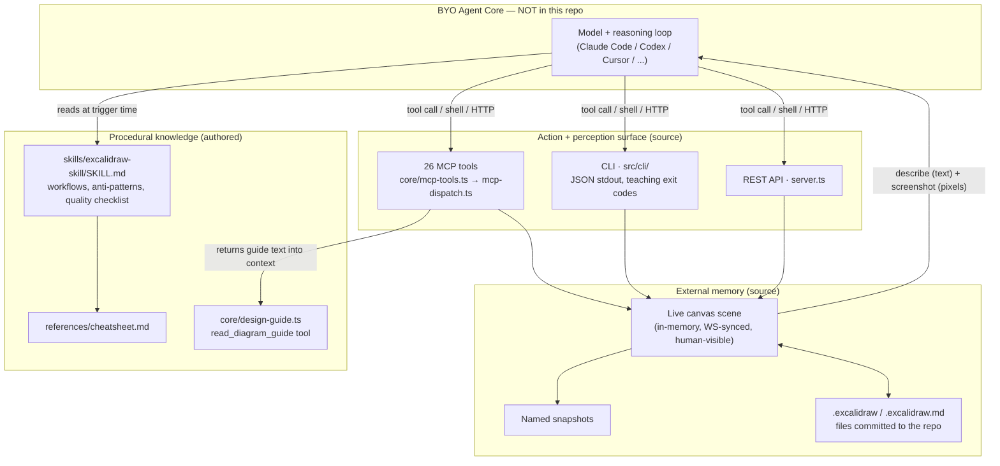

> Source: [yctimlin/mcp_excalidraw](https://github.com/yctimlin/mcp_excalidraw) (v2.0.0) · Date: 2026-08-09 · Mode: Explain · Type: Hybrid (capability infrastructure in source + authored skill pack)
>
> See also: [System & OOP Architecture](/oss/mcp-excalidraw-system-architecture/) · [AX Interface Review](/oss/mcp-excalidraw-ax-interface/)

## 1. Overview

This repo contains **no LLM call, no reasoning loop, no prompt to a model — anywhere**. It is the inverse of an agent runtime: a **body for a bring-your-own brain**. The host harness (Claude Code, Codex CLI, Claude Desktop, Cursor, ...) supplies the model and the loop; this project supplies the organs that make a *draw → look → fix* loop possible: **action** (element CRUD + layout tools), **perception** (`describe` for structured text, `screenshot` for actual pixels), **memory** (a persistent live canvas, named snapshots, `.excalidraw` files in the repo), and **procedural knowledge** (an installable `SKILL.md` plus an in-band design guide delivered as a tool result).

**Type classification — Hybrid (C).** Evidence for the split: `src/` implements real agent-capability machinery — an MCP tool server with a registry and dispatcher (`src/core/mcp-tools.ts`, `src/core/mcp-dispatch.ts`) and a CLI engineered as an agent surface (`src/cli/`) — while `skills/excalidraw-skill/SKILL.md` is authored steering content installed *into* a BYO harness via the `install-skill` command. There is no loop in `src/`, so it is not a Runtime; there is too much load-bearing source for a pure Pack.

**Substrate:** TypeScript/Node ≥ 20; MCP via `@modelcontextprotocol/server` v2 (both 2025 and 2026-07-28 protocol eras); harness-agnostic by design — the README documents six host harnesses, and any shell-capable agent can use the CLI with zero config.

## 2. Agentic Anatomy

The core is deliberately **outside the repo boundary**. Everything this repo ships is surround:



## 3. The Core (borrowed) and the Loop This Repo Enables

The reasoning loop lives in the host harness. What this repo authors is the **shape of the loop the harness should run** — written down as procedure in `SKILL.md` and enforced by making both perception channels first-class tools:

```mermaid
sequenceDiagram
    participant H as Host harness (BYO loop)
    participant S as SKILL.md (steering)
    participant T as CLI / MCP tools
    participant C as Canvas server
    participant B as Browser tab

    H->>S: skill triggers ("draw the architecture...")
    S-->>H: plan coordinates first; batch add; then VERIFY
    H->>T: add [elements JSON]
    T->>C: POST /api/elements/batch (auto-starts canvas)
    C-->>B: WS broadcast → live render
    H->>T: describe
    T-->>H: structured text: ids, positions, labels, connections
    H->>T: screenshot
    C->>B: export request → PNG
    T-->>H: image (MCP: inline; CLI: file path)
    Note over H: Quality checklist from SKILL.md:<br/>truncation? overlap? arrow crossing?
    H->>T: update auth-svc --set '{"width":220}'
    H->>T: screenshot (re-verify, then proceed)
```

Two design choices make this a genuine *agentic* loop rather than one-shot generation:

1. **Dual perception channels.** `describe`/`describe_scene` (`src/core/describe.ts`) gives machine-readable state for *programmatic* decisions (find ids, bounding boxes, connections); `screenshot`/`get_canvas_screenshot` gives ground-truth pixels for *quality* judgment. The skill explicitly teaches when to use which (`SKILL.md` "Workflow: Iterative Refinement").
2. **The verify step is prescribed, not optional.** `SKILL.md`'s Quality Checklist mandates screenshot-after-every-batch and "stop, fix it, re-screenshot, then continue" — steering content compensating for the model's tendency to declare victory without looking.

## 4. Context & Memory

**Context economy (of tool output, not of a transcript).** There is no context window to manage here — but the surfaces are shaped for one. `describe` emits compact plain text sorted top-to-bottom/left-to-right rather than raw JSON; CLI screenshots write PNGs to disk and print the *path* (only SVG streams to stdout); `export_to_image` without a path returns a length notice ("Base64 png data (N chars). Use filePath to save") instead of flooding the context with base64. `tools/list` results carry MCP 2026-07-28 cache hints (`mcp-server.ts:18`) so modern clients don't re-fetch the static tool table.

**Memory hierarchy** — the canvas is the agent's external working memory, with two persistence tiers layered on:

| Tier | Where | Lifetime | Role |
|------|-------|----------|------|
| Working | in-memory `Map`s in the canvas server (`src/types.ts`) | until server restart | the live scene all front-ends and browser tabs share |
| Checkpoint | named snapshots (`snapshot save/restore`) | until server restart | rollback before risky changes (skill teaches "snapshot save first") |
| Persistent | `.excalidraw` / `.excalidraw.md` files via `export`/`import` (`core/scene-io.ts`, `obsidian-md.ts`) | committed to git / Obsidian vault | diagrams-as-code artifacts; byte-stable re-exports avoid phantom diffs |

**Compaction/summarization:** n·a — no transcript exists. The closest analog is `describe` itself: a lossy, agent-readable summarization of the full scene state.

## 5. Capabilities

| Organ | Where it lives | Code or content |
|-------|----------------|-----------------|
| Tools (MCP) | Registry: `src/core/mcp-tools.ts` (static `Tool[]`, JSON Schemas) → dispatch: `callExcalidrawTool()` in `src/core/mcp-dispatch.ts` (26-case switch, Zod re-validation) → execution: HTTP against the canvas server via `core/canvas-client.ts` | Core code |
| Tools (CLI) | `src/cli/run.ts` command table + `src/cli/commands/*`; same `core/` functions, so CLI ≡ MCP behavior | Core code |
| Tools (REST) | Express routes in `src/server.ts` — the raw substrate both of the above drive; documented for LangChain/custom frameworks | Core code |
| Skill | `skills/excalidraw-skill/SKILL.md` (+ `references/cheatsheet.md`, `evals/`); trigger conditions in YAML frontmatter `description` | Authored content |
| Skill distribution | `install-skill` command (`src/cli/commands/install-skill.ts`) copies the bundled skill into any harness's skills root; `scripts/sync-skills.mjs` keeps the repo copy in sync | Core code serving content |
| In-band knowledge | `read_diagram_guide` tool returns `DIAGRAM_DESIGN_GUIDE` (`src/core/design-guide.ts`) — the design guide injected into context on demand, the MCP-mode equivalent of the cheatsheet | Content delivered through code |
| MCP (client side) | n·a — this repo is an MCP *server*; it consumes no external MCP servers | — |

A distinctive pattern: **one capability, three transports, one behavior.** The skill's "Step 0: Pick an Interface" tells the agent to prefer MCP tools if present, else CLI, else REST — and `core/normalize.ts` guarantees all three accept the same agent-friendly element format (`text` on shapes, `startElementId`/`endElementId` on arrows) and produce identical elements.

## 6. Orchestration & Autonomy

- **Subagents:** absent as a mechanism — but *multi-agent concurrency is supported by architecture*: the canvas server is a shared stateful hub, so multiple agents (and humans in browser tabs) can drive the same scene simultaneously over WS-synced state; the README advertises this against the official Excalidraw MCP.
- **Hooks / triggers / scheduling:** absent. The only trigger is the skill's frontmatter description matching a user request in the host harness.
- **Human-in-the-loop:** structural rather than gated — the canvas *is* a live human-visible surface. A human watches the agent draw in real time and can edit alongside it (browser edits sync back via `POST /api/elements/sync`). Destructive-action friction exists only at the CLI: `clear` requires `--yes`.
- **Guardrails (least privilege by default):**
  - Canvas binds `127.0.0.1` only; auto-start refuses non-loopback URLs (`core/spawn.ts`).
  - File writes are jailed to `EXCALIDRAW_EXPORT_DIR` via `sanitizeFilePath` (`core/normalize.ts`) — an agent can't be prompted into writing outside the allowed dir.
  - The identity gate (`assertCanvasIdentity` in `core/canvas-client.ts`) refuses to send mutations to a foreign service on the port, and `stop` only signals a pid the live server self-reports.
  - `share` is the sole outbound call and encrypts client-side (AES-GCM, key only in the URL fragment).
- **Session / state / event bus:** the canvas server is the event bus — WebSocket broadcast (`server.ts broadcast()`) fans element changes to every connected client; MCP connections themselves are stateless by design (fresh `McpServer` per connection, durable state in `core/canvas-state.ts` + the canvas process), so any number of agent sessions converge on one scene.

## 7. Extension Points

- **New MCP tool:** add schema to `mcp-tools.ts`, case to `mcp-dispatch.ts` — auto-registered by the factory loop in `mcp-server.ts`.
- **New CLI command:** handler in `src/cli/commands/`, row in the `COMMANDS` table (`cli/run.ts`).
- **Skill evolution:** edit `skills/excalidraw-skill/`, run `npm run sync:skills`; agents upgrade in place with `install-skill` (replaces the target dir so removed files don't linger).
- **New harness:** nothing to do — any MCP client config or any shell reaches the same surface; `install-skill --dir <skills-root>` adapts to any skills-directory convention, with `--target claude|codex` shortcuts.
- **Framework embedding:** REST API directly, or import `createExcalidrawMcpServer` from the package.

## 8. Organ Presence Matrix

| Organ | Present? | Where | Notes |
|-------|----------|-------|-------|
| Reasoning loop | ❌ (by design) | host harness | The repo *prescribes* the loop shape (SKILL.md verify cycle) without implementing one. |
| Model / provider layer | ❌ (by design) | host harness | No API key, no LLM dependency — a deliberate product claim (README FAQ). |
| System prompt / constitution | ⚠️ partial | `skills/excalidraw-skill/SKILL.md` | Not a system prompt, but the durable steering text; loaded at trigger time by the harness. |
| Context window mgmt | n·a | — | Token-economical *outputs* (describe text, screenshot-to-file) stand in for it. |
| Compaction / summarization | n·a | `core/describe.ts` as analog | `describe` is scene-state summarization, not transcript compaction. |
| Memory — working | ✅ | canvas server in-memory `Map`s (`src/types.ts`) | Shared across agents, harnesses, and browser tabs. |
| Memory — persistent | ✅ | `export`/`import` + snapshots (`core/scene-io.ts`, `/api/snapshots`) | Files survive restarts; snapshots don't (in-memory). |
| Tools (registry→dispatch→exec) | ✅ | `core/mcp-tools.ts` → `core/mcp-dispatch.ts` → `core/canvas-client.ts` | Mirrored 1:1 by CLI and REST. |
| Skills | ✅ | `skills/excalidraw-skill/` + `install-skill` distribution | Portable, versioned with the package, self-upgrading. |
| MCP | ✅ (server role) | `core/mcp-server.ts`, stdio via `src/index.ts` | Dual protocol era support (2025 + 2026-07-28). |
| Subagents | ❌ | — | Multi-*agent* concurrency supported by shared-canvas architecture instead. |
| Hooks / triggers / scheduling | ❌ | — | Only the skill's frontmatter trigger in the host harness. |
| Permissions / guardrails / HITL | ⚠️ partial | loopback bind, `sanitizeFilePath`, identity gate, `clear --yes`, encrypted share | No auth on the REST API (documented); HITL is ambient via the live browser tab. |
| Session / state / event bus | ✅ | `server.ts` WebSocket broadcast + stateless-MCP-connection design (`core/canvas-state.ts`) | One scene, many concurrent drivers. |

## 9. Glossary & Open Questions

**Glossary**

| Term | Meaning |
|------|---------|
| **See-your-own-work loop** | The prescribed draw → `describe`/`screenshot` → fix → re-verify cycle; the repo's central agentic idea. |
| **BYO harness** | The host agent runtime (Claude Code, Codex, ...) that supplies model + loop; this repo plugs capability into it. |
| **Agent-friendly format** | The simplified element JSON (`text`, `startElementId`) normalized by `core/normalize.ts` — schema shaped for LLM emission, not for Excalidraw's internal format. |
| **In-band knowledge** | Design guidance delivered as a tool result (`read_diagram_guide`) so MCP-only clients get what CLI users read from the cheatsheet. |
| **Teaching exit codes** | CLI exit codes 3 ("canvas unreachable → run start / fix env") and 4 ("browser tab required → open the URL") that encode the recovery action. |

**Open Questions**

- `skills/excalidraw-skill/evals/` exists but was not examined; whether the skill is benchmarked (and against what) is unverified.
- The skill claims MCP tool results "land directly in your context" as the reason to prefer MCP over CLI; for large scenes, `query_elements` via MCP returns full JSON (potentially heavy), while the CLI's typed `--filter` flags do client-side narrowing — the actual context-cost tradeoff between the two interfaces is not measured anywhere in the repo.
- The frontend auto-sync timer (browser → `POST /api/elements/sync`, overwrite semantics) can race agent writes; the skill documents symptom + cleanup (duplicate bound-text elements) but the underlying reconciliation strategy (last-writer-wins per whole scene) is undocumented outside code.
