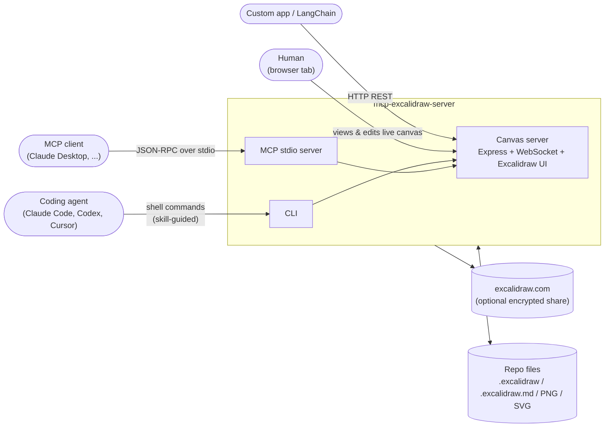
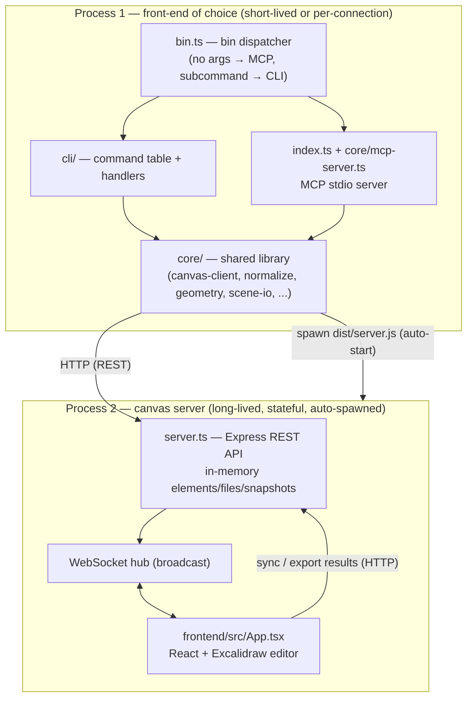
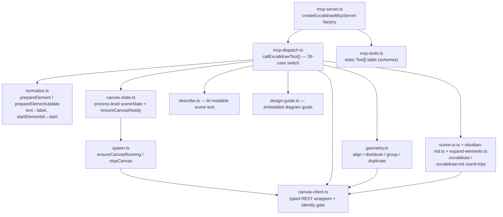
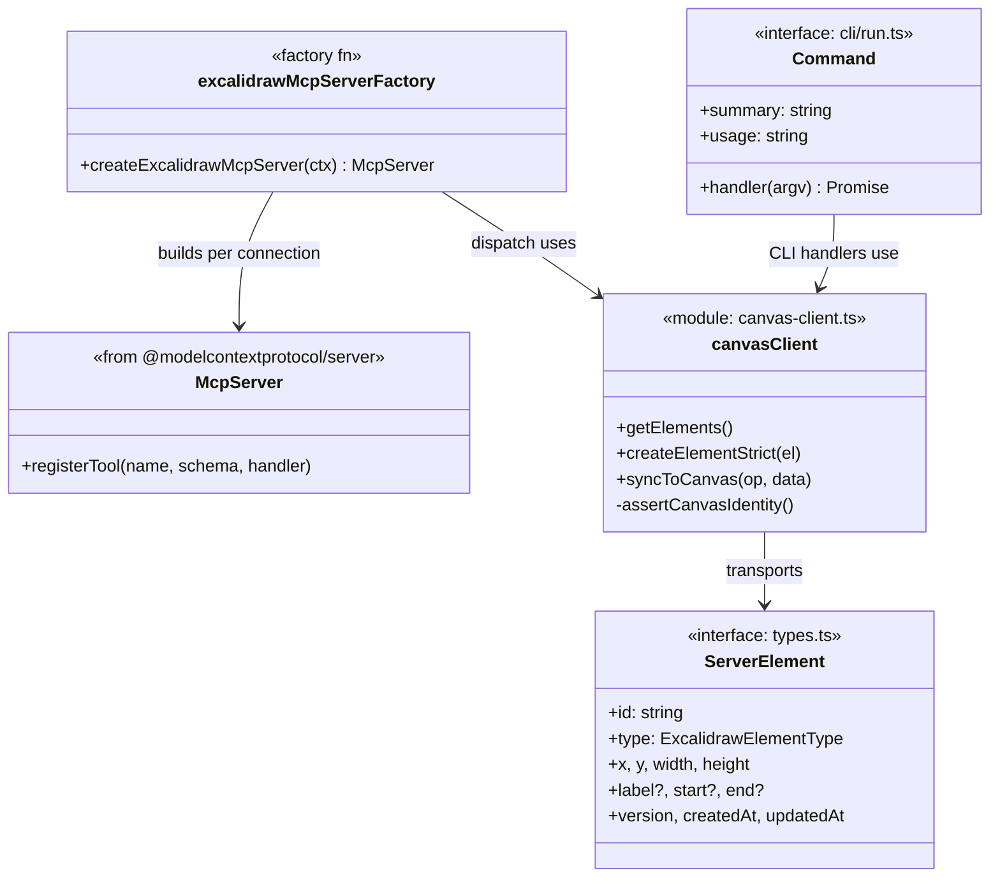
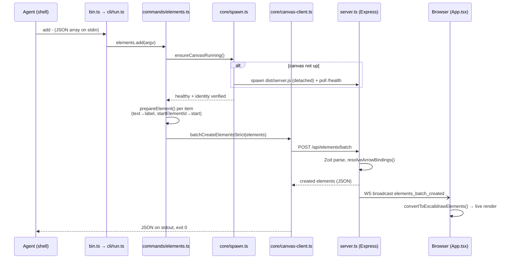
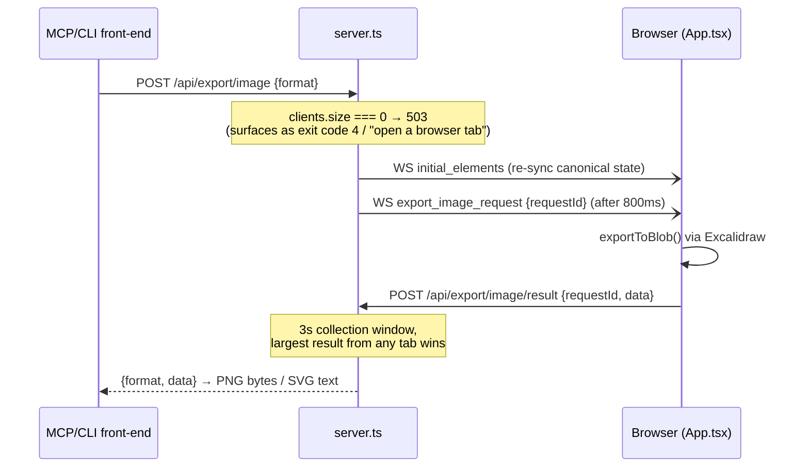

> Source: [yctimlin/mcp_excalidraw](https://github.com/yctimlin/mcp_excalidraw) (v2.0.0) · Date: 2026-08-09 · Mode: Explain · Type: Hybrid (application suite + published npm package)
>
> See also: [Agentic Architecture](/oss/mcp-excalidraw-agentic-architecture/) · [AX Interface Review](/oss/mcp-excalidraw-ax-interface/)

## 1. Overview

**mcp-excalidraw-server** gives AI coding agents a live Excalidraw canvas they can draw on, inspect (structured text + screenshots), refine element-by-element, and export as `.excalidraw` files that live in a repo. One canvas, three equivalent front-ends: a **CLI** (`npx -y mcp-excalidraw-server <command>`), an **MCP stdio server** (26 tools, protocol revisions 2025 *and* 2026-07-28), and a **plain REST API**. A bundled, installable **agent skill** teaches agents the drawing workflow.

**Type classification — Hybrid.** Evidence: `package.json` declares two bins (`mcp-excalidraw-server`, `excalidraw-canvas` → `dist/bin.js`) and three runnable entry points (`src/bin.ts`, `src/index.ts`, `src/server.ts`) — application; but it is also published to npm with `main: dist/index.js` exporting `createExcalidrawMcpServer` / `excalidrawMcpServerFactory` (`src/index.ts:80`) for programmatic embedding — library. The application role dominates.

**Tech stack:** TypeScript (ESM, Node ≥ 20) · Express 4 + `ws` (canvas server) · React 18 + `@excalidraw/excalidraw` + Vite (frontend) · `@modelcontextprotocol/server` v2 (MCP SDK) · Zod (validation) · `@excalidraw/mermaid-to-excalidraw` (runs in the browser) · Winston (logging, stderr-safe).

## 2. System Context

Everything runs locally on loopback (`127.0.0.1:3000` by default); the only outbound call is the optional `share` upload, encrypted client-side (`src/core/share-url.ts`).

## 3. High-Level Structure

Two processes, one product. All three front-ends are thin adapters over a shared core library that talks HTTP to the single stateful canvas server.

| Path | Responsibility |
|------|----------------|
| `src/bin.ts` | Single bin entry; routes no-args → MCP stdio, subcommand → CLI. Deliberately never imports `server.ts` statically. |
| `src/index.ts` | MCP stdio entry: `serveStdio(excalidrawMcpServerFactory)`, kicks off canvas auto-start. |
| `src/server.ts` | The canvas server: Express REST API, WebSocket broadcast hub, static frontend hosting, in-memory state, pidfile, loopback duplicate-listener guard. |
| `src/cli/` | `run.ts` command table + `args.ts` zero-dep flag parser + `commands/*` (server, elements, scene, snapshot, arrange, install-skill). |
| `src/core/` | Shared library behind both CLI and MCP: HTTP client, element normalization, geometry ops, scene file I/O, MCP tool table + dispatcher, auto-spawn, share-URL crypto. |
| `src/types.ts` | `ServerElement`, WebSocket message types, in-memory `Map` stores (`elements`, `files`, `snapshots`), font normalization. |
| `frontend/src/App.tsx` | React app embedding the Excalidraw editor; applies WebSocket messages, renders screenshots/mermaid, auto-syncs edits back. |
| `skills/excalidraw-skill/` | Portable agent skill (SKILL.md + cheatsheet) bundled into the npm package; installed via `install-skill`. |
| `scripts/` | Test harnesses (`check-mcp-stdio.mjs`, `check-local-bind.mjs`) and skill sync. |

## 4. Components — `src/core/` (the load-bearing package)

The CLI commands (`src/cli/commands/*`) bypass `mcp-dispatch.ts` and call the same `core` functions directly — e.g. `elements.ts` uses `prepareElement` + `batchCreateElementsStrict`, so CLI and MCP produce byte-identical elements.

Inside the canvas server (`server.ts`), the notable components are the Zod request schemas (`CreateElementSchema` with `.passthrough()` so unknown Excalidraw fields survive), `resolveArrowBindings`/`computeEdgePoint` (server-side arrow routing to shape edges), `rerouteBoundArrows` (arrows follow moved shapes), and the **pending-request maps** (`pendingExports`, `pendingViewports`) that bridge HTTP requests to WebSocket round-trips through the browser.

## 5. OOP & Class Architecture

The codebase is deliberately **function-first**; classes appear only at the SDK boundary. The architecture is carried by module seams and a few named patterns:

- **Facade over a remote store** — `canvas-client.ts` wraps all REST calls in typed functions; nothing else in `core/` touches `fetch`.
- **Two strictness profiles from one client** — lenient `syncToCanvas` (swallows errors, MCP degrades gracefully) vs `*Strict` variants (throw with real messages, CLI wants hard failures). Same endpoints, different failure contracts.
- **Factory per connection** — `excalidrawMcpServerFactory` builds a fresh `McpServer` per stdio connection/`server/discover` probe; all durable state lives in `canvas-state.ts` (module scope) or the canvas process, never on the server instance, so both MCP protocol eras see the same canvas.
- **Single dispatch table** — `mcp-tools.ts` (schemas) + `mcp-dispatch.ts` (behavior) form a data-driven registry; `mcp-server.ts` just iterates the table.
- **Async request broker** — `server.ts` correlates HTTP → WebSocket broadcast → HTTP result callback via `requestId` maps with timeouts and a best-result collection window (multiple browser tabs may answer).
- **Identity-gated client** — `assertCanvasIdentity()` in `canvas-client.ts` re-verifies the `/health` `service: 'mcp-excalidraw-canvas'` marker (3 s TTL, coalesced probe, fail-closed on timeout) before any API call, so mutations never reach a foreign service squatting on the port.

## 6. Key Flows

### 6.1 Agent creates elements (CLI path, representative end-to-end)

The MCP path is identical from `ensureCanvasReadyForMcpTool()` onward — `callExcalidrawTool('batch_create_elements')` runs the same `prepareElement` + `batchCreateElementsOnCanvas`.

### 6.2 Screenshot (browser-rendered round-trip)

The same broker pattern serves `set_viewport` and `create_from_mermaid` (conversion happens in the browser via `@excalidraw/mermaid-to-excalidraw`, then `App.tsx` syncs the merged scene back).

## 7. Extension Points

- **Add an MCP tool**: append a schema to `mcp-tools.ts` and a case to `callExcalidrawTool` in `mcp-dispatch.ts` — registration in `mcp-server.ts` is automatic.
- **Add a CLI command**: implement a handler in `src/cli/commands/` and register it in the `COMMANDS` table in `cli/run.ts` (summary + usage strings drive `help`).
- **Embed programmatically**: import `createExcalidrawMcpServer` / `runServer` from the package (`src/index.ts` exports).
- **Configuration**: env vars only — `EXPRESS_SERVER_URL`, `PORT`/`HOST`, `ENABLE_CANVAS_SYNC`, `EXCALIDRAW_NO_AUTOSTART`, `EXCALIDRAW_EXPORT_DIR` (`src/core/config.ts`); global `--url` flag maps onto `EXPRESS_SERVER_URL` before module load (`bin.ts`).
- **Skill customization**: `skills/excalidraw-skill/` is plain Markdown; `install-skill --dir <root>` copies it anywhere, `scripts/sync-skills.mjs` keeps the repo-local copy in sync.
- **Alternate deployment**: Docker images for MCP server and canvas separately (`Dockerfile`, `Dockerfile.canvas`, `docker-compose.yml`); the MCP image sets `EXCALIDRAW_NO_AUTOSTART=1` and points at a canvas container.

## 8. Key Abstractions / Glossary

| Term | Meaning |
|------|---------|
| **Canvas server** | The long-lived Express+WS process (`server.ts`) holding the single in-memory scene; the only stateful component. |
| **Front-end (of the toolkit)** | Any of CLI / MCP stdio server / raw REST — thin, stateless drivers of the canvas server. |
| **ServerElement** | The wire/storage shape of one Excalidraw element plus server metadata (`version`, timestamps); unknown Excalidraw fields pass through untouched. |
| **Agent-friendly format** | `"text"` on any shape and `"startElementId"`/`"endElementId"` on arrows; `normalize.ts` converts to Excalidraw's `label`/`start`/`end` forms. |
| **Bound arrow** | An arrow whose endpoints reference element ids; the server routes it edge-to-edge (`resolveArrowBindings`) and re-routes it when endpoints move. |
| **Auto-start** | Any canvas-touching command spawns `dist/server.js` detached if `/health` doesn't answer (`spawn.ts`); opt out with `EXCALIDRAW_NO_AUTOSTART=1`. |
| **Identity marker** | `/health` returns `service: 'mcp-excalidraw-canvas'` + `pid`; clients refuse to talk (and `stop` refuses to signal) anything without it. |
| **Snapshot** | Named server-side copy of all elements, restorable; in-memory like everything else. |
| **Protocol eras** | MCP 2025 (`initialize` handshake) vs 2026-07-28 (`server/discover`, per-request `_meta`); one factory serves both identically. |
| **Obsidian format** | `.excalidraw.md` — scene wrapped in the Obsidian Excalidraw plugin's Markdown container (`obsidian-md.ts`), byte-stable on re-export. |

## 9. Open Questions & Notes

- **Persistence is intentionally absent** — all state (`elements`, `files`, `snapshots` in `types.ts`) is in-memory `Map`s; restart wipes everything. The README tracks this as a TODO; export/snapshot is the sanctioned workaround.
- **`sceneState` is mostly vestigial** — `canvas-state.ts` holds theme/viewport/selection/groups per *front-end process*, but only `groups` is used (as a legacy cache; canvas `groupIds` are the stated source of truth) and `theme`/`viewport` never track the real browser state. `get_resource(scene|theme)` therefore reports defaults, not reality.
- **Two validation layers drift-prone by design** — `server.ts` Zod schemas and `mcp-dispatch.ts` Zod schemas overlap but are separately maintained (the server's is a superset with `.passthrough()`). Not verified whether every MCP-accepted field is REST-accepted.
- **Browser-dependent operations** — screenshot/image-export/viewport/mermaid genuinely require an open tab; the "largest response wins" heuristic in the export broker assumes the most complete canvas, which is plausible but not provably correct with mixed-zoom tabs.
- **`frontend/src/utils/` was not read** in this pass; App.tsx's auto-sync timer (periodic `POST /api/elements/sync`, overwrite semantics) is noted in the skill's error-recovery section as a source of duplicate bound-text elements.
