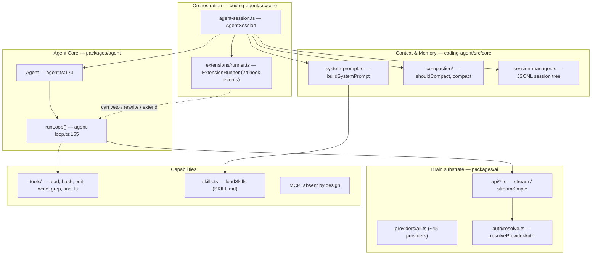
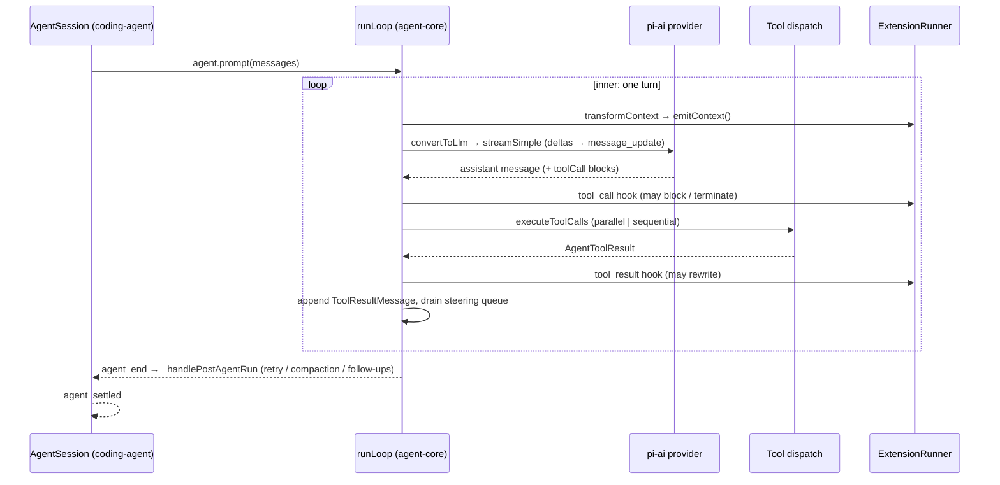

> Source: [earendil-works/pi-mono](https://github.com/earendil-works/pi-mono) (Pi Agent Harness monorepo, `@earendil-works/*`) · Date: 2026-08-14 · Mode: Explain · Type: **Runtime / Harness** (B)
> See also: [System & OOP Architecture](/oss/pi-mono-system-architecture/) · [Extension Architecture](/oss/pi-mono-extension-architecture/)

## 1. Overview

Pi is a **minimal terminal coding harness**: an agent runtime whose deliberate design stance is to keep the core small and push everything else — permissions, subagents, MCP, plan mode — out to user-authored TypeScript extensions. The monorepo layers cleanly:

- `packages/ai` (`@earendil-works/pi-ai`) — the **brain substrate**: unified multi-provider LLM API (~45 providers), auth resolution, streaming, model catalog, cost tracking.
- `packages/agent` (`@earendil-works/pi-agent-core`) — the **CPU**: `Agent` + `runLoop`, the tool contract, the event stream.
- `packages/coding-agent` (the `pi` CLI) — the **organism**: `AgentSession` orchestration, system prompt, skills, compaction, session tree, built-in tools, extension runner, and the delivery modes (interactive TUI / print / RPC / SDK).
- `protocol` / `server` / `client` — experimental remote-session wire layer (CBOR-framed).

**Type classification — Runtime (B), with evidence.** The reasoning loop is executable source: `runLoop()` at `packages/agent/src/agent-loop.ts:155`, a real nested `while` driving the model until a stop reason; tool dispatch (`executeToolCalls`, `agent-loop.ts:411`); a provider layer (`packages/ai/src/providers/`, `api/`); compaction (`packages/coding-agent/src/core/compaction/`). The repo also carries Pack-style dotfiles (`AGENTS.md`, fixture `SKILL.md`) — but those are dev config and test fixtures; judged by `src/`, this is unambiguously a Runtime. It is the harness that *consumes* packs (skills, extensions, themes, prompt templates).

**Substrate:** TypeScript (ESM), TypeBox schemas for tool parameters, first-party streaming clients per provider API (Anthropic Messages, OpenAI Responses/Completions/Codex, Google Generative AI/Vertex, Bedrock Converse, Mistral, Azure, …).

## 2. Agentic Anatomy

Every organ the core refuses to bake in lives in `packages/coding-agent/examples/extensions/` (~70 files): permission gates, subagents, sandboxing, plan mode, custom compaction.

## 3. The Core

### 3.1 Model / provider layer (`packages/ai`)

- **Registry:** `Provider` (`src/models.ts:97`), `Models` (`:156`), `createModels()` (`:735`). `packages/ai/src/providers/all.ts` registers ~45 providers (anthropic, openai, openai-codex, google, google-vertex, bedrock, mistral, groq, xai, openrouter, github-copilot, …) with generated model catalogs (`*.models.ts`, `models.generated.ts`).
- **Streaming surface:** each API module exports `stream` (typed provider options) and `streamSimple` (portable `SimpleStreamOptions`) — e.g. `api/anthropic-messages.ts:502/:816`. `lazyStream()` (`api/lazy.ts:45`) returns a stream synchronously while auth + module loading resolve behind it, encoding setup failures as error *events* — this is what satisfies the loop's "StreamFn must not throw" contract (`agent/src/types.ts:23-27`).
- **Auth:** `resolveProviderAuth()` (`src/auth/resolve.ts:50`) — a stored credential owns the provider; ambient env is consulted only when nothing is stored; no silent env fallback after a failed OAuth refresh. `getApiKey` is re-resolved **per LLM call** so expiring OAuth tokens stay fresh (`agent-loop.ts:305`).
- **Cost:** `calculateCost(model, usage)` (`models.ts:878`); aggregated in coding-agent (`usage-totals.ts`, `AgentSession.getSessionStats()` at `agent-session.ts:3122`).

### 3.2 System prompt (core code + authored content)

`buildSystemPrompt()` — `packages/coding-agent/src/core/system-prompt.ts:28`. Assembly order: base persona (authored at `:121-138`) → `Available tools:` list from each tool's `promptSnippet` → merged `Guidelines:` from per-tool `promptGuidelines` → a **pi self-documentation block** pointing at real README/docs/examples paths on disk (so the agent can read about itself) → `appendSystemPrompt` → `<project_context>` blocks from AGENTS files → skills catalog → cwd.

AGENTS.md loading: `resource-loader.ts` `loadContextFileFromDir()` (`:70`) tries `AGENTS.override.md`, `AGENTS.md`, `CLAUDE.md` (case variants); `loadProjectContextFiles()` (`:118`) walks the global agent dir, then every ancestor of cwd, de-duplicating git-worktree shadows.

Freshness: `AgentSession._rebuildSystemPrompt()` (`agent-session.ts:1023`) re-runs on every tool-set change, and `_installAgentNextTurnRefresh()` (`:535-556`) re-stamps `systemPrompt` and `tools` into the context **before every turn**. Extensions can override the prompt for one run via `before_agent_start` returning `{ systemPrompt }`.

### 3.3 The reasoning loop — nested double loop with steering injection

`runLoop()` at `packages/agent/src/agent-loop.ts:155`; public entries `agentLoop()` (`:31`), `agentLoopContinue()` (`:64`), `runAgentLoop()` (`:95`) all funnel here.

Its **distinctive control shape**:

- **Outer loop** (`while (true)`, `:170`) — re-entered only when `config.getFollowUpMessages()` yields queued messages after the agent would otherwise stop. This is the follow-up queue.
- **Inner loop** (`while (hasMoreToolCalls || pendingMessages.length > 0)`, `:174`) — one iteration = one turn = one assistant stream + its tool batch.
- **Steering mid-run:** `config.getSteeringMessages()` is drained after every turn (`:259`) and spliced into the context *before* the next assistant response. Steering lands **between turns, never mid-tool** — the in-flight tool batch always completes.
- **Per-turn state swap:** `config.prepareNextTurn()` (`:232-245`) may replace context, model, and thinking level between turns — this is how coding-agent hot-swaps models and re-injects a rebuilt system prompt mid-run.
- **One wire boundary:** `streamAssistantResponse()` (`:281-372`) is the single place internal `AgentMessage`s become provider format: `transformContext` → `convertToLlm` → `Context {systemPrompt, messages, tools}` → `streamFn`.
- **Truncation safety:** on `stopReason === "length"` **all** tool calls of that message are failed unexecuted (`failToolCallsFromTruncatedMessage`, `:381`) because streamed arguments may be silently truncated.
- **Tool-batch termination:** a batch stops the run only if *every* finalized result sets `terminate: true` (`shouldTerminateToolBatch`, `:582`).

Dispatch detail: `executeToolCalls` (`:411`) → sequential or parallel (one tool with `executionMode: "sequential"` forces the whole batch sequential) → per call `prepareToolCall` (`:600`: `prepareArguments` → `validateToolArguments` in `ai/src/utils/validation.ts:317` → `beforeToolCall` hook) → `executePreparedToolCall` (`:670`, streaming `tool_execution_update`) → `finalizeExecutedToolCall` (`:713`) → `createToolResultMessage` (`:777`).

## 4. Context & Memory

**Window assembly per call:** `Agent.createContextSnapshot()` (`agent.ts:437`) copies `state.messages` → `transformContext` (routed to extension `context` handlers, `sdk.ts:353`) → `convertToLlm` (`core/messages.ts:148`), which renders pi-specific roles (`bashExecution`, `custom`, `branchSummary`, `compactionSummary`) into plain `user` messages, honors `excludeFromContext`, and strips images when the model can't take them.

**Compaction** (`packages/coding-agent/src/core/compaction/`, 969-line `compaction.ts`):
- Estimation: `estimateTokens()` (chars/4 heuristic, images ≈ 4800 chars); `estimateContextTokens()` anchors on the last real provider usage plus estimated trailing tokens.
- Trigger: `shouldCompact()` when `contextTokens > contextWindow − reserveTokens`; defaults `{ reserveTokens: 16384, keepRecentTokens: 20000 }` (`compaction.ts:132-136`).
- Decision site: `AgentSession._checkCompaction()` (`agent-session.ts:1962`) distinguishes **overflow recovery** (drop the failed assistant message, compact, retry once) from **threshold compaction** (no retry). Executor `_runAutoCompaction()` (`:2058`), driven by `_handlePostAgentRun()` (`:1077`) which keeps calling `agent.continue()` while work remains.
- Summarization is **iterative** — a prior `CompactionEntry.summary` feeds the next summary; authored prompts (`SUMMARIZATION_PROMPT` with Goal / Constraints / Progress / Key Decisions / Next Steps sections, plus split-turn and turn-prefix variants) live beside the code. Read/modified file lists are tracked cumulatively across compactions.
- **Branch summarization:** `compaction/branch-summarization.ts` — when navigating between session-tree branches (`AgentSession.navigateTree()`, `agent-session.ts:2905`), the abandoned branch can be distilled into a persisted `BranchSummaryEntry`.

**Memory:** there is **no semantic/long-term memory subsystem** (no vector store, no memory-file convention). Persistence *is* the session tree:
- `SessionManager` (`core/session-manager.ts:855`) — JSONL, one entry per line, version 3, at `~/.pi/agent/sessions/--<cwd-slug>--/<timestamp>_<uuid>.jsonl`.
- **Branching is first-class:** entries carry `id`/`parentId`; `getBranch/getTree/branch/branchWithSummary/createBranchedSession` make the session a tree, not a log.
- A next-gen pluggable store exists in `packages/agent/src/harness/session/` (`JsonlSessionRepo`, `InMemorySessionRepo`) with an external SQLite backend package (`packages/session-backends/sqlite-node`) — see §9 on harness v2.

## 5. Capabilities

| Organ | Where it lives | How provided |
|-------|----------------|--------------|
| Tools | Contract: `AgentTool` (`agent/src/types.ts:386`, TypeBox schemas). Built-ins: `coding-agent/src/core/tools/` — **read, bash, edit, write, grep, find, ls** (`tools/index.ts:83`); default active set `read/bash/edit/write` | Core code; extensions add more via `pi.registerTool` |
| Skills | Loader `core/skills.ts` (`loadSkills` `:387`); `SKILL.md` + YAML frontmatter (`name`, `description`, `disable-model-invocation`); implements the agentskills.io spec | Core loader + authored content |
| MCP | **Absent by design.** Zero implementation repo-wide; `coding-agent/README.md:499`: "No MCP. Build CLI tools with READMEs, or build an extension that adds MCP support." | Extension-provided (if wanted) |

**Tool contract details:** `execute(toolCallId, params, signal?, onUpdate?) => Promise<AgentToolResult>`; results carry `content`, `details`, optional `usage`, `addedToolNames`, `terminate`. Tools **throw** on failure rather than encoding errors in content. Registry assembly: `AgentSession._refreshToolRegistry()` (`agent-session.ts:2463`) merges built-ins + extension tools + SDK `customTools`, applies allow/deny lists, harvests `promptSnippet`/`promptGuidelines` into the system prompt.

**Skills injection, two paths:** (1) a catalog of `<available_skills>` entries in the system prompt with the instruction to `read` the SKILL.md when relevant — only when the `read` tool is active; (2) explicit `/skill:name args`, expanded by `AgentSession._expandSkillCommand` (`agent-session.ts:1309`). Discovery: `~/.pi/agent/skills/`, `~/.agents/skills/`, project `.pi/skills/` + `.agents/skills/` (trusted projects only), pi packages, settings, `--skill` flags.

## 6. Orchestration & Autonomy

**Subagents — not in core.** Verified absent from `packages/agent` and `coding-agent/src`; README: "No sub-agents… build your own with extensions." The reference implementation is `examples/extensions/subagent/`: spawns a separate `pi` process per invocation (isolated context window), with single / parallel / chain modes and Markdown-frontmatter agent definitions.

**Hooks & events — three tiers:**
1. **Loop events** — `AgentEvent` (`agent/src/types.ts:428`): `agent_start/end`, `turn_start/end`, `message_start/update/end`, `tool_execution_start/update/end`. Listeners are awaited in order and are part of run settlement.
2. **Loop config hooks** (`types.ts:149-293`): `convertToLlm`, `transformContext`, `getApiKey`, `shouldStopAfterTurn`, `prepareNextTurn`, `getSteeringMessages`, `getFollowUpMessages`, `beforeToolCall`, `afterToolCall` — each with a documented "must not throw" contract.
3. **Extension events** — `ExtensionEvent` (`core/extensions/types.ts:1034`): **24 events** spanning session lifecycle, `context`, provider request/header/response interception, agent/turn/message/tool lifecycle, `model_select`, `user_bash`, `input`. Dispatched by `ExtensionRunner` (`core/extensions/runner.ts:268`); the `tool_call` hook can **block or terminate**, `tool_result` can rewrite, `before_agent_start` can replace the system prompt.

**Permissions / guardrails — deliberately absent from core.** Root README: "Pi does not include a built-in permission system… it runs with the permissions of the user that launched it." The only core gates are mechanical: tool allow/deny lists, **project trust** (`core/trust-manager.ts` — project-local skills/extensions are suppressed until the user trusts the project), and the extension `tool_call` veto. Policy belongs to extensions (`examples/extensions/permission-gate.ts` — which blocks by default when no UI is attached) or to containerization (`docs/containerization.md`: Gondolin micro-VM, plain Docker, OpenShell).

**Session / state / event bus:** `AgentSession` (`core/agent-session.ts:305`, ~3300 lines) is the real orchestrator — it owns the agent, session manager, settings, resource loader, model runtime, extension runner, and compaction/retry controllers. All delivery modes subscribe to the same event fan-out: interactive TUI, print mode, and RPC mode (LF-delimited JSONL, `docs/rpc.md`). Remote sessions ride `packages/protocol` (4-byte length + CBOR item; snapshots authoritative, progress events transient) through `PiServer` / `PiClient` with exclusive-vs-shared session leases.

## 7. Extension Points

The extension system is Pi's answer to *every* missing organ — detailed in the sibling [Extension Architecture](/oss/pi-mono-extension-architecture/). In one line each:

- **Extensions** (`~/.pi/agent/extensions/*.ts`, project `.pi/extensions/`) — TypeScript loaded in-process; register tools, commands, shortcuts; intercept all 24 events.
- **Skills** — SKILL.md capability packs, model-invoked or `/skill:`-invoked.
- **Prompt templates** and **themes** — authored content under `~/.pi/agent/`.
- **Pi packages** — npm/git-distributable bundles of the above.
- **SDK mode** — embed `AgentSession` (`core/sdk.ts`) in your own app with `customTools` and stream functions.

## 8. Organ Presence Matrix

| Organ | Present? | Where | Notes |
|-------|----------|-------|-------|
| Reasoning loop | ✅ | `agent/src/agent-loop.ts:155` `runLoop` | Nested double loop; steering between turns; follow-up outer loop |
| Model/provider layer | ✅ | `packages/ai` (`models.ts`, `providers/all.ts`, `api/*`) | ~45 providers, per-call auth refresh, cost tracking |
| System prompt | ✅ | `coding-agent/src/core/system-prompt.ts:28` | Rebuilt every turn; includes self-documentation paths |
| Context window mgmt | ✅ | `agent.ts:437` + `core/messages.ts:148` | One wire boundary (`streamAssistantResponse`) |
| Compaction | ✅ | `coding-agent/src/core/compaction/` | Threshold + overflow-recovery; iterative summaries; twin copy in harness v2 |
| Memory (persistent) | ⚠️ partial | `core/session-manager.ts` JSONL tree | Session persistence + branching only; **no semantic memory** — a finding |
| Tools | ✅ | `agent/src/types.ts:386` + `core/tools/` | 7 built-ins; TypeBox validation; throw-on-failure contract |
| Skills | ✅ | `core/skills.ts` | Agent Skills standard (agentskills.io), lenient |
| MCP | ❌ | — | Explicit policy: extensions or CLI-tools-with-READMEs instead |
| Subagents | ❌ core / ⚠️ example | `examples/extensions/subagent/` | Spawns separate `pi` processes |
| Hooks/triggers | ✅ | `core/extensions/runner.ts` (24 events) | Plus loop config hooks; no cron/scheduling organ |
| Permissions/HITL | ❌ core / ⚠️ example | `examples/extensions/permission-gate.ts` etc. | Core gates: tool allow/deny, project trust; else containerize |
| Session/state/event bus | ✅ | `core/agent-session.ts`, `protocol`/`server`/`client` | JSONL session tree; CBOR remote protocol with session leases |

## 9. Glossary & Open Questions

**Glossary**
- **Harness** — the runtime that hosts the model loop and loads user capability packs; Pi is one.
- **Steering** — user messages injected between turns of a running loop (`Agent.steer()`); **follow-up** — messages queued to start a new run after the current one ends (`Agent.followUp()`).
- **Session tree** — the branching JSONL persistence model (entries with `id`/`parentId`); navigating away from a branch may distill it into a **branch summary**.
- **Compaction entry** — a persisted summary that replaces older transcript entries when the window fills; iterative across compactions.
- **Project trust** — gate suppressing project-local skills/extensions until the user approves the project.
- **Pi package** — npm/git bundle of extensions, skills, prompts, themes.

**Two harness generations coexist (important):**
- **v1 (shipping):** `Agent` + `runLoop` + `AgentSession` + `SessionManager` — what `pi` runs today; everything above describes v1.
- **v2 (designed successor):** `AgentHarness` (`packages/agent/src/harness/agent-harness.ts:305`) — lanes, durable `SessionTree`, resumable operations, `RunOutcome` incl. `"suspended"`, typed hook registry (11 hook names at `:198-217`). **Almost every method currently throws `HarnessNotImplemented`**; the spec is the ~229 KB `packages/agent/docs/harness.md`. The harness dir also carries twin implementations of compaction, skills, and 4 tools.

**Open questions**
- Timeline/migration plan from v1 `AgentSession` to v2 `AgentHarness` is not determinable from source (spec exists, implementation stubbed).
- `packages/mom` and `packages/web-ui` are not workspaces of this repo — they hold only stale untracked `dist/` from an older checkout; Slack/web surfaces were extracted to `earendil-works/pi-chat`.
- The `telemetry` package defines contracts (`AI_TELEMETRY_SCHEMA`, `HARNESS_TELEMETRY_SCHEMA`) but how much of the shipping v1 path emits spans was not traced.
