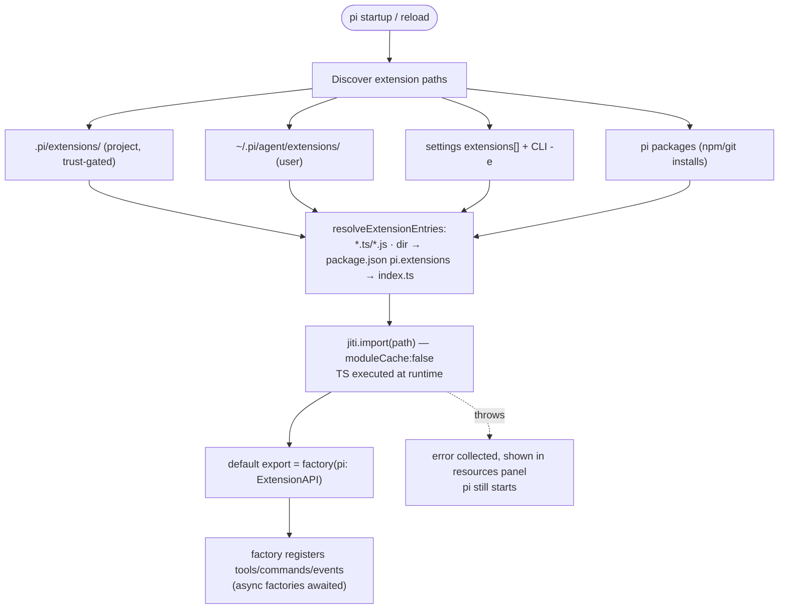
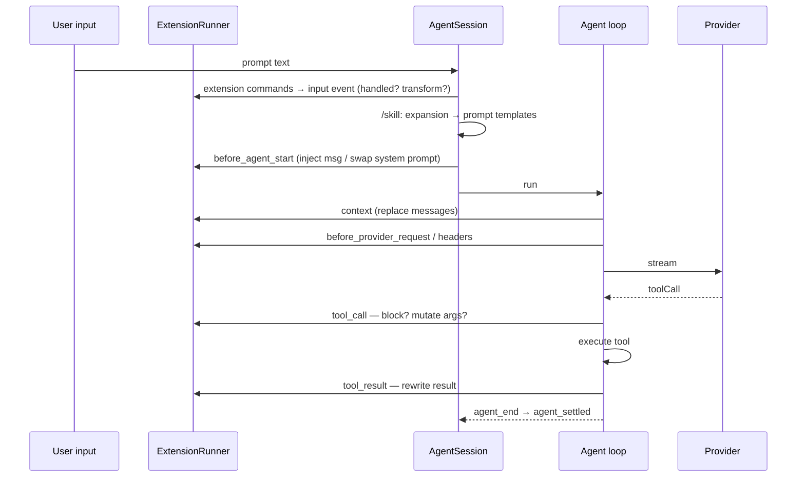
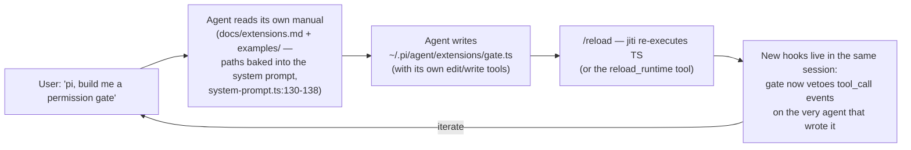

> Source: [earendil-works/pi-mono](https://github.com/earendil-works/pi-mono) (pi-mono, `packages/coding-agent`, v0.84.2) · Date: 2026-08-14 · Mode: Explain
> See also: [System & OOP Architecture](/oss/pi-mono-system-architecture/) · [Agentic Architecture](/oss/pi-mono-agentic-architecture/)

## 1. The thesis: omission as architecture

Pi's README states the design stance directly: *"Adapt pi to your workflows, not the other way around, without having to fork and modify pi internals"* and *"Pi ships with powerful defaults but skips features like sub agents and plan mode. Instead, you can ask pi to build what you want."* The philosophy section (`packages/coding-agent/README.md:494-512`) enumerates the deliberately-absent features — MCP, sub-agents, permission popups, plan mode, to-dos, background bash — each with the same answer: *build it with extensions, or install a package*.

The omissions are the extension system's reason to exist. And because extensions are **plain TypeScript files executed in-process**, and pi ships its own extension-authoring manual + 78 working examples on disk and points its system prompt at them, the running agent can write, install, and hot-reload its own extensions — pi is self-modifying software with the LLM as the modifier.

The whole mechanism is four files (~3,900 lines) in `packages/coding-agent/src/core/extensions/`:

| File | Lines | Role |
|---|---|---|
| `types.ts` | 1,728 | The public API: `ExtensionAPI`, `ExtensionContext`, every event + result type |
| `loader.ts` | 737 | Discovery, jiti execution, factory cache |
| `runner.ts` | 1,236 | `ExtensionRunner`: event dispatch, veto/chain semantics, error isolation |
| `wrapper.ts` | 45 | Adapts registered tools into agent-core `AgentTool`s |

## 2. The customization layers

Extensions are one of several layers, but different **in kind**: skills/prompts/themes/AGENTS.md are *data the model or renderer consumes*; extensions are *code that rewrites pi's control flow*.

| Layer | User location | Project location (trust-gated) | Package field | Mechanism |
|---|---|---|---|---|
| **Extensions** | `~/.pi/agent/extensions/*.ts` | `.pi/extensions/` | `pi.extensions` | TypeScript executed by jiti; full hook API |
| **Skills** | `~/.pi/agent/skills/`, `~/.agents/skills/` | `.pi/skills/`, `.agents/skills/` | `pi.skills` | `SKILL.md` (agentskills.io standard); catalog in system prompt, body read on demand; `/skill:name` |
| **Prompt templates** | `~/.pi/agent/prompts/*.md` | `.pi/prompts/*.md` | `pi.prompts` | filename → `/name` slash command |
| **Themes** | `~/.pi/agent/themes/*.json` | `.pi/themes/*.json` | `pi.themes` | JSON color tokens; hot-reload on file change |
| **Context files** | `~/.pi/agent/AGENTS.md` | `AGENTS.override.md` → `AGENTS.md` → `CLAUDE.md`, cwd + ancestors | — | injected as `<project_instructions>`; loaded regardless of trust |
| **System prompt files** | — | `.pi/SYSTEM.md`, `.pi/APPEND_SYSTEM.md` | — | replace/append the system prompt |
| **Settings** | `~/.pi/agent/settings.json` | `.pi/settings.json` | — | project overrides global; resource arrays with globs, `!`/`+`/`-` |

Precedence (`core/package-manager.ts:178-182`): project-settings-listed → project-auto `.pi/` → user-settings-listed → user-auto `~/.pi/agent/` → package resources. Conflicts: tools and flags are first-registration-wins; shortcuts are last-wins with a warning diagnostic.

**Trust gate:** project-local `.pi/` resources load only after the user trusts the project (`core/trust-manager.ts`); the `project_trust` decision itself can be delegated to an extension.

## 3. Discovery & loading



- **Runtime TS execution via jiti** (`loader.ts:434-467`): `createJiti(import.meta.url, { moduleCache: false, ... })`. Three runtime modes: Bun compiled binary (pi's own modules injected as `VIRTUAL_MODULES`), TS-source dev runs (virtual modules + tsconfig paths), built Node dist (alias map). `moduleCache: false` is what makes `/reload` re-evaluate edited files.
- Extensions may import the five bundled packages (`@earendil-works/pi-coding-agent`, `pi-agent-core`, `pi-tui`, `pi-ai` + subpaths, `typebox`), Node builtins, and any `node_modules` sitting next to the extension file.
- **Contract:** `export default function (pi: ExtensionAPI): void | Promise<void>` — a factory, rejected with a clear error if the default export isn't a function.
- **Failure posture:** load errors never kill startup — they become entries in `LoadExtensionsResult.errors`, surfaced in the startup resources panel.

## 4. The `ExtensionAPI` surface (what an extension can do)

Defined in `core/extensions/types.ts:1198-1437`, implemented in `loader.ts:250-419`. Grouped:

**Capability registration**
- `registerTool(tool: ToolDefinition)` — TypeBox params, `execute`, optional custom TUI renderers (`renderCall`/`renderResult`), `promptSnippet`/`promptGuidelines` (fed into the system prompt), `executionMode`. Registering a tool named `read`/`bash`/`edit`/… **replaces the built-in** (`agent-session.ts:2489-2494`); omit a renderer slot and the built-in renderer is inherited.
- `registerCommand(name, {handler, getArgumentCompletions})` — slash commands.
- `registerShortcut(keyId, {handler})` — keyboard shortcuts.
- `registerFlag(name, …)` / `getFlag` — **real CLI flags** that appear in `pi --help`.
- `registerProvider(...)` / `unregisterProvider` — full LLM-provider replacement: `baseUrl`, `apiKey` (env or `!command` interpolation), `models[]`, custom `streamSimple`, and an `oauth` block (`login/refreshToken/getApiKey`).

**Event subscription** — `pi.on(event, handler)` with 33 typed overloads (see §5).

**Agent/session actions** — `sendMessage` (custom messages, `deliverAs: "steer"|"followUp"|"nextTurn"`), `sendUserMessage` (with `expandPromptTemplates: true` an extension can **dispatch slash commands and skills as if the user typed them**), `appendEntry` (persist state in the session without entering LLM context), `setModel`, `setThinkingLevel`, `setActiveTools`, `getAllTools`, `exec` (subprocess), `events` (inter-extension pub/sub bus).

**UI (`ctx.ui: ExtensionUIContext`, `types.ts:131-285`)** — dialogs (`select`/`confirm`/`input`/`notify`), editor control (`setEditorText`, `setEditorComponent` — replace the input editor entirely, e.g. a vim modal editor), layout slots (`setWidget`, `setFooter`, `setHeader`, `setStatus`), raw terminal byte interception (`onTerminalInput` with consume/rewrite), and `ui.custom(factory)` for arbitrary TUI components/overlays — this is how the DOOM example runs at 35 FPS in an overlay. In non-UI modes (RPC/print/JSON) every method is a no-op via `noOpUIContext`.

**Command-context extras (`ExtensionCommandContext`)** — `newSession`, `fork`, `switchSession`, `navigateTree`, `waitForIdle`, and `reload()`.

## 5. The event model: 24 interception points

Full union `ExtensionEvent` at `types.ts:1034-1059`; dispatch in `runner.ts:801-1234`. The powerful ones are not observers but **rewrite/veto points**:

| Event | Power |
|---|---|
| `tool_call` | **Veto** — `{block, reason, terminate}`; modify args by mutating `event.input` in place; first block short-circuits |
| `tool_result` | **Middleware chain** — patch `{content, details, isError}`; each handler sees prior edits |
| `input` | `{action:"handled"}` swallows the prompt; `{action:"transform"}` rewrites it |
| `context` | `{messages}` **replaces the LLM context** (chained over a `structuredClone`) |
| `before_agent_start` | inject a message and/or **replace the system prompt** |
| `before_provider_request` / `before_provider_headers` | rewrite the raw provider payload / headers |
| `session_before_compact` | `{cancel}` or `{compaction}` — **fully replace pi's compaction** |
| `session_before_switch` / `before_fork` / `before_tree` | veto or customize session navigation |
| `user_bash` | swap the bash backend or replace execution entirely (how the Gondolin micro-VM routing works) |
| `project_trust` | own the trust decision |
| `resources_discover` | **mint skills/prompts/themes at runtime** |
| lifecycle (`session_*`, `agent_*`, `turn_*`, `message_*`, `tool_execution_*`, `model_select`, …) | observe everything |



**Error isolation:** most handler errors are caught per-handler (`emitError`, loop continues) — except `tool_call`, which is deliberately **not** caught: an extension crash there blocks the tool (*fail-safe*: `"Extension failed, blocking execution"`, `agent-session.ts:485-497`).

## 6. Hot reload: the loop that closes self-modification

- `/reload` (built-in command) → `AgentSession.reload()` (`agent-session.ts:2610-2634`): emit `session_shutdown{reason:"reload"}` → invalidate the old runner → reload settings → `resourceLoader.reload()` (clears the extension cache) → rebuild runtime → `session_start` + `resources_discover`.
- Combined with jiti's `moduleCache: false`, this re-executes the TypeScript from disk — **no restart, session preserved**.
- Programmatic: `ctx.reload()`; and `examples/extensions/reload-runtime.ts` registers a *tool* that queues `/reload` — so **the model itself can reload the runtime after writing code**.
- Staleness guard: after invalidation, any captured `pi`/`ctx` reference throws a descriptive error.
- Extensions have no file watcher (reload is explicit); themes do hot-reload via a watcher.

The full self-modification cycle, every step grounded in shipped code:



Three design choices make this loop work: (1) extensions are **interpreted TS, not compiled plugins** — the agent's file tools are sufficient to author them; (2) the **authoring manual ships inside the product** — `package.json` `files` includes `docs` and `examples`, and the default system prompt points at their resolved on-disk paths; (3) **reload is in-process** — the feedback cycle stays inside one conversation.

## 7. Pi packages: distributing modifications

Format (`docs/packages.md`, reader `core/pi-manifest.ts`): a normal npm package whose `package.json` carries a `pi` key —

```json
{ "name": "my-package", "keywords": ["pi-package"],
  "pi": { "extensions": ["./extensions"], "skills": ["./skills"],
          "prompts": ["./prompts"], "themes": ["./themes"] } }
```

Arrays accept globs with `!`/`+`/`-` modifiers; without a manifest, convention directories (`extensions/`, `skills/`, `prompts/`, `themes/`) are auto-discovered. Install: `pi install npm:@foo/bar@1.0.0` · `pi install git:github.com/user/repo@v1` · URLs · local paths; `-l` for project scope; `pi -e <source>` for a throwaway temp install. Installs land in `~/.pi/agent/{npm,git}/` (or project `.pi/`); each package gets a **separate module root** so bundled dependencies don't collide. Project packages auto-install on startup only after trust.

## 8. Dogfooding evidence: the seam is used internally

- The **only built-in extension** is llama.cpp support — `src/extensions/index.ts`: `builtInExtensions = [{ name: "llama.cpp", factory: llamaExtension, hidden: true }]`. Pi's own local-model feature rides the same API it offers users.
- The SDK accepts `extensionFactories` so embedders inject extensions programmatically (`examples/sdk/06-extensions.ts`).
- This repo's own dev config uses the system: `.pi/extensions/{tps,redraws,import-repro,prompt-url-widget}.ts`, `.pi/skills/`, `.pi/prompts/`.
- 69 example files + 9 example directories ship in the npm tarball. The ones that re-create pi's "missing" features: `subagent/` (spawns separate `pi` processes with isolated context; scout/planner/reviewer/worker agent defs), `plan-mode/` (read-only plan mode with bash allowlist), `permission-gate.ts` / `protected-paths.ts` / `project-trust.ts` (HITL & guardrails), `sandbox/` + `gondolin/` (OS/VM isolation), `custom-compaction.ts` / `handoff.ts` (context management), `custom-provider-anthropic/` (provider + OAuth), `modal-editor.ts` (vim editing), `dynamic-resources/` (an extension shipping its own skills/themes), and games (`snake.ts`, `doom-overlay/`) proving the UI surface is general. **No MCP bridge ships** — MCP remains listed under "what's possible."

## 9. Failure, security posture, and API stability

- **No sandbox, explicitly.** `docs/security.md`: extensions "run with the same permissions" as pi; a partial in-process sandbox "would be easy to misunderstand as a security boundary"; real isolation must come from the OS/container (`docs/containerization.md`). Project trust is "only an input-loading guard."
- **Failure containment is per-handler**, not per-extension: handlers that throw are logged (TUI error block / stderr) and skipped, except the fail-safe `tool_call` path (§5). Tool `execute` errors return to the LLM as `isError: true` and the agent continues.
- **Stability:** no formal policy, but a curated evolution — a `#extensions-migration` CHANGELOG anchor, a one-time startup migration that prints the guide for legacy layouts (`src/migrations.ts`), legacy `@mariozechner/*` import aliases kept resolving, and per-release breaking-change callouts.

## 10. Open questions

- Whether an official MCP-bridge package exists outside this repo was not verified (none ships here).
- The extension API's interaction with the in-progress v2 `AgentHarness` (typed hook registry of 11 hook names, currently `HarnessNotImplemented`) is unspecified in source — how today's 24-event API maps onto it is an open design question.
