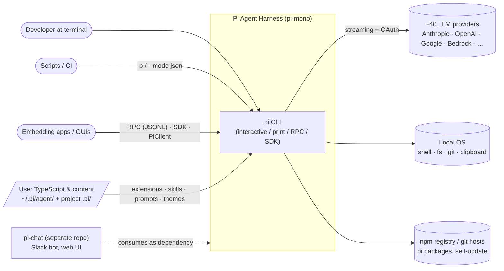
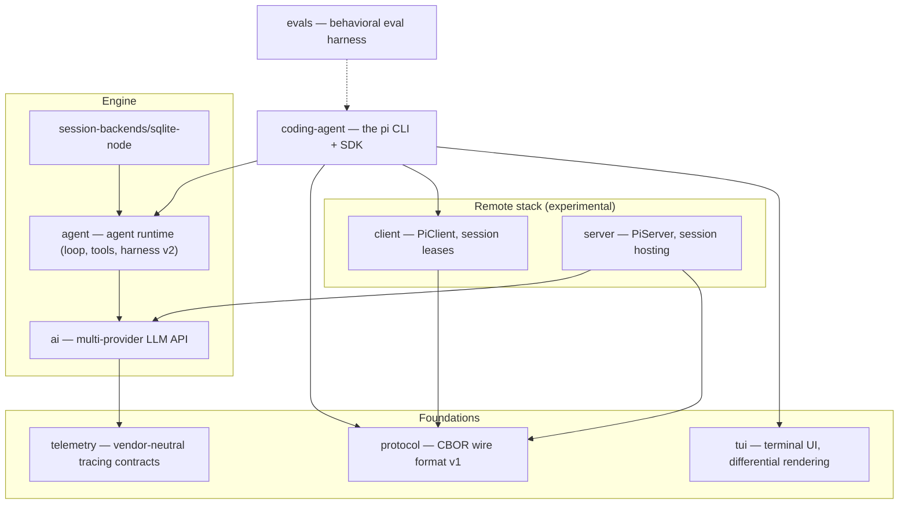
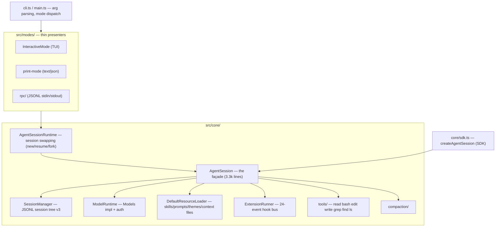
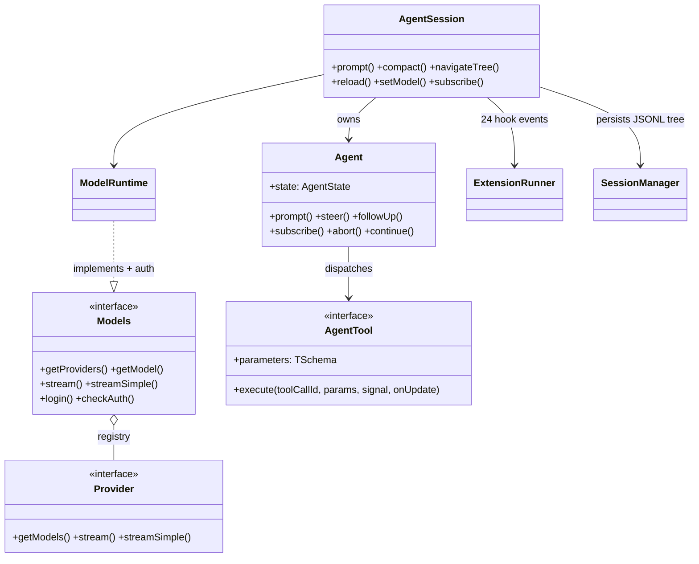
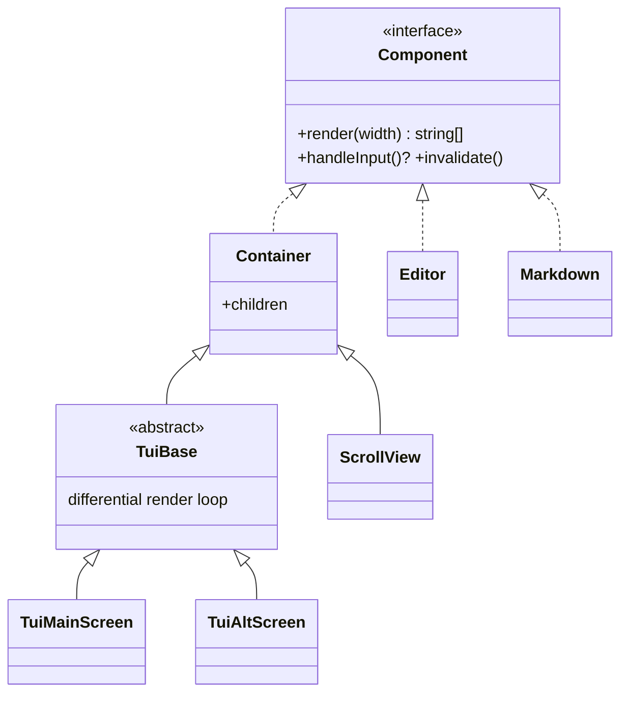
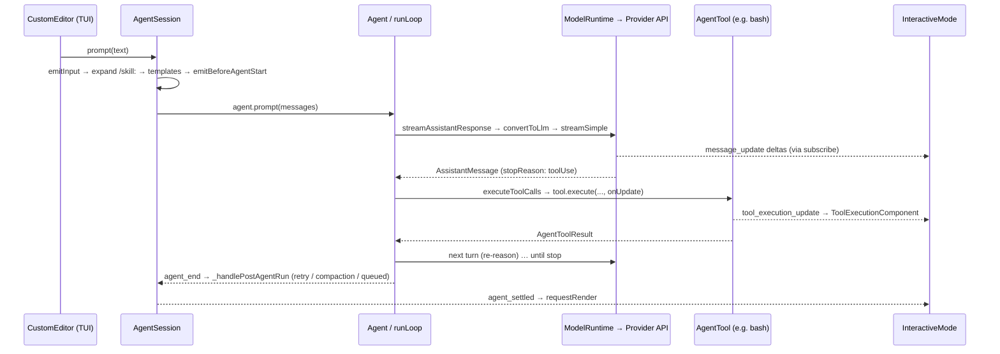

> Source: [earendil-works/pi-mono](https://github.com/earendil-works/pi-mono) (Pi Agent Harness monorepo, `@earendil-works/*`, v0.84.2) · Date: 2026-08-14 · Mode: Explain · Type: **Hybrid** (CLI app + published libraries)
> See also: [Agentic Architecture](/oss/pi-mono-agentic-architecture/) · [Extension Architecture](/oss/pi-mono-extension-architecture/)

## 1. Overview

**pi-mono** is the home of the Pi agent harness: a minimal, self-extensible terminal coding agent (`pi`) plus the layered libraries it is built from — a unified multi-provider LLM API, a provider-agnostic agent runtime, a differential-rendering TUI library, and an experimental remote-session protocol stack. The design philosophy is explicit in the README: *"Adapt pi to your workflows … without having to fork and modify pi internals"* — the core stays small, and users extend it with TypeScript extensions, skills, prompt templates, and themes.

**Type: Hybrid.** Evidence: `packages/coding-agent/package.json` declares `bin: { pi: "dist/cli.js" }` (an app with entry `src/cli.ts`) *and* library exports (`.`, `./rpc-entry`, `./client`) with a documented SDK (`docs/sdk.md`, `core/sdk.ts:createAgentSession`). Every other package is a library (`ai` also ships a small `pi-ai` auth CLI); `evals` is an internal test app.

**Tech stack:** TypeScript (ESM, strict), npm workspaces (lockstep-versioned 0.84.2), TypeBox for runtime schemas, `jiti` for runtime TS extension loading, hand-rolled CBOR + framing in `protocol`, first-party provider clients (`@anthropic-ai/sdk`, `openai`, `@google/genai`, AWS Bedrock), Bun for standalone binaries (`src/bun/cli.ts`), vitest + `vitest-evals`.

## 2. System Context (C4 L1)

Notes grounded in source: provider fan-out lives in `packages/ai/src/providers/` (~40 factories); OS access via built-in tools (`coding-agent/src/core/tools/`); package install/self-update via `core/package-manager.ts` and `utils/version-check.ts`; the Slack bot ("mom") and web UI were **extracted to `earendil-works/pi-chat`** — `packages/mom` and `packages/web-ui` here contain only stale untracked `dist/` output and are not workspaces.

## 3. High-Level Structure (C4 L2)

Build order in the root `package.json` is the dependency order: `tui → telemetry → ai → agent → session-backends/sqlite-node → protocol → client → server → coding-agent`.

| Path | npm name | Responsibility |
|------|----------|----------------|
| `packages/ai` | `@earendil-works/pi-ai` | Provider/model registry, streaming (`stream`/`streamSimple` per API), auth + OAuth resolution, generated model catalogs, cost tracking |
| `packages/agent` | `@earendil-works/pi-agent-core` | `Agent` + `runLoop` (the reasoning loop), `AgentTool` contract, events; plus the next-gen `harness/` layer (see §9) |
| `packages/coding-agent` | `@earendil-works/pi-coding-agent` | The `pi` product: `AgentSession` orchestration, tools, skills, extensions, compaction, session tree, 4 delivery modes |
| `packages/tui` | `@earendil-works/pi-tui` | `Component`/`Container` tree, `TuiMainScreen`/`TuiAltScreen`, editor, markdown, images, keybindings |
| `packages/telemetry` | `@earendil-works/pi-telemetry` | `TelemetryContext`/`TelemetrySpan` contracts, typed-schema DSL, in-memory + noop impls |
| `packages/protocol` | `@earendil-works/pi-protocol` | Wire v1: 4-byte length + CBOR item; TypeBox schemas; snapshots authoritative, progress transient |
| `packages/client` | `@earendil-works/pi-client` | Transport-neutral `PiClient`; `SessionLease` (shared/exclusive, `AsyncDisposable`) |
| `packages/server` | `@earendil-works/pi-server` | `PiServer` composing authenticated listeners; host supplies `PiServerService`/`PiSessionRuntime` |
| `packages/session-backends/sqlite-node` | `…-session-backend-sqlite-node` | `SessionRepo`/`SessionStorage`/search on `node:sqlite`, FTS5; the pluggable-backend slot |
| `packages/evals` | `@earendil-works/pi-evals` (private) | Real-`AgentSession` behavioral evals via `vitest-evals` |

## 4. Components (C4 L3) — inside `coding-agent`

Key point proven by the code: all four modes subscribe to the **same** `AgentSessionEvent` stream (`InteractiveMode` at `modes/interactive/interactive-mode.ts:3089`, `print-mode.ts`, `rpc/rpc-mode.ts`; JSON shape via `modes/json-event.ts:toJsonEvent`) — the mode layer is a thin presenter over `AgentSession`.

## 5. OOP & Class Architecture

### 5.1 The layered engine

- **Strategy seam:** `StreamFn` (`agent/src/types.ts:31`) keeps `pi-agent-core` provider-agnostic; `coding-agent/src/core/sdk.ts` installs `streamSimple` as the default.
- **Facade/Mediator:** `AgentSession` (`core/agent-session.ts:305`) over Agent + sessions + settings + models + extensions; `Models` (`ai/src/models.ts:156`) over providers — the source comments say exactly this.
- **Adapter / anti-corruption:** `server/src/protocol.ts` (`toProtocol*` converters own the pi-ai↔protocol boundary); `wrapToolDefinition` (extension tool → core `AgentTool`); `ai/src/compat.ts` (legacy global registry).
- **Repository with conformance suite:** `SessionRepo`/`SessionStorage` ports (`agent/src/harness/session/types.ts`) with in-memory, JSONL, and SQLite implementations, all validated by a shared conformance suite (`agent/src/harness/session/testing/conformance.ts`, exported as `./session/testing`).
- **Lease/RAII:** `SessionLease implements AsyncDisposable` with shared vs exclusive modes (`client/src/session-handle.ts`).
- **Result types over exceptions:** `ResultValue`, `ok/err/getOrThrow` and `TaggedError` subclasses (`LaneBusy`, `NothingToCompact`, …) in `agent/src/harness/`.
- **Observer everywhere:** `Agent.subscribe`, `AgentSession.subscribe`, `PiClient.subscribe/onEvent`, `createEventBus()`.
- **Lazy proxy:** `ai/src/api/*.lazy.ts` + `api/lazy.ts` defer heavy SDK imports and encode setup failures as in-stream error events.

### 5.2 TUI component model

(`packages/tui/src/tui.ts`; leaves include `Text`, `Editor`, `Markdown`, `Image`, `SelectList`; layout via `VStack`/`HStack`. `InteractiveMode` composes `chatContainer`/`editorContainer`/`footerContainer` from these.)

## 6. Key Flows

Interactive prompt → LLM → tool → render (real call chain):

Entry chain: `cli.ts` → `main()` (`main.ts`) → `createAgentSessionServices`/`FromServices` → `createAgentSessionRuntime` → mode (`new InteractiveMode` / `runPrintMode` / `runRpcMode`). Persistence runs in parallel: `SessionManager` appends JSONL entries; usage totals feed the footer.

**Remote-session flow (built, not yet user-facing):** `RemoteSession` (coding-agent `./client` export) → `PiClient` → framed CBOR over a `ByteTransport` → `PiServer` → host-supplied `PiServerService`/`PiSessionRuntime`, whose agent side is `createCodingAgentHarness()` (`src/server/create-harness.ts`) over the v2 `AgentHarness`. No `main.ts` code path constructs a `PiClient` today; the harness methods mostly throw `HarnessNotImplemented`.

## 7. Extension Points

Pi's extension story is its defining feature — covered in depth in [Extension Architecture](/oss/pi-mono-extension-architecture/). Summary: TypeScript extensions (jiti-loaded from `~/.pi/agent/extensions/` and `.pi/extensions/`) with a 24-event hook API; skills (SKILL.md); prompt templates; themes; pi packages (npm/git); pluggable session backends (`packages/session-backends/*` workspace glob); pluggable transports (`ByteTransportFactory`); pluggable stream functions (`StreamFn`); custom providers (`registerProvider` incl. OAuth); SDK embedding (`createAgentSession`).

## 8. Key Abstractions / Glossary

- **`Model` / `Provider` / `Models`** — a model belongs to a provider; `Models` is the registry-façade you stream through (`ai/src/models.ts`).
- **`StreamFn`** — the injected function that turns (model, context) into an `AssistantMessageEventStream`; the seam that keeps the loop provider-agnostic.
- **`AgentTool` / `AgentToolResult`** — TypeBox-schema'd tool contract; throw on failure; results may add tools or terminate the batch.
- **`AgentSession` vs `Agent`** — `Agent` is the bare loop + state; `AgentSession` adds sessions, settings, models, extensions, compaction, retries.
- **`AgentSessionRuntime`** — the holder that can swap the current session (new/resume/fork) under a running mode.
- **Session tree** — JSONL entries with `id`/`parentId`; branching and branch summaries are first-class (v3 in the CLI's `SessionManager`; v4 in the agent-core harness JSONL repo).
- **Mode** — a thin presenter (TUI / print / JSON / RPC) over the same event stream.
- **Pi package** — npm/git bundle of extensions/skills/prompts/themes declared via the `pi` key in `package.json`.
- **Snapshot vs progress (protocol)** — snapshots are authoritative state; progress events are transient UI hints, never reduced into state.

## 9. Open Questions & Notes

- **Two generations coexist.** Shipping v1: `Agent`+`runLoop`+`AgentSession`+JSONL v3. Designed v2: `AgentHarness implements AgentLane` (`agent/src/harness/agent-harness.ts:305`) with durable `Session`/`SessionRepo`, resumable operations, typed errors — but most methods currently reject with `HarnessNotImplemented`; the spec is `packages/agent/docs/harness.md` (~229 KB). Migration timeline is not determinable from source.
- **Remote stack is experimental.** `server/README.md` says it may change or be removed; `createCodingAgentHarness` has only a test consumer.
- **`packages/mom` and `packages/web-ui`** are not workspaces here (no `package.json`/`src`, only stale untracked `dist/`); Slack/web live in `earendil-works/pi-chat`. Any doc treating them as containers of this system (including the older `_docs/pi-mono-OOP-UML-Architecture.md`, written against the `@mariozechner` fork) is stale.
- **Telemetry emission coverage** — contracts and schemas exist (`AI_TELEMETRY_SCHEMA`, `HARNESS_TELEMETRY_SCHEMA`); how much the shipping v1 path emits was not traced.
